# [설계 문서] FinFriends 기술 설계 명세 (한글)

# 기술 설계 문서 (SDD · Software Design Document)

**문서 ID:** DESIGN-FINFRIENDS-MVP-001

**개정 버전:** 1.0

**날짜:** 2026-08-24

**입력 문서:** `SRS_finfriends-v1_0.md` (SRS-FINFRIENDS-MVP-001 · 2026-08-24)

**추적 원칙:** 본 문서는 요구사항을 **새로 만들지 않는다.** 모든 설계 요소는 SRS의 `REQ-FUNC-*` · `REQ-NF-*` · `AC-*` · `ACE-*` · `CON-*` · `KPI-*` 중 하나 이상에 귀속된다. 귀속이 없는 요소는 설계에 두지 않는다.

---

## 0. 이 문서를 읽는 방법

> 배경지식이 없어도 읽을 수 있도록, **각 다이어그램이 어떤 질문에 답하는지**를 먼저 밝힌다. 필요한 장만 골라 읽어도 된다.

| 장 | 다이어그램 | 이 그림이 답하는 질문 | 주로 보는 사람 |
| --- | --- | --- | --- |
| §1 | **유스케이스 다이어그램** | *"누가 이 시스템으로 무엇을 하는가?"* | 기획 · QA · 신규 합류자 |
| §2 | **컨텍스트 · 컴포넌트 다이어그램** | *"시스템은 어떤 조각으로 나뉘고 무엇이 외부에 있는가?"* | 개발팀 리드 · 아키텍트 |
| §3 | **ERD** | *"데이터는 어떤 표에 담기고 어떻게 연결되는가?"* | 개발 엔지니어 · 데이터 담당 |
| §4 | **클래스 다이어그램** | *"코드는 어떤 객체와 책임으로 쪼개지는가?"* | 개발 엔지니어 |
| §5 | **인과 루프 다이어그램** | *"어떤 행동이 어떤 결과를 낳아 다시 돌아오는가?"* | 기획 · 서비스분석 |
| §6 | **시퀀스 다이어그램** | *"하나의 일이 일어날 때 조각들이 어떤 순서로 대화하는가?"* | 개발 엔지니어 · QA |
| §7 | **플로차트** | *"이 판정은 어떤 조건으로 갈라지는가?"* | 전원 |
| §8 | 배치 스케줄 | *"사람이 누르지 않아도 도는 일은 무엇이 언제 도는가?"* | 개발 온콜 |
| §9~§11 | 표 | 제약 반영 · 추적성 · 미결 항목 | 검수자 |

**용어 3개만 먼저** — 본문의 나머지 용어는 SRS §1.3에 있다.

| 용어 | 한 줄 설명 |
| --- | --- |
| **⭐ (별)** | 아동이 학습·실천으로 받는 보상 점수. **현금이 아니며 현금으로 바꿀 수 없다** — 옷장 아이템 교환에만 쓴다 |
| **실천** | 아동이 실제 돈 행동을 한 것. MVP에서는 **미션 승인 · 소비 회고 · 위시리스트 달성** 3가지뿐이다 |
| **나무 / 숲** | 나무는 보호자가 보는 4영역 진행 화면, 숲은 그 나무의 월 단위 스냅샷. 숲은 **전월 대비 변화**를 보여준다 |

> **§ 표기 규약** — 앞에 `SRS`가 붙은 `SRS §x.y`는 **SRS 문서의 절**, 붙지 않은 `§x.y`는 **본 문서의 절**이다. 두 문서의 절 번호가 겹치는 구간이 있어 이 규약을 지킨다.
>
> **다이어그램은 SRS의 그림과 중복하지 않는다.** SRS §6.2에는 이미 열거형·상태 전이·판정 순서 다이어그램 7건이 있고, SRS §13.3~13.4에 빌드·게이트 순서 2건이 있다. 본 문서는 **그 9건이 다루지 않는 관점**(행위자·구조·데이터·객체·인과·상호작용)을 담고, 겹치는 지점은 참조로만 연결한다.

---

## 1. 유스케이스 모델

> **근거** — SRS §4.1 기능 요구사항 17건 · SRS §2 이해관계자 · SRS §8 대상 사용자 특성.
> 유스케이스는 요구사항을 **행위자 관점으로 다시 자른 것**이며, 요구사항을 추가하거나 바꾸지 않는다.

### 1.1 액터 정의

| 액터 | 구분 | 역할 | 근거 |
| --- | --- | --- | --- |
| **보호자** | 주 액터 | 계정·동의의 주체. 미션을 걸고 승인하며, 성장을 확인하는 유일한 열람자 | SRS §8.1 |
| **아동** | 주 액터 | 학습·실천의 주체. **독립 로그인을 하지 않고** 보호자 계정에 종속된다 | REQ-NF-011 · CON-DEV-03 |
| **스케줄러** | 시스템 액터 | 사람이 누르지 않아도 도는 판정·집계·정산의 발동자(시간) | §8 배치 스케줄 |
| **제휴사(선불업)** | 외부 시스템 | 선불전자지급수단 발행·카드 발행·가맹점망·결제 원장·충전·해지 | CON-ARC-02 |
| **본인인증 서비스** | 외부 시스템 | 보호자 실명 확인 | REQ-FUNC-007 |
| **푸시 알림 인프라** | 외부 시스템 | 미접속·승인 알림 전달. **도달을 전제하지 않는다** | CON-DEV-04 |
| **개발 온콜** | 운영 액터 | 규제·정합성·보안 알림 1차 수신 · 30분 내 확인 | REQ-NF-017 |
| **정책·콘텐츠·사업 담당** | 운영 액터 | 규제 알림 · 문장 풀 잔여 알림 · 원가 알림 수신 | REQ-NF-016 · 017 |

### 1.2 유스케이스 다이어그램 — 전체

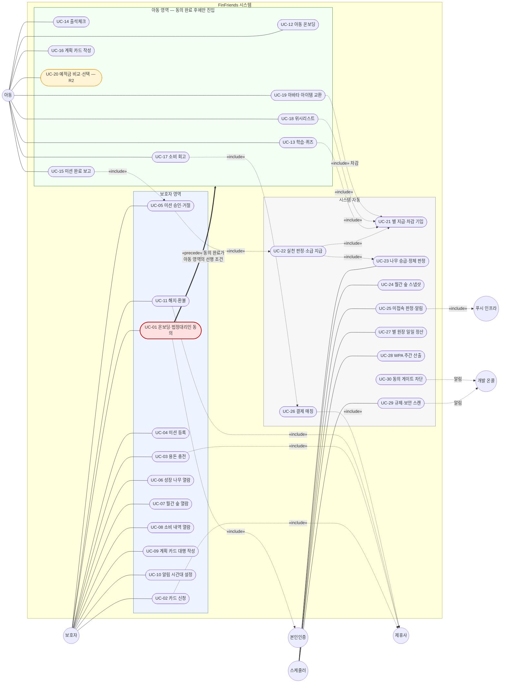
```mermaid
flowchart LR
    G(("보호자"))
    C(("아동"))
    S(("스케줄러"))
    P(("제휴사"))
    IV(("본인인증"))
    PN(("푸시 인프라"))
    OC(("개발 온콜"))

    subgraph SYS["FinFriends 시스템"]
        direction TB

        subgraph GZ["보호자 영역"]
            UC01(["UC-01 온보딩·법정대리인 동의"])
            UC02(["UC-02 카드 신청"])
            UC03(["UC-03 용돈 충전"])
            UC04(["UC-04 미션 등록"])
            UC05(["UC-05 미션 승인·거절"])
            UC06(["UC-06 성장 나무 열람"])
            UC07(["UC-07 월간 숲 열람"])
            UC08(["UC-08 소비 내역 열람"])
            UC09(["UC-09 계획 카드 대행 작성"])
            UC10(["UC-10 알림 시간대 설정"])
            UC11(["UC-11 해지·환불"])
        end

        subgraph CZ["아동 영역 — 동의 완료 후에만 진입"]
            UC12(["UC-12 아동 온보딩"])
            UC13(["UC-13 학습·퀴즈"])
            UC14(["UC-14 출석체크"])
            UC15(["UC-15 미션 완료 보고"])
            UC16(["UC-16 계획 카드 작성"])
            UC17(["UC-17 소비 회고"])
            UC18(["UC-18 위시리스트"])
            UC19(["UC-19 아바타 아이템 교환"])
            UC20(["UC-20 예적금 비교·선택 — R2"])
        end

        subgraph AZ["시스템 자동"]
            UC21(["UC-21 별 지급·차감 기입"])
            UC22(["UC-22 실천 판정·소급 지급"])
            UC23(["UC-23 나무 승급·정체 판정"])
            UC24(["UC-24 월간 숲 스냅샷"])
            UC25(["UC-25 미접속 판정·알림"])
            UC26(["UC-26 결제 매칭"])
            UC27(["UC-27 별 원장 일일 정산"])
            UC28(["UC-28 WPA 주간 산출"])
            UC29(["UC-29 규제·보안 스캔"])
            UC30(["UC-30 동의 게이트 차단"])
        end
    end

    G --- UC01 & UC02 & UC03 & UC04 & UC05 & UC06 & UC07 & UC08 & UC09 & UC10 & UC11
    C --- UC12 & UC13 & UC14 & UC15 & UC16 & UC17 & UC18 & UC19 & UC20
    S --- UC23 & UC24 & UC25 & UC27 & UC28 & UC29

    UC01 -.->|"«include»"| IV
    UC02 -.->|"«include»"| P
    UC03 -.->|"«include»"| P
    UC11 -.->|"«include»"| P
    UC26 -.->|"«include»"| P
    UC25 -.->|"«include»"| PN
    UC29 -.->|"알림"| OC
    UC30 -.->|"알림"| OC

    UC01 ==>|"«precede» 동의 완료가<br/>아동 영역의 선행 조건"| CZ
    UC15 -.->|"«include»"| UC05
    UC05 -.->|"«include»"| UC22
    UC17 -.->|"«include»"| UC26
    UC22 -.->|"«include»"| UC21
    UC22 -.->|"«include»"| UC23
    UC13 -.->|"«include»"| UC21
    UC18 -.->|"«include»"| UC21
    UC19 -.->|"«include» 차감"| UC21

    style GZ fill:#eef4ff,stroke:#4a7ac7
    style CZ fill:#f2fff2,stroke:#2d8a2d
    style AZ fill:#f7f7f7,stroke:#888
    style UC01 fill:#ffe0e0,stroke:#c00,stroke-width:2px
    style UC20 fill:#fff4d6,stroke:#e69500
```

> **이 그림이 말하는 것** — ① 아동 영역 전체가 **UC-01(동의 완료) 뒤에만** 열린다. ② 아동의 실천(UC-15·17·18)은 반드시 **UC-21 별 기입**과 **UC-23 나무 판정**을 거쳐야 성장으로 기록된다 — 화면이 아니라 원장이 진실의 원천이다. ③ 붉은 UC-01은 규제 게이트, 노란 UC-20은 R2 이월(법률 검토 대기)이다.

### 1.3 유스케이스 목록 및 요구사항 추적

| UC | 이름 | 주 액터 | 귀속 요구사항 | 수용 기준 |
| --- | --- | --- | --- | --- |
| **UC-01** | 보호자 온보딩·법정대리인 동의 | 보호자 | REQ-FUNC-007 · REQ-NF-008 | AC-8.1 · AC-8.3 · ACE-8.1 · ACE-8.2 |
| **UC-02** | 카드 신청 | 보호자 | REQ-FUNC-007② · REQ-NF-015 | ACE-8.1 |
| **UC-03** | 용돈 충전 | 보호자 | REQ-NF-015 · KPI-11 | — *(제휴사 인터페이스)* |
| **UC-04** | 미션 등록 | 보호자 | REQ-FUNC-002 | AC-2.1 |
| **UC-05** | 미션 승인·거절 | 보호자 | REQ-FUNC-002 · 010 | AC-6.1 · AC-6.2 · ACE-6.1 · ACE-6.3 |
| **UC-06** | 성장 나무 열람 | 보호자 | REQ-FUNC-001 · REQ-NF-001 | AC-1.1 · AC-1.2 · AC-3.1 · ACE-1.1 · ACE-3.1 |
| **UC-07** | 월간 숲 열람 | 보호자 | REQ-FUNC-009 · REQ-NF-001 | AC-1.3 · AC-1.4 · ACE-1.2 |
| **UC-08** | 소비 내역 열람 | 보호자 | REQ-FUNC-013 | — |
| **UC-09** | 계획 카드 대행 작성 | 보호자 | REQ-FUNC-008 · CON-DEV-01 | AC-4.1 |
| **UC-10** | 알림 시간대 설정 | 보호자 | REQ-FUNC-011 | AC-7.3 |
| **UC-11** | 해지·환불 | 보호자 | REQ-NF-013 · CON-REG-07 | — |
| **UC-12** | 아동 온보딩 | 아동 | REQ-FUNC-006 · REQ-NF-008 | — |
| **UC-13** | 학습·퀴즈 | 아동 | REQ-FUNC-003 | AC-2.2 · AC-2.4 |
| **UC-14** | 출석체크 | 아동 | REQ-FUNC-004 | — *(조건 미결 · D5)* |
| **UC-15** | 미션 완료 보고 | 아동 | REQ-FUNC-002 | AC-6.3 |
| **UC-16** | 계획 카드 작성 | 아동 | REQ-FUNC-008 · KPI-04 | AC-4.1 · AC-4.4 |
| **UC-17** | 소비 회고 | 아동 | REQ-FUNC-008 | AC-5.1~5.6 · ACE-5.1 · ACE-5.2 |
| **UC-18** | 위시리스트 | 아동 | REQ-FUNC-012 | — |
| **UC-19** | 아바타 아이템 교환 | 아동 | REQ-FUNC-005 | — |
| **UC-20** | 예적금 비교·선택 | 아동 | REQ-FUNC-014 · REQ-NF-012 | — *(R2 이월)* |
| **UC-21** | 별 지급·차감 기입 | 스케줄러 · 내부 | REQ-FUNC-004 · REQ-NF-006 · 010 | ACE-2.2 |
| **UC-22** | 실천 판정·⭐ 소급 지급 | 내부 | REQ-FUNC-010 · REQ-NF-007 | AC-6.1 · ACE-6.2 |
| **UC-23** | 나무 승급·정체 판정 | 스케줄러 | REQ-FUNC-001 | AC-2.2 · AC-2.3 · ACE-2.3 · ACE-3.2 |
| **UC-24** | 월간 숲 스냅샷 | 스케줄러 | REQ-FUNC-009 | AC-1.3 · ACE-1.2 |
| **UC-25** | 미접속 판정·알림 | 스케줄러 | REQ-FUNC-011 | AC-7.1 · ACE-7.1~7.3 |
| **UC-26** | 결제 매칭 | 내부 | REQ-FUNC-008② | AC-4.2 · AC-4.3 · ACE-4.1 · ACE-4.2 |
| **UC-27** | 별 원장 일일 정산 | 스케줄러 | REQ-NF-006 · KPI-22 | — |
| **UC-28** | WPA 주간 산출 | 스케줄러 | SRS §9.4.2 · KPI-01·02 | — |
| **UC-29** | 규제·보안 스캔 | 스케줄러 | REQ-NF-009 · 010 · 011 · 017 | — |
| **UC-30** | 동의 게이트 차단 | 내부 | REQ-NF-008 · KPI-23 | ACE-8.2 |

**집계** — 보호자 11 · 아동 9 · 시스템 자동 10 = **30건**. 기능 요구사항 17건 중 **REQ-FUNC-017**(기록 이전)만 유스케이스가 없다 — 릴리스 미배분 항목이다(SRS §13.2).

### 1.4 주요 유스케이스 명세

> 30건 전체를 같은 깊이로 쓰지 않는다. **되돌리기 어렵거나 예외 경로가 많은 5건**만 상세 명세하고, 나머지는 §1.3의 추적과 §6의 시퀀스로 갈음한다.

#### UC-01 · 보호자 온보딩 및 법정대리인 동의

| 항목 | 내용 |
| --- | --- |
| **목적** | 보호자 계정을 만들고 **법정대리인 동의를 받아 아동 영역을 여는 것** |
| **사전 조건** | 없음 — 시스템의 최초 진입점 |
| **사후 조건** | 동의 상태가 `완료`로 기록되고 아동 계정이 활성화된다. 동의 미완이면 아동 영역은 열리지 않는다 |
| **기본 흐름** | ① 보호자 정보 입력 → ② 본인인증 호출 → ③ **법정대리인 동의 화면**(캐시하지 않음) → ④ 아동 정보 등록 → ⑤ 카드 신청 |
| **대안 흐름 A** | 2단계까지 진행 후 종료 → 다음 날 재진입 시 **직전 단계에서 재개**, 재입력 항목 0건 (AC-8.1) |
| **대안 흐름 B** | 카드 없이 시작(R1.1 · REQ-FUNC-015) → 학습·퀴즈·별 획득만 열고 카드 필요 기능은 잠금 사유와 함께 잠근다 |
| **예외 흐름 1** | 5단계 외부 API 실패 → 입력값 **24시간 보존** · 오류 사유를 사용자 언어로 표시 (ACE-8.1) |
| **예외 흐름 2** | 세션 만료 → 직전 완료 단계에서 재개하되 **동의 단계는 재확인** — 동의는 캐시하지 않는다 (ACE-8.2) |
| **예외 흐름 3** | 동의 미완 상태에서 아동 영역 진입 시도 → **차단** + `consent_gate_blocked` 적재 + 즉시 규제 알림 (UC-30) |
| **비기능 제약** | 총 소요 중위 ≤ 10분 · 3단계 이탈률 ≤ 30% (AC-8.3) · 본인인증 호출 ≤ 1.2회/건 (CON-RES-03) |

#### UC-05 · 미션 승인·거절 *(소급 지급 포함)*

| 항목 | 내용 |
| --- | --- |
| **목적** | 아동이 보고한 미션 완료를 보호자가 판정하고, **지연되어도 아동의 완료 시점이 보존되게** 하는 것 |
| **사전 조건** | 미션이 등록(UC-04)되고 아동이 완료를 보고(UC-15)해 `PENDING` 상태 |
| **사후 조건** | `APPROVED` · `BACKFILLED` · `REJECTED` 중 하나로 확정되고 상태 전이가 적재된다 |
| **기본 흐름** | ① 「승인 대기 N건」 확인 → ② 승인 → ③ ⭐1 지급 → ④ 실천 카운트 가산 → ⑤ 나무 조건 갱신 |
| **대안 흐름 A** | 완료 시점 주기가 **이미 종료** → `BACKFILLED`: ⭐는 지급하되 **나무 조건은 완료 시점 주기에 귀속**하고 다음 주기에 가산하지 않는다 (ACE-6.2) |
| **대안 흐름 B** | 대기 5건 이상 누적 → **일괄 승인 경로** 제공. 일괄이어도 **건별로 완료 시각 기준 개별 소급** (ACE-6.3) |
| **예외 흐름 1** | 거절 → ⭐ 미지급 · 사유 표시 · **「미실천」과 시각적으로 구별** · 실천 카운트 미가산 (ACE-6.1) |
| **예외 흐름 2** | 동일 미션에 승인 요청 2회 이상 → **⭐는 1회만** 지급(멱등 키) · 원장 불일치 0건 (ACE-2.2) |
| **비기능 제약** | 소급 성공률 **100% — 불변**(REQ-NF-007) · ⭐ 반영 p95 ≤ 800ms(REQ-NF-002) |

#### UC-16·17 · 계획 카드 작성과 소비 회고 *(두 갈래)*

| 항목 | 내용 |
| --- | --- |
| **목적** | 결제 **전에** 계획을 적게 하고, 결제 **후에** 계획과 실제를 맞춰 보게 하는 것 |
| **사전 조건** | 아동 카드가 활성 상태이며 결제가 가능하다 |
| **사후 조건** | `plan_met` · `category_met`이 기록되고, 계획 준수 시에만 ⭐1이 지급된다 |
| **기본 흐름** | ① 계획 카드 작성(**어디서 · 업종 · 얼마까지** 필수) → ② 결제 발생 → ③ 자동 매칭 → ④ 두 갈래 회고 제시 |
| **대안 흐름 A** *(갈래 A)* | 실제 ≤ 계획 → **⭐1 지급** · `plan_met=true` (AC-5.3) |
| **대안 흐름 B** *(갈래 B)* | 실제 > 계획 → **회고 문장은 동일하게 제시**하되 ⭐ 미지급 · **보유 별 차감 없음** (AC-5.4) |
| **대안 흐름 C** | 금액은 이내이나 **업종 불일치** → **⭐1 지급** · 회고를 「업종 다름」 갈래로 분기 · `category_met=false` (ACE-4.2) |
| **예외 흐름 1** | 계획 카드 없는 결제 → 대조 화면을 만들지 않고 **작성 유도만** 노출 · ⭐ 미지급 (AC-4.3) |
| **예외 흐름 2** | 한 계획 카드에 결제 여러 건 매칭 → **합계로 판정**하고 업종별 내역을 모두 나열 (ACE-4.1) |
| **예외 흐름 3** | 회고 미완 상태에서 다음 소비 발생 → 큐에 쌓아 순서대로 제시, **3건 초과 시 오래된 건을 「요약 회고」로 병합** (ACE-5.2) |
| **예외 흐름 4** | 문장 풀 잔여 20% 이하 → 운영 알림 발송 · 재사용 전 **풀 확장 요구** (ACE-5.1) |
| **비기능 제약** | 매칭 정확도 **≥ 90%**(AC-4.2) · 계획 카드 작성률 **≥ 50%**(AC-4.4 · 생존 조건) |

#### UC-06 · 성장 나무 열람 *(정체 원인 제시)*

| 항목 | 내용 |
| --- | --- |
| **목적** | 4영역의 진행과 **실천 근거**를 보이고, 멈춰 있으면 **왜 멈췄는지를 조건 단위로** 알리는 것 |
| **사전 조건** | 보호자 동의 완료 · 아동 계정 활성 |
| **사후 조건** | `tree_view_opened`가 적재되고 실천 근거·정체 원인 열람 여부가 기록된다 |
| **기본 흐름** | ① 나무 진입 → ② 4영역 단계와 **실천 근거를 기본 노출** → ③ 조건별 잔여량 표시 |
| **대안 흐름 A** | 특정 영역이 **14일 이상 미상승** → **미충족 조건을 전부 표시**하고 **가장 적게 남은 조건을 최상단**에 (AC-3.1 · ACE-3.1) |
| **예외 흐름 1** | 이번 달 실천 0건 → *"아직 기록이 없어요 + 첫 실천 안내"*. 빈 화면을 결함으로 읽는 응답 ≤ 2/8 (ACE-1.1) |
| **예외 흐름 2** | 정체가 **주기 초기화 직후** 발생(정상 상태) → **「정체」로 표시하지 않는다** · 오탐 0건 (ACE-3.2) |
| **예외 흐름 3** | 승인 대기 1건 이상 → **「승인 대기 N건」 표시**로 *"이번 주엔 안 했구나"* 라는 반대 결론을 막는다 (AC-6.2) |
| **비기능 제약** | 진입~첫 페인트 **p95 ≤ 1,250ms** — 5초 회상 테스트를 오염시키지 않는 상한 (REQ-NF-001) |

#### UC-25 · 미접속 판정 및 알림 *(오탐 금지)*

| 항목 | 내용 |
| --- | --- |
| **목적** | 아동이 멈춘 것을 보호자가 **3일 안에** 알게 하는 것 — 대체재의 기준선은 최대 한 달이다 |
| **사전 조건** | 아동 계정 활성 · 알림 시간대 설정값 존재 |
| **사후 조건** | 발송 또는 미발송이 판정되고 `inactivity_notified`가 적재된다 |
| **기본 흐름** | ① 배치가 최종 접속 시각 조회 → ② 72시간 경과 판정 → ③ **아동이 멈춘 지점(영역·조건) 첨부** → ④ 설정 시간대에 발송 |
| **예외 흐름 1** | **71시간 시점 재접속** → 발송하지 않는다 · **오탐 발송 0건** (ACE-7.3) |
| **예외 흐름 2** | 푸시 차단 → **앱 내 배너 + (동의 시) 문자**로 대체 · 차단 상태를 **별도 집계** (ACE-7.1) |
| **예외 흐름 3** | 앱 삭제 → 문구를 **「재설치 안내」로 분기**하고 **다른 이벤트 코드**로 적재 (ACE-7.2) |
| **비기능 제약** | 발송률 **100%** · 발송 지연 p95 ≤ 6h · 정지→인지 **≤ 3일**(KPI-14) |

---
## 2. 아키텍처 설계

> **근거** — SRS §3 시스템 맥락 및 인터페이스 · SRS §12.3 아키텍처 제약(CON-ARC).

### 2.1 컨텍스트 다이어그램 — 시스템의 경계

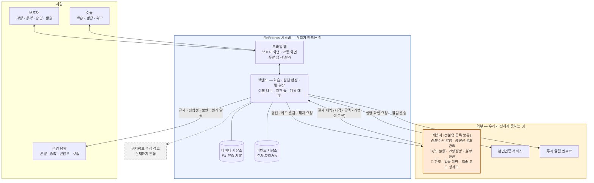
```mermaid
flowchart TB
    subgraph USERS["사람"]
        G["보호자<br/><i>계정 · 동의 · 승인 · 열람</i>"]
        C["아동<br/><i>학습 · 실천 · 회고</i>"]
        OPS["운영 담당<br/><i>온콜 · 정책 · 콘텐츠 · 사업</i>"]
    end

    subgraph FF["FinFriends 시스템 — 우리가 만드는 것"]
        APP["모바일 앱<br/>보호자 화면 · 아동 화면<br/><i>동일 앱 내 분리</i>"]
        CORE["백엔드 — 학습 · 실천 판정 · 별 원장<br/>성장 나무 · 월간 숲 · 계획 대조"]
        DATA[("데이터 저장소<br/><i>PII 분리 저장</i>")]
        EVT[("이벤트 저장소<br/><i>주차 파티셔닝</i>")]
    end

    subgraph EXT["외부 — 우리가 정하지 못하는 것"]
        PSP["제휴사 (선불업 등록 보유)<br/><i>선불수단 발행 · 충전금 별도관리</i><br/><i>카드 발행 · 가맹점망 · 결제 원장</i><br/>🔴 한도 · 업종 제한 · 업종 코드 상세도"]
        IDV["본인인증 서비스"]
        PUSH["푸시 알림 인프라"]
    end

    G <--> APP
    C <--> APP
    APP <--> CORE
    CORE --- DATA
    CORE --- EVT

    CORE -->|"충전 · 카드 발급 · 해지 요청"| PSP
    PSP -->|"결제 내역 (시각 · 금액 · 가맹점 분류)"| CORE
    CORE -->|"실명 확인 요청"| IDV
    CORE -->|"알림 발송"| PUSH
    CORE -->|"규제 · 정합성 · 보안 · 원가 알림"| OPS

    NOLOC["위치정보 수집 경로<br/>존재하지 않음"]
    CORE -.-x NOLOC

    style FF fill:#eef4ff,stroke:#4a7ac7,stroke-width:2px
    style EXT fill:#fff4d6,stroke:#e69500
    style PSP fill:#ffe9d6,stroke:#c06000,stroke-width:2px
    style NOLOC fill:#f2f2f2,stroke:#888,stroke-dasharray: 4 3
```

> **이 그림이 말하는 것** — 돈이 실제로 움직이는 부분(선불수단 발행·카드·가맹점망)은 **전부 제휴사 쪽에 있다.** 그래서 ① 카드 한도·업종 제한을 우리가 정할 수 없고(CON-REG-08) ② 우리 가용성 목표가 제휴사 SLA를 넘을 수 없고(CON-ARC-03) ③ 계획↔실제 대조의 정확도 상한이 제휴사의 업종 코드 상세도에 묶인다(CON-ARC-04). 점선으로 끊긴 「위치정보」는 **막아둔 기능이 아니라 아예 없는 경로**다(CON-REG-03).

### 2.2 컴포넌트 다이어그램 — 내부 구조

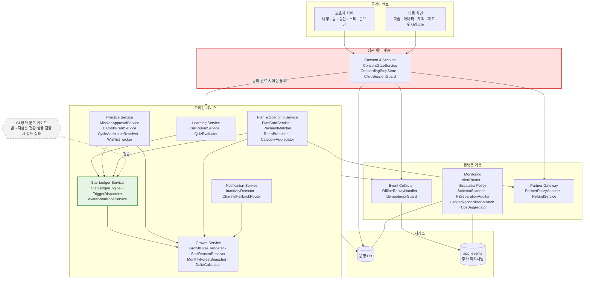
```mermaid
flowchart TB
    subgraph CLIENT["클라이언트"]
        PUI["보호자 화면<br/>나무 · 숲 · 승인 · 소비 · 온보딩"]
        CUI["아동 화면<br/>학습 · 아바타 · 계획 · 회고 · 위시리스트"]
    end

    subgraph GATE["접근 제어 계층"]
        CA["Consent & Account<br/>ConsentGateService<br/>OnboardingStepStore · ChildSessionGuard"]
    end

    subgraph DOMAIN["도메인 서비스"]
        LS["Learning Service<br/>CurriculumService · QuizEvaluator"]
        PS["Practice Service<br/>MissionApprovalService<br/>BackfillGrantService<br/>CycleAttributionResolver · WishlistTracker"]
        SL["Star Ledger Service<br/>StarLedgerEngine · TriggerDispatcher<br/>AvatarWardrobeService"]
        GS["Growth Service<br/>GrowthTreeRenderer · StallReasonResolver<br/>MonthlyForestSnapshot · DeltaCalculator"]
        PSP2["Plan & Spending Service<br/>PlanCardService · PaymentMatcher<br/>RetroBrancher · CategoryAggregator"]
        NS["Notification Service<br/>InactivityDetector · ChannelFallbackRouter"]
    end

    subgraph PLATFORM["플랫폼 계층"]
        EC["Event Collector<br/>OfflineReplayHandler · IdempotencyGuard"]
        MON["Monitoring<br/>AlertRouter · EscalationPolicy<br/>SchemaScanner · PiiSeparationAuditor<br/>LedgerReconciliationBatch · CostAggregator"]
        PG["Partner Gateway<br/>PartnerPolicyAdapter · RefundService"]
    end

    subgraph STORE["저장소"]
        DB[("운영 DB")]
        EVTDB[("app_events<br/>주차 파티셔닝")]
    end

    PUI --> CA
    CUI --> CA
    CA -->|"동의 완료 시에만 통과"| DOMAIN

    LS --> SL
    PS --> SL
    PSP2 --> SL
    SL --> GS
    PS --> GS
    PSP2 --> GS
    PSP2 --> PG
    CA --> PG
    NS --> GS

    DOMAIN --> EC
    CA --> EC
    EC --> EVTDB
    DOMAIN --> DB
    CA --> DB
    MON --- DB
    MON --- EVTDB

    CIGATE{{"CI 정적 분석 게이트<br/>별↔저금통 전환 심볼 검출 시 빌드 실패"}}
    CIGATE -.->|"검증"| SL

    style GATE fill:#ffe0e0,stroke:#c00,stroke-width:2px
    style SL fill:#e6f4e6,stroke:#2d8a2d,stroke-width:2px
    style CIGATE fill:#f2f2f2,stroke:#888,stroke-dasharray: 4 3
```

### 2.3 컴포넌트 책임 및 경계

| 컴포넌트 | 책임 | 다른 컴포넌트에 넘기지 않는 것 | 귀속 요구사항 |
| --- | --- | --- | --- |
| **Consent & Account** | 동의 게이트 · 온보딩 단계 보존 · 아동 세션 종속 검증 | **동의 판정** — 도메인 서비스가 자체 판단하지 않고 반드시 이 계층을 통과한다 | REQ-FUNC-007 · REQ-NF-008 · 011 |
| **Learning Service** | 4영역 커리큘럼 · 퀴즈 채점 · 이수 판정 | 별 지급 — 트리거만 발행하고 기입은 하지 않는다 | REQ-FUNC-003 · 006 |
| **Practice Service** | 실천 판정 · 승인 상태 전이 · 소급 지급 · 주기 귀속 | **주기 귀속 결정** — 나무·숲이 아니라 여기서 확정한다 | REQ-FUNC-002 · 010 · 012 |
| **Star Ledger Service** | ⭐ 증감 **이중 기입** · 멱등 처리 · 아이템 교환 차감 | 별↔저금통 전환 — **경로 자체가 없다** | REQ-FUNC-004 · 005 · REQ-NF-006 · 010 |
| **Growth Service** | 나무 단계·조건 · 정체 판정 · 월간 숲 스냅샷·델타 | 실천 인정 — 판정 결과를 **읽기만** 한다 | REQ-FUNC-001 · 009 |
| **Plan & Spending Service** | 계획 카드 · 결제 매칭 · 두 갈래 회고 · 업종 집계 | 업종 코드 정의 — 제휴사 값을 그대로 쓴다 | REQ-FUNC-008 · 013 |
| **Notification Service** | 미접속 판정 · 채널 폴백 · 발송 시간대 조정 | 푸시 도달 보장 — 도달을 전제하지 않는다 | REQ-FUNC-011 |
| **Event Collector** | 이벤트 10종 적재 · 오프라인 재전송 보정 · 멱등 방어 | 지표 계산 — 적재만 하고 산출은 배치가 한다 | REQ-NF-003 · SRS §9.4 |
| **Partner Gateway** | 충전·카드 발급·결제 조회·해지 어댑터 · 제휴사 정책 반영 | 한도·업종 제한 결정 | REQ-NF-013 · 015 |
| **Monitoring** | 알림 라우팅·에스컬레이션 · 스키마 스캔 · 원장 정산 · 원가 집계 | — | REQ-NF-006 · 009 · 016 · 017 |

### 2.4 규제·정합성 경계 — 설계가 지켜야 하는 네 개의 선

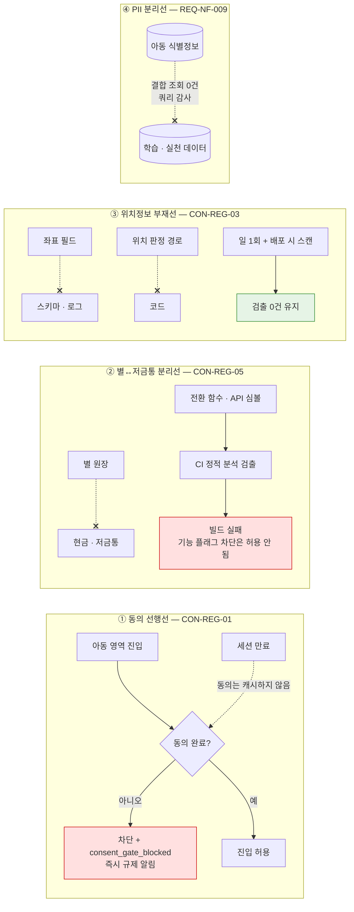
```mermaid
flowchart LR
    subgraph L1["① 동의 선행선 — CON-REG-01"]
        A1["아동 영역 진입"] --> A2{"동의 완료?"}
        A2 -- "아니오" --> A3["차단 + consent_gate_blocked<br/>즉시 규제 알림"]
        A2 -- "예" --> A4["진입 허용"]
        A5["세션 만료"] -.->|"동의는 캐시하지 않음"| A2
    end

    subgraph L2["② 별↔저금통 분리선 — CON-REG-05"]
        B1["별 원장"] -.-x B2["현금 · 저금통"]
        B3["전환 함수 · API 심볼"] --> B4["CI 정적 분석 검출"]
        B4 --> B5["빌드 실패<br/>기능 플래그 차단은 허용 안 됨"]
    end

    subgraph L3["③ 위치정보 부재선 — CON-REG-03"]
        C1["좌표 필드"] -.-x C2["스키마 · 로그"]
        C3["위치 판정 경로"] -.-x C4["코드"]
        C5["일 1회 + 배포 시 스캔"] --> C6["검출 0건 유지"]
    end

    subgraph L4["④ PII 분리선 — REQ-NF-009"]
        D1[("아동 식별정보")]
        D2[("학습 · 실천 데이터")]
        D1 -.-x|"결합 조회 0건<br/>쿼리 감사"| D2
    end

    style A3 fill:#ffe0e0,stroke:#c00
    style B5 fill:#ffe0e0,stroke:#c00
    style C6 fill:#e6f4e6,stroke:#2d8a2d
```

> **네 선의 공통점** — 전부 **허용 오차 0**이고, 전부 **기능 플래그나 운영 규칙이 아니라 구조로** 지켜진다. 플래그는 켜질 수 있고 운영 규칙은 잊힐 수 있어서, 검증 가능한 형태는 「경로 부재」뿐이다(SRS §12.1 계층 1~2).

---

## 3. 데이터 설계

> **근거** — SRS §6.1 인터페이스 목록 · SRS §6.2 데이터 모델 · SRS §6.4 DB 스키마 개요 · SRS §12.3 CON-ARC.

### 3.1 ERD — 개체 관계도

```mermaid
erDiagram
    GUARDIAN_ACCOUNTS ||--o{ CHILD_ACCOUNTS : "보호자 1 · 아동 N"
    GUARDIAN_ACCOUNTS ||--o| CONSENT_RECORDS : "동의 이력"
    CHILD_ACCOUNTS ||--o{ LEARNING_PROGRESS : "4영역 진도"
    CHILD_ACCOUNTS ||--o{ MISSIONS : "보호자가 등록"
    MISSIONS ||--o{ MISSION_APPROVALS : "상태 전이"
    MISSION_APPROVALS ||--o| PRACTICE_CREDITS : "승인 시 실천 인정"
    CHILD_ACCOUNTS ||--o{ PRACTICE_CREDITS : "실천 원장"
    PRACTICE_CREDITS ||--|| STAR_LEDGER : "실천 1 · 기입 1"
    CHILD_ACCOUNTS ||--o{ STAR_LEDGER : "별 증감 이중 기입"
    CHILD_ACCOUNTS ||--o{ TREE_STATES : "영역별 4행"
    TREE_STATES ||--o{ TREE_CONDITIONS : "조건 충족 내역"
    CHILD_ACCOUNTS ||--o{ FOREST_SNAPSHOTS : "월 1행"
    CHILD_ACCOUNTS ||--o{ PLAN_CARDS : "결제 전 계획"
    PLAN_CARDS ||--o{ SPENDING_RECORDS : "1 계획 : N 결제"
    SPENDING_RECORDS ||--o| RETROSPECTIVES : "회고"
    RETRO_SENTENCE_POOL ||--o{ RETROSPECTIVES : "비복원 추출"
    CHILD_ACCOUNTS ||--o{ WISHLISTS : "저축 목표"
    WISHLISTS ||--o{ WISHLIST_MILESTONES : "30 · 70 · 100%"
    CHILD_ACCOUNTS ||--o{ AVATAR_ITEMS_OWNED : "교환 이력"
    AVATAR_ITEM_CATALOG ||--o{ AVATAR_ITEMS_OWNED : "사전 제작 에셋"
    GUARDIAN_ACCOUNTS ||--o{ NOTIFICATIONS : "발송 이력"
    CHILD_ACCOUNTS ||--o{ APP_EVENTS : "인앱 이벤트"
    GUARDIAN_ACCOUNTS ||--o{ APP_EVENTS : "인앱 이벤트"
    CHILD_ACCOUNTS ||--o| PARTNER_CARDS : "선불카드 1매"

    GUARDIAN_ACCOUNTS {
        uuid id PK
        string auth_ref "인증 참조 — PII 분리 저장"
        enum consent_state "PENDING · COMPLETED"
        timestamp consent_completed_at
        string notify_window "알림 시간대"
        boolean push_allowed
        boolean sms_consented
    }
    CHILD_ACCOUNTS {
        uuid id PK
        uuid guardian_id FK
        int birth_year "만 나이 산출용"
        enum device_type "모집 분류·채널 선택 전용 — 기능 판정 금지"
        timestamp created_at "WPA 분모 7일 경과 판정"
        timestamp last_session_at "72시간 판정 입력"
    }
    CONSENT_RECORDS {
        uuid id PK
        uuid guardian_id FK
        enum consent_type "법정대리인 · 개인정보 · 문자수신"
        timestamp agreed_at
        string version "약관 버전"
    }
    LEARNING_PROGRESS {
        uuid id PK
        uuid child_id FK
        enum topic "EARN · SPEND · SAVE · GROW"
        boolean completed
        int quiz_correct_count
    }
    MISSIONS {
        uuid id PK
        uuid child_id FK
        string title
        int reward_star "고정 1"
        text condition "보호자 사전 설정"
        timestamp created_at
    }
    MISSION_APPROVALS {
        uuid id PK
        uuid mission_id FK
        enum state "PENDING · APPROVED · BACKFILLED · REJECTED"
        timestamp earned_at "아동 완료 시점 — 주차·주기 귀속 기준"
        timestamp awarded_at "보호자 승인 시점"
        int delay_hours
        uuid cycle_id "완료 시점 주기"
        text reject_reason
    }
    PRACTICE_CREDITS {
        uuid id PK
        uuid child_id FK
        enum trigger_code "4 · 5 · 6 (v1) · 7 · 8 (v2)"
        enum approval_mode "AUTO · PARENT"
        enum tree_slot "귀속 영역"
        timestamp earned_at "WPA 주차 귀속"
        timestamp awarded_at
        uuid cycle_id
    }
    STAR_LEDGER {
        uuid id PK
        uuid child_id FK
        int delta "증감 — 현금 전환 필드 없음"
        enum trigger_code "1~8 · 교환 차감"
        int balance_after
        string idempotency_key UK
        timestamp client_ts
        timestamp server_ts
    }
    TREE_STATES {
        uuid id PK
        uuid child_id FK
        enum slot "4영역"
        int stage
        uuid cycle_id
        date cycle_started_at
        int stall_days "14일 이상 시 정체"
    }
    TREE_CONDITIONS {
        uuid id PK
        uuid tree_state_id FK
        enum condition_type "LEARN · QUIZ · PRACTICE"
        int required
        int achieved
        boolean met
    }
    FOREST_SNAPSHOTS {
        uuid id PK
        uuid child_id FK
        string year_month
        json stage_by_slot
        json delta_vs_prev "전월 대비 — 7항목 이상"
        int stars_earned_this_month
        boolean prev_month_exists "false면 대체 문구"
    }
    PLAN_CARDS {
        uuid id PK
        uuid child_id FK
        enum author "CHILD · GUARDIAN"
        string merchant_hint "어디서"
        string category_code "제휴사 업종 코드와 대조 가능"
        int limit_amount "얼마까지"
        string item_note "무엇을"
        timestamp created_at
    }
    SPENDING_RECORDS {
        uuid id PK
        uuid child_id FK
        uuid plan_card_id FK "null이면 계획 없는 결제"
        int actual_amount
        string merchant_category "제휴사 승인 업종 코드"
        enum plan_match "MET · EXCEEDED · NO_PLAN"
        enum category_match "MATCHED · MISMATCHED"
        timestamp settled_at
    }
    RETROSPECTIVES {
        uuid id PK
        uuid spending_record_id FK
        uuid sentence_id FK
        boolean plan_met
        boolean star_granted
        int dwell_ms
        enum queue_state "PENDING · VIEWED · MERGED"
    }
    RETRO_SENTENCE_POOL {
        uuid id PK
        enum branch "MET · EXCEEDED · CATEGORY_MISMATCH"
        text sentence
        boolean used_in_cycle "비복원 추출"
    }
    WISHLISTS {
        uuid id PK
        uuid child_id FK
        string goal_name
        int goal_amount
        int saved_amount
    }
    WISHLIST_MILESTONES {
        uuid id PK
        uuid wishlist_id FK
        enum threshold "P30 · P70 · P100"
        boolean reached
        timestamp reached_at
    }
    AVATAR_ITEM_CATALOG {
        uuid id PK
        string name
        int star_price
        enum asset_state "SPEC_PENDING · PRODUCED"
    }
    AVATAR_ITEMS_OWNED {
        uuid id PK
        uuid child_id FK
        uuid item_id FK
        uuid star_ledger_id FK "차감 기입 참조"
    }
    NOTIFICATIONS {
        uuid id PK
        uuid guardian_id FK
        uuid child_id FK
        enum channel "PUSH · IN_APP_BANNER · SMS"
        enum event_code "INACTIVITY · REINSTALL_GUIDE"
        timestamp last_session_at
        timestamp sent_at
        timestamp opened_at
    }
    PARTNER_CARDS {
        uuid id PK
        uuid child_id FK
        string partner_card_ref
        enum state "REQUESTED · SHIPPING · ACTIVE · TERMINATED"
        timestamp requested_at
    }
    APP_EVENTS {
        uuid id PK
        enum event_type "10종"
        uuid subject_id "child_id 또는 parent_id"
        json payload
        string idempotency_key UK
        timestamp client_ts "주차 귀속 기준"
        timestamp server_ts
    }
```

> **이 그림에서 먼저 볼 것 세 가지**
> ① `PRACTICE_CREDITS`가 **WPA(북극성 지표)의 원천 테이블**이다 — 화면이 아니라 이 표가 「실천했다」의 정의다.
> ② `STAR_LEDGER`에 **현금 전환 필드가 없다.** 없는 것이 설계이며, 있으면 규제 검증이 성립하지 않는다(CON-REG-05).
> ③ `MISSION_APPROVALS`와 `PRACTICE_CREDITS`가 **`earned_at`과 `awarded_at`을 따로** 가진다. 이 두 칼럼이 소급 지급(ACE-6.2)과 WPA 주차 귀속(SRS §9.4.2)을 동시에 성립시킨다.

### 3.2 SRS §6.4 스키마 개요와의 대응

| SRS §6.4 표기 | 본 설계의 테이블 | 분해·추가 이유 |
| --- | --- | --- |
| `guardian_accounts` | `GUARDIAN_ACCOUNTS` + `CONSENT_RECORDS` | 동의는 **버전·유형별 이력**이 필요하다 — 약관 개정 시 재동의 대상을 특정해야 한다 |
| `child_accounts` | `CHILD_ACCOUNTS` + `PARTNER_CARDS` | 카드 상태(신청·배송·활성·해지)가 계정과 수명주기가 다르다. 배송 대기 구간이 R1.1(카드 없는 체험)의 분기점이다 |
| `tree_states` | `TREE_STATES` + `TREE_CONDITIONS` | 정체 원인을 **조건 단위로** 표시해야 하므로(ACE-3.1) 조건이 행이어야 한다. 조건을 JSON에 넣으면 「가장 적게 남은 조건」 정렬을 쿼리로 만들 수 없다 |
| `plan_cards` · 소비 내역 | `PLAN_CARDS` + `SPENDING_RECORDS` + `RETROSPECTIVES` | 1계획 : N결제 매칭(ACE-4.1)과 회고 큐 병합(ACE-5.2)이 각각 다른 수명주기를 가진다 |
| *(없음)* | `RETRO_SENTENCE_POOL` | 비복원 추출과 잔여율 알림(ACE-5.1)을 위해 문장이 데이터여야 한다 |
| *(없음)* | `WISHLIST_MILESTONES` | 30·70·100% 도달을 **각각 실천 트리거로 계상**해야 하므로 도달 이력이 행이어야 한다 |
| *(없음)* | `AVATAR_ITEM_CATALOG.asset_state` | 3D 에셋 사양 미확정(D4)을 **데이터로 표현**해 제작 착수 게이트(CON-RES-02)를 코드가 알 수 있게 한다 |

### 3.3 별 원장 이중 기입 설계

> ⭐ 정합성 오류율 **0% — 불변**(REQ-NF-006)을 만족시키는 최소 구조.

| 설계 요소 | 규칙 | 이 규칙이 막는 실패 |
| --- | --- | --- |
| **멱등 키** | `idempotency_key`에 UNIQUE 제약. 키 = `트리거코드:원천ID:아동ID` | 동일 미션 2회 승인 시 ⭐ 2개 지급(ACE-2.2) |
| **잔액 스냅샷** | 모든 행에 `balance_after`를 기록하고, 직전 행의 `balance_after + delta`와 일치해야 한다 | 중간 행 유실을 정산 전에 발견할 수 없는 상태 |
| **전환 필드 부재** | 현금·저금통 관련 칼럼·함수·API 심볼을 두지 않고 **CI 정적 분석으로 강제** | 플래그로 막았다가 켜지는 경로(CON-REG-05) |
| **차감형** | `delta < 0`은 아이템 교환에서만 발생하며 **주기 초기화 삭제가 없다** | 아동이 모은 것이 사라지는 경험 |
| **일일 정산** | 배치가 `SUM(delta)` vs 최종 `balance_after`를 대조. 불일치 1건이면 **30분 내 확인** | 오류가 누적되어 원인 추적이 불가능해지는 상태 |

### 3.4 이벤트 저장소 설계

| 항목 | 설계 | 근거 |
| --- | --- | --- |
| **파티셔닝** | `app_events`를 `client_ts` 기준 **주차 파티션**으로 분할 | 주간 지표 배치가 파티션 하나만 읽는다 · SRS §6.4 |
| **귀속 기준** | 주차·월 귀속은 항상 `client_ts`. `server_ts`는 유실·지연 진단 전용 | CON-ARC-07 · 계측 원칙 M3 |
| **멱등 방어** | `idempotency_key` UNIQUE + 재수신 시 무시(에러 아님) | 오프라인 재전송이 지표를 부풀리지 않게(M2) |
| **필수 필드 검증** | 배포 시 스키마 검증으로 null 차단 — 결측 0건 | 계측 건강성 H4 |
| **역행 감시** | `client_ts > server_ts` 또는 격차 7일 초과를 일간 집계 | 계측 건강성 H3 |

### 3.5 계측 공백 대응 — 추가가 필요한 이벤트 2종

> SRS §9.4.4가 특정한 공백이다. **이 두 개가 없으면 REQ-FUNC-008의 생존 조건(AC-4.4)이 측정 불가**다. 설계는 준비해 두고, 채택 여부는 SRS §6.1 · SRS §6.2.8 개정 결정에 따른다.

| 제안 이벤트 | 발생 시점 | 필수 필드 | 이 이벤트로 열리는 지표 |
| --- | --- | --- | --- |
| `plan_card_created` | 계획 카드 저장 확정 | `child_id` · `author` · `category_code` · `limit_amount` · `client_ts` | **KPI-04 분자** · 작성자 분포(아동/보호자 — CON-DEV-01 검증) |
| `payment_settled` | 제휴사 결제 확정 수신 | `child_id` · `amount` · `merchant_category` · `matched_plan_card_id` · `client_ts` | **KPI-04 분모** · AC-4.2 매칭 정확도 · KPI-05 앱 기록률 |

---
## 4. 클래스 설계 — CLD ①: Class Diagram

> **근거** — SRS §5 추적성 매트릭스의 구현 클래스 · SRS §6.2 열거형 정의.
> **CLD 표기에 대하여** — 요청된 `CLD`를 **Class Diagram**(§4)과 **Causal Loop Diagram**(§5) 두 가지로 모두 해석해 각각 작성했다. 앞은 *코드가 어떻게 쪼개지는가*, 뒤는 *행동이 어떤 되돌이를 만드는가*를 답한다. 어느 한쪽만 필요하면 그 장만 읽어도 된다.

### 4.1 도메인 클래스 다이어그램

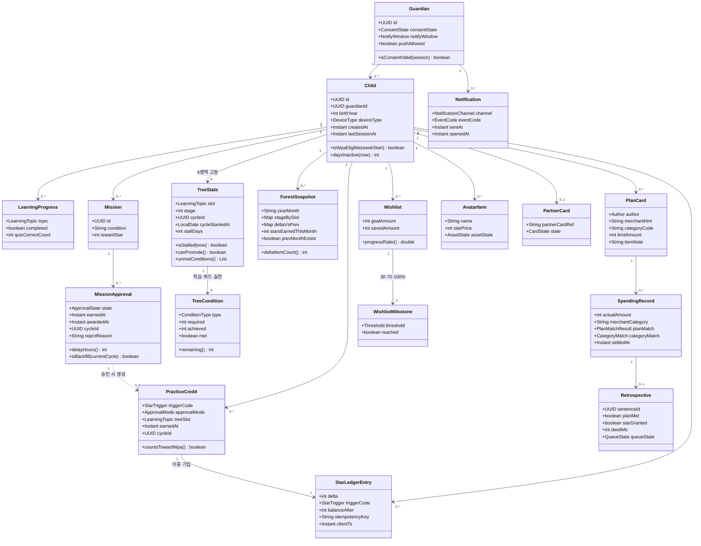
```mermaid
classDiagram
    class Guardian {
        +UUID id
        +ConsentState consentState
        +NotifyWindow notifyWindow
        +boolean pushAllowed
        +isConsentValid(session) boolean
    }
    class Child {
        +UUID id
        +UUID guardianId
        +int birthYear
        +DeviceType deviceType
        +Instant createdAt
        +Instant lastSessionAt
        +isWpaEligible(weekStart) boolean
        +daysInactive(now) int
    }
    class LearningProgress {
        +LearningTopic topic
        +boolean completed
        +int quizCorrectCount
    }
    class Mission {
        +UUID id
        +String condition
        +int rewardStar
    }
    class MissionApproval {
        +ApprovalState state
        +Instant earnedAt
        +Instant awardedAt
        +UUID cycleId
        +String rejectReason
        +delayHours() int
        +isBackfill(currentCycle) boolean
    }
    class PracticeCredit {
        +StarTrigger triggerCode
        +ApprovalMode approvalMode
        +LearningTopic treeSlot
        +Instant earnedAt
        +UUID cycleId
        +countsTowardWpa() boolean
    }
    class StarLedgerEntry {
        +int delta
        +StarTrigger triggerCode
        +int balanceAfter
        +String idempotencyKey
        +Instant clientTs
    }
    class TreeState {
        +LearningTopic slot
        +int stage
        +UUID cycleId
        +LocalDate cycleStartedAt
        +int stallDays
        +isStalled(now) boolean
        +canPromote() boolean
        +unmetConditions() List
    }
    class TreeCondition {
        +ConditionType type
        +int required
        +int achieved
        +boolean met
        +remaining() int
    }
    class ForestSnapshot {
        +String yearMonth
        +Map stageBySlot
        +Map deltaVsPrev
        +int starsEarnedThisMonth
        +boolean prevMonthExists
        +deltaItemCount() int
    }
    class PlanCard {
        +Author author
        +String merchantHint
        +String categoryCode
        +int limitAmount
        +String itemNote
    }
    class SpendingRecord {
        +int actualAmount
        +String merchantCategory
        +PlanMatchResult planMatch
        +CategoryMatch categoryMatch
        +Instant settledAt
    }
    class Retrospective {
        +UUID sentenceId
        +boolean planMet
        +boolean starGranted
        +int dwellMs
        +QueueState queueState
    }
    class Wishlist {
        +int goalAmount
        +int savedAmount
        +progressRatio() double
    }
    class WishlistMilestone {
        +Threshold threshold
        +boolean reached
    }
    class AvatarItem {
        +String name
        +int starPrice
        +AssetState assetState
    }
    class Notification {
        +NotificationChannel channel
        +EventCode eventCode
        +Instant sentAt
        +Instant openedAt
    }
    class PartnerCard {
        +String partnerCardRef
        +CardState state
    }

    Guardian "1" --> "0..*" Child
    Child "1" --> "0..*" LearningProgress
    Child "1" --> "0..*" Mission
    Mission "1" --> "0..*" MissionApproval
    MissionApproval "1" ..> "0..1" PracticeCredit : 승인 시 생성
    Child "1" --> "0..*" PracticeCredit
    PracticeCredit "1" --> "1" StarLedgerEntry : 이중 기입
    Child "1" --> "0..*" StarLedgerEntry
    Child "1" --> "4" TreeState : 4영역 고정
    TreeState "1" --> "3" TreeCondition : 학습·퀴즈·실천
    Child "1" --> "0..*" ForestSnapshot
    Child "1" --> "0..*" PlanCard
    PlanCard "1" --> "0..*" SpendingRecord
    SpendingRecord "1" --> "0..1" Retrospective
    Child "1" --> "0..*" Wishlist
    Wishlist "1" --> "3" WishlistMilestone : 30·70·100%
    Child "1" --> "0..*" AvatarItem
    Guardian "1" --> "0..*" Notification
    Child "1" --> "0..1" PartnerCard
```

> **읽는 요령** — 숫자는 개수다. `Child "1" --> "4" TreeState`는 *"아동 한 명에게 나무 상태가 정확히 4개(4영역)"*, `TreeState "1" --> "3" TreeCondition`은 *"영역마다 조건이 정확히 3개(학습·퀴즈·실천)"* 를 뜻한다. **이 두 숫자가 고정이라는 것이 곧 ADR-006**이다 — 조건을 2개로 줄이면 실천을 뺄 수 있게 된다.

### 4.2 서비스 클래스 다이어그램 — 판정 책임의 분리

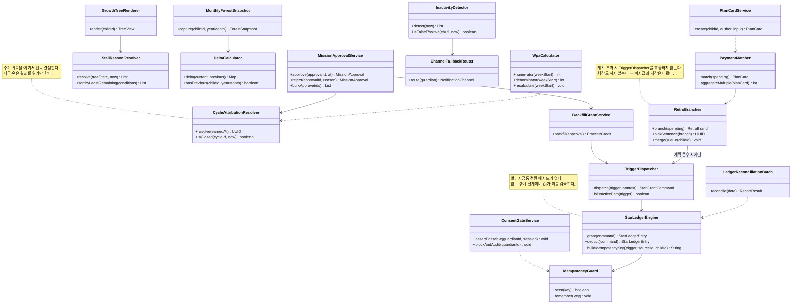
```mermaid
classDiagram
    class ConsentGateService {
        +assertPassable(guardianId, session) void
        +blockAndAudit(guardianId) void
    }
    class TriggerDispatcher {
        +dispatch(trigger, context) StarGrantCommand
        +isPracticePath(trigger) boolean
    }
    class StarLedgerEngine {
        +grant(command) StarLedgerEntry
        +deduct(command) StarLedgerEntry
        +buildIdempotencyKey(trigger, sourceId, childId) String
    }
    class IdempotencyGuard {
        +seen(key) boolean
        +remember(key) void
    }
    class MissionApprovalService {
        +approve(approvalId, at) MissionApproval
        +reject(approvalId, reason) MissionApproval
        +bulkApprove(ids) List
    }
    class CycleAttributionResolver {
        +resolve(earnedAt) UUID
        +isClosed(cycleId, now) boolean
    }
    class BackfillGrantService {
        +backfill(approval) PracticeCredit
    }
    class GrowthTreeRenderer {
        +render(childId) TreeView
    }
    class StallReasonResolver {
        +resolve(treeState, now) List
        +sortByLeastRemaining(conditions) List
    }
    class MonthlyForestSnapshot {
        +capture(childId, yearMonth) ForestSnapshot
    }
    class DeltaCalculator {
        +delta(current, previous) Map
        +hasPrevious(childId, yearMonth) boolean
    }
    class PlanCardService {
        +create(childId, author, input) PlanCard
    }
    class PaymentMatcher {
        +match(spending) PlanCard
        +aggregateMultiple(planCard) int
    }
    class RetroBrancher {
        +branch(spending) RetroBranch
        +pickSentence(branch) UUID
        +mergeQueue(childId) void
    }
    class InactivityDetector {
        +detect(now) List
        +isFalsePositive(child, now) boolean
    }
    class ChannelFallbackRouter {
        +route(guardian) NotificationChannel
    }
    class LedgerReconciliationBatch {
        +reconcile(date) ReconResult
    }
    class WpaCalculator {
        +numerator(weekStart) int
        +denominator(weekStart) int
        +recalculate(weekStart) void
    }

    ConsentGateService ..> IdempotencyGuard
    MissionApprovalService --> CycleAttributionResolver
    MissionApprovalService --> BackfillGrantService
    BackfillGrantService --> TriggerDispatcher
    TriggerDispatcher --> StarLedgerEngine
    StarLedgerEngine --> IdempotencyGuard
    GrowthTreeRenderer --> StallReasonResolver
    MonthlyForestSnapshot --> DeltaCalculator
    PaymentMatcher --> RetroBrancher
    PlanCardService ..> PaymentMatcher
    RetroBrancher --> TriggerDispatcher : 계획 준수 시에만
    InactivityDetector --> ChannelFallbackRouter
    LedgerReconciliationBatch ..> StarLedgerEngine
    WpaCalculator ..> CycleAttributionResolver

    note for StarLedgerEngine "별↔저금통 전환 메서드가 없다.<br/>없는 것이 설계이며 CI가 이를 검증한다."
    note for RetroBrancher "계획 초과 시 TriggerDispatcher를 호출하지 않는다.<br/>차감도 하지 않는다 — 미지급과 차감은 다르다."
    note for CycleAttributionResolver "주기 귀속을 여기서 단독 결정한다.<br/>나무·숲은 결과를 읽기만 한다."
```

### 4.3 상태 수명주기 — SRS §6.2와의 분담

| 상태 기계 | 정의 위치 | 본 문서의 보강 |
| --- | --- | --- |
| `ApprovalState` (미션 승인) | **SRS §6.2.4** — 전이도 있음 | 본 문서 §6.4 시퀀스에서 소급 분기의 호출 순서를 보강 |
| `PlanMatchResult` · `CategoryMatch` | **SRS §6.2.5** — 판정 순서도 있음 | 본 문서 §7.3에서 회고 큐 병합까지 확장 |
| `NotificationChannel` | **SRS §6.2.6** — 폴백 순서도 있음 | 본 문서 §6.7 시퀀스에서 시간대 조정과 결합 |
| `Verdict` (PASS·HOLD·FAIL) | **SRS §6.2.7** | 보강 없음 — 판정 규칙은 SRS §9.1이 원본 |
| **`CardState`** (카드 수명주기) | 없음 | **아래 신규** — R1.1 「카드 없는 체험」의 분기점이라 명시가 필요하다 |
| **`QueueState`** (회고 큐) | 없음 | **본 문서 §7.3 플로차트에서 신규** — ACE-5.2의 병합 규칙을 상태로 표현 |

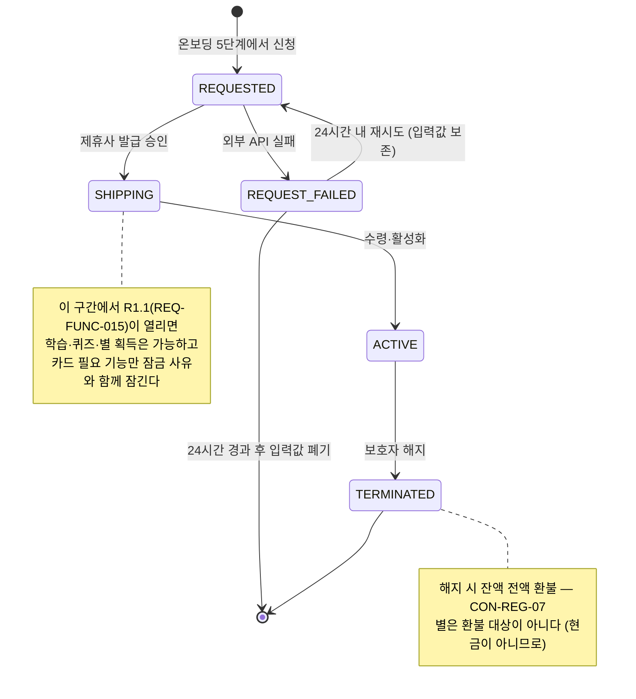
```mermaid
stateDiagram-v2
    [*] --> REQUESTED : 온보딩 5단계에서 신청
    REQUESTED --> SHIPPING : 제휴사 발급 승인
    REQUESTED --> REQUEST_FAILED : 외부 API 실패
    REQUEST_FAILED --> REQUESTED : 24시간 내 재시도 (입력값 보존)
    REQUEST_FAILED --> [*] : 24시간 경과 후 입력값 폐기
    SHIPPING --> ACTIVE : 수령·활성화
    ACTIVE --> TERMINATED : 보호자 해지
    TERMINATED --> [*]

    note right of SHIPPING
        이 구간에서 R1.1(REQ-FUNC-015)이 열리면
        학습·퀴즈·별 획득은 가능하고
        카드 필요 기능만 잠금 사유와 함께 잠긴다
    end note

    note right of TERMINATED
        해지 시 잔액 전액 환불 — CON-REG-07
        별은 환불 대상이 아니다 (현금이 아니므로)
    end note
```

---

## 5. 인과 루프 다이어그램 — CLD ②: Causal Loop Diagram

> **근거** — SRS §1.1 두 가치 선언 · SRS §8.1 이탈 트리거 · SRS §11 ADR-001·006 · SRS §10.4 리스크.
> **읽는 법** — 화살표는 *"이것이 늘면 저것도 늘어난다(+)"* 또는 *"이것이 늘면 저것은 줄어든다(−)"* 를 뜻한다. **R**은 스스로 커지는 되돌이(강화 루프), **B**는 스스로 멈추는 되돌이(균형 루프)다.

### 5.1 R1 — 성장 루프 *(선언 ① 이 살아 있을 때)*

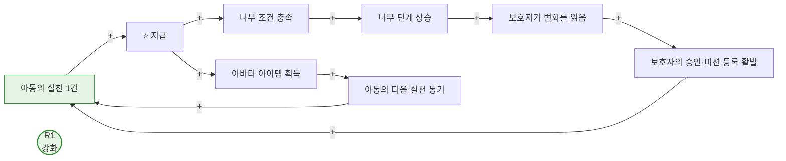
```mermaid
flowchart LR
    A["아동의 실천 1건"] -->|"+"| B["⭐ 지급"]
    B -->|"+"| C["나무 조건 충족"]
    C -->|"+"| D["나무 단계 상승"]
    D -->|"+"| E["보호자가 변화를 읽음"]
    E -->|"+"| F["보호자의 승인·미션 등록 활발"]
    F -->|"+"| A
    B -->|"+"| G["아바타 아이템 획득"]
    G -->|"+"| H["아동의 다음 실천 동기"]
    H -->|"+"| A

    R1(("R1<br/>강화"))
    style R1 fill:#e6f4e6,stroke:#2d8a2d,stroke-width:2px
    style A fill:#e6f4e6,stroke:#2d8a2d
```

> **이 루프가 제품의 심장이다.** WPA를 북극성으로 둔 이유가 여기 있다 — 루프의 **입구가 실천 1건**이므로, 실천이 0이면 나머지 화살표가 전부 멈춘다(ADR-001).

### 5.2 R2 — 전달 루프와 B1 — 불신 루프 *(선언 ② 가 걸린 지점)*

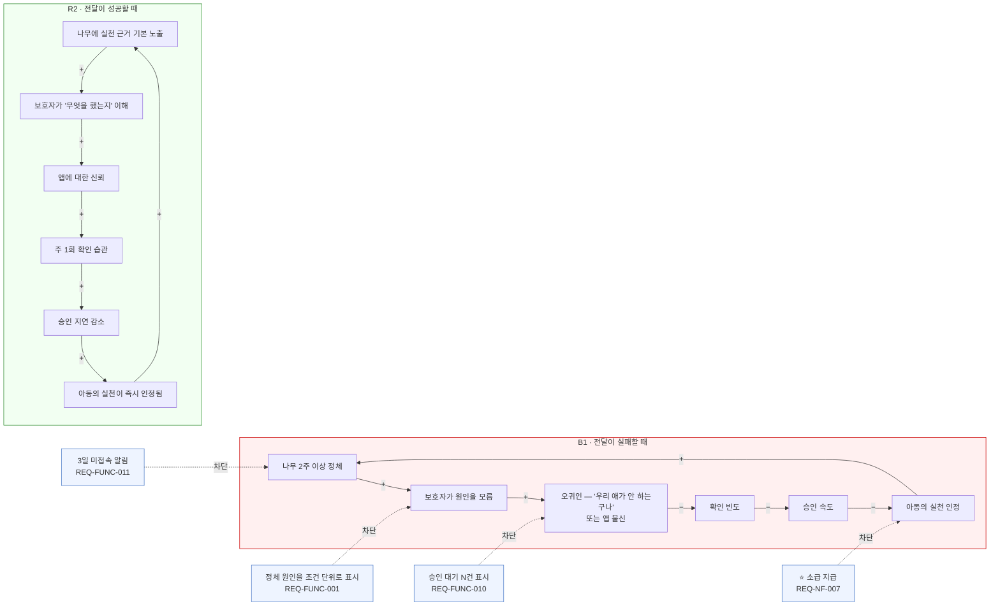
```mermaid
flowchart LR
    subgraph POS["R2 · 전달이 성공할 때"]
        P1["나무에 실천 근거 기본 노출"] -->|"+"| P2["보호자가 '무엇을 했는지' 이해"]
        P2 -->|"+"| P3["앱에 대한 신뢰"]
        P3 -->|"+"| P4["주 1회 확인 습관"]
        P4 -->|"+"| P5["승인 지연 감소"]
        P5 -->|"+"| P6["아동의 실천이 즉시 인정됨"]
        P6 -->|"+"| P1
    end

    subgraph NEG["B1 · 전달이 실패할 때"]
        N1["나무 2주 이상 정체"] -->|"+"| N2["보호자가 원인을 모름"]
        N2 -->|"+"| N3["오귀인 — '우리 애가 안 하는구나'<br/>또는 앱 불신"]
        N3 -->|"−"| N4["확인 빈도"]
        N4 -->|"−"| N5["승인 속도"]
        N5 -->|"−"| N6["아동의 실천 인정"]
        N6 -->|"+"| N1
    end

    FIX1["정체 원인을 조건 단위로 표시<br/>REQ-FUNC-001"] -.->|"차단"| N2
    FIX2["승인 대기 N건 표시<br/>REQ-FUNC-010"] -.->|"차단"| N3
    FIX3["⭐ 소급 지급<br/>REQ-NF-007"] -.->|"차단"| N6
    FIX4["3일 미접속 알림<br/>REQ-FUNC-011"] -.->|"차단"| N1

    style POS fill:#f2fff2,stroke:#2d8a2d
    style NEG fill:#fff0f0,stroke:#c00
    style FIX1 fill:#eef4ff,stroke:#4a7ac7
    style FIX2 fill:#eef4ff,stroke:#4a7ac7
    style FIX3 fill:#eef4ff,stroke:#4a7ac7
    style FIX4 fill:#eef4ff,stroke:#4a7ac7
```

> **이 그림이 요구사항 4건의 존재 이유다.** B1은 *"아이가 멈춤 → 보호자가 이유를 모름 → 확인을 덜 함 → 승인이 늦음 → 아이의 실천이 인정 안 됨 → 더 멈춤"* 의 자기강화 하강 루프다. 파란 상자 4개는 각각 이 루프의 **다른 지점을 끊는다** — 하나만 넣으면 다른 지점에서 루프가 다시 닫힌다. H1형 보호자의 이탈이 *"자녀 탓이 아니라 앱 불신"* 으로 일어난다는 관찰(SRS §8.1)이 N3에 해당한다.

### 5.3 B2 — 계획 카드 루프의 취약점 *(리스크 R1의 구조)*

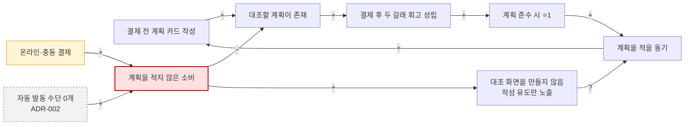
```mermaid
flowchart LR
    C1["결제 전 계획 카드 작성"] -->|"+"| C2["대조할 계획이 존재"]
    C2 -->|"+"| C3["결제 후 두 갈래 회고 성립"]
    C3 -->|"+"| C4["계획 준수 시 ⭐1"]
    C4 -->|"+"| C5["계획을 적을 동기"]
    C5 -->|"+"| C1

    X1["계획을 적지 않은 소비"] -->|"−"| C2
    X1 -->|"+"| X2["대조 화면을 만들지 않음<br/>작성 유도만 노출"]
    X2 -->|"?"| C5

    ON["온라인·충동 결제"] -->|"+"| X1
    NOAUTO["자동 발동 수단 0개<br/>ADR-002"] -->|"+"| X1

    style X1 fill:#ffe0e0,stroke:#c00,stroke-width:2px
    style NOAUTO fill:#f2f2f2,stroke:#888,stroke-dasharray: 4 3
    style ON fill:#fff4d6,stroke:#e69500
```

> **정직하게 남기는 부분** — 이 루프는 **입구가 사용자 행동 하나에 걸려 있다.** 자동으로 발동하는 사전 수단이 없으므로(ADR-002), 작성률이 낮으면 사전(적기)과 사후(맞춰보기)가 **함께** 무너진다. 그래서 AC-4.4(작성률 ≥ 50%)가 REQ-FUNC-008의 **생존 조건**이고, X2에서 C5로 가는 화살표가 `?`인 것은 *"작성 유도가 실제로 다음 작성을 늘리는지 아직 모른다"* 는 뜻이다 — 이 물음표가 KPI-04로 측정된다.

### 5.4 B3 — 별의 사용처 제약 *(ADR-003이 지불한 대가)*

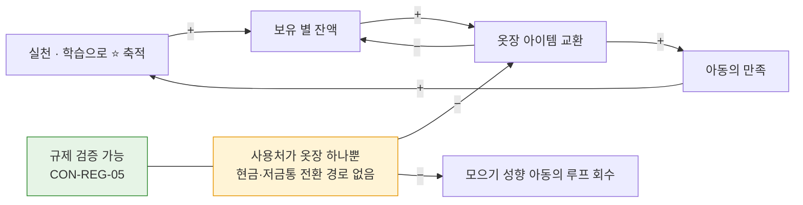
```mermaid
flowchart LR
    S1["실천 · 학습으로 ⭐ 축적"] -->|"+"| S2["보유 별 잔액"]
    S2 -->|"+"| S3["옷장 아이템 교환"]
    S3 -->|"−"| S2
    S3 -->|"+"| S4["아동의 만족"]
    S4 -->|"+"| S1

    LIMIT["사용처가 옷장 하나뿐<br/>현금·저금통 전환 경로 없음"] -->|"−"| S3
    LIMIT -->|"−"| S5["모으기 성향 아동의 루프 회수"]
    SAFE["규제 검증 가능<br/>CON-REG-05"] --- LIMIT

    style LIMIT fill:#fff4d6,stroke:#e69500
    style SAFE fill:#e6f4e6,stroke:#2d8a2d
```

> **대가를 지운 그림이 아니다.** 분리선을 지키면 규제 검증이 성립하지만(초록), 별의 사용처가 하나뿐이라 **모으기 성향 아동의 루프가 약해진다**(노랑). REQ-FUNC-016(옷장 외 목적지)이 R2+로 배분된 이유가 이 화살표다.

---
## 6. 시퀀스 다이어그램

> **근거** — SRS §9.2 정상 경로 수용 기준 30건 · SRS §9.3 예외 경로 19건.
> 수용 기준이 *"무엇이 참이어야 하는가"* 를 말한다면, 시퀀스는 *"그것이 참이 되려면 누가 누구를 어떤 순서로 부르는가"* 를 말한다. 각 다이어그램 끝에 검증 대상 AC를 붙였다.

### 6.1 SD-01 · 보호자 온보딩과 법정대리인 동의

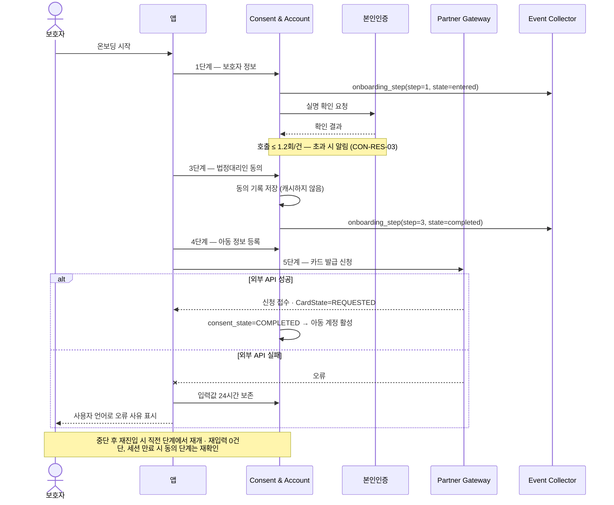
```mermaid
sequenceDiagram
    actor G as 보호자
    participant APP as 앱
    participant CA as Consent & Account
    participant IDV as 본인인증
    participant PG as Partner Gateway
    participant EC as Event Collector

    G->>APP: 온보딩 시작
    APP->>CA: 1단계 — 보호자 정보
    CA->>EC: onboarding_step(step=1, state=entered)
    CA->>IDV: 실명 확인 요청
    IDV-->>CA: 확인 결과
    Note over CA,IDV: 호출 ≤ 1.2회/건 — 초과 시 알림 (CON-RES-03)

    APP->>CA: 3단계 — 법정대리인 동의
    CA->>CA: 동의 기록 저장 (캐시하지 않음)
    CA->>EC: onboarding_step(step=3, state=completed)

    APP->>CA: 4단계 — 아동 정보 등록
    APP->>PG: 5단계 — 카드 발급 신청

    alt 외부 API 성공
        PG-->>APP: 신청 접수 · CardState=REQUESTED
        CA->>CA: consent_state=COMPLETED → 아동 계정 활성
    else 외부 API 실패
        PG--xAPP: 오류
        APP->>CA: 입력값 24시간 보존
        APP-->>G: 사용자 언어로 오류 사유 표시
    end

    Note over G,CA: 중단 후 재진입 시 직전 단계에서 재개 · 재입력 0건<br/>단, 세션 만료 시 동의 단계는 재확인
```

**검증 대상** — AC-8.1(재개) · AC-8.3(총 소요 ≤ 10분) · ACE-8.1(API 실패 보존) · ACE-8.2(동의 재확인)

### 6.2 SD-02 · 동의 미완 상태의 아동 영역 진입 차단

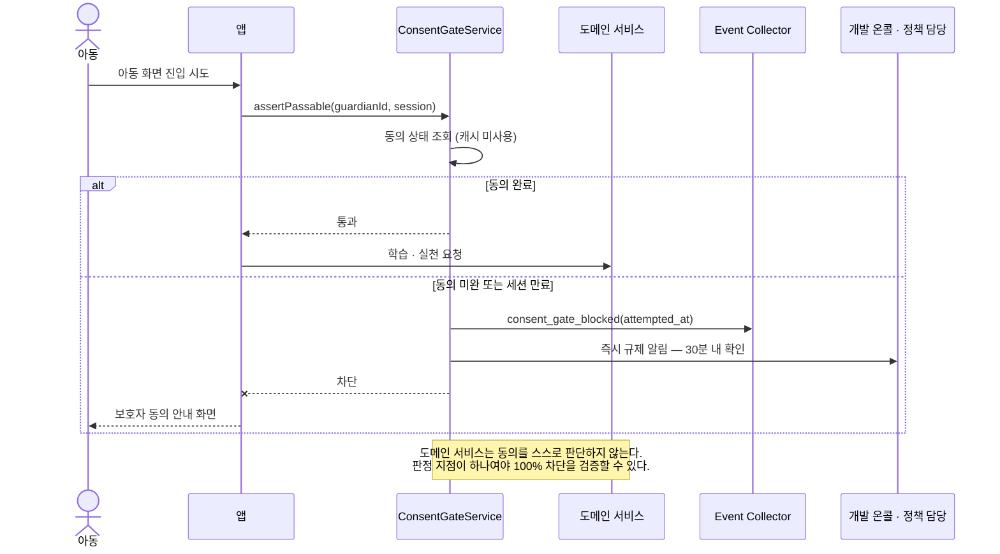
```mermaid
sequenceDiagram
    actor C as 아동
    participant APP as 앱
    participant CA as ConsentGateService
    participant DS as 도메인 서비스
    participant EC as Event Collector
    participant OC as 개발 온콜 · 정책 담당

    C->>APP: 아동 화면 진입 시도
    APP->>CA: assertPassable(guardianId, session)
    CA->>CA: 동의 상태 조회 (캐시 미사용)

    alt 동의 완료
        CA-->>APP: 통과
        APP->>DS: 학습 · 실천 요청
    else 동의 미완 또는 세션 만료
        CA->>EC: consent_gate_blocked(attempted_at)
        CA->>OC: 즉시 규제 알림 — 30분 내 확인
        CA--xAPP: 차단
        APP-->>C: 보호자 동의 안내 화면
    end

    Note over CA,DS: 도메인 서비스는 동의를 스스로 판단하지 않는다.<br/>판정 지점이 하나여야 100% 차단을 검증할 수 있다.
```

**검증 대상** — REQ-NF-008(100% 차단) · KPI-23(차단 건수) · CON-REG-01

### 6.3 SD-03 · 미션 완료 → 승인 → ⭐ 지급 → 나무 갱신

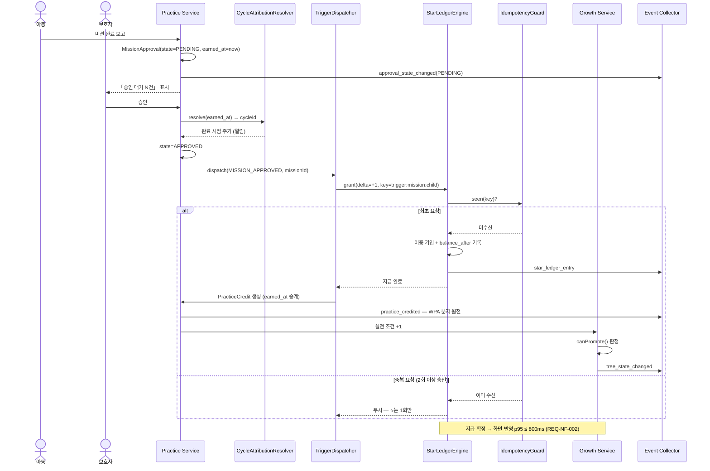
```mermaid
sequenceDiagram
    actor C as 아동
    actor G as 보호자
    participant PS as Practice Service
    participant CAR as CycleAttributionResolver
    participant TD as TriggerDispatcher
    participant SL as StarLedgerEngine
    participant IG as IdempotencyGuard
    participant GS as Growth Service
    participant EC as Event Collector

    C->>PS: 미션 완료 보고
    PS->>PS: MissionApproval(state=PENDING, earned_at=now)
    PS->>EC: approval_state_changed(PENDING)
    PS-->>G: 「승인 대기 N건」 표시

    G->>PS: 승인
    PS->>CAR: resolve(earned_at) → cycleId
    CAR-->>PS: 완료 시점 주기 (열림)
    PS->>PS: state=APPROVED
    PS->>TD: dispatch(MISSION_APPROVED, missionId)
    TD->>SL: grant(delta=+1, key=trigger:mission:child)
    SL->>IG: seen(key)?

    alt 최초 요청
        IG-->>SL: 미수신
        SL->>SL: 이중 기입 + balance_after 기록
        SL->>EC: star_ledger_entry
        SL-->>TD: 지급 완료
        TD->>PS: PracticeCredit 생성 (earned_at 승계)
        PS->>EC: practice_credited — WPA 분자 원천
        PS->>GS: 실천 조건 +1
        GS->>GS: canPromote() 판정
        GS->>EC: tree_state_changed
    else 중복 요청 (2회 이상 승인)
        IG-->>SL: 이미 수신
        SL-->>TD: 무시 — ⭐는 1회만
    end

    Note over SL,GS: 지급 확정 → 화면 반영 p95 ≤ 800ms (REQ-NF-002)
```

**검증 대상** — AC-2.1(동일 세션 반영) · ACE-2.2(중복 승인 1회 지급) · AC-6.2(대기 N건)

### 6.4 SD-04 · 승인 지연 시 소급 지급 *(완료 시점 주기가 이미 종료된 경우)*

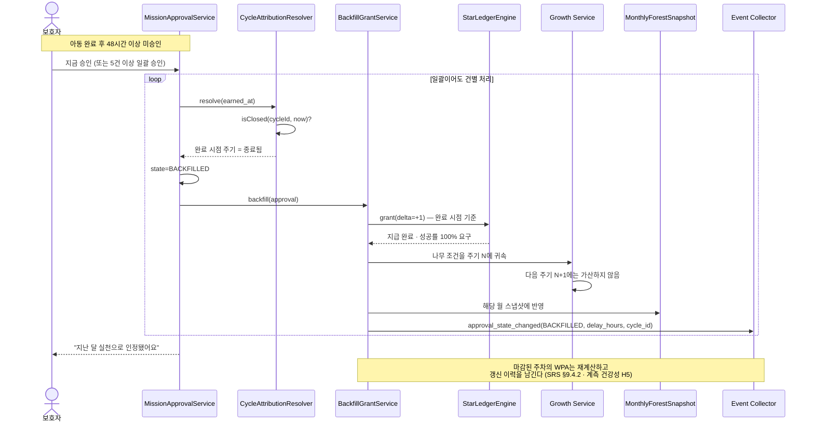
```mermaid
sequenceDiagram
    actor G as 보호자
    participant PS as MissionApprovalService
    participant CAR as CycleAttributionResolver
    participant BG as BackfillGrantService
    participant SL as StarLedgerEngine
    participant GS as Growth Service
    participant FS as MonthlyForestSnapshot
    participant EC as Event Collector

    Note over G,PS: 아동 완료 후 48시간 이상 미승인
    G->>PS: 지금 승인 (또는 5건 이상 일괄 승인)

    loop 일괄이어도 건별 처리
        PS->>CAR: resolve(earned_at)
        CAR->>CAR: isClosed(cycleId, now)?
        CAR-->>PS: 완료 시점 주기 = 종료됨
        PS->>PS: state=BACKFILLED
        PS->>BG: backfill(approval)
        BG->>SL: grant(delta=+1) — 완료 시점 기준
        SL-->>BG: 지급 완료 · 성공률 100% 요구
        BG->>GS: 나무 조건을 주기 N에 귀속
        GS->>GS: 다음 주기 N+1에는 가산하지 않음
        BG->>FS: 해당 월 스냅샷에 반영
        BG->>EC: approval_state_changed(BACKFILLED, delay_hours, cycle_id)
    end

    PS-->>G: "지난 달 실천으로 인정됐어요"

    Note over BG,EC: 마감된 주차의 WPA는 재계산하고<br/>갱신 이력을 남긴다 (SRS §9.4.2 · 계측 건강성 H5)
```

**검증 대상** — AC-6.1(성공률 100%) · ACE-6.2(주기 귀속) · ACE-6.3(일괄 개별 소급) · REQ-NF-007

### 6.5 SD-05 · 계획 카드 → 결제 → 매칭 → 두 갈래 회고

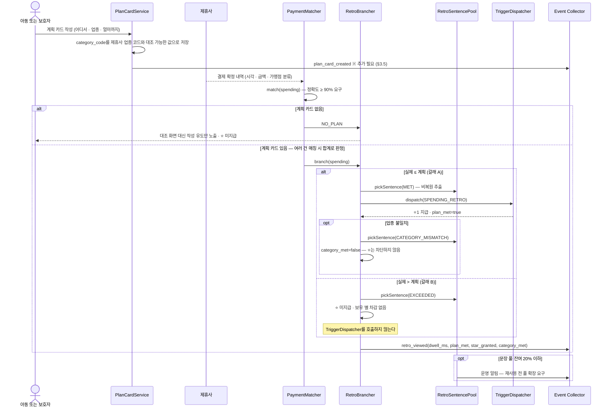
```mermaid
sequenceDiagram
    actor C as 아동 또는 보호자
    participant PC as PlanCardService
    participant PSP as 제휴사
    participant PM as PaymentMatcher
    participant RB as RetroBrancher
    participant POOL as RetroSentencePool
    participant TD as TriggerDispatcher
    participant EC as Event Collector

    C->>PC: 계획 카드 작성 (어디서 · 업종 · 얼마까지)
    PC->>PC: category_code를 제휴사 업종 코드와 대조 가능한 값으로 저장
    PC->>EC: plan_card_created ※ 추가 필요 (§3.5)

    PSP-->>PM: 결제 확정 내역 (시각 · 금액 · 가맹점 분류)
    PM->>PM: match(spending) — 정확도 ≥ 90% 요구

    alt 계획 카드 없음
        PM->>RB: NO_PLAN
        RB-->>C: 대조 화면 대신 작성 유도만 노출 · ⭐ 미지급
    else 계획 카드 있음 — 여러 건 매칭 시 합계로 판정
        PM->>RB: branch(spending)
        alt 실제 ≤ 계획 (갈래 A)
            RB->>POOL: pickSentence(MET) — 비복원 추출
            RB->>TD: dispatch(SPENDING_RETRO)
            TD-->>RB: ⭐1 지급 · plan_met=true
            opt 업종 불일치
                RB->>POOL: pickSentence(CATEGORY_MISMATCH)
                RB->>RB: category_met=false — ⭐는 차단하지 않음
            end
        else 실제 > 계획 (갈래 B)
            RB->>POOL: pickSentence(EXCEEDED)
            RB->>RB: ⭐ 미지급 · 보유 별 차감 없음
            Note over RB: TriggerDispatcher를 호출하지 않는다
        end
        RB->>EC: retro_viewed(dwell_ms, plan_met, star_granted, category_met)
    end

    opt 문장 풀 잔여 20% 이하
        POOL->>EC: 운영 알림 — 재사용 전 풀 확장 요구
    end
```

**검증 대상** — AC-4.1~4.3 · AC-5.1~5.6 · ACE-4.1(합계 판정) · ACE-4.2(업종 불일치) · ACE-5.1(문장 풀)

### 6.6 SD-06 · 오프라인 실천 후 재연결 *(멱등 방어)*

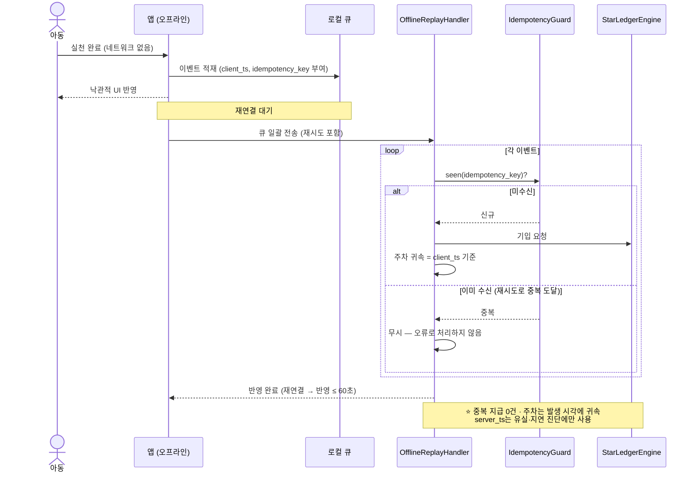
```mermaid
sequenceDiagram
    actor C as 아동
    participant APP as 앱 (오프라인)
    participant Q as 로컬 큐
    participant EC as OfflineReplayHandler
    participant IG as IdempotencyGuard
    participant SL as StarLedgerEngine

    C->>APP: 실천 완료 (네트워크 없음)
    APP->>Q: 이벤트 적재 (client_ts, idempotency_key 부여)
    APP-->>C: 낙관적 UI 반영

    Note over APP,Q: 재연결 대기

    APP->>EC: 큐 일괄 전송 (재시도 포함)
    loop 각 이벤트
        EC->>IG: seen(idempotency_key)?
        alt 미수신
            IG-->>EC: 신규
            EC->>SL: 기입 요청
            EC->>EC: 주차 귀속 = client_ts 기준
        else 이미 수신 (재시도로 중복 도달)
            IG-->>EC: 중복
            EC->>EC: 무시 — 오류로 처리하지 않음
        end
    end
    EC-->>APP: 반영 완료 (재연결 → 반영 ≤ 60초)

    Note over EC,SL: ⭐ 중복 지급 0건 · 주차는 발생 시각에 귀속<br/>server_ts는 유실·지연 진단에만 사용
```

**검증 대상** — ACE-2.1(중복 0건 · ≤60초 · client_ts) · REQ-NF-003 · 계측 원칙 M2·M3

### 6.7 SD-07 · 3일 미접속 판정과 채널 폴백

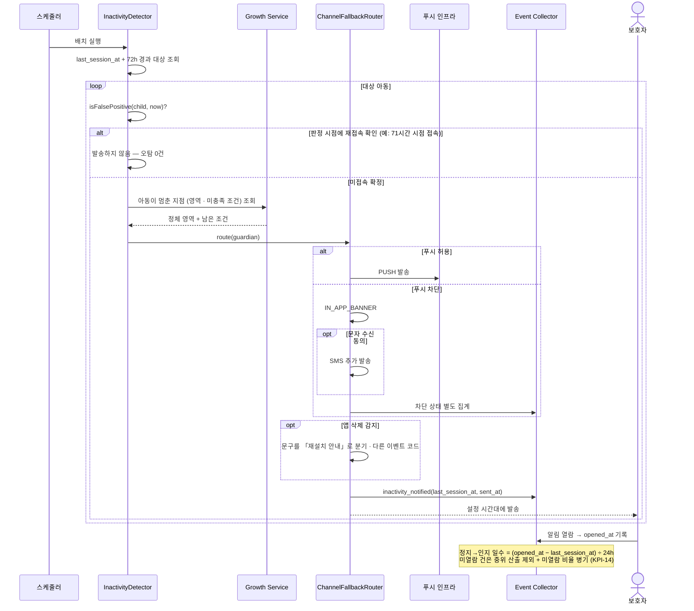
```mermaid
sequenceDiagram
    participant SCH as 스케줄러
    participant ID as InactivityDetector
    participant GS as Growth Service
    participant CFR as ChannelFallbackRouter
    participant PUSH as 푸시 인프라
    participant EC as Event Collector
    actor G as 보호자

    SCH->>ID: 배치 실행
    ID->>ID: last_session_at + 72h 경과 대상 조회

    loop 대상 아동
        ID->>ID: isFalsePositive(child, now)?
        alt 판정 시점에 재접속 확인 (예: 71시간 시점 접속)
            ID->>ID: 발송하지 않음 — 오탐 0건
        else 미접속 확정
            ID->>GS: 아동이 멈춘 지점 (영역 · 미충족 조건) 조회
            GS-->>ID: 정체 영역 + 남은 조건
            ID->>CFR: route(guardian)
            alt 푸시 허용
                CFR->>PUSH: PUSH 발송
            else 푸시 차단
                CFR->>CFR: IN_APP_BANNER
                opt 문자 수신 동의
                    CFR->>CFR: SMS 추가 발송
                end
                CFR->>EC: 차단 상태 별도 집계
            end
            opt 앱 삭제 감지
                CFR->>CFR: 문구를 「재설치 안내」로 분기 · 다른 이벤트 코드
            end
            CFR->>EC: inactivity_notified(last_session_at, sent_at)
            CFR-->>G: 설정 시간대에 발송
        end
    end

    G->>EC: 알림 열람 → opened_at 기록
    Note over EC: 정지→인지 일수 = (opened_at − last_session_at) ÷ 24h<br/>미열람 건은 중위 산출 제외 + 미열람 비율 병기 (KPI-14)
```

**검증 대상** — AC-7.1~7.3 · ACE-7.1~7.3 · KPI-14·15

### 6.8 SD-08 · 성장 나무 열람과 정체 원인 산출

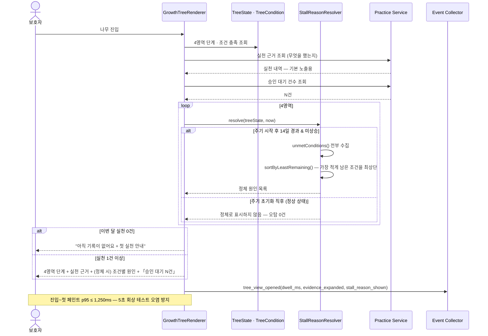
```mermaid
sequenceDiagram
    actor G as 보호자
    participant GTR as GrowthTreeRenderer
    participant TS as TreeState · TreeCondition
    participant SRR as StallReasonResolver
    participant PS as Practice Service
    participant EC as Event Collector

    G->>GTR: 나무 진입
    GTR->>TS: 4영역 단계 · 조건 충족 조회
    GTR->>PS: 실천 근거 조회 (무엇을 했는지)
    PS-->>GTR: 실천 내역 — 기본 노출용
    GTR->>PS: 승인 대기 건수 조회
    PS-->>GTR: N건

    loop 4영역
        GTR->>SRR: resolve(treeState, now)
        alt 주기 시작 후 14일 경과 & 미상승
            SRR->>SRR: unmetConditions() 전부 수집
            SRR->>SRR: sortByLeastRemaining() — 가장 적게 남은 조건을 최상단
            SRR-->>GTR: 정체 원인 목록
        else 주기 초기화 직후 (정상 상태)
            SRR-->>GTR: 정체로 표시하지 않음 — 오탐 0건
        end
    end

    alt 이번 달 실천 0건
        GTR-->>G: "아직 기록이 없어요 + 첫 실천 안내"
    else 실천 1건 이상
        GTR-->>G: 4영역 단계 + 실천 근거 + (정체 시) 조건별 원인 + 「승인 대기 N건」
    end

    GTR->>EC: tree_view_opened(dwell_ms, evidence_expanded, stall_reason_shown)
    Note over GTR,G: 진입~첫 페인트 p95 ≤ 1,250ms — 5초 회상 테스트 오염 방지
```

**검증 대상** — AC-1.1·1.2 · AC-3.1 · ACE-1.1 · ACE-3.1·3.2 · REQ-NF-001 · KPI-06·07

### 6.9 SD-09 · 월간 숲 스냅샷 생성과 전월 대비 델타

```mermaid
sequenceDiagram
    participant SCH as 스케줄러
    participant MFS as MonthlyForestSnapshot
    participant DC as DeltaCalculator
    participant TS as TreeState
    participant SL as StarLedger
    participant SP as SpendingRecords
    participant EC as Event Collector
    actor G as 보호자

    SCH->>MFS: 월초 배치 (전월 마감)
    MFS->>TS: 4영역 최종 단계
    MFS->>SL: 이번 달 획득 별 합계
    MFS->>SP: 업종별 소비 집계
    MFS->>DC: hasPrevious(childId, yearMonth)?

    alt 전월 데이터 존재
        DC->>DC: delta(current, previous) — 항목 7개 이상
        DC-->>MFS: 델타 맵
        MFS->>MFS: 스냅샷 저장 (누적 · 초기화 없음)
    else 가입 첫 달 — 전월 없음
        DC-->>MFS: prev_month_exists=false
        MFS->>MFS: 델타 0으로 렌더하지 않음
    end

    G->>MFS: 월간 숲 진입
    alt prev_month_exists = true
        MFS-->>G: 변화 항목 7개 이상 + 이번 달 획득 별 (스크롤 없이 노출)
    else
        MFS-->>G: "다음 달부터 비교할 수 있어요"
    end
    MFS->>EC: forest_view_opened(year_month, delta_items_rendered, dwell_ms)

    Note over MFS,EC: 소급 귀속분(BACKFILLED)이 도착하면<br/>해당 월 스냅샷을 갱신하고 갱신 이력을 남긴다
```

**검증 대상** — AC-1.3·1.4 · ACE-1.2 · REQ-FUNC-009 · KPI-08·09·10

### 6.10 SD-10 · 별 원장 일일 정산과 WPA 주간 산출

```mermaid
sequenceDiagram
    participant SCH as 스케줄러
    participant LRB as LedgerReconciliationBatch
    participant SL as star_ledger
    participant WC as WpaCalculator
    participant PC as practice_credits
    participant CH as child_accounts
    participant AR as AlertRouter
    participant OC as 개발 온콜

    Note over SCH,LRB: ① 일일 정산 — 매일
    SCH->>LRB: reconcile(date)
    LRB->>SL: SUM(delta) vs 최종 balance_after 대조
    alt 불일치 0건
        LRB-->>SCH: 정상
    else 불일치 1건 이상
        LRB->>AR: 즉시 알림
        AR->>OC: 30분 내 확인 · 1시간 내 원인 특정
        Note over AR,OC: 4시간 미해결 → 팀 전체 에스컬레이션
    end

    Note over SCH,WC: ② WPA 주간 산출 — ISO 주 마감 후 D+1
    SCH->>WC: calculate(weekStart)
    WC->>CH: 분모 — 주차 시작 시점 스냅샷<br/>동의 완료 & 계정 7일 경과 & 28일 내 세션
    WC->>PC: 분자 — 실천 트리거 3종의 distinct child_id<br/>학습 경로 트리거 제외 · earned_at 기준 귀속
    WC->>WC: 한 아동의 복수 실천은 1로 계산
    WC-->>SCH: WPA(주차 w)

    opt 마감 주차에 소급 귀속분 도착
        WC->>WC: recalculate(weekStart) + 갱신 이력 보존
    end

    opt 전주 대비 −10%p
        WC->>AR: 북극성 경보 → 제품 담당 24시간 내 원인 분석
    end
```

**검증 대상** — REQ-NF-006(정합성 0%) · KPI-22 · SRS §9.4.2 WPA 카운트 규칙 · 계측 건강성 H5

### 6.11 SD-11 · 아바타 아이템 교환 *(별 차감)*

```mermaid
sequenceDiagram
    actor C as 아동
    participant AWS as AvatarWardrobeService
    participant CAT as AvatarItemCatalog
    participant SL as StarLedgerEngine
    participant EC as Event Collector

    C->>AWS: 아이템 교환 요청
    AWS->>CAT: 아이템 조회
    alt asset_state = SPEC_PENDING
        CAT-->>AWS: 미제작 — 노출 대상 아님
        AWS-->>C: 교환 불가 (사양 확정 전 제작 금지 · CON-RES-02)
    else asset_state = PRODUCED
        AWS->>SL: deduct(delta=−star_price, key=exchange:item:child)
        alt 잔액 충분
            SL->>SL: 차감 기입 + balance_after
            SL->>EC: star_ledger_entry(delta<0)
            SL-->>AWS: 완료
            AWS->>AWS: AvatarItemsOwned 생성 (star_ledger_id 참조)
            AWS-->>C: 아이템 획득
        else 잔액 부족
            SL--xAWS: 거절
            AWS-->>C: 남은 별 안내
        end
    end

    Note over SL,EC: 이 차감은 practice_credited가 아니다 —<br/>WPA 분자에 들어가지 않는다 (계측 원칙 M1)
```

**검증 대상** — REQ-FUNC-005 · REQ-NF-006 · SRS §9.4.2 경계 규칙

### 6.12 SD-12 · 해지와 전액 환불

```mermaid
sequenceDiagram
    actor G as 보호자
    participant APP as 앱
    participant RS as RefundService
    participant PSP as 제휴사
    participant SL as star_ledger

    G->>APP: 해지 요청
    APP->>RS: terminate(childCardId)
    RS->>PSP: 해지·환불 요청
    PSP-->>RS: 환불 결과 (잔액 전액)
    RS->>RS: PartnerCard.state = TERMINATED
    RS-->>G: 전액 환불 완료 안내

    RS--xSL: 별은 환불 대상이 아니다
    Note over RS,SL: 별은 현금이 아니므로 환불 경로가 없다.<br/>부분 환불·잔액 소멸 분기를 두지 않는다 (CON-REG-07)
```

**검증 대상** — REQ-NF-013 · CON-REG-07

---
## 7. 논리 흐름 — 플로차트

> SRS §6.2에 이미 있는 판정 흐름 3건(**승급 논리곱** 6.2.3 · **두 갈래 판정** 6.2.5 · **알림 채널 폴백** 6.2.6)은 여기서 반복하지 않는다. 아래는 그 3건이 다루지 않는 흐름이다.

### 7.1 서비스 전체 흐름 — 처음 읽는 사람을 위한 지도

```mermaid
flowchart TB
    START(["보호자가 앱을 설치"]) --> ON["보호자 온보딩 5단계"]
    ON --> CONSENT{"법정대리인<br/>동의 완료?"}
    CONSENT -- "아니오" --> BLOCK["아동 화면 진입 차단"]
    BLOCK --> ON
    CONSENT -- "예" --> OPEN["아동 화면 개통"]

    OPEN --> LEARN["아동: 학습 · 퀴즈"]
    LEARN --> STAR1["⭐ 지급 (학습 경로)"]
    STAR1 -.->|"WPA 분자 제외"| NOTE1["접속만으로 실천 지표가<br/>오르지 않게 차단"]

    OPEN --> PRACTICE{"실천 3경로"}
    PRACTICE --> P1["미션 수행 → 보호자 승인"]
    PRACTICE --> P2["계획 카드 작성 → 결제 → 회고"]
    PRACTICE --> P3["위시리스트 30·70·100% 도달"]
    P1 --> STAR2["⭐ 지급 + 실천 인정"]
    P2 --> STAR2
    P3 --> STAR2
    STAR2 ==>|"WPA 분자 산입"| WPA["북극성 지표"]

    STAR1 --> TREE["성장 나무 조건 갱신"]
    STAR2 --> TREE
    TREE --> PROMO{"학습 · 퀴즈 · 실천<br/>세 조건 모두 충족?"}
    PROMO -- "예" --> UP["나무 단계 상승"]
    PROMO -- "아니오" --> STAY["미승급 · 남은 조건을 조건별로 표시"]

    UP --> FOREST["월간 숲 스냅샷 — 전월 대비 변화"]
    STAY --> STALL{"주기 시작 후<br/>14일 경과?"}
    STALL -- "예" --> REASON["정체 원인을 조건 단위로 표시"]
    STALL -- "아니오" --> WAIT["정체로 표시하지 않음"]

    FOREST --> GVIEW["보호자가 변화를 읽음"]
    REASON --> GVIEW
    GVIEW --> APPROVE["승인 · 미션 등록이 활발해짐"]
    APPROVE --> PRACTICE

    IDLE{"아동 72시간<br/>미접속?"} -.-> NOTIFY["보호자에게 알림<br/>+ 멈춘 지점 표시"]
    NOTIFY -.-> GVIEW
    OPEN -.-> IDLE

    STAR2 --> WARDROBE["아바타 아이템 교환 (차감)"]
    WARDROBE -.-x CASH["현금 · 저금통 전환<br/>경로 없음"]

    style CONSENT fill:#ffe0e0,stroke:#c00,stroke-width:2px
    style STAR2 fill:#e6f4e6,stroke:#2d8a2d,stroke-width:2px
    style WPA fill:#e6f4e6,stroke:#2d8a2d,stroke-width:2px
    style CASH fill:#f2f2f2,stroke:#888,stroke-dasharray: 4 3
    style NOTE1 fill:#f7f7f7,stroke:#888
```

> **이 한 장이 제품 전체다.** 왼쪽에서 시작해 오른쪽으로 가되, **오른쪽 끝(보호자가 읽음)이 다시 왼쪽(실천)으로 돌아온다** — 이 되돌이가 §5.1의 R1 루프다. 붉은 마름모는 규제 게이트, 초록은 북극성 지표의 원천, 점선으로 끊긴 회색은 **의도적으로 만들지 않은 경로**다.

### 7.2 정체 판정 흐름 — 오탐을 만들지 않는 조건

```mermaid
flowchart TD
    S["나무 상태 조회"] --> C1{"단계 상승이<br/>있었나?"}
    C1 -- "있음" --> NORMAL["정상 — 정체 아님"]
    C1 -- "없음" --> C2{"주기 시작 후<br/>14일 경과?"}
    C2 -- "미경과" --> FRESH["정체로 표시하지 않음<br/>주기 초기화 직후는 정상 상태"]
    C2 -- "경과" --> C3{"미충족 조건<br/>수집"}
    C3 --> C4{"승인 대기<br/>건이 있나?"}
    C4 -- "있음" --> PENDING["「승인 대기 N건」을 함께 표시<br/>보호자 지연을 아동의 미실천으로<br/>오독하지 않게 한다"]
    C4 -- "없음" --> SORT["미충족 조건 전부 표시<br/>가장 적게 남은 조건을 최상단"]
    PENDING --> SORT
    SORT --> SHOW["정체 원인 화면"]
    SHOW --> EV["tree_view_opened.stall_reason_shown=true"]
    EV --> KPI["KPI-06 정체 원인 열람률<br/>분모 = 정체 발생 계정만"]

    style FRESH fill:#e6f4e6,stroke:#2d8a2d
    style PENDING fill:#fff4d6,stroke:#e69500
```

**검증 대상** — ACE-3.1(전부 표시·정렬) · ACE-3.2(오탐 0건) · AC-3.1(열람률) · SRS §6.3 규칙 9

### 7.3 회고 큐 병합 흐름 — 미완 회고가 쌓일 때

```mermaid
flowchart TD
    NEW["결제 확정 → 회고 생성<br/>queue_state=PENDING"] --> OPEN{"아동이<br/>앱을 여는가?"}
    OPEN -- "아니오" --> WAIT["큐에 대기"]
    WAIT --> NEXT{"다음 소비가<br/>먼저 발생?"}
    NEXT -- "예" --> ADD["큐에 추가"]
    ADD --> SIZE{"큐 길이<br/>> 3건?"}
    SIZE -- "예" --> MERGE["오래된 건을 「요약 회고」로 병합<br/>queue_state=MERGED"]
    SIZE -- "아니오" --> WAIT
    MERGE --> WAIT
    NEXT -- "아니오" --> WAIT

    OPEN -- "예" --> SERVE["가장 오래된 건부터 순서대로 제시"]
    SERVE --> VIEW["회고 열람 → queue_state=VIEWED<br/>dwell_ms 기록"]
    VIEW --> BRANCH["갈래별 집계<br/>plan_met true/false 분리"]
    BRANCH --> K16["KPI-16 체류 중위 · KPI-18 갈래별 열람률"]

    MERGE -.->|"주의"| RISK["병합된 건은 개별 체류를<br/>산출할 수 없다 —<br/>KPI-16 분모에서 제외하고<br/>병합 건수를 병기한다"]

    style MERGE fill:#fff4d6,stroke:#e69500
    style RISK fill:#f7f7f7,stroke:#888
```

**검증 대상** — ACE-5.2(큐 병합) · AC-5.2(체류) · AC-5.5(갈래별 열람률)

> **여기서 새로 정한 것 하나** — 병합된 회고는 개별 체류 시간이 존재하지 않으므로 **KPI-16 분모에서 제외하고 병합 건수를 병기**한다. SRS에는 이 규칙이 없으며, 넣지 않으면 병합이 많은 주에 체류 중위가 실제보다 길게 보인다. §11에 개정 후보로 올렸다.

### 7.4 소급 귀속 판정 흐름 — ⭐와 나무 조건이 갈라지는 지점

```mermaid
flowchart TD
    APPROVE["보호자 승인"] --> RESOLVE["earned_at으로 주기 해석"]
    RESOLVE --> C1{"완료 시점 주기가<br/>아직 열려 있나?"}
    C1 -- "열림" --> A1["state=APPROVED"]
    A1 --> G1["⭐1 지급"]
    G1 --> T1["나무 조건 → 현재 주기에 가산"]

    C1 -- "종료됨" --> A2["state=BACKFILLED"]
    A2 --> G2["⭐1 지급 — 완료 시점 기준<br/>성공률 100% 불변"]
    G2 --> T2["나무 조건 → 완료 시점 주기 N에 귀속"]
    T2 --> T3["다음 주기 N+1에는 가산하지 않음"]
    T3 --> F1["해당 월 숲 스냅샷 갱신"]
    F1 --> MSG["'지난 달 실천으로 인정됐어요' 표시"]
    T3 --> W1["마감 주차 WPA 재계산 + 갱신 이력"]

    C1 -.-> REJ["거절 시: ⭐ 미지급 · 사유 표시<br/>「미실천」과 시각적 구별 · 카운트 미가산"]

    style G2 fill:#e6f4e6,stroke:#2d8a2d,stroke-width:2px
    style T3 fill:#fff4d6,stroke:#e69500
    style REJ fill:#ffe0e0,stroke:#c00
```

> **이 흐름의 핵심은 「⭐는 주되 나무는 옮기지 않는다」** 다. 둘을 같이 옮기면 지연 승인이 **다음 주기 나무를 부풀려** 보호자가 읽는 「이번 달 변화」가 거짓이 된다.

**검증 대상** — ACE-6.1(거절) · ACE-6.2(주기 귀속) · AC-6.1 · REQ-NF-007

### 7.5 WPA 산출 흐름 — 무엇을 세고 무엇을 세지 않는가

```mermaid
flowchart TD
    W["주차 w 마감 D+1 배치"] --> DEN["분모 산출"]
    DEN --> D1{"동의 완료?"}
    D1 -- "아니오" --> OUT1["제외"]
    D1 -- "예" --> D2{"계정 생성 후<br/>7일 경과?"}
    D2 -- "아니오" --> OUT2["분자·분모 모두 제외<br/>온보딩 ⭐의 과대계상 차단"]
    D2 -- "예" --> D3{"직전 28일 내<br/>세션 1회 이상?"}
    D3 -- "아니오" --> OUT3["제외 — 완전 이탈 계정"]
    D3 -- "예" --> DENOM["분모 산입 (주차 시작 시점 스냅샷)"]

    W --> NUM["분자 산출"]
    NUM --> N1{"트리거 경로?"}
    N1 -- "LEARNING (1·2·3)" --> OUT4["분자 제외<br/>접속만으로 오르는 활동량 지표 차단"]
    N1 -- "PRACTICE (4·5·6)" --> N2{"이 아동이 주차 내<br/>이미 계상됐나?"}
    N2 -- "예" --> ONE["1로 계산 — 사람 수 지표"]
    N2 -- "아니오" --> N3["earned_at 기준 주차에 귀속"]
    N3 --> N4{"거절 후 재승인?"}
    N4 -- "예" --> LAST["최종 승인 1건만"]
    N4 -- "아니오" --> NUMER["분자 산입 (distinct child_id)"]
    ONE --> NUMER
    LAST --> NUMER

    DENOM --> CALC["WPA = 분자 ÷ 분모"]
    NUMER --> CALC
    CALC --> HEALTH{"이벤트 유실률<br/>≤ 0.5%?"}
    HEALTH -- "아니오" --> UNTRUST["지표를 판정에 쓰지 않는다 —<br/>하락이 실천 감소인지 유실인지 구분 불가"]
    HEALTH -- "예" --> USE["판정 사용 (SRS §9.1 3구간)"]

    style OUT4 fill:#f2f2f2,stroke:#888
    style OUT2 fill:#f2f2f2,stroke:#888
    style UNTRUST fill:#ffe0e0,stroke:#c00
    style USE fill:#e6f4e6,stroke:#2d8a2d
```

**검증 대상** — SRS §9.4.2 카운트 규칙 전건 · 계측 건강성 H1

### 7.6 릴리스 게이트 통과 흐름

```mermaid
flowchart LR
    B["B1~B6 빌드 완료"] --> A1{"α 게이트<br/>규제 상수 자동 테스트 100%<br/>별 원장 불일치 0건"}
    A1 -- "미통과" --> FIXA["규제·정합성 우선 수정<br/>허용 오차 0"]
    FIXA --> A1
    A1 -- "통과" --> ALPHA["α 내부 — 팀 + 지인 가정 3~5"]

    ALPHA --> A2{"β 게이트<br/>AC-2.1 PASS (첫 실천 ≥ 60%)<br/>AC-1.1 PASS (회상 ≥ 6/8)<br/>WPA ≥ 5/8"}
    A2 -- "HOLD" --> HOLD["표본 +4 후 재판정<br/>그 사이 배분 변경 없음 (AP-2)"]
    HOLD --> A2
    A2 -- "FAIL" --> REDESIGN["지정된 재설계 → 다음 판본"]
    A2 -- "PASS" --> BETA["β 클로즈드 — 8슬롯"]

    BETA --> A3{"일반 공개 게이트<br/>WPA ≥ 55% 2주 연속<br/>정지→인지 ≤ 3일<br/>정합성 오류 0건"}
    A3 -- "미통과" --> BETA
    A3 -- "통과" --> GA["일반 공개 — 1차 대상 세그먼트"]

    style A1 fill:#ffe0e0,stroke:#c00
    style HOLD fill:#fff4d6,stroke:#e69500
    style GA fill:#e6f4e6,stroke:#2d8a2d
```

**검증 대상** — SRS §9.5 릴리즈 게이트 · SRS §9.1 3구간 판정 · SRS §13.5 AP-2

### 7.7 알림 에스컬레이션 흐름 — 울린 뒤에 무엇이 일어나는가

```mermaid
flowchart TD
    E["감시 항목 임계 초과"] --> L{"어느 계층?"}
    L -- "규제 · 정합성 · 보안" --> C1["개발 온콜 + 정책 담당<br/>즉시 알림"]
    C1 --> C2{"30분 내 확인?"}
    C2 -- "아니오" --> ESC1["에스컬레이션"]
    C2 -- "예" --> C3["즉시 경로 차단 · 1시간 내 원인 특정"]
    C3 --> C4{"2시간 내 해결?"}
    C4 -- "아니오" --> STOP["서비스 일시 중단"]
    C4 -- "예" --> OK1["해소 · 사후 기록"]

    L -- "북극성 · 실천" --> M1["제품 담당"]
    M1 --> M2["24시간 내 원인 분석 또는 주간 리뷰"]
    M2 --> M3{"2주 연속?"}
    M3 -- "예" --> ROADMAP["로드맵 재검토"]
    M3 -- "아니오" --> OK2["관찰 유지"]

    L -- "성능" --> P1{"AC 역산 상한<br/>3일 연속 초과?"}
    P1 -- "예" --> P2["릴리즈 중단 · 아키텍처 재검토<br/>값을 늦추지 않고 재설정 트리거 발동"]
    P1 -- "아니오" --> OK3["관찰 유지"]

    L -- "콘텐츠 · 비용" --> Q1["콘텐츠 · 사업 담당"]
    Q1 --> Q2["1주 내 문장 풀 확장 / 월간 원가 리뷰"]

    L -- "보안 S4 (전환 경로)" --> S4["CI 빌드 실패 — 병합 차단"]

    style STOP fill:#ffe0e0,stroke:#c00,stroke-width:2px
    style S4 fill:#ffe0e0,stroke:#c00,stroke-width:2px
    style P2 fill:#fff4d6,stroke:#e69500
```

**검증 대상** — REQ-NF-017(대응 SLA·에스컬레이션) · REQ-NF-006 · ADR-007

---

## 8. 배치·스케줄 설계

> 사람이 누르지 않아도 도는 일의 목록이다. **어느 하나가 멈추면 어떤 지표가 산출되지 않는지**를 함께 적었다 — 멈춘 것을 모르는 상태가 가장 위험하다.

| # | 배치 | 주기 | 입력 | 산출 | 멈추면 잃는 것 | 귀속 |
| --- | --- | --- | --- | --- | --- | --- |
| **BAT-1** | 나무 승급·정체 판정 | 일 1회 | `tree_states` · `tree_conditions` · `practice_credits` | 단계 갱신 · `stall_days` | 정체 원인 표시 · KPI-06 | REQ-FUNC-001 |
| **BAT-2** | 미접속 72시간 판정 | 일 1회 *(설정 시간대별)* | `child_accounts.last_session_at` | 알림 발송 · `inactivity_notified` | 정지→인지 ≤ 3일 (KPI-14) | REQ-FUNC-011 |
| **BAT-3** | 별 원장 일일 정산 | 일 1회 | `star_ledger` | 불일치 건수 · 알림 | **정합성 0% 보증** (KPI-22) | REQ-NF-006 |
| **BAT-4** | 규제·보안 스캔 | 일 1회 + **배포 시** | 스키마 · 로그 · 쿼리 감사 | 좌표·얼굴 필드 · 결합 조회 · 독립 로그인 건수 | 규제 검증 자체 | REQ-NF-009 · 011 |
| **BAT-5** | 정적 분석 전환 경로 게이트 | **배포(CI)** | 소스 심볼 | 빌드 성공/실패 | 별↔저금통 분리 강제 | REQ-NF-010 |
| **BAT-6** | WPA 주간 산출 | 주 1회 *(ISO 주 마감 D+1)* | `practice_credits` · 활성 아동 스냅샷 | WPA · KPI-01·02 | **북극성 지표** | SRS §9.4.2 |
| **BAT-7** | 주간 지표 집계 | 주 1회 | `app_events` 주차 파티션 | KPI-08·13~19·20·21·24 | 주간 리뷰 판정 근거 | SRS §9.4.3 |
| **BAT-8** | 월간 숲 스냅샷 | 월 1회 *(월초)* | 나무·별·소비 집계 | `forest_snapshots` · 전월 델타 | 전월 대비 변화 (REQ-FUNC-009) | REQ-FUNC-009 |
| **BAT-9** | 월간 지표·원가 집계 | 월 1회 | 청구서 · 호출 로그 · 이벤트 | KPI-03·06·07·09~11·25 · B1~B3 | 원가 임계 감시 | REQ-NF-016 |
| **BAT-10** | 계측 건강성 점검 | 일 1회 + 배포 시 | 이벤트 vs 원장 대조 | H1~H5 | **다른 모든 지표의 신뢰도** | SRS §9.4.6 |
| **BAT-11** | 문장 풀 잔여율 감시 | 일 1회 | `retro_sentence_pool` | 잔여율 · 알림 | 회고 문장 재노출 방지 | ACE-5.1 |
| **BAT-12** | 가용성·오류율 프로브 | **5분** | 헬스 체크 | 월 가용성 · API 오류율 | REQ-NF-004 · 005 판정 | REQ-NF-004 · 005 |

> **BAT-10을 먼저 켠다** — 유실률을 모르는 상태에서는 BAT-6의 WPA 하락이 *실천이 줄었다*는 뜻인지 *이벤트가 안 들어왔다*는 뜻인지 구분할 수 없다(SRS §9.4.6).
> **BAT-5는 배치가 아니라 게이트다** — 통과하지 못하면 병합 자체가 되지 않는다.

---

## 9. 설계 제약 반영 — CON-* 가 어디에 구현되어 있는가

| 제약 | 설계 수단 | 위치 |
| --- | --- | --- |
| **CON-REG-01** 동의 선행 | `ConsentGateService`를 **단일 판정 지점**으로 두고 도메인 서비스에 자체 판단을 두지 않음 | §2.2 · §2.4 ① · SD-02 |
| **CON-REG-02** 알기 쉬운 고지 | `LearningTopic` 명칭을 보호자·아동 공용으로 고정하고 한 줄 설명을 별 필드로 분리 | SRS §6.2.1 참조 |
| **CON-REG-03** 위치정보 부재 | 스키마에 좌표 칼럼을 두지 않고 **BAT-4 스캔**으로 유입 감시 | §2.1 · §2.4 ③ · BAT-4 |
| **CON-REG-04** 중개 회피 | `UC-20`을 R2로 배분하고 D2 미통과 시 **착수 자체를 막음** | §1.3 · SRS §13.2 |
| **CON-REG-05** 별↔저금통 분리 | `StarLedgerEngine`에 전환 메서드를 두지 않고 **BAT-5 CI 게이트**로 강제 | §3.3 · §4.2 note · §2.4 ② |
| **CON-REG-06** 얼굴 미수집 | 아바타를 `AVATAR_ITEM_CATALOG` 사전 제작 에셋으로만 구성 · 업로드 경로 없음 | §3.1 |
| **CON-REG-07** 전액 환불 | `RefundService`에 부분 환불·잔액 소멸 분기를 두지 않음 | SD-12 |
| **CON-REG-08** 제휴사 정책 종속 | `PartnerPolicyAdapter`가 한도·업종을 **읽어 반영만** 함 | §2.3 |
| **CON-REG-09** 마이데이터 불가 | 자체 카드 발급 + 폐쇄형 수집(`PARTNER_CARDS` · `SPENDING_RECORDS`) | §3.1 · CON-ARC-01 |
| **CON-ARC-03** SLA 상한 | 가용성 목표를 상수로 박지 않고 `min(자체, 제휴사)` 산출값으로 둠 | §8 BAT-12 |
| **CON-ARC-04** 업종 코드 종속 | `PaymentMatcher`를 금액 판정과 업종 판정으로 **분리**해, 업종 대조 포기 시 금액 단독으로 축소 가능 | §4.2 · SD-05 |
| **CON-ARC-06** CI 게이트 | BAT-5 — 배치가 아니라 병합 차단 게이트 | §8 |
| **CON-ARC-07** 이벤트 적재 규약 | `idempotency_key` UNIQUE · `client_ts` 주차 귀속 · 역행 감시 | §3.4 · SD-06 |
| **CON-DEV-01** 전용폰 미전제 | `PLAN_CARDS.author`에 `GUARDIAN`을 두어 보호자 기기 작성을 1급으로 지원 | §3.1 · UC-09 |
| **CON-DEV-02** 기기로 기능 안 가름 | `device_type`을 채널 선택·모집 분류 전용으로 제한(칼럼 주석에 명시) | §3.1 |
| **CON-DEV-03** 독립 로그인 부재 | `ChildSessionGuard`가 보호자 세션 부재 시 차단 · BAT-4가 시도 건수 감시 | §2.2 · §8 |
| **CON-DEV-04** 푸시 차단 정상 취급 | `ChannelFallbackRouter` + 차단 상태 별도 집계 | SD-07 |
| **CON-RES-02** 3D 에셋 게이트 | `AVATAR_ITEM_CATALOG.asset_state=SPEC_PENDING` 을 코드가 읽어 노출·교환을 막음 | §3.2 · SD-11 |
| **CON-DOC-01** 자동 개입 미기술 | 본 문서 전체에서 위치·체류 트리거를 **경로 부재로만** 표기 | §2.1 · §7.1 |

> **반영되지 않은 제약** — `CON-REG-02`의 문구 검수, `CON-DOC-02~06`은 **설계 수단이 아니라 문서·문구 규율**이므로 설계 산출물에 대응 요소를 두지 않는다. 산출물 검수 체크리스트로 관리한다.

---

## 10. 추적성 — 요구사항 ↔ 설계 산출물

| 요구사항 | 유스케이스 | 시퀀스 | 클래스 | 주요 테이블 | 흐름도 |
| --- | --- | --- | --- | --- | --- |
| REQ-FUNC-001 | UC-06 · 23 | SD-08 | `GrowthTreeRenderer` · `StallReasonResolver` | `TREE_STATES` · `TREE_CONDITIONS` | §7.2 |
| REQ-FUNC-002 | UC-04 · 05 · 15 | SD-03 | `MissionApprovalService` | `MISSIONS` · `MISSION_APPROVALS` | §7.4 |
| REQ-FUNC-003 | UC-13 | — | `CurriculumService` · `QuizEvaluator` | `LEARNING_PROGRESS` | §7.1 |
| REQ-FUNC-004 | UC-14 · 21 | SD-03 · SD-11 | `TriggerDispatcher` · `StarLedgerEngine` | `STAR_LEDGER` | §7.5 · SRS §6.2.2 |
| REQ-FUNC-005 | UC-19 | SD-11 | `AvatarWardrobeService` | `AVATAR_ITEM_CATALOG` · `AVATAR_ITEMS_OWNED` | — |
| REQ-FUNC-006 | UC-12 | SD-01 | `ChildOnboardingFlow` | `CHILD_ACCOUNTS` | §7.1 |
| REQ-FUNC-007 | UC-01 · 02 | SD-01 | `ConsentGateService` · `OnboardingStepStore` | `GUARDIAN_ACCOUNTS` · `CONSENT_RECORDS` · `PARTNER_CARDS` | §4.3 |
| REQ-FUNC-008 | UC-09 · 16 · 17 · 26 | SD-05 | `PlanCardService` · `PaymentMatcher` · `RetroBrancher` | `PLAN_CARDS` · `SPENDING_RECORDS` · `RETROSPECTIVES` | §7.3 · SRS §6.2.5 |
| REQ-FUNC-009 | UC-07 · 24 | SD-09 | `MonthlyForestSnapshot` · `DeltaCalculator` | `FOREST_SNAPSHOTS` | — |
| REQ-FUNC-010 | UC-05 · 22 | SD-04 | `BackfillGrantService` · `CycleAttributionResolver` | `MISSION_APPROVALS` · `PRACTICE_CREDITS` | §7.4 |
| REQ-FUNC-011 | UC-10 · 25 | SD-07 | `InactivityDetector` · `ChannelFallbackRouter` | `NOTIFICATIONS` | SRS §6.2.6 |
| REQ-FUNC-012 | UC-18 | — | `WishlistTracker` | `WISHLISTS` · `WISHLIST_MILESTONES` | §7.1 |
| REQ-FUNC-013 | UC-08 | — | `SpendingLedgerView` · `CategoryAggregator` | `SPENDING_RECORDS` | — |
| REQ-FUNC-014 | UC-20 *(R2)* | — | `SavingsCompareService` | — *(미설계 · D2 대기)* | — |
| REQ-FUNC-015 | UC-01 대안 B | SD-01 | `TrialPathRouter` | `PARTNER_CARDS.state` | §4.3 |
| REQ-FUNC-016 | — *(R2+)* | — | `StarRedemptionService` | — *(미설계 · 분리선 재검토 대기)* | §5.4 |
| REQ-FUNC-017 | — *(미배분)* | — | — | — | — |
| REQ-NF-001 | UC-06 · 07 | SD-08 · SD-09 | `RenderLatencyMonitor` | — | §7.7 |
| REQ-NF-002 | UC-21 | SD-03 | `GrantLatencyMonitor` | — | §7.7 |
| REQ-NF-003 | — | **SD-06** | `OfflineReplayHandler` · `IdempotencyGuard` | `APP_EVENTS` | §7.5 |
| REQ-NF-004 · 005 | — | — | `AvailabilityProbe` · `ErrorRateMonitor` | — | §8 BAT-12 · §7.7 |
| REQ-NF-006 | UC-27 | **SD-10** | `LedgerReconciliationBatch` | `STAR_LEDGER` | §8 BAT-3 |
| REQ-NF-007 | UC-22 | **SD-04** | `BackfillGrantService` | `MISSION_APPROVALS` | §7.4 |
| REQ-NF-008 | UC-30 | **SD-02** | `ConsentGateService` · `ConsentBlockAuditor` | `CONSENT_RECORDS` | §2.4 ① |
| REQ-NF-009 | UC-29 | — | `SchemaScanner` · `PiiSeparationAuditor` | 전 테이블 | §2.4 ③④ · §8 BAT-4 |
| REQ-NF-010 | UC-29 | — | `ConversionPathStaticCheck` | `STAR_LEDGER` | §2.4 ② · §8 BAT-5 |
| REQ-NF-011 | UC-29 | SD-02 | `ChildSessionGuard` | `CHILD_ACCOUNTS` | §8 BAT-4 |
| REQ-NF-012 | UC-20 | — | `SavingsCompareService` | — | §9 CON-REG-04 |
| REQ-NF-013 | UC-11 | **SD-12** | `RefundService` | `PARTNER_CARDS` | — |
| REQ-NF-014 | 전 UC | — | `CopyReviewChecklist` | — | §9 |
| REQ-NF-015 | UC-02 · 03 | SD-01 · SD-05 | `PartnerPolicyAdapter` | `PARTNER_CARDS` | §2.1 |
| REQ-NF-016 | — | — | `CostAggregator` | — | §8 BAT-9 |
| REQ-NF-017 | UC-29 | SD-10 | `AlertRouter` · `EscalationPolicy` | — | **§7.7** |
| REQ-NF-018 | — | — | 열거형 확장 규약 | `APP_EVENTS.event_type` | SRS §6.2.8 |

**커버리지** — 요구사항 35건 중 **32건**이 설계 산출물에 대응한다. 미대응 3건은 REQ-FUNC-014(R2 · 법률 검토 대기) · REQ-FUNC-016(R2+ · 분리선 재검토 대기) · REQ-FUNC-017(미배분)이며, 전부 **착수 조건 미해소로 설계하지 않은 것**이지 누락이 아니다.

---

## 11. 설계 미결 항목

> 설계로 닫을 수 없고 **결정 또는 외부 확정이 필요한** 항목이다. SRS §10.2 외부 의존성과 SRS §9.4.4 계측 공백을 설계 관점으로 다시 적었다.

| # | 미결 항목 | 무엇이 막혀 있는가 | 필요한 결정 | 결정 전까지의 설계 처리 |
| --- | --- | --- | --- | --- |
| **OP-1** 🔴 | `plan_card_created` · `payment_settled` 이벤트 추가 | KPI-04 산출 불가 → **REQ-FUNC-008의 생존 조건(AC-4.4)이 측정 불가** | SRS §6.1(10종) · SRS §6.2.8 `EventType` 개정 | §3.5에 스키마를 준비해 두고 적재 코드를 넣지 않는다 |
| **OP-2** 🔴 | 제휴사 업종 코드 상세도 (D1) | `PaymentMatcher`의 정확도 상한 미정 | 제휴 계약 확인 | 금액 판정과 업종 판정을 **분리 구현**해 축소 가능하게 둔다(ADR-008) |
| **OP-3** 🔴 | 예적금 중개업 해당 여부 (D2) | `SavingsCompareService` 착수 불가 | 법률 검토 | UC-20을 R2로 배분하고 설계하지 않는다 |
| **OP-4** | 3D 에셋 종수·벌수 (D4) | `AvatarItemCatalog` 규모 미정 | 팀 결정 | `asset_state=SPEC_PENDING`으로 표현해 제작 착수를 코드가 막는다 |
| **OP-5** | 출석체크 ⭐ 지급 조건 (D5) | `StarTrigger.ATTENDANCE` 발동 조건 미정 | 팀 결정 — H1·H2 신호가 정반대 | 트리거는 정의하되 조건을 설정값으로 외부화한다 |
| **OP-6** | 나무 단계 수 · 조건 수치 · 주기 길이 | `TreeCondition.required` 값 미정 | 팀 결정 *(프로토타입 착수 전)* | 값을 코드에 박지 않고 `TREE_CONDITIONS` 행으로 둔다 |
| **OP-7** | 병합된 회고의 체류 지표 처리 | KPI-16 분모 정의에 병합 건이 없다 | **본 문서 §7.3의 신규 규칙** 승인 여부 | 분모 제외 + 병합 건수 병기로 구현하고 SRS 개정 후보로 올린다 |
| **OP-8** | 제휴사 충전·결제 원장 적재 규약 | KPI-11 · KPI-25가 외부 원천에 의존 | 적재 규약 정의 | 외부 원천으로 표기하고 유실 시 「산출 불가」로 기록한다 |

---

*작성자: 개발팀 리드, 검토자: 서비스분석 혜원 · 정책·법령 병윤, 승인자: 제품기획 유림*
