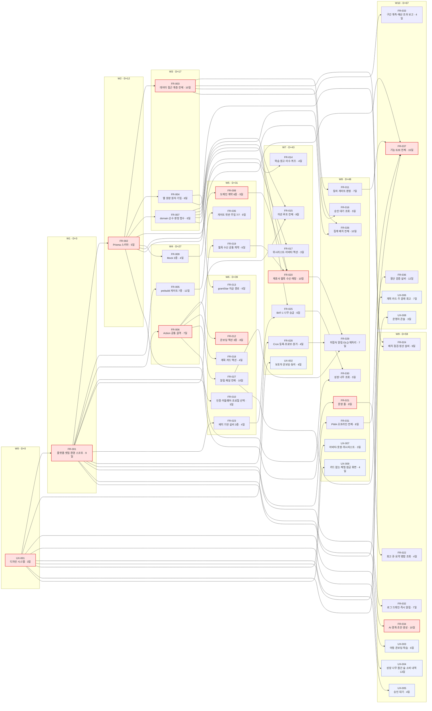
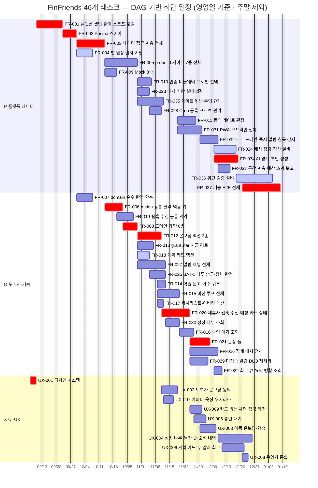

# [실행 총괄] FinFriends — 46개 태스크 개발 실행 계획

**문서 ID:** EXEC-FINFRIENDS-NEXTJS-001
**개정 버전:** 1.0
**대상:** `tasks/` 46개 이슈 스크립트 전건 *(FR 37 + UI/UX 9)*
**기준 문서:** `TASKS_finfriends-nextjs-v3_0.md` (개정 3.1) §2 · §3 선행 관계 · §5 착수 차단 · §8 AC 배분
**작성 순서 근거:** `REPORT_task-extraction-review.md` (개정 3.1) §4.1 — 9 Stage
**방법론:** `METHODOLOGY_task-extraction.md`

> **이 문서가 답하는 것** — *"46개 이슈를 몇 명이, 어떤 순서로, 무엇을 동시에 붙잡고 가야 하는가."*
> 태스크가 **무엇인지**는 `tasks/`의 각 파일이, **왜 그 단위인지**는 `TASKS`·`ANALYSIS`가 답한다. 이 문서는 **언제·누가·무엇과 나란히**만 다룬다.

---

## 0. 세 개의 축을 구별한다

이 프로젝트에는 순서를 말하는 말이 셋 있고, **서로 다른 것을 가리킨다.** 섞이면 "3단계"가 어느 3단계인지 알 수 없다.

| 축 | 정의 | 값 | 어디에 있나 |
| --- | --- | --- | --- |
| **Step** | 태스크를 *추출하는* 절차 | 1 계약·데이터 → 2 로직 → 3 AC→테스트 → 4 NFR·의존성 | `METHODOLOGY` |
| **Stage** | 이슈 본문을 *작성하는* 순서 | 1 ~ 9 | `REPORT` §4.1 · `tasks/stage-N/` |
| **Wave** | 코드를 *구현하는* 착수 파동 | W0 ~ W10 | **이 문서 §2.4** |

**Stage ≠ Wave다.** Stage는 사람이 문서를 쓰는 순서라 한 사람이 순차로 갔지만, Wave는 **선행이 끝난 순간 동시에 열리는 묶음**이다. 예를 들어 `FR-028`(Vercel Cron)은 Stage 3에서 썼지만 착수는 W7이고, `FR-035`(게이트 위반 주입)는 Stage 9에서 썼지만 착수는 **W5**다 — 게이트가 서자마자 그 게이트를 깨는 시험을 만들 수 있기 때문이다.

---

## 1. 실행 전략

### 1.1 인원 — 5명에서 더 늘려도 끝나는 날은 같다

같은 DAG를 인원만 바꿔 목록 스케줄링(여유 적은 것 우선)으로 돌린 결과다.

| 투입 | 1인 | 2인 | 3인 | 4인 | **5인** | 6인 | 7인 | 8인 |
| --- | :-: | :-: | :-: | :-: | :-: | :-: | :-: | :-: |
| **완료일** | 312일 | 167일 | 122일 | 101일 | **90일** | 90일 | 90일 | 90일 |
| **단축 폭** | — | −145 | −45 | −21 | **−11** | **0** | **0** | **0** |

**5인에서 임계 경로 90일에 닿고, 6인째부터 단축이 0이다.** 총 작업량이 **312 인일**이므로 5인 기준 가동률은 **69%** — 나머지는 선행을 기다리는 시간이며, 사람을 더 넣어도 그 대기는 줄지 않는다.

> **권고 — 5인.** 4인은 101일(+11일)이지만 인당 여유가 줄어 어느 한 사람이 빠지면 바로 임계 경로가 밀린다. 6인 이상은 **비용만 늘고 날짜는 그대로**다.

### 1.2 레인은 나누되, 벽을 세우지 않는다

| 레인 | 유형 | 건수 | 작업량 | 성격 |
| --- | --- | :-: | :-: | --- |
| **P 플랫폼·데이터** | `[Infra]` `[DB]` `[Sec]` `[Mock]` `[Test]` | 18 | 140 인일 | 한 번 틀리면 전건을 다시 본다 |
| **D 도메인·기능** | `[Feature/*]` `[Contract]` | 19 | 123 인일 | 계약이 서면 서로 독립적으로 간다 |
| **X UI/UX** | `[UI/UX]` | 9 | 49 인일 | 디자인 + 화면 구현을 한 사람이 진다 |

> 레인은 **주 유형**으로 가른다 — `TASKS` §9의 「유형이 섞인 이슈 10건」은 부 유형을 라벨로만 달고, 레인은 주 유형을 따른다.

⚠️ **레인을 인원에 고정하면 오히려 늦어진다.** 같은 5인을 `P2·D2·X1`로 못박으면 **109일**로, 겸업 가능한 5인 풀(**90일**)보다 **19일 느리다.** X 레인은 49 인일뿐이라 전담 1명이 **90일 중 41일을 논다.**

> **운영 규칙** — 레인은 **리뷰어를 정하는 기준**이지 사람을 가두는 칸이 아니다. 각 레인에 **주담당 1명**을 두어 일관성을 지키고, 놀고 있는 사람은 레인을 넘어 여유(§5 「여유」 칸) 큰 이슈를 집는다.

### 1.3 순서를 흔들면 안 되는 다섯 가지

| # | 규칙 | 근거 |
| --- | --- | --- |
| **1** | **`UX-001` 디자인 시스템이 첫 이슈다** | 유일한 진입점. 토큰·컴포넌트 목록이 없으면 `FR-001`의 `globals.css`가 빈 채로 선다 |
| **2** | **`FR-005` prebuild 게이트를 첫 기능 코드보다 먼저 켠다** | 나중에 켜면 이미 쌓인 위반을 전수 수정해야 한다 (SRS §13.1). 일정상 `FR-005` 완료 **D+39** = 첫 `[Feature]` 착수 **D+39**로 딱 맞는다 — **여유 21일이 있지만 쓰면 안 되는 여유다** |
| **3** | **`FR-003` RLS를 마지막에 켜지 않는다** | *"RLS는 마지막에 켤 수 없다"* — 나중이면 모든 쿼리를 다시 검토 (SRS §13.1) |
| **4** | **`FR-008` 도메인 계약 6종을 동결한 뒤 소비 Command를 연다** | 계약이 흔들리면 그 도메인의 Command 전건이 함께 흔들린다 |
| **5** | **`FR-009` Mock 3종이 외부 연동보다 먼저 선다** | 제휴사·SMS·AI 답이 없어도 `FR-019`·`FR-020`을 **착수**할 수 있게 하는 유일한 수단 (§1.4 T-1). `FR-009` 완료 **D+31** = `FR-019` 착수 **D+31** |

### 1.4 착수 차단 항목 — 답이 필요한 날짜

`TASKS` §5의 8건을 **일정 위에 못 박았다.** 「기한」은 차단 대상 중 **가장 먼저 착수하는 이슈의 착수일**이며, 그날까지 답이 없으면 그 이슈는 대체안으로 가거나 멈춘다.

| # | 확인 항목 | 차단 대상 | 기한 | 미해소 시 |
| --- | --- | --- | :-: | --- |
| **D-TEC-1** | 해외 클라우드가 **아동 개인정보 국외이전**에 해당하는가 (X-8) | **전건 46** | **D+0** | **RG-T4 미통과 — 일반 공개 불가.** α·β는 고지·동의 하에 진행 |
| **D-TEC-4** | Supabase **플랜 · 백업/PITR 보존 기간** | `FR-001` · `FR-002` | **D+3** | 복구 요건 미충족을 명시하고 진행 |
| **T-2** | 플랜이 **5분 Cron · 배포 보호 · 로그 보존**을 제공하는가 (D-TEC-3) | `FR-001` · `FR-028` · `FR-032` | **D+3** | 프로브 주기 상향 또는 외부 수단 대체 |
| **T-3** | Prisma 버전이 **다중 스키마**를 지원하는가 | `FR-002` · `FR-003` | **D+12** | `pii` 분리를 별도 DB 또는 뷰+권한으로 교체 — **`FR-002` 재작성** |
| **T-1** | 제휴사가 **고정 출구 IP**를 요구하는가 (C-TEC-015 · D-TEC-2) | `FR-019` · `FR-020` · `UX-009` | **D+31** | `FR-009` 웹훅 픽스처로 **착수는 가능** · 완료만 지연 |
| **D-TEC-8** | **SMS 게이트웨이** 사업자·단가 | `FR-027` | **D+39** | 폴백 채널 1종 부재 — AC-7.1 미성립 |
| **T-4** | **`pg_cron` · `pg_net`** 활성화 가능한가 (D-TEC-7) | `FR-023` · `FR-024` · `FR-025` · `FR-026` | **D+39** | X-5 재개 — 배치 분담 **전면 재설계** |
| **D-TEC-6** | Gemini API의 **데이터 처리 조건** | `FR-034` · `UX-008` | **D+65** | `AI_ENABLED=false` 유지 — **기능 손실 0건** |

> 🔴 **첫 주에 답이 필요한 것이 3건이다** — `D-TEC-4`·`T-2`가 **D+3**(`FR-001` 착수일), `T-3`가 **D+12**(`FR-002` 착수일)다. 셋 다 임계 경로 위의 이슈를 물고 있고, `FR-002` 하나에 **43건**이 뒤에 달려 있다.
> 🟡 **`D-TEC-1`은 날짜가 없다** — 착수를 막지 않고 **일반 공개를 막는다.** α·β 구간에서는 고지·동의로 진행하되, 공개 판단 시점 전까지 답이 있어야 한다.

---

## 2. 의존성 구조

### 2.1 그래프 한눈에

| 항목 | 값 |
| --- | :-: |
| 노드 | **46** *(FR 37 + UX 9)* |
| 간선 | **134** |
| 순환 | **0건** |
| 진입점 *(선행 없음)* | **1건** — `UX-001` |
| 종점 *(아무것도 막지 않음)* | **11건** |
| 깊이 *(웨이브 수)* | **11** |
| 이론상 최대 동시 착수 | **8건** |
| 임계 경로 길이 | **90일 · 11건** |

### 2.2 임계 경로 — 여기서 하루 밀리면 전체가 하루 밀린다

```
UX-001 → FR-001 → FR-002 → FR-003 → FR-006 → FR-008 → FR-012 → FR-020 → FR-021 → FR-034 → FR-037
```

| 순번 | 이슈 | 기능 | 기간 | 구간 |
| :-: | --- | --- | :-: | :-: |
| 1 | `UX-001` | 디자인 시스템 — 토큰·테마·컴포넌트·접근성·아동 문구 | 3일 | D+0 ~ D+3 |
| 2 | `FR-001` | 플랫폼 셋업·환경 스코프·로컬·스타일 | 9일 | D+3 ~ D+12 |
| 3 | `FR-002` | Prisma 스키마 | 5일 | D+12 ~ D+17 |
| 4 | `FR-003` | 데이터 접근 계층 전체 | 10일 | D+17 ~ D+27 |
| 5 | `FR-006` | Action 공통 골격·멱등 키·캐시 태그 | 7일 | D+27 ~ D+34 |
| 6 | `FR-008` | 도메인 계약 6종 | 5일 | D+34 ~ D+39 |
| 7 | `FR-012` | 온보딩 액션 3종 | 8일 | D+39 ~ D+47 |
| 8 | `FR-020` | 제휴사 웹훅 수신·매칭·카드 상태 | 10일 | D+47 ~ D+57 |
| 9 | `FR-021` | 문장 풀·submitRetrospective | 8일 | D+57 ~ D+65 |
| 10 | `FR-034` | AI 경계·초안 생성·승인 상태기계 | 10일 | D+65 ~ D+75 |
| 11 | `FR-037` | 기능 E2E 전체 | 15일 | D+75 ~ D+90 |

> `TASKS` §7이 적어 둔 경로와 다르다. §7은 `FR-013 → FR-015 → FR-020`을 지나는데 **§3 표에 `FR-015 → FR-020` 간선이 없다**(`FR-020`의 선행은 `FR-007·008·012·018·019`). 위 경로는 §3 표를 그대로 기계 판독해 **기간 가중 최장 경로**로 다시 구한 것이다.

### 2.3 파급력 상위 — 뒤에 달린 이슈가 많은 순서

| 이슈 | 기능 | 직접 후속 | **전이 후속** | 여유 |
| --- | --- | :-: | :-: | :-: |
| `UX-001` | 디자인 시스템 — 토큰·테마·컴포넌트·접근성·아동 문구 | 9 | **45** | **0** |
| `FR-001` | 플랫폼 셋업·환경 스코프·로컬·스타일 | 15 | **44** | **0** |
| `FR-002` | Prisma 스키마 | 12 | **43** | **0** |
| `FR-003` | 데이터 접근 계층 전체 | 8 | **40** | **0** |
| `FR-004` | 별 원장 원자 기입 | 4 | **33** | 4일 |
| `FR-006` | Action 공통 골격·멱등 키·캐시 태그 | 12 | **32** | **0** |
| `FR-008` | 도메인 계약 6종 | 12 | **30** | **0** |
| `FR-007` | domain 순수 판정 함수 | 6 | **20** | 24일 |

> 상위 7건이 전부 **여유 0(임계)** 이다. 이 구간은 **가장 숙련된 사람에게 배정하고, 리뷰를 앞당겨 붙인다.**

### 2.4 웨이브 — 선행이 끝나는 순간 동시에 열리는 묶음

> 「착수 가능」은 **모든 선행이 끝나는 가장 이른 날**이다. 인원 제약을 넣지 않은 값이므로, 실제 착수는 5인 배정에 따라 뒤로 밀릴 수 있다(§5 대장의 「여유」로 판단).

| Wave | 착수 가능 | 이슈 | 건수 | 작업량 | 레인 |
| :-: | :-: | --- | :-: | :-: | :-: |
| **W0** | D+0 | `UX-001` | 1 | 3 인일 | X1 |
| **W1** | D+3 | `FR-001` | 1 | 9 인일 | P1 |
| **W2** | D+12 | `FR-002` | 1 | 5 인일 | P1 |
| **W3** | D+17 | `FR-003` · `FR-004` · `FR-007` | 3 | 22 인일 | P2 D1 |
| **W4** | D+27 | `FR-005` · `FR-006` · `FR-009` | 3 | 23 인일 | P2 D1 |
| **W5** | D+31 | `FR-008` · `FR-019` · `FR-035` | 3 | 20 인일 | P1 D2 |
| **W6** | D+39 | `FR-010` · `FR-012` · `FR-013` · `FR-018` · `FR-023` · `FR-027` | 6 | 37 인일 | P2 D4 |
| **W7** | D+43 | `FR-014` · `FR-015` · `FR-017` · `FR-020` · `FR-025` · `FR-028` · `UX-002` | 7 | 42 인일 | P1 D5 X1 |
| **W8** | D+48 | `FR-011` · `FR-016` · `FR-021` · `FR-026` · `FR-029` · `FR-030` · `FR-031` · `UX-007` · `UX-009` | 9 | 57 인일 | P2 D5 X2 |
| **W9** | D+59 | `FR-022` · `FR-024` · `FR-032` · `FR-034` · `UX-003` · `UX-004` · `UX-005` | 7 | 53 인일 | P3 D1 X3 |
| **W10** | D+67 | `FR-033` · `FR-036` · `FR-037` · `UX-006` · `UX-008` | 5 | 41 인일 | P3 X2 |

**W0~W2는 폭이 1이다** — `UX-001 → FR-001 → FR-002`가 직렬이라 **첫 17일 동안은 사람을 늘려도 쓸 데가 없다.** 이 구간에 §1.4의 차단 항목 답을 받고, 이슈 46건을 GitHub에 올리고, 로컬 환경을 맞추는 것이 실질적인 병행 작업이다.
**폭이 가장 넓은 곳은 W8(9건)** 이며, 이때 5인 전원이 붙어도 대기가 생긴다.

### 2.5 UI/UX 9건이 붙는 자리

화면 이슈는 **디자인과 구현을 한 이슈가 함께 진다**(개정 3.1). 따라서 착수 시점이 **데이터가 흐르기 시작한 뒤**로 밀린다.

| UX 이슈 | 화면 | 선행 FR | 착수 | 완료 |
| --- | --- | --- | :-: | :-: |
| `UX-001` | 디자인 시스템 — 토큰·테마·컴포넌트·접근성·아동 문구 | *(없음)* | D+0 | D+3 |
| `UX-002` | 보호자 온보딩·동의 — 디자인 + 온보딩·공개 화면 | `FR-001` · `FR-010` · `FR-012` | D+47 | D+53 |
| `UX-003` | 아동 온보딩·학습 — 디자인 + 학습·퀴즈 화면 | `FR-011` · `FR-014` | D+60 | D+66 |
| `UX-004` | 성장 나무·월간 숲·소비 내역 — 디자인 + 전달 화면 전체 | `FR-001` · `FR-006` · `FR-026` · `FR-030` | D+67 | D+80 |
| `UX-005` | 승인 대기 — 디자인 + 승인 대기 화면 | `FR-001` · `FR-016` | D+59 | D+63 |
| `UX-006` | 계획 카드·두 갈래 회고 — 디자인 + 화면 2종 | `FR-001` · `FR-018` · `FR-022` | D+69 | D+76 |
| `UX-007` | 아바타·옷장·위시리스트 — 디자인 + 보상 화면 | `FR-017` | D+48 | D+51 |
| `UX-008` | 운영자 콘솔 — 디자인 + AI 초안 검토 화면 | `FR-034` | D+75 | D+78 |
| `UX-009` | 카드 없는 체험 잠금 화면 | `FR-020` | D+57 | D+61 |

> **역방향 결합 2건** — `TASKS` §4는 `FR-011`(동의 차단 화면)과 `FR-031`(설치 유도 배너)이 `UX-002`를 전제한다고 적었고, §11 검증표는 *"`FR`이 `UX`를 선행으로 두는 경우 **0건**"* 이라고 적었다. **두 진술이 충돌한다.**
> 이 문서는 **보수적으로 §4를 따랐다**(간선 포함). 다만 두 경우 모두 필요한 것은 **화면 마크업뿐**이므로, 로직을 먼저 열고 화면만 나중에 결합하면 `FR-011`은 **9일**, `FR-031`은 **14일** 당길 수 있다. **전체 완료일은 어느 쪽이든 90일로 같다** — 임계 경로 위가 아니기 때문이다.

---

## 3. 의존성 DAG

> **간선 134개를 전이 축약해 57개로 줄여 그렸다.** 축약은 *"다른 경로로 이미 보장되는 간선"* 만 지운 것이라 **도달 관계와 일정이 완전히 같다.** 전체 134개 원본 간선은 §5 대장의 「선행」 칸에 그대로 있다.
> 🔴 붉은 노드 = 임계 경로 · 🟣 보라 노드 = UI/UX.



---

## 4. Gantt — DAG 기반 병렬 일정

> **읽는 법** — 막대의 시작은 `after <선행>`으로 정해진다. 여기 적힌 선행은 그 이슈의 **결정 선행**(가장 늦게 끝나는 선행) 하나이며, 나머지 선행은 §5 대장에 있다.
> 🔴 **crit(붉은색) = 여유 0**, 하루도 못 민다. 🔵 **active = 여유 5일 이하**, 사실상 임계에 가깝다. 회색 = 여유 6일 이상.
> **인원 제약이 없는 최단 일정**이다. 5인으로 실행하면 일부 회색 막대가 뒤로 밀리지만, **총 90 영업일(약 4.3개월)은 그대로**다.



**기준일 2026-09-07(월) 착수 · 주말 제외 · 완료 2027-01-08.**

---

## 5. 태스크 실행 대장 — 46건

> **착수** 순으로 정렬. 「여유」는 전체 완료일을 밀지 않고 늦출 수 있는 날수이며, **🔴 = 여유 0(임계) · 🟡 = 여유 5일 이하**다.
> 「파급」은 이 이슈 뒤에 **전이적으로** 달린 이슈 수 — 밀렸을 때 영향받는 범위다.
> 「선행」은 **전체 선행**이다(§3 DAG는 전이 축약본이므로 더 적게 보인다).

| ID | 유형 | 레인 | 복잡도 | 흡수 | AC | 착수 | 완료 | 여유 | 파급 | 선행 | 파일 |
| --- | --- | :-: | :-: | :-: | :-: | :-: | :-: | :-: | :-: | --- | --- |
| `UX-001` | `[UI/UX]` | X | M | 1 | 0 | **D+0** | D+3 | **0** 🔴 | 45 | *(없음)* | `tasks/stage-1/UX-001_design-system.md` |
| `FR-001` | `[Infra]` | P | H | 7 | 1 | **D+3** | D+12 | **0** 🔴 | 44 | `UX-001` | `tasks/stage-1/FR-001_platform-setup.md` |
| `FR-002` | `[DB]` | P | H | 1 | 0 | **D+12** | D+17 | **0** 🔴 | 43 | `FR-001` | `tasks/stage-1/FR-002_prisma-schema.md` |
| `FR-003` | `[DB]` | P | H | 8 | 3 | **D+17** | D+27 | **0** 🔴 | 40 | `FR-002` | `tasks/stage-1/FR-003_data-access-layer.md` |
| `FR-004` | `[DB]` | P | H | 1 | 2 | **D+17** | D+23 | 4일 🟡 | 33 | `FR-002` | `tasks/stage-1/FR-004_star-ledger-atomic-write.md` |
| `FR-007` | `[Contract]` | D | H | 1 | 2 | **D+17** | D+23 | 24일 | 20 | `FR-002` | `tasks/stage-2/FR-007_domain-pure-functions.md` |
| `FR-005` | `[Infra]` | P | H | 8 | 8 | **D+27** | D+39 | 21일 | 13 | `FR-001` · `FR-002` · `FR-003` | `tasks/stage-3/FR-005_prebuild-gates.md` |
| `FR-006` | `[Contract]` | D | H | 3 | 1 | **D+27** | D+34 | **0** 🔴 | 32 | `FR-001` · `FR-003` · `FR-004` | `tasks/stage-2/FR-006_server-action-skeleton.md` |
| `FR-009` | `[Mock]` | P | M | 3 | 0 | **D+27** | D+31 | 10일 | 20 | `FR-002` · `FR-003` | `tasks/stage-2/FR-009_mocks.md` |
| `FR-019` | `[Contract]` | D | H | 1 | 1 | **D+31** | D+37 | 10일 | 19 | `FR-001` · `FR-002` · `FR-009` | `tasks/stage-2/FR-019_partner-webhook-contract.md` |
| `FR-008` | `[Contract]` | D | M | 6 | 0 | **D+34** | D+39 | **0** 🔴 | 30 | `FR-002` · `FR-006` | `tasks/stage-2/FR-008_domain-contracts.md` |
| `FR-010` | `[Sec]` | P | M | 3 | 1 | **D+39** | D+44 | 14일 | 10 | `FR-001` · `FR-002` · `FR-008` | `tasks/stage-3/FR-010_auth-middleware.md` |
| `FR-012` | `[Feature/Command]` | D | H | 3 | 3 | **D+39** | D+47 | **0** 🔴 | 19 | `FR-006` · `FR-008` | `tasks/stage-4/FR-012_onboarding-actions.md` |
| `FR-013` | `[Feature/Command]` | D | H | 1 | 1 | **D+39** | D+45 | 12일 | 15 | `FR-004` · `FR-006` · `FR-008` | `tasks/stage-4/FR-013_grant-star.md` |
| `FR-018` | `[Feature/Command]` | D | M | 1 | 1 | **D+39** | D+43 | 4일 🟡 | 13 | `FR-006` · `FR-008` | `tasks/stage-5/FR-018_plan-card-action.md` |
| `FR-023` | `[Infra]` | P | M | 3 | 0 | **D+39** | D+43 | 21일 | 11 | `FR-001` · `FR-002` · `FR-005` · `FR-019` | `tasks/stage-3/FR-023_batch-infrastructure.md` |
| `FR-027` | `[Feature/Command]` | D | H | 5 | 5 | **D+39** | D+49 | 19일 | 2 | `FR-006` · `FR-008` | `tasks/stage-5/FR-027_notification-channels.md` |
| `FR-035` | `[Infra]` | P | H | 1 | 8 | **D+39** | D+48 | 42일 | 0 | `FR-005` | `tasks/stage-9/FR-035_gate-violation-injection.md` |
| `FR-025` | `[Feature/Command]` | D | H | 1 | 1 | **D+43** | D+49 | 23일 | 2 | `FR-007` · `FR-023` | `tasks/stage-5/FR-025_bat1-tree-judgment.md` |
| `FR-028` | `[Infra]` | P | M | 3 | 0 | **D+43** | D+47 | 21일 | 2 | `FR-001` · `FR-023` | `tasks/stage-3/FR-028_vercel-cron-base.md` |
| `FR-014` | `[Feature/Command]` | D | M | 3 | 0 | **D+45** | D+49 | 35일 | 1 | `FR-002` · `FR-007` · `FR-008` · `FR-013` | `tasks/stage-4/FR-014_learning-quiz.md` |
| `FR-015` | `[Feature/Command]` | D | H | 4 | 5 | **D+45** | D+54 | 27일 | 2 | `FR-006` · `FR-007` · `FR-008` · `FR-013` | `tasks/stage-4/FR-015_mission-loop.md` |
| `FR-017` | `[Feature/Command]` | D | M | 2 | 0 | **D+45** | D+48 | 39일 | 1 | `FR-002` · `FR-008` · `FR-013` | `tasks/stage-4/FR-017_reward-actions.md` |
| `FR-020` | `[Feature/Command]` | D | H | 5 | 6 | **D+47** | D+57 | **0** 🔴 | 12 | `FR-007` · `FR-008` · `FR-012` · `FR-018` · `FR-019` | `tasks/stage-5/FR-020_partner-webhook-matching.md` |
| `UX-002` | `[UI/UX]` | X | H | 2 | 2 | **D+47** | D+53 | 11일 | 7 | `FR-001` · `FR-010` · `FR-012` · `UX-001` | `tasks/stage-7/UX-002_guardian-onboarding.md` |
| `UX-007` | `[UI/UX]` | X | M | 2 | 0 | **D+48** | D+51 | 39일 | 0 | `FR-017` · `UX-001` | `tasks/stage-7/UX-007_reward.md` |
| `FR-030` | `[Feature/Query]` | D | H | 1 | 0 | **D+49** | D+54 | 23일 | 1 | `FR-006` · `FR-025` | `tasks/stage-6/FR-030_growth-tree-query.md` |
| `FR-011` | `[Sec]` | P | H | 2 | 3 | **D+53** | D+60 | 11일 | 5 | `FR-003` · `FR-006` · `FR-010` · `UX-002` | `tasks/stage-3/FR-011_consent-gate.md` |
| `FR-031` | `[Infra]` | P | H | 4 | 3 | **D+53** | D+61 | 14일 | 1 | `FR-001` · `FR-006` · `FR-008` · `UX-002` | `tasks/stage-5/FR-031_pwa-offline.md` |
| `FR-016` | `[Feature/Query]` | D | M | 1 | 4 | **D+54** | D+59 | 27일 | 1 | `FR-007` · `FR-015` | `tasks/stage-6/FR-016_approvals-query.md` |
| `FR-021` | `[Feature/Command]` | D | H | 2 | 5 | **D+57** | D+65 | **0** 🔴 | 7 | `FR-002` · `FR-008` · `FR-013` · `FR-020` | `tasks/stage-5/FR-021_retrospective.md` |
| `FR-026` | `[Feature/Command]` | D | H | 4 | 7 | **D+57** | D+67 | 10일 | 2 | `FR-003` · `FR-007` · `FR-020` · `FR-023` | `tasks/stage-5/FR-026_aggregation-batches.md` |
| `FR-029` | `[Feature/Command]` | D | H | 2 | 3 | **D+57** | D+64 | 11일 | 1 | `FR-020` · `FR-027` · `FR-028` | `tasks/stage-5/FR-029_inactivity-dlq.md` |
| `UX-009` | `[UI/UX]` | X | M | 1 | 1 | **D+57** | D+61 | 29일 | 0 | `FR-020` · `UX-001` | `tasks/stage-7/UX-009_card-lock.md` |
| `UX-005` | `[UI/UX]` | X | M | 2 | 1 | **D+59** | D+63 | 27일 | 0 | `FR-001` · `FR-016` · `UX-001` | `tasks/stage-7/UX-005_approvals.md` |
| `FR-032` | `[Infra]` | P | H | 3 | 2 | **D+60** | D+67 | 11일 | 2 | `FR-001` · `FR-011` · `FR-023` | `tasks/stage-8/FR-032_observability.md` |
| `UX-003` | `[UI/UX]` | X | H | 2 | 2 | **D+60** | D+66 | 24일 | 0 | `FR-011` · `FR-014` · `UX-001` | `tasks/stage-7/UX-003_child-learning.md` |
| `FR-022` | `[Feature/Query]` | D | M | 1 | 1 | **D+65** | D+69 | 14일 | 1 | `FR-021` | `tasks/stage-6/FR-022_retro-queue-query.md` |
| `FR-024` | `[Infra]` | P | H | 5 | 4 | **D+65** | D+74 | 4일 🟡 | 1 | `FR-003` · `FR-004` · `FR-021` · `FR-023` | `tasks/stage-8/FR-024_batch-audit-reconcile.md` |
| `FR-034` | `[Sec]` | P | H | 5 | 6 | **D+65** | D+75 | **0** 🔴 | 2 | `FR-001` · `FR-008` · `FR-010` · `FR-021` | `tasks/stage-8/FR-034_ai-ops-tool.md` |
| `FR-033` | `[Infra]` | P | M | 2 | 1 | **D+67** | D+71 | 19일 | 0 | `FR-003` · `FR-006` · `FR-032` | `tasks/stage-8/FR-033_budget-instrumentation.md` |
| `UX-004` | `[UI/UX]` | X | H | 3 | 13 | **D+67** | D+80 | 10일 | 0 | `FR-001` · `FR-006` · `FR-026` · `FR-030` · `UX-001` | `tasks/stage-7/UX-004_growth-delivery.md` |
| `UX-006` | `[UI/UX]` | X | H | 3 | 2 | **D+69** | D+76 | 14일 | 0 | `FR-001` · `FR-018` · `FR-022` · `UX-001` | `tasks/stage-7/UX-006_plan-retro.md` |
| `FR-036` | `[Infra]` | P | H | 4 | 12 | **D+74** | D+86 | 4일 🟡 | 0 | `FR-001` · `FR-003` · `FR-004` · `FR-005` · `FR-006` · `FR-024` · `FR-026` · `FR-032` | `tasks/stage-9/FR-036_cross-cutting-verification.md` |
| `FR-037` | `[Test]` | P | H | 5 | 15 | **D+75** | D+90 | **0** 🔴 | 0 | `FR-009` · `FR-011` · `FR-019` · `FR-020` · `FR-027` · `FR-029` · `FR-031` · `FR-034` | `tasks/stage-9/FR-037_feature-e2e.md` |
| `UX-008` | `[UI/UX]` | X | M | 2 | 0 | **D+75** | D+78 | 12일 | 0 | `FR-034` · `UX-001` | `tasks/stage-8/UX-008_ops-console.md` |

**합계 — 46건 · 312 인일 · 임계 11건 · 여유 5일 이하 4건.**

---

## 6. 병목과 대응

### 6.1 구조적 병목 3곳

| # | 병목 | 언제 | 증상 | 대응 |
| --- | --- | :-: | --- | --- |
| **B1** | **직렬 도입부** `UX-001 → FR-001 → FR-002` | D+0 ~ D+17 | 폭이 1이라 **5인 중 4인이 놀 수 있다** | 이 구간에 ① §1.4 차단 항목 답 확보 ② GitHub 이슈 46건 생성 ③ 로컬 환경·시드 정비 ④ SRS 정독을 **전원이 병행**한다 |
| **B2** | **`FR-003` 데이터 접근 계층** 10일 | D+17 ~ D+27 | 단일 이슈로 가장 길고, 뒤에 **40건**이 달린다 | 내부를 ①롤 분리 ②RLS 정책 ③`withGuardian` 래퍼 ④파티셔닝 ⑤마이그레이션 절차로 나눠 **2인이 병행**하고, 완료 판정만 하나로 본다 |
| **B3** | **W8 폭 9건** | D+48 부근 | 열린 일이 인원(5)보다 많다 | 여유 큰 `UX-007`·`UX-009`·`FR-030`을 뒤로 미루고, 임계의 `FR-021`을 먼저 채운다 |

### 6.2 일정 위험 — 이 계획이 틀릴 수 있는 지점

| 위험 | 영향 | 완화 |
| --- | --- | --- |
| ⚠️ **기간 산정은 실측이 아니다** | 전체 90일이 통째로 흔들린다 | 부록 A의 산정 규칙을 **W2 종료 시점(D+17)에 실적으로 교정**한다 — 그때면 `UX-001`·`FR-001`·`FR-002` 3건의 실적이 나온다 |
| **`T-4` pg_cron 불가** | `FR-023`~`FR-026` **4건 재설계**, 임계 경로 밖이지만 파급 11건 | D+39까지 답을 받고, 불가 시 Vercel Cron 단독안으로 전환 |
| **`FR-020` 제휴사 연동 지연**(T-1) | 임계 경로 위 10일 이슈 | `FR-009` Mock으로 **착수는 그대로**, 완료만 실연동 후로 분리 |
| **`FR-037` 기능 E2E가 마지막 15일** | 여기서 결함이 나오면 **되돌릴 시간이 없다** | E2E를 끝에 몰지 말고, 각 기능 완료 시 해당 시나리오만 먼저 붙인다 |
| **AC 상한 초과 3건**(`FR-037` 15 · `UX-004` 12 · `FR-036` 12) | 한 이슈의 완료 판정이 흐려진다 | `TASKS` §10.2 — 템플릿을 늘려 쓰거나 분리. 분리 시 **+3건 · 총 49건** |

---

## 7. 실행 규약

### 7.1 착수 전 한 번만 하는 일

| 순서 | 할 일 | 산출 |
| :-: | --- | --- |
| 1 | `tasks/` 46건을 **GitHub 이슈로 생성** | 이슈 번호 46개 |
| 2 | `tasks/_index.md` §2 매핑표에 **번호 기입** | ID ↔ 이슈 번호 |
| 3 | 46개 스크립트의 `FR-###`·`UX-###` → **`#번호` 일괄 치환** | 상호 링크 활성 |
| 4 | `References` 절의 **`(#)` 자리표시 링크를 실제 앵커로 교체** | 근거 추적 가능 |
| 5 | 각 이슈에 **`wave:W#` · `lane:P|D|X` · `slack:0|n` 라벨** 추가 | 보드 필터 |

> ⚠️ 4번은 **46건 전부 미처리 상태**다. 링크가 `(#)`인 채로 이슈를 만들면 작업자가 근거 문서를 못 찾는다.

### 7.2 이슈 하나를 닫는 절차

| 단계 | 판정 |
| :-: | --- |
| 1 | `References`의 SRS 절을 **먼저 읽는다** — 이슈 본문이 시키는 첫 줄이다 |
| 2 | `Task Breakdown` 체크박스 전건 완료 *(`FR` 37건이 흡수한 개정 2.0 태스크 **115건** + `UX` 9건이 흡수한 개정 3.0 이슈 **18건** — 기준 판본이 다르므로 더하지 않는다)* |
| 3 | `Acceptance Criteria`의 GWT 전건 통과 |
| 4 | `Definition of Done` 전건 충족 — **`UX-*` 9건은 「디자인 DoD」와 「구현 DoD」 두 묶음을 각각** |
| 5 | prebuild 게이트 7종 통과 *(`FR-005` 이후 전건 필수)* |
| 6 | `Blocks` 목록의 후속 이슈에 **완료를 알린다** |

### 7.3 릴리스 게이트

`FR-035`·`FR-036`·`FR-037` 3건은 **기능이 아니라 출시 판단의 근거**다. 셋 다 종점이며 합계 36일 — 마지막 51일 구간을 여기에 쓴다.

| 게이트 | 근거 이슈 | 미통과 시 |
| --- | --- | --- |
| **RG-T1** 게이트 7종 위반 주입 7/7 | `FR-035` | 배포 금지 |
| **RG-T2** 동시성·격리·RLS | `FR-036` | 배포 금지 |
| **RG-T3** Preview 격리 | `FR-001` + `FR-036` | 배포 금지 |
| **RG-T4** 국외이전 판단 | *(D-TEC-1 · 코드 밖)* | **일반 공개 금지** — α·β는 고지·동의로 진행 |

---

## 8. 검증

| 항목 | 결과 |
| --- | :-: |
| `tasks/` 파일 수 ↔ 대장 행 수 | ✅ **46 / 46** |
| 대장의 파일 경로 실존 | ✅ **46 / 46** |
| 순환 의존 | ✅ **0건** |
| 선행 ID가 46건 밖을 가리키는 경우 | ✅ **0건** |
| 모든 간선에서 `선행 완료일 ≤ 후속 착수일` | ✅ **위반 0건** |
| 임계 경로 기간 합 ↔ 전체 완료일 | ✅ **90일 = 90일** |
| 전이 축약 전후 도달 관계 | ✅ **동일** (134 → 57 간선) |
| `TASKS` §5 착수 차단 8건의 일정 배치 | ✅ **8 / 8** |
| AC 84건이 귀속된 이슈 수 | **35 / 46** — 나머지 11건은 §8 배분표에 AC가 없다 |

> **AC가 배분되지 않은 11건** — `FR-002` · `FR-008` · `FR-009` · `FR-014` · `FR-017` · `FR-023` · `FR-028` · `FR-030` · `UX-001` · `UX-007` · `UX-008`.
> 계약·Mock·게이트 기반 설비처럼 **자기 AC 없이 남의 AC를 성립시키는 이슈**들이다. 완료 판정은 각 이슈의 `Definition of Done`이 단독으로 진다. **이 11건은 GWT로 검증되지 않는다**는 점을 배정 시 인지해야 한다.

*집계 방법 — `TASKS_finfriends-nextjs-v3_0.md` §2 표(UX 9행)와 §3 표(FR 37행)를 파이프 구분으로 기계 판독해 선행 관계 134개 간선을 만들고, §2 주석(「`UX-001`만 다른 UX의 선행」)과 §4 역방향 결합 3건을 더했다. 위상 정렬 → CPM(전진·후진 계산)으로 착수·완료·여유를 구했고, 인원별 완료일은 여유 오름차순 목록 스케줄링으로 시뮬레이션했다. AC는 §8 배분표 84행의 「귀속 이슈」 칸을 이슈별 집합으로 뒤집어 셌다.*

---

## 부록 A. 기간 산정 규칙

> ⚠️ **이 규칙은 실측이 아니라 가정이다.** 팀 속도 데이터가 없으므로 문서에서 관측 가능한 세 값만 썼다. **W2 종료 시점에 실적으로 교정하는 것을 전제로 한 수치**다.

```
기간(영업일) = 기본  +  ⌈흡수 건수 / 2⌉  +  ⌈귀속 AC 수 / 2⌉
               기본:  복잡도 H = 4일 ·  복잡도 M = 2일
```

| 항 | 왜 이 값인가 |
| --- | --- |
| **기본 H 4 / M 2** | `TASKS` §0 — H는 *아키텍처 결정·동시성·규제 강제·외부 연동*, M은 *표준 구현 + 검증*. 결정이 필요한 일에 2배를 준다 |
| **흡수 / 2** | 흡수 1건 = 개정 2.0의 태스크 1건 = 이슈 본문의 `Task Breakdown` 체크박스 1개. 2개를 하루로 본다 |
| **AC / 2** | AC 1건 = GWT 시나리오 1개 + 그 검증 수단. 2개를 하루로 본다 |

**결과 분포 — 최소 3일(4건 · `FR-017`·`UX-001`·`UX-007`·`UX-008`) · 최대 15일(`FR-037`) · 중위 6일 · 합 312 인일.**

교정할 때는 값 넷(기본 H **4** · 기본 M **2** · 흡수 나눔수 **2** · AC 나눔수 **2**)만 바꾸면 되고, DAG·여유·임계 경로 판정은 **기간과 무관하게 그대로**다 — 구조는 문서에서 읽은 사실이고 기간만 가정이기 때문이다.

---

*근거 문서: `TASKS_finfriends-nextjs-v3_0.md` (개정 3.1) · `REPORT_task-extraction-review.md` (개정 3.1) · `METHODOLOGY_task-extraction.md`*
*태스크 본문: `tasks/stage-1/` ~ `tasks/stage-9/` 46건 · 색인 `tasks/_index.md` · 요약 `tasks/_summary.md`*
