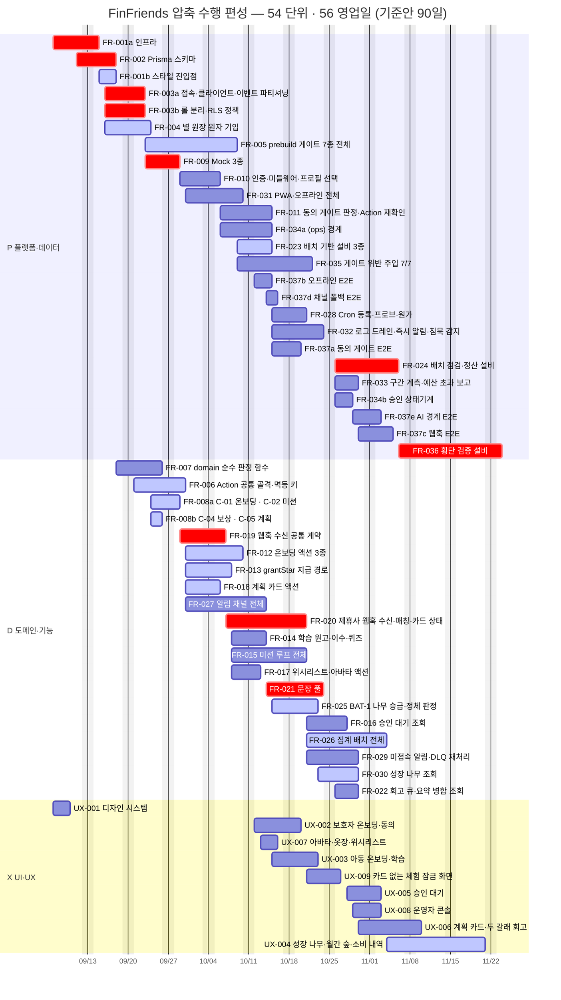

# [압축 수행] FinFriends — 최대 병렬 편성 Gantt

**문서 ID:** EXEC-FAST-FINFRIENDS-001
**개정 버전:** 1.0
**기준안:** `EXECUTION_finfriends-nextjs-v1_0.md` (EXEC-FINFRIENDS-NEXTJS-001 · 개정 1.0) — **그 문서는 그대로 둔다**
**대상:** `tasks/` 46건 · 압축 편성 후 **54 작업 단위**
**근거:** `TASKS_finfriends-nextjs-v3_0.md` §2·§3 선행 관계 · `tasks/` 각 이슈의 `Task Breakdown` 본문

> **기준안과 이 문서의 관계** — 기준안은 *"이슈를 통째로 두고, 선행이 **끝나면** 다음을 연다"* 는 보수 편성이다(**90일**).
> 이 문서는 같은 46건을 **쪼개고 겹쳐서** 동시 실행을 최대로 끌어올린 편성이다(**56일**). 둘은 대체 관계가 아니라 **선택지**다 — §1의 비교표에서 인원과 위험을 보고 고른다.

---

## 0. 무엇을 압축했나 — 세 가지 기법

기준안의 90일은 **이미 인원 무제한 최단값**이다. 사람을 더 넣어 줄어드는 여지는 0이었다. 따라서 압축은 **일정이 아니라 그래프를 건드려야** 한다.

| 기법 | 무엇을 바꾸나 | 무엇을 사는가 | 건수 |
| --- | --- | --- | :-: |
| **① 분할 (Split)** | 한 이슈 안의 **서로 독립인 묶음**을 병렬 트랙으로 쪼갠다 | 같은 이슈에 **사람이 더** 붙어야 한다 | **5건 → 14 단위** |
| **② 겹치기 (Overlap · SS+lead)** | 후속이 선행의 **일부 산출물**만 필요하면, 그 일부가 나오는 날부터 시작한다 | 선행이 흔들리면 **후속이 재작업**한다 | **12 간선** |
| **③ 결합 해제 (Decouple)** | 근거가 다투어지는 간선을 **끊는다** | 화면 결합을 **뒤로 미룬다** | **2 간선** |

⚠️ **①·②는 공짜가 아니다.** 분할은 인원을, 겹치기는 재작업 위험을 대가로 낸다. §2의 각 항목에 **안전 등급**(🟢 구조적으로 독립 / 🟡 조건부 / 🔴 되돌림 비용 큼)을 붙였다.

---

## 1. 결론 — 인원을 정하면 날짜가 정해진다

| 편성 | 4인 | 5인 | 6인 | **7인** | 8인 이상 | 이론 최단 |
| --- | :-: | :-: | :-: | :-: | :-: | :-: |
| **기준안** *(EXECUTION 문서)* | 101일 | **90일** | 90일 | 90일 | 90일 | 90일 |
| **압축안** *(이 문서)* | 91일 | **78일** | 69일 | **59일** | 59일 | **56일** |
| **단축** | −10 | **−12** | −21 | **−31** | −31 | **−34 (38%)** |

**같은 5인으로도 90 → 78일**이고, **7인을 넣으면 59일**에서 포화한다. 총 작업량은 **312 인일로 양쪽이 같다** — 일을 줄인 게 아니라 **대기를 줄였다.**

| 지표 | 기준안 | 압축안 |
| --- | :-: | :-: |
| 완료 (이론 최단) | 90일 | **56일** |
| 최대 동시 실행 | 8건 | **12건** |
| 임계 경로 | 11건 · 90일 | **9건 · 56일** |
| 작업 단위 | 46 | **54** |
| 총 작업량 | 312 인일 | 312 인일 |

> **권고 — 6인 또는 7인.** 5인은 78일로 기준안보다 12일 빠르지만 최대 동시 12건을 감당하지 못해 압축의 절반을 흘린다. 7인이 59일로 포화점이고, 8인부터는 다시 **0**이다.

---

## 2. 압축 편성 목록

### 2.1 분할 — 5건을 14 단위로

> **쪼갠 근거는 전부 이슈 본문에 있다.** `Task Breakdown`이 이미 묶음으로 나뉘어 있고, 그 묶음들이 서로 다른 것을 기다린다.

| 원 이슈 | 분할 단위 | 근거 *(본문 인용)* | 안전 |
| --- | --- | --- | :-: |
| **FR-001** 9일 | **a** 인프라 6일<br>**b** 스타일 진입점 3일 | 12개 항목 중 `UX-001`을 실제로 쓰는 것은 **Tailwind·`globals.css` 한 줄뿐**. → **a를 D+0에 착수**해 `UX-001`과 나란히 간다 | 🟢 |
| **FR-003** 10일 | **a** 접속·계측·마이그레이션 5일<br>**b** 롤·RLS·`withGuardian` 5일 | 본문이 「접속·클라이언트」「권한·정책」「실행 규약」「계측·마이그레이션」 **4묶음으로 이미 나뉘어 있다** | 🟡 2인 병행 필수 |
| **FR-008** 5일 | **a** C-01·02·03 3일<br>**b** C-04·05·06 2일 | 계약 6종이 각자 완결이고, **소비 이슈는 자기 계약 하나만** 필요하다 | 🟢 |
| **FR-034** 10일 | **a** 경계·레지스트리·화이트리스트·초안 API 7일<br>**b** 승인 상태기계 3일 | 5블록 중 `FR-021` 문장 풀을 실제로 쓰는 것은 **(구 FR-119) 승인 상태기계뿐** | 🟢 |
| **FR-037** 15일 | **a** 동의 3 · **b** 오프라인 3 · **c** 웹훅 4 · **d** 채널 폴백 2 · **e** AI 경계 3 | 본문이 5블록이고 **각 블록이 서로 다른 기능을 검증**한다 → 각자 자기 기능 뒤에 붙는다 | 🟢 |

> **부수 효과** — `FR-037` 분할로 `TASKS` §10.2가 지적한 **AC 상한 초과(15건)가 저절로 해소**된다. 가장 큰 이슈를 3·3·4·2·3으로 나누면 전부 상한 10 안에 들어온다.
> ⚠️ **`FR-003`만 🟡이다** — 이슈 본문이 *"롤만 나누고 RLS를 안 켠 중간 상태는 부분 성공이 아니라 실패"* 라고 못 박았다. **쪼개되 완료 판정은 하나로 유지**해야 하며, 두 트랙이 같은 날 끝나야 한다.

### 2.2 겹치기 — 12 간선을 SS+lead로

> **읽는 법** — 「선행 시작 +N일」은 선행이 *끝나기* 전, 시작 후 N일째부터 후속을 열 수 있다는 뜻이다. **N < 선행 기간**이므로 두 작업이 겹쳐 돈다.

| 선행 → 후속 | 겹침 | 왜 기다릴 필요가 없나 | 안전 |
| --- | :-: | --- | :-: |
| `FR-001a` → `FR-002` | 시작 +4일 | Supabase 프로젝트가 서면 스키마 작성 착수 가능 — Vercel 연결·로컬 환경·버전 고정을 기다릴 이유가 없다 | 🟢 |
| `FR-002` → `FR-003a` | 시작 +3일 | 테이블·칼럼 **이름이 확정되는 시점**이면 접속 구성·파티셔닝 착수 가능 | 🟢 |
| `FR-002` → `FR-003b` | 시작 +3일 | 롤·RLS 정책도 테이블 이름만 있으면 쓸 수 있다 — 마이그레이션 파일 완성 불필요 | 🟡 |
| `FR-002` → `FR-004` | 시작 +3일 | `StarLedger`·`PracticeCredit` 모델과 `idempotency_key @unique`가 서면 SQL 작성 착수 | 🟢 |
| `FR-004` → `FR-006` | 시작 +3일 | 골격의 멱등 계약은 **UNIQUE 제약 설계**만 필요하고 SQL 완성본은 필요 없다 | 🟢 |
| `FR-003a` → `FR-006` | 시작 +3일 | Action 골격은 `withGuardian()` **시그니처**만 참조한다 | 🟡 |
| `FR-003b` → `FR-006` | 시작 +3일 | 동일 — 정책 전수 작성 완료를 기다리지 않는다 | 🟡 |
| `FR-006` → `FR-008a` | 시작 +3일 | 계약의 zod 스키마·반환 타입은 **골격 완성 전에 확정**된다 | 🟢 |
| `FR-006` → `FR-008b` | 시작 +3일 | 동일 | 🟢 |
| `FR-008a` → `FR-012` | 시작 +2일 | 온보딩은 **C-01 하나**만 쓴다 — C-02·C-03을 기다리지 않는다 | 🟢 |
| `FR-012` → `FR-020` | 시작 +4일 | 웹훅 매칭은 `requestPartnerCard`의 **카드 상태**만 필요하다 | 🟡 |
| `FR-020` → `FR-021` | 시작 +5일 | 회고는 **회고 큐 적재 계약**만 필요 — 매칭 정확도·DLQ는 뒤에 와도 된다 | 🟡 |

> **가장 큰 한 건은 `FR-020 → FR-021`(5일 겹침)** 이다 — 회고는 결제 매칭의 **회고 큐 적재 계약**만 필요하고, 매칭 정확도·DLQ 처리를 기다릴 이유가 없다. 이 간선은 **기준안과 압축안 양쪽 모두 임계 경로 위**에 있다.

### 2.3 결합 해제 — 2 간선

| 끊은 간선 | 근거 | 효과 |
| --- | --- | :-: |
| `UX-002` → **`FR-011`** | 기준안 §2.5 — `TASKS` §4는 전제한다 하고 §11 검증표는 *"`FR`이 `UX`를 선행으로 두는 경우 0건"* 이라 한다. **두 진술이 충돌한다** | 착수 **9일** 당김 |
| `UX-002` → **`FR-031`** | 동일. 필요한 것은 **동의 차단 화면·설치 유도 배너의 마크업뿐** — 로직을 먼저 열고 화면만 나중에 결합한다 | 착수 **14일** 당김 |

> 🔴 **이 결정은 압축의 전제다.** 끊지 않고 계산하면 `UX-002 → FR-011 → FR-032 → FR-036`이 **새 임계 경로**가 되어 전체가 **62일**이 된다. 끊으면 **56일**이다 — **6일이 이 한 판단에 달려 있다.**

---

## 3. 새 임계 경로 — 무엇이 바뀌었나

```
FR-001a → FR-002 → FR-003a → FR-009 → FR-019 → FR-020 → FR-021 → FR-024 → FR-036
```

| 순번 | 단위 | 내용 | 기간 | 구간 |
| :-: | --- | --- | :-: | :-: |
| 1 | `FR-001a` | 인프라 — 스캐폴딩·Supabase·Vercel·환경 스코프·버전 고정 | 6일 | D+0 ~ D+6 |
| 2 | `FR-002` | Prisma 스키마 | 5일 | D+4 ~ D+9 |
| 3 | `FR-003a` | 접속·클라이언트·이벤트 파티셔닝·마이그레이션 절차 | 5일 | D+7 ~ D+12 |
| 4 | `FR-009` | Mock 3종 | 4일 | D+12 ~ D+16 |
| 5 | `FR-019` | 웹훅 수신 공통 계약 | 6일 | D+16 ~ D+22 |
| 6 | `FR-020` | 제휴사 웹훅 수신·매칭·카드 상태 | 10일 | D+22 ~ D+32 |
| 7 | `FR-021` | 문장 풀·submitRetrospective | 8일 | D+27 ~ D+35 |
| 8 | `FR-024` | 배치 점검·정산 설비 | 9일 | D+35 ~ D+44 |
| 9 | `FR-036` | 횡단 검증 설비 | 12일 | D+44 ~ D+56 |

> ⚠️ **경로 위 9건의 기간을 더하면 65일이지만 완료는 56일이다.** 차이 **9일**이 이 경로 안에서 겹쳐 도는 몫이다 — 겹치기가 실제로 얼마를 벌었는지가 여기 그대로 나온다.

| 비교 | 기준안 (11건 · 90일) | 압축안 (9건 · 56일) |
| --- | --- | --- |
| **빠진 것** | `UX-001` · `FR-001` · `FR-006` · `FR-008` · `FR-012` · `FR-034` · `FR-037` | 겹치기·분할로 임계에서 내려왔다 |
| **들어온 것** | — | `FR-009` Mock · `FR-019` 웹훅 계약 · `FR-024` 배치 점검 · `FR-036` 횡단 검증 |
| **그대로** | `FR-002` · `FR-003` · `FR-020` · `FR-021` | 압축해도 남는 **진짜 뼈대** |

> **압축의 성격이 여기 드러난다** — 임계가 *"계약·골격을 세우는 일"* 에서 *"외부와 물리는 일(Mock → 웹훅 → 매칭 → 회고)과 검증 설비"* 로 옮겨 갔다.
> 즉 **압축안에서 일정을 지키는 열쇠는 `T-1`(고정 출구 IP) 답을 빨리 받는 것**이다 — `FR-019`·`FR-020`이 새로 임계에 올랐기 때문이다.

---

## 4. 압축 Gantt

> **기준안의 Gantt와 읽는 법이 다르다.** 기준안은 막대를 `after <선행>`으로 걸어 **끝나야 시작**을 그렸다. 여기서는 **겹치기가 핵심**이라 막대를 절대 날짜로 놓았다 — 겹쳐 있는 구간이 곧 동시 작업 구간이다.
> 🔴 **crit = 여유 0** · 🔵 **active = 여유 4일 이하** · 회색 = 여유 5일 이상.
> 분할 단위는 `FR-003a` 처럼 **원 이슈 번호 + 소문자**로 적었다. GitHub 이슈를 쪼갤지 한 이슈 안의 체크박스 묶음으로 둘지는 §6에서 다룬다.



**기준일 2026-09-07(월) 착수 · 주말 제외 · 완료 2026-11-23** *(기준안 대비 34 영업일 · 약 7주 단축)*

---

## 5. 동시 실행 프로파일 — 언제 몇 명이 필요한가

| 구간 | 동시 열림 | 폭 | 비고 |
| --- | :-: | --- | --- |
| D+0 ~ D+3 | 1~**2** | `██` | 직렬 도입부 — 인프라와 디자인 시스템만 |
| D+4 ~ D+7 | 2~**5** | `█████` |  |
| D+8 ~ D+11 | 4~**5** | `█████` | 스키마·접근계층·원장이 한꺼번에 열린다 |
| D+12 ~ D+15 | 4~**6** | `██████` |  |
| D+16 ~ D+19 | 4~**8** | `████████` |  |
| D+20 ~ D+23 | 8~**10** | `██████████` | 계약이 갈라지며 기능이 한꺼번에 열린다 |
| D+24 ~ D+27 | **11** | `███████████` |  |
| D+28 ~ D+31 | 8~**12** | `████████████` | **최대 폭** — 6~7인이 없으면 여기서 흘린다 |
| D+32 ~ D+35 | 7~**9** | `█████████` |  |
| D+36 ~ D+39 | 7~**9** | `█████████` |  |
| D+40 ~ D+43 | 3~**7** | `███████` | 기능이 닫히고 E2E 분할분이 붙는다 |
| D+44 ~ D+47 | 2~**3** | `███` |  |
| D+48 ~ D+51 | **2** | `██` | 꼬리 — 긴 이슈 2건만 남는다 |
| D+52 ~ D+55 | 1~**2** | `██` |  |

**최대 12건이 한꺼번에 열리는 D+28이 이 편성의 고비다.** 그날 도는 것은 — `FR-015` · `FR-020` · `FR-021` · `FR-025` · `FR-028` · `FR-032` · `FR-035` · `FR-037a` · `FR-037d` · `UX-002` · `UX-003` · `UX-007`.
**꼬리 10일(D+46~)은 다시 2건뿐**이다 — `FR-036` 횡단 검증(12일)과 `UX-004` 성장 나무 화면(13일)이 각자 길게 돈다. **이 둘을 더 쪼개지 않는 한 56일 아래로는 내려가지 않는다.**

---

## 6. 압축 실행 대장 — 54 단위

> 「당김」은 **기준안의 완료일 대비** 얼마나 앞당겨졌는지다. 분할 단위는 **원 이슈의 기준안 완료일**과 비교한 값이다. **늦어진 단위는 0건**이다.

| 단위 | 내용 | 레인 | 기간 | 착수 | 완료 | 여유 | 당김 | 선행 |
| --- | --- | :-: | :-: | :-: | :-: | :-: | :-: | --- |
| `FR-001a` | 인프라 — 스캐폴딩·Supabase·Vercel·환경 스코프·버전 고정 | P | 6 | **D+0** | D+6 | **0** 🔴 | **−6일** | *(없음)* |
| `UX-001` | 디자인 시스템 — 토큰·테마·컴포넌트·접근성·아동 문구 | X | 3 | **D+0** | D+3 | 5일 | — | *(없음)* |
| `FR-002` | Prisma 스키마 | P | 5 | **D+4** | D+9 | **0** 🔴 | **−8일** | `FR-001a` |
| `FR-001b` | 스타일 진입점 — Tailwind·shadcn·globals.css·로컬 시드 | P | 3 | **D+6** | D+9 | 2일 🟡 | **−3일** | `FR-001a` · `UX-001` |
| `FR-003a` | 접속·클라이언트·이벤트 파티셔닝·마이그레이션 절차 | P | 5 | **D+7** | D+12 | **0** 🔴 | **−15일** | `FR-002` |
| `FR-003b` | 롤 분리·RLS 정책·pii 권한 회수·withGuardian 래퍼 | P | 5 | **D+7** | D+12 | **0** 🔴 | **−15일** | `FR-002` |
| `FR-004` | 별 원장 원자 기입 | P | 6 | **D+7** | D+13 | 1일 🟡 | **−10일** | `FR-002` |
| `FR-007` | domain 순수 판정 함수 | D | 6 | **D+9** | D+15 | 7일 | **−8일** | `FR-002` |
| `FR-006` | Action 공통 골격·멱등 키·캐시 태그 | D | 7 | **D+10** | D+17 | 1일 🟡 | **−17일** | `FR-001a` · `FR-001b` · `FR-003a` · `FR-003b` · `FR-004` |
| `FR-005` | prebuild 게이트 7종 전체 | P | 12 | **D+12** | D+24 | 4일 🟡 | **−15일** | `FR-001a` · `FR-001b` · `FR-002` · `FR-003a` · `FR-003b` |
| `FR-009` | Mock 3종 | P | 4 | **D+12** | D+16 | **0** 🔴 | **−15일** | `FR-002` · `FR-003a` · `FR-003b` |
| `FR-008a` | C-01 온보딩 · C-02 미션 · C-03 학습 | D | 3 | **D+13** | D+16 | 3일 🟡 | **−23일** | `FR-002` · `FR-006` |
| `FR-008b` | C-04 보상 · C-05 계획·회고 · C-06 알림·오프라인 | D | 2 | **D+13** | D+15 | 3일 🟡 | **−24일** | `FR-002` · `FR-006` |
| `FR-010` | 인증·미들웨어·프로필 선택 | P | 5 | **D+16** | D+21 | 9일 | **−23일** | `FR-001a` · `FR-001b` · `FR-002` · `FR-008a` |
| `FR-019` | 웹훅 수신 공통 계약 | D | 6 | **D+16** | D+22 | **0** 🔴 | **−15일** | `FR-001a` · `FR-001b` · `FR-002` · `FR-009` |
| `FR-012` | 온보딩 액션 3종 | D | 8 | **D+17** | D+25 | 1일 🟡 | **−22일** | `FR-006` · `FR-008a` |
| `FR-013` | grantStar 지급 경로 | D | 6 | **D+17** | D+23 | 4일 🟡 | **−22일** | `FR-004` · `FR-006` · `FR-008b` |
| `FR-018` | 계획 카드 액션 | D | 4 | **D+17** | D+21 | 1일 🟡 | **−22일** | `FR-006` · `FR-008b` |
| `FR-027` | 알림 채널 전체 | D | 10 | **D+17** | D+27 | 18일 | **−22일** | `FR-006` · `FR-008b` |
| `FR-031` | PWA·오프라인 전체 | P | 8 | **D+17** | D+25 | 28일 | **−36일** | `FR-001a` · `FR-001b` · `FR-006` · `FR-008b` |
| `FR-011` | 동의 게이트 판정·Action 재확인 | P | 7 | **D+21** | D+28 | 9일 | **−32일** | `FR-003a` · `FR-003b` · `FR-006` · `FR-010` |
| `FR-034a` | (ops) 경계 · 프로바이더 레지스트리 · 프롬프트 화이트리스트 · 초안 API | P | 7 | **D+21** | D+28 | 22일 | **−47일** | `FR-001a` · `FR-001b` · `FR-008b` · `FR-010` |
| `FR-020` | 제휴사 웹훅 수신·매칭·카드 상태 | D | 10 | **D+22** | D+32 | **0** 🔴 | **−25일** | `FR-007` · `FR-008a` · `FR-012` · `FR-018` · `FR-019` |
| `FR-014` | 학습 원고·이수·퀴즈 | D | 4 | **D+23** | D+27 | 23일 | **−22일** | `FR-002` · `FR-007` · `FR-008a` · `FR-013` |
| `FR-015` | 미션 루프 전체 | D | 9 | **D+23** | D+32 | 15일 | **−22일** | `FR-006` · `FR-007` · `FR-008a` · `FR-013` |
| `FR-017` | 위시리스트·아바타 액션 | D | 3 | **D+23** | D+26 | 27일 | **−22일** | `FR-002` · `FR-008b` · `FR-013` |
| `FR-023` | 배치 기반 설비 3종 | P | 4 | **D+24** | D+28 | 4일 🟡 | **−15일** | `FR-001a` · `FR-001b` · `FR-002` · `FR-005` · `FR-019` |
| `FR-035` | 게이트 위반 주입 7/7 | P | 9 | **D+24** | D+33 | 23일 | **−15일** | `FR-005` |
| `FR-037b` | 오프라인 E2E — Android·iOS | P | 3 | **D+25** | D+28 | 28일 | **−62일** | `FR-031` |
| `UX-002` | 보호자 온보딩·동의 — 디자인 + 온보딩·공개 화면 | X | 6 | **D+25** | D+31 | 25일 | **−22일** | `FR-001a` · `FR-001b` · `FR-010` · `FR-012` · `UX-001` |
| `UX-007` | 아바타·옷장·위시리스트 — 디자인 + 보상 화면 | X | 3 | **D+26** | D+29 | 27일 | **−22일** | `FR-017` · `UX-001` |
| `FR-021` | 문장 풀·submitRetrospective | D | 8 | **D+27** | D+35 | **0** 🔴 | **−30일** | `FR-002` · `FR-008b` · `FR-013` · `FR-020` |
| `FR-037d` | 채널 폴백 E2E — 전달 시도 100% | P | 2 | **D+27** | D+29 | 27일 | **−61일** | `FR-027` |
| `FR-025` | BAT-1 나무 승급·정체 판정 | D | 6 | **D+28** | D+34 | 4일 🟡 | **−15일** | `FR-007` · `FR-023` |
| `FR-028` | Cron 등록·프로브·원가 | P | 4 | **D+28** | D+32 | 13일 | **−15일** | `FR-001a` · `FR-001b` · `FR-023` |
| `FR-032` | 로그 드레인·즉시 알림·침묵 감지 | P | 7 | **D+28** | D+35 | 9일 | **−32일** | `FR-001a` · `FR-001b` · `FR-011` · `FR-023` |
| `FR-037a` | 동의 게이트 E2E | P | 3 | **D+28** | D+31 | 25일 | **−59일** | `FR-011` |
| `UX-003` | 아동 온보딩·학습 — 디자인 + 학습·퀴즈 화면 | X | 6 | **D+28** | D+34 | 22일 | **−32일** | `FR-011` · `FR-014` · `UX-001` |
| `FR-016` | 승인 대기 조회 | D | 5 | **D+32** | D+37 | 15일 | **−22일** | `FR-007` · `FR-015` |
| `FR-026` | 집계 배치 전체 | D | 10 | **D+32** | D+42 | 1일 🟡 | **−25일** | `FR-003a` · `FR-003b` · `FR-007` · `FR-020` · `FR-023` |
| `FR-029` | 미접속 알림·DLQ 재처리 | D | 7 | **D+32** | D+39 | 13일 | **−25일** | `FR-020` · `FR-027` · `FR-028` |
| `UX-009` | 카드 없는 체험 잠금 화면 | X | 4 | **D+32** | D+36 | 20일 | **−25일** | `FR-020` · `UX-001` |
| `FR-030` | 성장 나무 조회 | D | 5 | **D+34** | D+39 | 4일 🟡 | **−15일** | `FR-006` · `FR-025` |
| `FR-022` | 회고 큐·요약 병합 조회 | D | 4 | **D+35** | D+39 | 10일 | **−30일** | `FR-021` |
| `FR-024` | 배치 점검·정산 설비 | P | 9 | **D+35** | D+44 | **0** 🔴 | **−30일** | `FR-003a` · `FR-003b` · `FR-004` · `FR-021` · `FR-023` |
| `FR-033` | 구간 계측·예산 초과 보고 | P | 4 | **D+35** | D+39 | 17일 | **−32일** | `FR-003a` · `FR-003b` · `FR-006` · `FR-032` |
| `FR-034b` | 승인 상태기계 — 문장 풀 적재·배정 필터 | P | 3 | **D+35** | D+38 | 15일 | **−37일** | `FR-021` · `FR-034a` |
| `UX-005` | 승인 대기 — 디자인 + 승인 대기 화면 | X | 4 | **D+37** | D+41 | 15일 | **−22일** | `FR-001a` · `FR-001b` · `FR-016` · `UX-001` |
| `FR-037e` | AI 경계 E2E — 대기 0 · 페이로드 0 · 장애 주입 | P | 3 | **D+38** | D+41 | 15일 | **−49일** | `FR-034a` · `FR-034b` |
| `UX-008` | 운영자 콘솔 — 디자인 + AI 초안 검토 화면 | X | 3 | **D+38** | D+41 | 15일 | **−37일** | `FR-034b` · `UX-001` |
| `FR-037c` | 웹훅 E2E — 서명·재전송·DLQ·매칭 정확도 | P | 4 | **D+39** | D+43 | 13일 | **−47일** | `FR-009` · `FR-019` · `FR-020` · `FR-029` |
| `UX-006` | 계획 카드·두 갈래 회고 — 디자인 + 화면 2종 | X | 7 | **D+39** | D+46 | 10일 | **−30일** | `FR-001a` · `FR-001b` · `FR-018` · `FR-022` · `UX-001` |
| `UX-004` | 성장 나무·월간 숲·소비 내역 — 디자인 + 전달 화면 전체 | X | 13 | **D+42** | D+55 | 1일 🟡 | **−25일** | `FR-001a` · `FR-001b` · `FR-006` · `FR-026` · `FR-030` · `UX-001` |
| `FR-036` | 횡단 검증 설비 | P | 12 | **D+44** | D+56 | **0** 🔴 | **−30일** | `FR-001a` · `FR-001b` · `FR-003a` · `FR-003b` · `FR-004` · `FR-005` · `FR-006` · `FR-024` · `FR-026` · `FR-032` |

**합계 — 54 단위 · 312 인일 · 임계 10건 · 여유 0 또는 4일 이하 24건.**

**가장 크게 당겨진 5건** — `FR-037b` 오프라인 E2E **−62일** · `FR-037d` 채널 폴백 **−61일** · `FR-037a` 동의 게이트 **−59일** · `FR-037e` AI 경계 **−49일** · `FR-037c` 웹훅 **−47일**.
전부 `FR-037` 분할분이다. **검증을 끝에 몰지 않고 각 기능 뒤에 붙인 것이 이 편성의 가장 큰 이득**이며, 기준안 §6.2가 *"E2E를 끝에 몰지 말라"* 고 적어 둔 것을 일정으로 실현한 것이다.

---

## 7. 압축이 요구하는 것 · 감수하는 것

### 7.1 요구하는 것 — 이게 안 되면 압축은 성립하지 않는다

| # | 요구 | 왜 |
| :-: | --- | --- |
| **R1** | **6~7인.** 5인이면 78일에 그친다 | 최대 동시 12건을 5인이 감당하지 못한다 |
| **R2** | **`UX-002` ↔ `FR-011`·`FR-031` 결합 해제 결정** | 안 끊으면 62일 — **6일이 이 판단 하나에 달려 있다**(§2.3) |
| **R3** | **`FR-003`에 2인 동시 투입** | 쪼갠 두 트랙이 **같은 날 끝나야** 완료 판정이 하나로 선다 |
| **R4** | **`T-1`(고정 출구 IP) 조기 확답** | 새 임계가 `FR-009 → FR-019 → FR-020`을 지난다 — 기준안에서는 여유가 있던 구간이다 |
| **R5** | **선행 산출물을 겹침 시점에 「공개」하는 규율** | 겹치기 12건은 전부 *"선행의 일부가 그날 나와 있다"* 를 전제한다. 계약·시그니처·모델을 **완성 전에 확정해 공유**해야 한다 |

### 7.2 감수하는 것 — 위험과 완화

| 위험 | 어디에서 | 완화 |
| --- | --- | --- |
| 🔴 **겹침 구간 재작업** | 🟡 등급 6 간선 — `FR-002→FR-003b` · `FR-003a/b→FR-006` · `FR-012→FR-020` · `FR-020→FR-021` | 겹침 시점에 선행의 해당 부분을 **동결**하고, 이후 변경은 후속 담당자와 합의해서만 |
| 🔴 **`FR-003` 부분 완료 착시** | 분할 🟡 | 이슈 본문이 *"중간 상태는 부분 성공이 아니라 실패"* 라 못 박았다 — **DoD는 쪼개지 않는다** |
| 🟡 **작업 단위 46 → 54** | 관리 비용 | 분할분을 **별도 이슈로 만들지 말고** 원 이슈 안의 `Task Breakdown` 묶음에 담당자를 나눠 다는 편이 추적이 쉽다. 단 `FR-037`만은 5건으로 쪼개면 **AC 상한 초과가 해소**되므로 별도 이슈 권장 |
| 🟡 **꼬리가 얇다** | D+46~D+56은 2건뿐 | `FR-036`(12일)·`UX-004`(13일)를 더 쪼개면 추가 단축 여지가 있으나, 이번 편성에는 넣지 않았다 |
| ⚠️ **기간은 여전히 가정** | 전 구간 | 기준안 부록 A와 **같은 산정 규칙**을 썼다 — 분할 단위의 기간은 원 이슈 기간을 내용 비중대로 나눈 값이며, 합은 보존된다 |

---

## 8. 검증

| 항목 | 결과 |
| --- | :-: |
| 46건 전건이 압축 편성에 존재 | ✅ **46 / 46** *(분할 5건 → 14 단위, 총 54)* |
| 총 작업량 보존 | ✅ **312 = 312 인일** |
| 순환 의존 | ✅ **0건** |
| 모든 간선에서 `착수 ≥ 선행 착수 + 겹침` | ✅ **위반 0건** |
| 겹침이 선행 기간을 넘는 경우 *(=허위 겹치기)* | ✅ **0건** |
| 기준안보다 늦어진 단위 | ✅ **0건** |
| 임계 경로 `Σ겹침 + 말단 기간` ↔ 완료일 | ✅ **44 + 12 = 56일** |
| 분할 단위 기간 합 ↔ 원 이슈 기간 | ✅ **5 / 5 일치** |

*집계 방법 — 기준안의 그래프(간선 134개)에 ①분할 5건의 내부 배선 ②겹침 12간선의 lead ③결합 해제 2간선을 적용해 54노드 그래프를 만들고, `ES[v] = max(ES[p] + lead(p,v))` 로 전진 계산했다(겹침이 없는 간선은 `lead = 선행 기간`, 즉 종전 FS와 같다). 여유는 후진 계산으로 구했고, 인원별 완료일은 겹침을 반영한 목록 스케줄링으로 시뮬레이션했다. 분할 기간은 각 `Task Breakdown` 묶음의 항목 수 비중으로 나눈 뒤 합을 원 기간에 맞췄다.*

---

## 부록. 기준안과 한 줄 대조

| | 기준안 `EXECUTION_…v1_0.md` | 압축안 *(이 문서)* |
| --- | --- | --- |
| **편성 원칙** | 이슈를 통째로, 선행이 끝나면 시작 | 쪼개고 겹쳐서 동시 실행 최대화 |
| **완료** | 90일 (5인) | **56일** (7인) · 78일 (5인) |
| **작업 단위** | 46 | 54 |
| **최대 동시** | 8 | 12 |
| **임계** | `UX-001 → … → FR-037` 11건 | `FR-001a → … → FR-036` 9건 |
| **성격** | 낮은 관리 비용 · 재작업 위험 낮음 | 빠름 · **인원과 규율을 요구** |
| **언제 고르나** | 인원이 5인 이하이거나 요구사항이 아직 흔들릴 때 | 인원 6~7인이 확보되고 `TASKS`·SRS가 **동결**되었을 때 |

---

*기준 문서: `EXECUTION_finfriends-nextjs-v1_0.md` · `TASKS_finfriends-nextjs-v3_0.md` (개정 3.1)*
*분할 근거: `tasks/stage-1/FR-001` · `FR-003` · `stage-2/FR-008` · `stage-8/FR-034` · `stage-9/FR-037` 의 `Task Breakdown` 본문*
