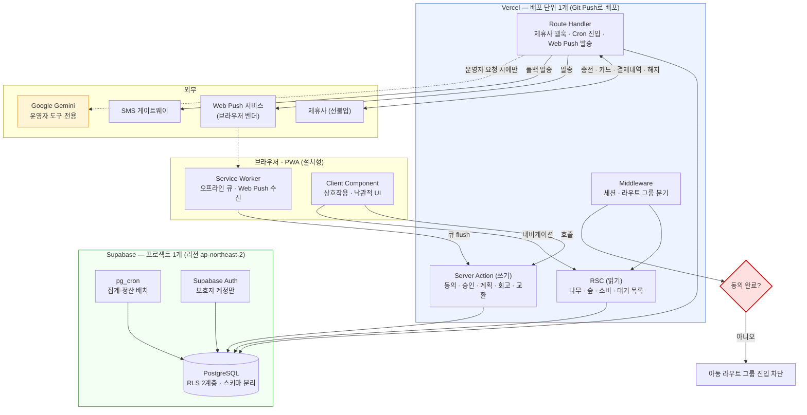
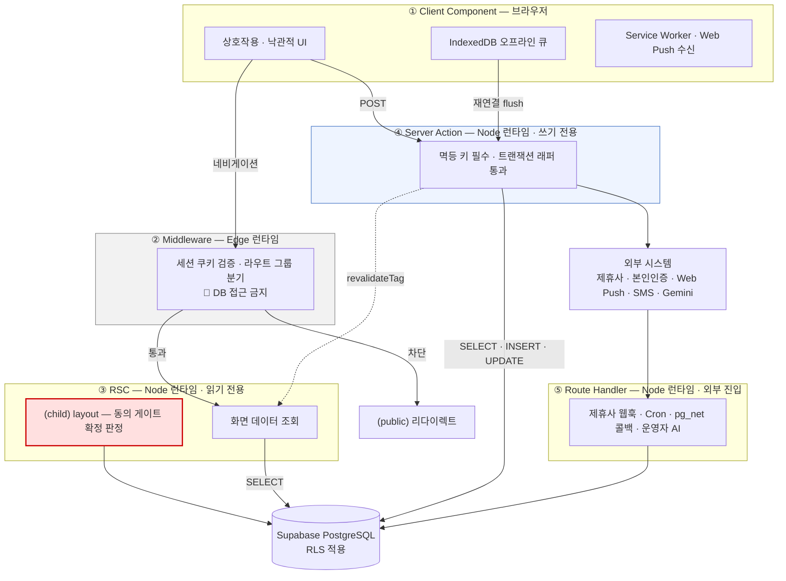
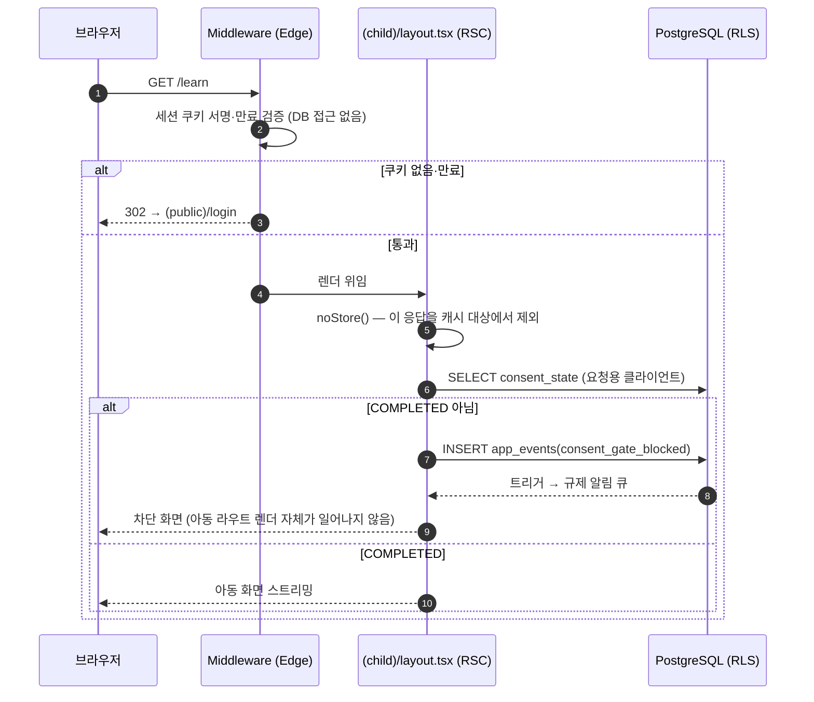
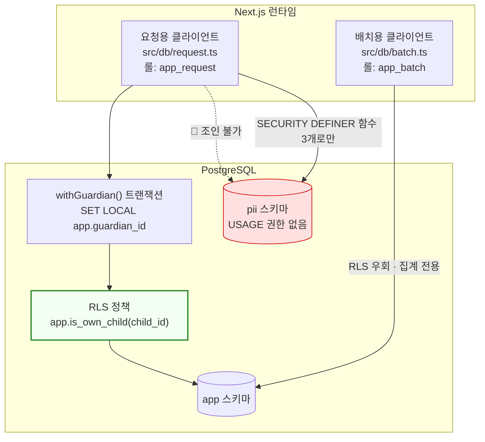
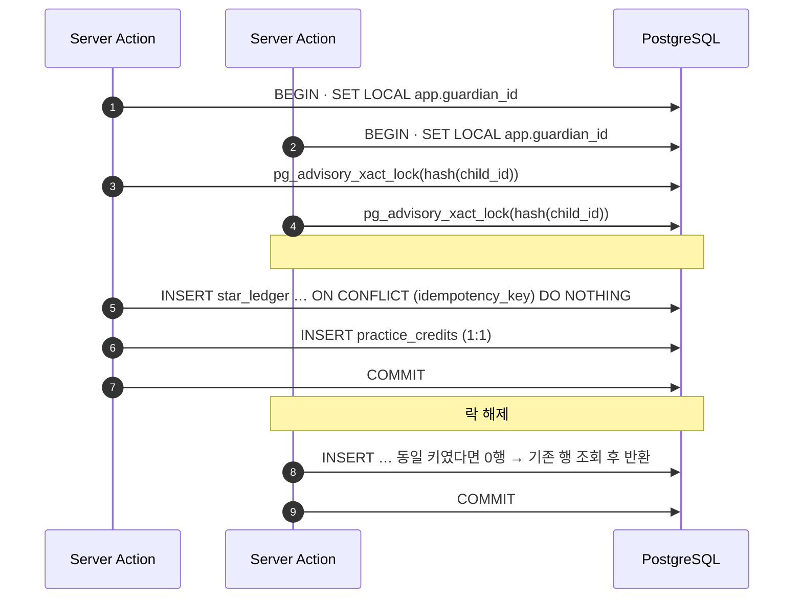
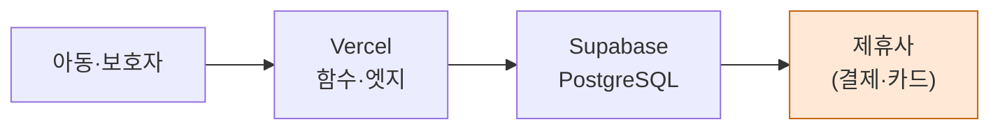
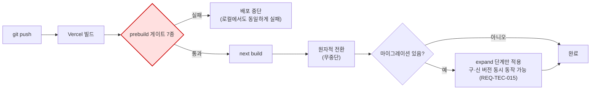
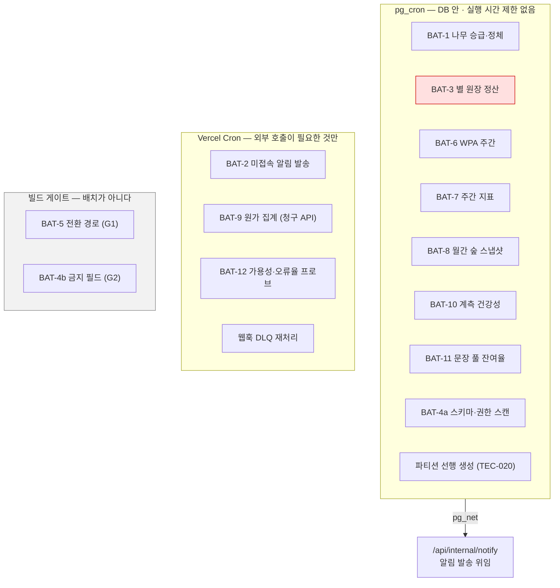
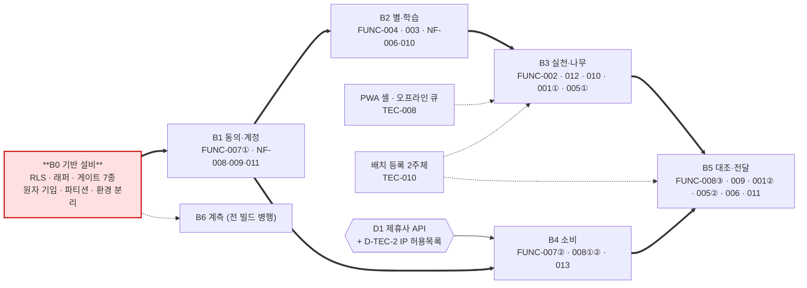

# [SRS 문서] FinFriends — 기술 제약 반영판 (Next.js · Vercel · Supabase)

# 소프트웨어 요구사항 명세서 (SRS)

**문서 ID:** SRS-FINFRIENDS-NEXTJS-001

**개정 버전:** 1.0

**날짜:** 2026-08-24

**표준:** ISO/IEC/IEEE 29148:2018

**기준 문서:** `SRS_finfriends-v1_0.md` (SRS-FINFRIENDS-MVP-001) · `DESIGN_finfriends-v1_0.md` (DESIGN-FINFRIENDS-MVP-001)

---

## 0. 본 문서의 지위

> **기준 SRS를 대체하지 않는다.** SRS-FINFRIENDS-MVP-001은 *무엇을 만들어야 하는가*의 최종본으로 그대로 유효하며, 본 문서는 **§1.5의 기술 제약을 정확히 반영했을 때 그것이 구현 가능한 형태로 어떻게 성립하는가**를 명세한다.

| 구분 | 기준 SRS (MVP-001) | **본 문서 (NEXTJS-001)** |
| --- | --- | --- |
| 답하는 질문 | 무엇을 만들어야 하는가 | **주어진 스택으로 어떻게 성립시키는가** |
| 요구사항 ID | `REQ-FUNC-*` · `REQ-NF-*` 원본 | 원본을 **승계**하고 `REQ-TEC-*` · `REQ-AI-*`를 **신설** |
| 플랫폼 | 명시하지 않음 *("모바일 애플리케이션")* | **Next.js App Router PWA · Vercel · Supabase** |
| 값의 지위 | 수용 기준에서 역산한 상한 | 상한을 **런타임 예산으로 배분**한 값(§8) |
| 충돌 처리 | — | **§1.6에 8건을 전수 기록**하고 해소 방식을 명시 |

**읽는 순서** — 급하면 **§1.5 제약 → §1.6 충돌 해소 → §6.1 서버 경계 목록 → §6.2 Prisma 스키마** 네 곳만 읽어도 구현에 착수할 수 있다. 값이 어디서 나왔는지가 궁금하면 **§8 런타임 예산**, 무엇이 아직 안 닫혔는지가 궁금하면 **§14 미결 항목**으로 간다.

---

## 1. 서론

### 1.1 목적

본 문서는 **단일 Next.js 풀스택 프레임워크 · Vercel 단일 배포 · Supabase 단일 데이터 저장소**라는 제약 아래에서, 기준 SRS의 요구사항 35건이 **어떤 런타임 경계·데이터 접근 규칙·빌드 게이트로 성립하는가**를 정의한다.

두 가치 선언(선언 ① 성장이 일어난다 · 선언 ② 그 성장이 보인다)과 규제 상수는 기준 SRS에서 **변경 없이 승계**한다. 본 문서가 바꾸는 것은 **그것을 성립시키는 수단**이며, 수단이 요구사항을 바꿔야 하는 지점은 §1.6에 전수 기록한다.

### 1.2 범위

**승계** — 4영역 학습·퀴즈 · 실천 판정 3경로 · 별 지급 엔진 · 성장 나무·월간 숲 · 소비 계획 카드·업종 대조 · 보호자 온보딩·법정대리인 동의 · ⭐ 소급 지급 · 3일 미접속 알림 · 제휴사 위탁 선불카드 · 인앱 이벤트 수집.

**본 문서가 확정하는 것**

- **배포 단위** — Next.js 앱 1개, Vercel 프로젝트 1개, Supabase 프로젝트 1개
- **런타임 경계** — RSC(읽기) · Server Action(쓰기) · Route Handler(외부 진입·배치) · Client Component(상호작용)
- **데이터 접근 규칙** — Prisma 2클라이언트 + Supabase RLS 2계층 방어
- **배치 분담** — DB 내부 집계는 `pg_cron`, 외부 호출은 Vercel Cron
- **빌드 게이트** — 별도 CI 파이프라인 없이 `prebuild` 스크립트로 규제 게이트를 강제
- **AI 경계** — 아동 대면 런타임에 AI를 두지 않고 **운영자 전용 오프라인 도구**로 한정

**범위 제외** — 기준 SRS §1.2의 제외 항목을 그대로 승계한다. 추가로 아래를 제외한다.

| 제외 항목 | 근거 |
| --- | --- |
| 네이티브 앱(iOS·Android 스토어 배포) | C-TEC-001 — 단일 Next.js 프레임워크. PWA로 성립시킨다(§1.6 X-1) |
| 별도 백엔드 서버 · 컨테이너 · 오케스트레이션 | C-TEC-002 · C-TEC-007 |
| 자체 AI 서버 · 모델 호스팅 | C-TEC-005 |
| 별도 CI/CD 파이프라인(GitHub Actions 등) | C-TEC-007 — 빌드 스크립트로 대체(§1.6 X-2) |

### 1.3 정의, 약어, 축약어

> 기준 SRS §1.3의 용어를 승계하고, 본 문서에서 새로 쓰는 스택 용어만 정의한다.

| 용어 | 정의 |
| --- | --- |
| **RSC** | React Server Component. 서버에서 실행되어 HTML을 만드는 컴포넌트. 본 문서의 **모든 읽기 경로**가 여기에 있다 |
| **Server Action** | `"use server"`로 표시된 서버 함수. 클라이언트가 직접 호출하는 **쓰기 경로**. 내부적으로 POST |
| **Route Handler** | `app/api/**/route.ts`. 외부 시스템이 들어오는 입구(웹훅)와 배치 트리거 |
| **RLS** | Row Level Security. Postgres가 **행 단위로** 접근을 막는 기능. 본 문서의 2차 방어선 |
| **Supavisor** | Supabase의 커넥션 풀러. 서버리스에서 커넥션 고갈을 막는다(포트 6543 · transaction 모드) |
| **pg_cron** | Postgres 안에서 도는 스케줄러. **함수 실행 시간 제한이 없어** 대량 집계 배치를 여기서 돌린다 |
| **Vercel Cron** | Vercel이 Route Handler를 정해진 시각에 호출하는 기능. **외부 호출이 필요한 배치**만 여기서 돈다 |
| **PWA** | Progressive Web App. 홈 화면에 설치되는 웹 앱. 본 시스템의 아동·보호자 화면 형태 |
| **Web Push · VAPID** | 웹 표준 푸시와 그 인증 키 방식. iOS는 **설치된 PWA에서만** 동작한다(§1.6 X-3) |
| **Background Sync** | 오프라인 큐를 재연결 시 자동 전송하는 브라우저 기능. **iOS 미지원**(§1.6 X-4) |
| **Vercel AI SDK** | Vercel이 제공하는 LLM 호출 표준 인터페이스. 모델 교체를 환경 변수로 처리한다 |
| **멱등 키** | `idempotency_key`. **클라이언트가 생성**해 Server Action에 전달하는 중복 방지 키 |
| **런타임 예산** | 하나의 응답 상한(예: 1,250ms)을 콜드스타트·인증·쿼리·렌더로 쪼갠 배분값(§8) |

### 1.4 시스템 한눈에 보기 — 하나의 배포 단위



> **이 그림의 핵심 세 가지** — ① 배포 단위가 **하나**다(별도 백엔드·컨테이너 없음). ② 배치가 **두 곳**으로 나뉜다 — DB 안(`pg_cron`)과 Vercel Cron. 실행 시간 제한 때문이다(§1.6 X-5). ③ **AI는 아동·보호자 경로에 없다** — 운영자가 명시적으로 요청할 때만 호출된다(§1.6 X-7).

### 1.5 Assumptions & Constraints

> **아래 C-TEC-001~007은 발주 제약이며 설계 변수가 아니다.** C-TEC-008 이후는 001~007을 성립시키기 위해 본 문서가 **도출**한 파생 제약이다.

#### 시스템 내부 — 단일 통합 프레임워크

| ID | 제약 |
| --- | --- |
| **C-TEC-001** | 모든 서비스는 **Next.js (App Router)** 기반의 단일 풀스택 프레임워크로 구현한다. (프론트엔드와 백엔드를 별도 분리하지 않는다.) |
| **C-TEC-002** | 서버 측 로직(DB 접근, API 호출 등)은 Next.js의 **Server Actions 또는 Route Handlers**를 사용하여 별도의 백엔드 서버 없이 구현한다. |
| **C-TEC-003** | 데이터베이스는 **Prisma + 로컬 Supabase**를 사용하여 로컬 개발환경을 구성하고, 배포 시 **Supabase(PostgreSQL)** 를 사용하여 인프라 설정 복잡도를 최소화한다. |
| **C-TEC-004** | UI 및 스타일링은 **Tailwind CSS와 shadcn/ui**를 사용하여 AI가 일관된 디자인 코드를 생성하도록 강제한다. |

#### 시스템 외부 — 연결 및 AI 통합

| ID | 제약 |
| --- | --- |
| **C-TEC-005** | (AI 호출 기능이 포함된 경우) AI 기능은 별도 자체 서버 구축 없이 **Vercel AI SDK**를 사용하여 Next.js에서 외부 API를 호출하는 형태로 구현한다. |
| **C-TEC-006** | 외부 AI 서비스 API 호출은 **Google Gemini API**를 기본으로 사용하며, **환경 변수 설정만으로 모델 교체가 가능**하도록 SDK의 표준 인터페이스를 준수한다. |
| **C-TEC-007** | 배포 및 인프라 관리는 **Vercel 플랫폼으로 단일화**하며, **CI/CD 설정 없이 Git Push만으로 배포를 자동화**한다. |

#### 파생 제약 — 위 7건을 성립시키기 위해 본 문서가 도출한 것

| ID | 파생 제약 | 어느 제약에서 나왔는가 |
| --- | --- | --- |
| **C-TEC-008** | 클라이언트 형태는 **설치형 PWA 단일**이다. 네이티브 앱을 만들지 않으므로 푸시·오프라인·백그라운드는 **웹 표준 능력의 범위 안에서만** 성립한다 | C-TEC-001 |
| **C-TEC-009** | 모든 **쓰기**는 Server Action을 통과하고, 모든 **읽기**는 RSC에서 수행한다. Client Component는 DB에 직접 접근하지 않는다 | C-TEC-002 |
| **C-TEC-010** | Server Action은 **멱등 키를 인자로 필수 수신**한다. 키는 클라이언트가 생성하며, 서버가 생성하면 재시도 시 중복을 막을 수 없다 | C-TEC-002 |
| **C-TEC-011** | DB 커넥션은 **Supavisor transaction 모드(6543)** 로만 맺고 `pgbouncer=true`·`connection_limit=1`을 강제한다. prepared statement를 쓰지 않는다 | C-TEC-002 · 003 |
| **C-TEC-012** | Prisma 클라이언트를 **두 개** 둔다 — 요청용(제한 롤 · RLS 적용) · 배치용(서비스 롤 · RLS 우회). 하나로 쓰면 RLS가 무력화된다 | C-TEC-003 |
| **C-TEC-013** | **함수 실행 시간 안에 끝나지 않는 집계는 Vercel에서 돌리지 않는다.** DB 내부 `pg_cron` + SQL 함수로 옮긴다 | C-TEC-007 |
| **C-TEC-014** | 규제·정합성 게이트는 **`prebuild` npm 스크립트**로 강제한다. 별도 CI 파이프라인을 만들지 않으므로 빌드가 유일한 강제 지점이다 | C-TEC-007 |
| **C-TEC-015** | Vercel 함수는 **고정 출구 IP를 갖지 않는다.** 제휴사가 IP 허용목록을 요구하면 이 제약이 계약 조건과 충돌한다 — 계약 전 확인 필수 | C-TEC-007 |
| **C-TEC-016** | 데이터·함수 리전을 **`ap-northeast-2`(Supabase) · `icn1`(Vercel)** 로 고정한다. 아동 개인정보의 물리적 위치를 특정할 수 있어야 한다 | C-TEC-003 · 007 |
| **C-TEC-017** | AI 프롬프트에 **아동 식별정보 · 금액 · 가맹점명을 넣지 않는다.** 넣는 순간 아동 데이터 최소 수집 요건과 충돌한다 | C-TEC-005 · 006 |
| **C-TEC-018** | 스타일은 **Tailwind 유틸리티 + shadcn/ui 컴포넌트**로만 작성하고, 별도 CSS 파일·CSS-in-JS·인라인 스타일을 두지 않는다 | C-TEC-004 |

### 1.6 제약 충돌과 해소 — 8건

> **이 절이 본 문서의 핵심이다.** 기준 SRS의 요구사항과 §1.5의 제약이 충돌하는 지점을 전수 기록하고, ① 수단을 바꿔 해소하는가 ② 요구사항의 표현을 재정의하는가 ③ 미해결로 남기는가를 구분한다. **③은 숨기지 않는다.**

| # | 충돌 | 왜 충돌하는가 | 해소 | 유형 |
| --- | --- | --- | --- | :-: |
| **X-1** | 기준 SRS §3 *"보호자·아동 화면이 동일 앱 내에서 분리"* ↔ C-TEC-001 단일 Next.js | 웹 앱에는 「앱 내 분리」라는 개념이 없다 | **라우트 그룹 분리** — `app/(guardian)/**` · `app/(child)/**`. 아동 그룹의 `layout.tsx`가 동의 게이트를 통과해야만 렌더된다. 분리가 폴더 구조로 강제된다 | ① 수단 |
| **X-2** | REQ-NF-010 *"전환 경로 검출 시 **빌드 실패**(CI 게이트)"* ↔ C-TEC-007 *"CI/CD 설정 없이"* | 별도 CI가 없으면 게이트를 걸 곳이 없어 보인다 | **`prebuild` 스크립트**에 정적 검사를 넣는다. Vercel이 `next build` 전에 자동 실행하므로 **Git Push만으로 게이트가 강제**되고, 로컬 빌드에서도 막힌다 — 별도 CI보다 강제력이 넓다 | ① 수단 |
| **X-3** | AC-7.1 *"72시간 경과 시 보호자에게 **발송률 100%**"* ↔ C-TEC-008 PWA | iOS는 **홈 화면에 설치된 PWA에서만** Web Push를 허용한다. 미설치 사용자에게는 푸시 채널 자체가 없다 | 지표를 **「전달 시도 100%」** 로 재정의하고 **SMS를 1급 폴백으로 승격**한다. 기준 SRS ACE-7.1이 이미 폴백을 규정하므로 요구사항 신설이 아니라 **채널 우선순위 변경**이다. 설치 유도 배너를 온보딩 5단계에 넣는다 | ② 재정의 |
| **X-4** | ACE-2.1 *"재연결 → 반영 **≤ 60초**"* ↔ C-TEC-008 | Background Sync API가 **iOS 미지원**이라 백그라운드 자동 전송이 불가능하다 | 플랫폼별로 나눈다 — **지원 플랫폼: 재연결 후 ≤ 60초**, **iOS: 다음 포그라운드 진입 시 즉시(≤ 5초)**. 큐는 IndexedDB에 남으므로 **중복 0건·`client_ts` 귀속은 양쪽 모두 무조건 성립**한다 | ② 재정의 |
| **X-5** | 배치 12건(BAT-1~12) ↔ C-TEC-007 서버리스 | 월간 집계는 함수 실행 시간 안에 끝나지 않을 수 있고, 5분 프로브는 Vercel Cron 요금제에 걸린다 | **분담한다** — DB 내부 집계·정산은 `pg_cron` + SQL 함수(실행 시간 제한 없음), 외부 호출이 필요한 발송·통보만 Vercel Cron. 5분 프로브는 **Vercel Pro 플랜을 전제**로 명시한다(§10) | ① 수단 |
| **X-6** | REQ-NF-006 *"별 원장 정합성 **0% — 불변**"* ↔ C-TEC-002 서버리스 동시 실행 | 같은 아동에 대한 Server Action이 동시에 여러 인스턴스에서 돌면 `balance_after` 계산이 어긋난다 | **아동별 advisory lock + 단일 SQL 원자 삽입 + `UNIQUE(idempotency_key)`** 3중. 읽고-계산하고-쓰는 왕복을 없앤다(§6.5) | ① 수단 |
| **X-7** | C-TEC-005·006 AI 호출 ↔ REQ-NF-009 아동 데이터 최소 수집 | 아동의 소비·실천 데이터를 외부 AI에 보내면 규제 계층 1과 충돌한다 | **AI를 아동 대면 런타임에 두지 않는다.** 회고 문장 풀 확장 **초안 생성** 등 운영자 전용 도구로만 쓰고, 프롬프트에는 갈래 코드·톤 지침·금지어만 넣는다(C-TEC-017). 출력은 콘텐츠 담당 승인 후 적재 | ① 수단 |
| **X-8** 🔴 | C-TEC-003·007 해외 사업자(Vercel·Supabase) ↔ 아동 개인정보 | 처리 위탁·국외이전 고지·동의 항목이 발생할 수 있다. 리전을 서울로 고정해도 **사업자 소재와 관제 주체는 국외**다 | **미해결.** 리전 고정(C-TEC-016)과 처리 위탁 문서화는 하되, **국외이전 해당 여부는 법률 검토 대상(D-TEC-1)** 으로 신설한다. 미확정 상태로 일반 공개하지 않는다 | ③ 미해결 |

> **X-8을 미해결로 남긴 이유** — 이것은 설계로 닫을 수 있는 문제가 아니다. 리전을 서울로 고정하면 물리적 저장 위치는 해소되지만, 클라우드 사업자가 국외 법인이라는 사실은 남는다. 기준 SRS의 규제 계층 1(허용 오차 0)에 걸리는 항목이므로 **성능·비용을 이유로 미룰 수 없고**, 법률 검토 결과에 따라 C-TEC-003·007 자체를 재검토해야 할 수 있다. 대체 경로(국내 리전 PaaS·자체 호스팅)는 C-TEC와 충돌하므로 본 문서 범위 밖이다.

---

## 2. 이해관계자

> 기준 SRS §2의 10개 역할을 그대로 승계한다. 아래는 **본 문서의 제약이 새로 만들어 낸 책임**만 적은 것이며, 새 조직을 만들자는 뜻이 아니라 **이 책임에 이름이 붙어 있지 않으면 아무도 하지 않는다**는 뜻이다.

| 신설 책임 | 귀속 역할 *(기준 SRS §2)* | 무엇을 책임지는가 | 왜 필요한가 |
| --- | --- | --- | --- |
| **배포 소유자** | 개발팀 리드 | Vercel 프로젝트 설정 · 환경 변수 스코프(Production/Preview) · 배포 보호 · 리전 고정 | Git Push가 곧 배포이므로(C-TEC-007) **설정이 곧 릴리스 통제 수단**이다. 사람이 누르는 승인 단계가 없다 |
| **스키마 소유자** | 개발 엔지니어 | Prisma 마이그레이션 승인 · expand-contract 준수 · RLS 정책 변경 | 무중단 배포 중에는 **구·신 버전이 같은 DB를 동시에** 쓴다(§10.4). 파괴적 마이그레이션 1건이 가용성 요구(REQ-NF-004)를 직접 깬다 |
| **게이트 소유자** | 개발 담당 | `prebuild` 게이트 7종의 규칙·예외 승인 | 별도 CI가 없으므로 **게이트를 끄는 행위가 곧 규제 통제를 끄는 행위**다. 예외는 승인 없이 만들 수 없다 |
| **AI 도구 소유자** | 콘텐츠 담당 | 프롬프트 원문 관리 · 초안 승인 · 금지어 목록 갱신 | AI 출력은 **승인 전에는 어떤 화면에도 나가지 않는다**(REQ-AI-004). 승인자가 없으면 초안이 그대로 적재된다 |
| **국외이전 검토 책임** | 정책·법령 | X-8 · D-TEC-1의 종결 | 미해결로 남긴 유일한 충돌이며, **일반 공개 여부가 여기에 걸려 있다** |

---

## 3. 시스템 맥락 및 인터페이스

> 기준 SRS §3의 경계(내부 7서비스 · 외부 3계)는 **그대로다.** 바뀌는 것은 그 7서비스가 **어디에서 실행되는가**이다. 본 절은 서비스를 프로세스로 나누지 않고 **런타임 경계 4종**으로 나눈다.

### 3.1 런타임 경계 — 무엇을 어디에 두는가



| # | 경계 | 런타임 | 할 수 있는 것 | **할 수 없는 것** | 근거 |
| --- | --- | --- | --- | --- | --- |
| ① | **Client Component** | 브라우저 | 상호작용 · 낙관적 UI · IndexedDB 큐 · 푸시 구독 | **DB 접근 · 시크릿 참조 · 판정 로직** | C-TEC-009 |
| ② | **Middleware** | Edge | 세션 쿠키 유무·서명 검증 · 라우트 그룹 리다이렉트 | **DB 접근 · Prisma 사용 · 동의 확정 판정** | §8 예산 · C-TEC-011 |
| ③ | **RSC** | Node | 모든 읽기 · 화면 조립 · 게이트 확정 판정 | **쓰기(INSERT/UPDATE/DELETE)** | C-TEC-009 |
| ④ | **Server Action** | Node | 모든 쓰기 · 외부 API 호출 · 재검증 트리거 | **외부 시스템이 직접 호출** *(동일 출처 POST만)* | C-TEC-002 · 010 |
| ⑤ | **Route Handler** | Node | 웹훅 수신 · Cron 진입 · `pg_net` 콜백 · 운영자 AI | **아동·보호자 화면의 데이터 경로로 사용** | C-TEC-002 |

> **② 미들웨어에 DB를 두지 않는 이유가 두 가지다.** ⓐ Edge 런타임에서는 Prisma·Supavisor 커넥션 모델이 성립하지 않는다(C-TEC-011). ⓑ 성립시킬 수 있다 해도 **모든 요청에 DB 왕복 1회를 얹으면** §8의 1,250ms 예산이 미들웨어에서만 60~120ms를 잃는다. 따라서 미들웨어는 **「세션 쿠키가 있는가」까지만** 판정하고, **「동의가 완료됐는가」는 `app/(child)/layout.tsx`가 판정**한다.
> **④가 외부에서 호출되지 않는다는 점이 설계를 바꾼다** — 제휴사 결제 통보는 Server Action으로 받을 수 없다. 그래서 ⑤가 필요하고, ⑤는 **세션이 없는 진입점**이므로 서명 검증이 인증을 대신한다(REQ-TEC-018).

### 3.2 라우트 그룹 구조 — 분리를 폴더로 강제한다

기준 SRS §3의 *"보호자·아동 화면은 동일 앱 내에서 분리"* 를 **라우트 그룹**으로 성립시킨다(X-1). 분리가 조건문이 아니라 **디렉터리**이므로, 새 화면을 잘못된 그룹에 두면 게이트를 우회하는 것이 아니라 **애초에 그 레이아웃 아래에 들어가지 못한다.**

```
app/
├─ layout.tsx                      전역 셸 · globals.css(Tailwind 진입) · 폰트
├─ (public)/                       랜딩 · 로그인 · 동의 안내 — 세션 불필요
├─ (guardian)/
│  ├─ layout.tsx                   보호자 세션 필수
│  ├─ onboarding/[step]/page.tsx   REQ-FUNC-007  (5단계 · 재개)
│  ├─ tree/page.tsx                REQ-FUNC-001  (성장 나무 · 정체 원인)
│  ├─ forest/page.tsx              REQ-FUNC-009  (월간 숲)
│  ├─ approvals/page.tsx           REQ-FUNC-002 · 010  (승인 대기 N건)
│  └─ spending/page.tsx            REQ-FUNC-013  (소비 내역)
├─ (child)/
│  ├─ layout.tsx                   🔴 동의 게이트 확정 판정 — 이 파일이 유일한 판정 지점
│  ├─ learn/…                      REQ-FUNC-003 · 006
│  ├─ avatar/…                     REQ-FUNC-005
│  ├─ plan/…                       REQ-FUNC-008  (계획 카드)
│  ├─ retro/…                      REQ-FUNC-008  (두 갈래 회고)
│  └─ wishlist/…                   REQ-FUNC-012
├─ (ops)/                          운영자 전용 · 아동/보호자 계정으로 진입 불가
│  ├─ ai/retro-draft/page.tsx      REQ-AI-001 · 004
│  └─ sentence-pool/page.tsx       ACE-5.1  (문장 풀 잔여율 · 승인)
└─ api/
   ├─ partner/webhook/[event]/route.ts   결제 승인 · 카드 상태  (REQ-TEC-018)
   ├─ cron/inactivity/route.ts           BAT-2
   ├─ cron/probe/route.ts                BAT-12
   ├─ cron/cost/route.ts                 BAT-9
   ├─ internal/notify/route.ts           pg_net 진입 — BAT-3 · 11 알림 발송
   ├─ ops/ai/retro-draft/route.ts        REQ-AI-002 · 003
   └─ health/route.ts                    프로브 대상

src/
├─ actions/            "use server" — 쓰기 경로 전수 (§6.4)
├─ db/                 request.ts(RLS 적용) · batch.ts(서비스 롤) · withGuardian.ts
├─ domain/             판정 로직 — 순수 함수 · DB·React 비의존
├─ components/ui/      shadcn/ui 컴포넌트 (C-TEC-004)
└─ lib/                ai · push · partner · events · idempotency
prisma/
├─ schema.prisma       §6.2
├─ migrations/         expand-contract 준수 (REQ-TEC-015)
└─ sql/                RLS 정책 · SQL 함수 · pg_cron 등록 (§6.3 · §11)
scripts/gates/         prebuild 게이트 7종 (§6.6)
```

> **`domain/`을 DB·React 양쪽에서 떼어 놓는 이유** — 나무 승급·정체 판정·계획 대조·WPA 카운트는 **RSC에서도, Server Action에서도, `pg_cron` 배치의 대조 테스트에서도** 같은 답을 내야 한다. 판정이 컴포넌트나 쿼리 안에 섞이면 배치가 만든 값과 화면이 만든 값이 갈라지고, 그 순간 REQ-NF-006(정합성 0%)을 검증할 기준이 사라진다.

### 3.3 동의 게이트 — 판정 지점은 하나뿐

CON-REG-01은 *"동의를 캐시하지 않고 세션 만료 시 재확인"* 을 요구한다. 캐시 금지는 Next.js에서 **기본값과 정면으로 부딪히는 요구**다 — App Router는 라우트를 정적으로 만들려 하고, 정적으로 만들어진 순간 동의 상태가 굳는다.

| 판정 지점 | 무엇을 보는가 | 캐시 | 실패 시 |
| --- | --- | --- | --- |
| `middleware.ts` *(Edge)* | 세션 쿠키 서명 · 아동 프로필 선택 여부 | — | `(public)/login`으로 리다이렉트 |
| **`app/(child)/layout.tsx`** *(Node · RSC)* | **`consent_state = COMPLETED` DB 조회** | **금지** — `noStore()` | 차단 화면 + `consent_gate_blocked` 적재 → **즉시 규제 알림**(REQ-NF-008) |
| Server Action 공통 래퍼 | 동일 조회를 트랜잭션 안에서 재확인 | 금지 | 쓰기 거부 · 감사 로그 |
| DB(RLS) | `app.is_consented(guardian_id)` | — | 행 0건 반환 |



> **네 겹으로 두는 이유** — 미들웨어는 빠르지만 **틀릴 수 있고**(쿠키는 낡을 수 있다), 레이아웃은 정확하지만 **읽기 경로만 막는다**. 쓰기는 Server Action으로 직접 들어올 수 있으므로 래퍼가 한 번 더 보고, 그 셋을 전부 우회한 경로가 있어도 **RLS가 행을 주지 않는다.** REQ-NF-008의 「100% 차단」은 한 겹으로는 증명할 수 없다.

### 3.4 외부 인터페이스 — 방향과 진입점

| 외부 시스템 | 방향 | 진입/호출 지점 | 인증 | 실패 시 |
| --- | --- | --- | --- | --- |
| **제휴사 — 충전·카드 발급·해지** | 우리 → 제휴사 | Server Action 내 `fetch` | API 키(서버 전용 env) | 입력값 24시간 보존(ACE-8.1) · 사용자 언어 오류 표시 |
| **제휴사 — 결제 승인 통보** | 제휴사 → 우리 | `POST /api/partner/webhook/payment` | **HMAC 서명 검증 + 타임스탬프 허용창 5분** | **서명 실패는 401** · **처리 실패는 200 + DLQ 적재** *(재전송 폭주 방지)* |
| **제휴사 — 카드 상태 변경** | 제휴사 → 우리 | `POST /api/partner/webhook/card-state` | 동일 | 동일 |
| **본인인증** | 우리 → 외부 | Server Action | 계약 키 | 온보딩 단계 보존 · 호출 1.2회/건 초과 시 알림(REQ-NF-016) |
| **Web Push** | 우리 → 브라우저 벤더 | `/api/cron/inactivity` 내 발송 | VAPID 키쌍 | 410/404 수신 시 구독 폐기 → SMS 폴백(ACE-7.1) |
| **SMS** | 우리 → 게이트웨이 | 동일 | API 키 | 미발송 건 재시도 3회 · 실패 집계 |
| **Google Gemini** | 우리 → 외부 | `POST /api/ops/ai/retro-draft` **운영자 요청 시에만** | 서버 전용 API 키 | 초안 생성 실패 — 재시도 2회 후 중단. **어떤 화면도 저하되지 않는다** |

> **웹훅 응답 규약** — 제휴사 웹훅은 **처리 성공 여부와 무관하게 200을 반환**하고 실패는 내부 DLQ(`partner_webhook_dlq`)에 남긴다. 서버리스에서 5xx를 반환하면 제휴사의 재전송이 함수 동시 실행을 밀어올려 커넥션을 고갈시킨다(C-TEC-011). **재처리는 우리 쪽 배치가 하고, 상대의 재시도에 기대지 않는다.**
> **결제 통보가 없는 경우** — 웹훅을 제공하지 않는 제휴사라면 `/api/cron/settlement-poll`을 Vercel Cron으로 두어 폴링한다. 이 분기는 D-TEC-2(계약 조건 확인)에 걸려 있으며, 폴링 주기가 회고 제시 지연(AC-5.2)의 상한을 결정한다.

---

## 4. 구체적 요구사항

> **요구사항은 늘어나지 않았다.** §4.1은 기준 SRS 35건이 이 스택에서 **무엇을 갖춰야 성립하는가**를 적은 것이고, §4.2·§4.3은 그 성립 조건 중 **독립된 검증 대상이 되는 것**만 새 ID로 승격한 것이다. 새 ID는 기존 ID를 대체하지 않고 **귀속**된다.

### 4.1 승계 요구사항의 성립 조건

#### 기능 요구사항 — REQ-FUNC-001 ~ 017

| 승계 ID | 이 스택에서의 성립 조건 | 런타임 경계 | 귀속 신설 ID |
| --- | --- | --- | --- |
| **001** 성장 나무 | 4영역 조회를 **단일 RSC에서 병렬 4쿼리**로 처리하고 정체 판정은 `pg_cron` 산출값(`stall_days`)을 **읽기만** 한다 — 화면에서 재계산하면 배치와 값이 갈라진다 | RSC | TEC-016 · 010 |
| **002** 미션 루프 | 승인은 Server Action **1개**에 모으고, 승인·⭐지급·실천 인정·이벤트 적재를 **한 트랜잭션**에 넣는다 | Server Action | TEC-003 · 019 |
| **003** 학습·퀴즈 | 원고는 DB 적재(런타임 변경 가능). 이수 판정은 `domain/`의 순수 함수 | RSC + Server Action | TEC-002 |
| **004** 별 지급 엔진 | **advisory lock + 단일 SQL 원자 삽입 + `UNIQUE(idempotency_key)`**. 전환 경로 부재는 `prebuild` 게이트 G1이 강제 | Server Action | **TEC-019** · 011 |
| **005** 아바타·옷장 | 차감도 지급과 **같은 원장 경로**를 쓴다. `asset_state=SPEC_PENDING` 품목은 쿼리 단계에서 제외(CON-RES-02) | Server Action | TEC-019 |
| **006** 아동 온보딩 | `(child)` 그룹 진입 자체가 게이트 통과 후에만 가능 — 온보딩 화면도 예외가 아니다 | RSC | **TEC-006** |
| **007** 보호자 온보딩·동의 | 단계 저장은 매 단계 Server Action 커밋(세션 메모리에 두지 않는다). 카드 신청 실패 시 입력값을 **DB에 24시간 보존** | Server Action | TEC-003 · 006 |
| **008** 계획 카드·업종 대조 | 계획 카드는 쓰기(Action), 결제 수신은 **웹훅(Route Handler)**, 매칭은 수신 트랜잭션 안에서 즉시 | Action + Route Handler | **TEC-018** · 019 |
| **009** 월간 숲 | 스냅샷 생성은 `pg_cron`(월초 대량 집계 — 함수 실행 시간 안에 끝나지 않는다). 화면은 스냅샷을 **읽기만** 한다 | pg_cron → RSC | **TEC-010** |
| **010** ⭐ 소급 지급 | `earned_at`(완료)과 `awarded_at`(승인)을 분리 저장하고 주차·주기 귀속은 **`earned_at` 기준**. 일괄 승인도 건별 트랜잭션 | Server Action | TEC-019 |
| **011** 3일 미접속 알림 | 판정은 `pg_cron`, **발송은 Vercel Cron**(외부 호출). 채널은 Web Push → 인앱 배너 → SMS 순 폴백 | pg_cron + Vercel Cron | **TEC-009** · 010 |
| **012** 위시리스트 | 단계 도달(30·70·100%) 판정을 **DB 제약 + 부분 유니크 인덱스**로 중복 지급 차단 | Server Action | TEC-019 |
| **013** 소비 내역 | 업종별 집계는 조회 시 계산하지 않고 **월간 집계 테이블**을 읽는다(§8 예산) | pg_cron → RSC | TEC-010 · 016 |
| **014** 예적금 비교·선택 | 착수 게이트 유지(D2 법률 검토). 스택과 무관하게 **R2** | — | — |
| **015** 카드 없는 체험 | `PARTNER_CARDS.state`로 잠금 분기. 라우트 그룹은 그대로 두고 **컴포넌트 단위 잠금** | RSC | TEC-001 |
| **016** 별의 옷장 외 목적지 | 착수 게이트 유지(현금 분리선 재검토). 게이트 G1은 확장 후에도 **동일하게 적용** | — | TEC-011 |
| **017** 기록 이전 | 미배분 유지 | — | — |

#### 비기능 요구사항 — REQ-NF-001 ~ 018

| 승계 ID | 이 스택에서의 성립 조건 | 위험 지점 | 귀속 신설 ID |
| --- | --- | --- | --- |
| **001** 렌더 p95 | §8 런타임 예산으로 배분. 콜드스타트·커넥션 획득이 예산의 **22%** | 콜드스타트 | TEC-004 · 016 |
| **002** ⭐ 반영 p95 | `revalidateTag` 이후 재렌더까지가 예산 안에 들어와야 한다. **낙관적 UI는 지표로 쓰지 않는다** | 재검증 범위 과다 | **TEC-016** |
| **003** 오프라인 반영 | IndexedDB 큐 + 클라이언트 생성 멱등 키. **iOS는 포그라운드 진입 시 flush**(X-4) | Background Sync 부재 | **TEC-008** |
| **004** 월 가용성 | Vercel · Supabase · 제휴사의 **직렬 곱**이 상한. 배포는 무중단이지만 **마이그레이션은 아니다** | 파괴적 DDL | **TEC-015** |
| **005** API 오류율 | 웹훅 5xx 반환 금지 규약이 오류율 지표와 **직결** | 재전송 폭주 | TEC-018 |
| **006** 원장 정합성 **0%** | advisory lock·원자 삽입·유니크 3중 + `pg_cron` 일일 대조 | 동시 실행 | **TEC-019** |
| **007** 소급 100% | 트랜잭션 경계 안에 귀속 판정 포함 | 부분 커밋 | TEC-019 |
| **008** 동의 게이트 **100%** | 4겹 판정(§3.3) · 캐시 금지 | 정적 최적화 | **TEC-006** |
| **009** 최소 수집 | `pii` 스키마 분리 + **요청용 롤에 스키마 접근 권한 없음** → 결합 조회가 문법적으로 불가 | 편의 조인 | **TEC-005** |
| **010** 별↔저금통 분리 | CI가 없으므로 **`prebuild` 게이트 G1**이 유일한 강제 지점(X-2) | 게이트 우회 | **TEC-011** |
| **011** 아동 종속성 | 아동 자격증명을 **만들지 않는다** — Supabase Auth 사용자는 보호자뿐 | 편의 로그인 | **TEC-007** |
| **012** 중개 회피 | 착수 게이트 유지 | — | — |
| **013** 전액 환불 | 해지 Server Action에 부분 환불 분기를 두지 않는다 | — | — |
| **014** 알기 쉬운 고지 | 문구는 DB 적재 · shadcn/ui 컴포넌트 재사용으로 표기 일관성 확보 | — | TEC-012 |
| **015** 제휴사 정책 종속 | `PartnerPolicyAdapter`가 한도·업종을 **읽어 반영만** 한다 | — | TEC-018 |
| **016** 월 원가 | Vercel·Supabase·Gemini 청구를 월 1회 집계(BAT-9). **AI 호출은 운영자 트리거뿐이라 상한이 예측 가능** | AI 비용 폭주 | **AI-005** |
| **017** 모니터링 SLA | Vercel 로그 드레인 + Supabase 로그 + 규제 이벤트 즉시 알림 | 배치 침묵 | **TEC-017** |
| **018** 확장성 | 트리거·영역·채널을 **Prisma enum + DB 테이블 이중 관리**하지 않고 한쪽으로 고정 | 이중 정의 | TEC-020 |

### 4.2 신설 기술 요구사항 — REQ-TEC

| ID | 제목 | 출처 | 우선순위 | 유형 | 검증 방식 | 인수 기준 | 상태 | 담당자 |
| --- | --- | --- | --- | --- | --- | --- | --- | --- |
| **REQ-TEC-001** | 단일 배포 단위 및 라우트 그룹 분리 | C-TEC-001 · X-1 | Must Have | Architecture | 1) 배포 산출물 검수<br>2) 라우트 트리 정적 검사 | 배포 단위가 **Vercel 프로젝트 1개 · Supabase 프로젝트 1개**여야 한다. 아동 화면의 모든 `page.tsx`는 예외 없이 `app/(child)/layout.tsx` 하위에 있어야 하며, 그룹 밖 아동 화면 **0건** | Proposed | 개발팀 리드 |
| **REQ-TEC-002** | 읽기·쓰기 경로 분리 | C-TEC-002 · 009 | Must Have | Architecture | 1) 게이트 G3 정적 검사<br>2) 코드 리뷰 | Client Component에서 `@/db/**` import **0건**, RSC에서 `INSERT`·`UPDATE`·`DELETE` **0건**, Server Action 밖의 쓰기 **0건**. 위반 시 빌드 실패 | Proposed | 개발 엔지니어 |
| **REQ-TEC-003** | Server Action 멱등 계약 | C-TEC-010 · ACE-2.1 · 2.2 | Must Have | Reliability | 1) 동일 키 반복 호출 테스트<br>2) 게이트 G4 시그니처 검사 | 모든 Server Action은 입력 스키마에 **`idempotencyKey`(클라이언트 생성 UUIDv7)** 를 필수로 갖고, 동일 키 재호출 시 **부작용 1회 · 반환값 동일**이어야 한다. 키 없는 액션이 존재하면 빌드 실패 | Proposed | 개발 엔지니어 |
| **REQ-TEC-004** | 커넥션 풀링 및 접속 경로 | C-TEC-011 | Must Have | Reliability | 1) 접속 문자열 검수<br>2) 동시 200요청 부하 테스트 | 요청 경로는 **Supavisor transaction 모드(6543)** · `pgbouncer=true` · `connection_limit=1`만 사용한다. 마이그레이션·대량 배치만 `DIRECT_URL`(5432)을 쓴다. 부하 테스트에서 **커넥션 고갈 오류 0건** | Proposed | 개발 엔지니어 |
| **REQ-TEC-005** | Prisma 2클라이언트 및 RLS 2계층 | C-TEC-012 · REQ-NF-009 · 011 | Must Have | Security | 1) 롤 권한 감사(일 1회)<br>2) 타 보호자 데이터 접근 시도 테스트 | 요청용 클라이언트는 **`BYPASSRLS` 권한이 없는 롤**로만 접속하고 모든 쿼리가 **트랜잭션 래퍼**를 통과해야 한다. RLS 정책이 없는 사용자 데이터 테이블 **0건**. 타 보호자 데이터 조회 시 **0행** 반환 | Proposed | 개발 엔지니어 |
| **REQ-TEC-006** | 동의 게이트 다중 판정 및 캐시 금지 | CON-REG-01 · REQ-NF-008 | Must Have | Compliance | 1) 4개 판정 지점 각각 자동 테스트<br>2) 응답 헤더 캐시 검사 | `(child)` 그룹의 모든 응답은 **캐시되지 않아야** 하며(`noStore`), 동의 미완 상태 진입 시도 **100% 차단** · `consent_gate_blocked` 적재 후 **즉시 알림**. 4개 판정 지점 중 **하나라도 제거되면 테스트가 실패**해야 한다 | Proposed | 정책·법령 |
| **REQ-TEC-007** | 아동 세션의 보호자 파생 | CON-DEV-03 · REQ-NF-011 | Must Have | Security | 1) 인증 로그 감사<br>2) 스키마 검사 | 아동 자격증명(비밀번호·소셜·매직링크) 저장 필드가 **0건**이어야 한다. Supabase Auth 사용자는 **보호자만** 존재하고, 아동 프로필 선택은 **보호자 세션에 서명된 쿠키**로만 표현된다. 아동 독립 로그인 시도 **0건** | Proposed | 개발 온콜 |
| **REQ-TEC-008** | PWA 설치성 및 오프라인 큐 | C-TEC-008 · REQ-NF-003 · X-4 | Must Have | Reliability | 1) Lighthouse 설치성 검사<br>2) 기내 모드 시나리오 테스트(2 OS) | 매니페스트·Service Worker가 등록되고 홈 화면 설치가 가능해야 한다. 오프라인 중 발생한 실천 기록은 IndexedDB 큐에 남아 **손실 0건**, 재연결 후 전송 시 **⭐ 중복 0건**, 주차 귀속은 **`client_ts`** 기준 | Proposed | 개발 엔지니어 |
| **REQ-TEC-009** | Web Push 발송 및 채널 폴백 | X-3 · ACE-7.1 | Should Have | Reliability | 1) 채널별 발송 테스트<br>2) 구독 만료 처리 테스트 | 72시간 판정 대상 전건에 **전달 시도 100%**. 푸시 응답 **404·410 수신 시 구독을 즉시 폐기**하고 다음 채널로 폴백한다. 채널별 발송·열람·차단을 **분리 집계**한다 | Proposed | 개발 엔지니어 |
| **REQ-TEC-010** | 배치 실행 위치 분담 | C-TEC-013 · X-5 | Must Have | Operability | 1) 등록 목록 대조(§11)<br>2) 실행 시간 상한 테스트 | 배치 12건이 §11의 표대로 **`pg_cron` 또는 Vercel Cron에 등록**되어야 하며, Vercel에서 도는 배치의 실행 시간이 함수 상한의 **60%를 넘지 않아야** 한다. 각 배치의 **최근 성공 시각**을 감시하고 주기의 2배를 넘기면 알림 | Proposed | 개발 온콜 |
| **REQ-TEC-011** | `prebuild` 규제 게이트 7종 | C-TEC-014 · X-2 · REQ-NF-010 | Must Have | Compliance | 1) 위반 코드 주입 테스트 7종<br>2) 게이트 실행 로그 검수 | 위반을 주입하면 **빌드가 실패**해야 한다(7종 각각). 게이트는 `prebuild`와 `build` 스크립트 **양쪽에서 호출**되어 패키지 매니저 정책 차이로 건너뛰어지지 않아야 한다. 게이트 비활성 커밋 **0건** | Proposed | 개발 담당 |
| **REQ-TEC-012** | 단일 스타일 경로 | C-TEC-004 · 018 | Should Have | Maintainability | 1) 게이트 G5 정적 검사<br>2) 코드 리뷰 | `globals.css` 외 CSS·SCSS 파일 **0건**, CSS-in-JS 라이브러리 의존성 **0건**, `style={{…}}` 인라인 **0건**(승인된 CSS 변수 주입 화이트리스트 제외). 공통 UI는 `src/components/ui/**`를 재사용한다 | Proposed | 개발 엔지니어 |
| **REQ-TEC-013** | 리전 고정 | C-TEC-016 · X-8 | Must Have | Compliance | 1) 프로젝트 설정 검수<br>2) 배포 시 리전 확인 | Supabase 프로젝트는 **`ap-northeast-2`**, Vercel 함수는 **`icn1`** 에 고정한다. 리전이 다른 배포 **0건**. 리전 변경은 정책·법령 승인 없이 수행할 수 없다 | Proposed | 개발팀 리드 |
| **REQ-TEC-014** | 환경 변수 스코프 및 배포 보호 | C-TEC-007 · REQ-NF-009 | Must Have | Security | 1) 변수 스코프 감사<br>2) Preview URL 비인증 접근 시도 | 운영 시크릿이 **Preview 스코프에 존재하면 안 된다**(0건). Preview 배포는 **별도 Supabase 프로젝트**만 가리키며 운영 데이터에 접근할 수 **없어야** 한다. Preview URL의 **비인증 접근 0건**(배포 보호 활성) | Proposed | 개발팀 리드 |
| **REQ-TEC-015** | 무중단 마이그레이션 (expand-contract) | C-TEC-007 · REQ-NF-004 | Must Have | Reliability | 1) 마이그레이션 정적 검사(게이트 G7)<br>2) 롤링 배포 시나리오 테스트 | 한 배포에 **파괴적 DDL**(`DROP COLUMN`·`RENAME`·기존 칼럼 `NOT NULL` 추가)을 포함할 수 없다. 확장 → 이중 기입 → 전환 → 정리의 **최소 2배포 분할**을 지키고, 마이그레이션 구간의 오류율 상승이 **≤ 0.5%p**여야 한다 | Proposed | 개발 엔지니어 |
| **REQ-TEC-016** | 캐시·재검증 규약 | REQ-NF-001 · 002 · 008 | Must Have | Performance | 1) 캐시 헤더 검사<br>2) 지급~반영 지연 계측 | **동의 상태 · 별 잔액 · 승인 대기 건수는 캐시하지 않는다.** 나무·숲·소비는 **태그 기반 재검증**만 사용하고, 쓰기 액션은 **자신이 바꾼 태그만** 무효화한다. 지급~화면 반영 **p95 ≤ 800ms** | Proposed | 개발 엔지니어 |
| **REQ-TEC-017** | 관측 및 알림 경로 | REQ-NF-017 · C-TEC-007 | Must Have | Operability | 1) 알림 리허설<br>2) 배치 침묵 감지 테스트 | 규제·정합성·보안 이벤트는 **1건 이상 발생 시 즉시 알림 · 30분 내 확인**이어야 한다. 함수 로그는 **외부 보존소로 드레인**하며 보존 기간이 감사 요구를 만족해야 한다. **배치가 돌지 않는 상태를 탐지**하는 감시가 별도로 존재해야 한다 | Proposed | 개발 온콜 |
| **REQ-TEC-018** | 제휴사 웹훅 수신 규약 | C-TEC-002 · REQ-FUNC-008 | Must Have | Security | 1) 서명 위조 테스트<br>2) 재전송 중복 테스트 | 서명 검증 실패 요청의 **적재 0건**, 동일 거래 재전송 시 **중복 적재 0건**(제휴사 거래 ID 유니크). 처리 실패 시에도 **200을 반환**하고 DLQ에 적재하며, 재처리는 **우리 배치가** 수행한다 | Proposed | 개발 엔지니어 |
| **REQ-TEC-019** | 별 원장 동시성 제어 | X-6 · REQ-NF-006 | Must Have | Reliability | 1) 동시 100요청 부하 테스트<br>2) 일일 정산 diff | 동일 아동에 대한 동시 지급 요청에서 `balance_after`가 **단조 증가**하고 원장 불일치 **0건**이어야 한다. 잔액 계산은 **읽고-쓰는 왕복 없이 단일 SQL**로 수행하고, `idempotency_key`에 **유니크 제약**이 있어야 한다 | Proposed | 개발 엔지니어 |
| **REQ-TEC-020** | 이벤트 적재 및 파티셔닝 | CON-ARC-07 · §9.4.6 | Should Have | Performance | 1) 유실률 계측<br>2) 파티션 운영 테스트 | `app_events`는 **주차 파티셔닝**되고, 이벤트 유실률 **≤ 0.5%** · 필수 필드(`idempotency_key`·`client_ts`·`server_ts`) 결측 **0건**. 파티션 생성은 **`pg_cron`이 선행 생성**하며 누락 시 알림 | Proposed | 개발 엔지니어 |

**집계** — Must Have **17** · Should Have **3** = **20건**

### 4.3 신설 AI 요구사항 — REQ-AI

> C-TEC-005는 *"AI 호출 기능이 포함된 경우"* 라는 **조건절**을 갖는다. 기준 SRS의 요구사항 35건 중 **아동·보호자에게 AI 생성물을 보여야 하는 것은 하나도 없다.** 따라서 본 문서는 AI를 **기능**이 아니라 **운영자 도구**로 배치하고, 그 경계 자체를 요구사항으로 명시한다(X-7).

| ID | 제목 | 출처 | 우선순위 | 유형 | 검증 방식 | 인수 기준 | 상태 | 담당자 |
| --- | --- | --- | --- | --- | --- | --- | --- | --- |
| **REQ-AI-001** | AI 호출 경계 — 아동·보호자 런타임 배제 | C-TEC-005 · X-7 · REQ-NF-009 | Must Have | Compliance | 1) 호출 경로 정적 검사(게이트 G6)<br>2) 요청 로그 감사 | AI 호출은 **`app/api/ops/**` 아래에서만** 발생해야 한다. `(child)`·`(guardian)` 렌더 경로 및 그들이 호출하는 Server Action에서 AI SDK import **0건**. **아동·보호자 요청이 AI 응답을 기다리는 경로 0건** | Proposed | 개발 담당 |
| **REQ-AI-002** | 모델 교체 가능성 | C-TEC-006 | Must Have | Maintainability | 1) 모델 교체 테스트(환경 변수만 변경)<br>2) 코드 리뷰 | 기본 모델은 **Google Gemini**이며, **`AI_MODEL_ID` 환경 변수 변경만으로** 다른 모델로 교체되고 코드 변경이 **0줄**이어야 한다. 모델 식별자 하드코딩 **0건**, SDK 표준 인터페이스(`generateObject` 등) 외 직접 HTTP 호출 **0건** | Proposed | 개발 엔지니어 |
| **REQ-AI-003** | 프롬프트 입력 제한 | C-TEC-017 · REQ-NF-009 | Must Have | Compliance | 1) 프롬프트 빌더 정적 검사<br>2) 발신 페이로드 표본 검사 | 프롬프트에 **아동 식별자 · 금액 · 가맹점명 · 자유 입력 원문**이 포함되면 안 된다(각 0건). 허용 입력은 **갈래 코드 · 톤 지침 · 금지어 목록 · 길이 제약**뿐이며, 변수 보간이 화이트리스트 밖이면 **빌드 실패** | Proposed | 정책·법령 |
| **REQ-AI-004** | 출력 승인 파이프라인 | X-7 · ACE-5.1 | Must Have | Compliance | 1) 상태 전이 테스트<br>2) 화면 노출 경로 검사 | AI 출력은 `retro_sentence_pool`에 **`review_state=DRAFT`** 로만 적재되고, **콘텐츠 담당 승인 전에는 어떤 아동 화면에도 배정되지 않아야** 한다(배정 쿼리가 `APPROVED`만 조회). 승인자·승인 시각을 **기록**한다 | Proposed | 콘텐츠 담당 |
| **REQ-AI-005** | 구조화 출력 · 실패 격리 · 비용 상한 | C-TEC-005 · REQ-NF-016 | Should Have | Reliability | 1) 스키마 위반 응답 주입 테스트<br>2) 월간 호출·비용 집계 | 출력은 **스키마 검증(`generateObject`)** 을 통과해야 적재되며, 실패 시 **재시도 2회 후 중단**하고 운영자에게 사유를 표시한다. **AI 장애가 아동·보호자 화면에 어떤 영향도 주지 않아야** 한다(가용성 지표에서 분리). 월 호출 상한을 두고 초과 시 차단 | Proposed | 콘텐츠 담당 |

**집계** — Must Have **4** · Should Have **1** = **5건**

> **AI를 쓰지 않는 선택도 유효하다** — REQ-AI-001~005는 *"AI를 넣으라"* 는 요구가 아니라 *"넣는다면 이 경계 안에서만"* 이라는 요구다. `AI_ENABLED=false`가 기본값이며, 이 값이 `false`일 때 기준 SRS의 요구사항 35건은 **하나도 성립하지 않는 것이 없다.**

---

## 5. 추적성 매트릭스

> 기준 SRS §5는 요구사항을 **모듈·클래스**에 대응시켰다. 본 문서는 같은 요구사항을 **파일 경로**에 대응시킨다 — 단일 프레임워크에서는 모듈 경계가 곧 디렉터리 경계이고, 그것이 검증 가능한 유일한 단위이기 때문이다.

### 5.1 승계 기능 요구사항 → 구현 위치

| 요구사항 | 화면 (RSC) | 쓰기 (Server Action) | 주요 테이블 | 배치 |
| --- | --- | --- | --- | --- |
| REQ-FUNC-001 | `(guardian)/tree/page.tsx` | — | `tree_states` · `tree_conditions` | BAT-1 |
| REQ-FUNC-002 | `(guardian)/approvals/page.tsx` | `approveMission` · `rejectMission` · `bulkApproveMissions` | `missions` · `mission_approvals` | — |
| REQ-FUNC-003 | `(child)/learn/[topic]/page.tsx` | `completeLearningTopic` · `submitQuizAnswer` | `learning_progress` | — |
| REQ-FUNC-004 | *(전 화면 공통 헤더)* | `grantStar` *(내부 전용)* | `star_ledger` · `practice_credits` | BAT-3 |
| REQ-FUNC-005 | `(child)/avatar/page.tsx` | `redeemAvatarItem` | `avatar_item_catalog` · `avatar_items_owned` | — |
| REQ-FUNC-006 | `(child)/onboarding/page.tsx` | `completeLearningTopic` | `learning_progress` | — |
| REQ-FUNC-007 | `(guardian)/onboarding/[step]/page.tsx` | `saveOnboardingStep` · `submitConsent` · `requestPartnerCard` | `guardian_accounts` · `consent_records` · `partner_cards` | — |
| REQ-FUNC-008 | `(child)/plan/page.tsx` · `(child)/retro/page.tsx` | `createPlanCard` · `submitRetrospective` | `plan_cards` · `spending_records` · `retrospectives` | BAT-11 |
| REQ-FUNC-009 | `(guardian)/forest/page.tsx` | — | `forest_snapshots` | BAT-8 |
| REQ-FUNC-010 | `(guardian)/approvals/page.tsx` | `approveMission` *(소급 분기)* | `mission_approvals` · `practice_credits` | — |
| REQ-FUNC-011 | *(알림 수신 — SW)* | `updateNotifyWindow` · `registerPushSubscription` | `notifications` | BAT-2 |
| REQ-FUNC-012 | `(child)/wishlist/page.tsx` | `updateWishlistSaving` | `wishlists` · `wishlist_milestones` | — |
| REQ-FUNC-013 | `(guardian)/spending/page.tsx` | — | `spending_records` · `monthly_category_agg` | BAT-9 |
| REQ-FUNC-015 | `(child)/**` *(잠금 분기)* | — | `partner_cards` | — |
| *(외부 진입)* | — | — | — | `api/partner/webhook/[event]` |

### 5.2 신설 요구사항 → 강제 수단

> **「강제 수단」이 없는 요구사항은 지켜지지 않는다.** 아래 표에서 「사람이 지킨다」로만 채워진 행은 하나도 없어야 하며, 실제로 없다.

| ID | 강제 수단 | 강제 지점 | 테스트 |
| --- | --- | --- | --- |
| REQ-TEC-001 | 라우트 그룹 + 게이트 G3 | `prebuild` · 디렉터리 구조 | TC-TEC-001 |
| REQ-TEC-002 | 게이트 G3 (import 그래프 검사) | `prebuild` | TC-TEC-002 |
| REQ-TEC-003 | zod 입력 스키마 + 게이트 G4 | 런타임 + `prebuild` | TC-TEC-003 |
| REQ-TEC-004 | 접속 문자열 검증 유틸 (부팅 시 assert) | 런타임 부팅 | TC-TEC-004 |
| REQ-TEC-005 | DB 롤 권한 + RLS 정책 + `withGuardian` 래퍼 | **PostgreSQL** | TC-TEC-005 |
| REQ-TEC-006 | `noStore()` + 4겹 판정 + `consent_gate_blocked` 트리거 | 런타임 + DB | TC-TEC-006 |
| REQ-TEC-007 | 스키마에 아동 자격증명 부재 + BAT-4a 스캔 | **스키마 구조** | TC-TEC-007 |
| REQ-TEC-008 | 매니페스트·SW 등록 검사 + 큐 무결성 테스트 | `prebuild` + E2E | TC-TEC-008 |
| REQ-TEC-009 | 채널 폴백 라우터 + 구독 폐기 처리 | 런타임 | TC-TEC-009 |
| REQ-TEC-010 | `pg_cron`·`vercel.json` 등록 목록 대조 게이트 | `prebuild` | TC-TEC-010 |
| REQ-TEC-011 | `prebuild` + `build` **이중 호출** | **빌드** | TC-TEC-011 |
| REQ-TEC-012 | 게이트 G5 (CSS 파일·인라인 스타일 스캔) | `prebuild` | TC-TEC-012 |
| REQ-TEC-013 | `vercel.json` 리전 고정 + 배포 후 확인 | 설정 | TC-TEC-013 |
| REQ-TEC-014 | 환경 변수 스코프 감사 + 배포 보호 설정 | **Vercel 설정** | TC-TEC-014 |
| REQ-TEC-015 | 게이트 G7 (마이그레이션 DDL 정적 검사) | `prebuild` | TC-TEC-015 |
| REQ-TEC-016 | 태그 상수 모듈 + 캐시 헤더 검사 | 런타임 + 테스트 | TC-TEC-016 |
| REQ-TEC-017 | 로그 드레인 + 배치 하트비트 테이블 | 설정 + DB | TC-TEC-017 |
| REQ-TEC-018 | HMAC 검증 미들 + 거래 ID 유니크 제약 | 런타임 + **DB 제약** | TC-TEC-018 |
| REQ-TEC-019 | advisory lock + 단일 SQL + 유니크 제약 | **PostgreSQL** | TC-TEC-019 |
| REQ-TEC-020 | 파티션 선행 생성 배치 + 필수 필드 `NOT NULL` | **DB 제약** | TC-TEC-020 |
| REQ-AI-001 | 게이트 G6 (AI SDK import 경로 제한) | `prebuild` | TC-AI-001 |
| REQ-AI-002 | 프로바이더 레지스트리 + 하드코딩 스캔 | `prebuild` | TC-AI-002 |
| REQ-AI-003 | 프롬프트 빌더 화이트리스트 + G6 | `prebuild` + 런타임 | TC-AI-003 |
| REQ-AI-004 | `review_state` 상태 기계 + 배정 쿼리 조건 | **DB 제약** | TC-AI-004 |
| REQ-AI-005 | zod 스키마 + 호출 카운터 상한 | 런타임 | TC-AI-005 |

> **강제 지점이 「PostgreSQL」·「DB 제약」·「스키마 구조」인 행이 6건**이다. 이 6건은 **애플리케이션 코드를 전부 갈아엎어도 그대로 남는다.** 규제 계층 1·2에 걸린 요구사항을 애플리케이션 코드에만 두지 않은 이유다.

---

## 6. 부록

### 6.1 인터페이스 목록 — 서버 경계 전수

> 기준 SRS §6.1은 *"공개 REST API를 제공하지 않는다"* 고 했다. 그 판단은 유지된다. 본 절의 목록은 **API 사양이 아니라 서버에서 실행되는 함수의 전수 목록**이며, 여기에 없는 서버 실행 경로는 존재하지 않아야 한다.

#### 6.1.1 Server Action — 쓰기 경로 (외부 호출 불가)

| 액션 | 귀속 요구사항 | 멱등 키 | 트랜잭션 안에서 함께 하는 일 | 무효화 태그 |
| --- | --- | --- | --- | --- |
| `saveOnboardingStep` | FUNC-007 · AC-8.1 | ✅ | 단계 저장 · `onboarding_step` 이벤트 | `guardian:{id}` |
| `submitConsent` | FUNC-007 · **NF-008** | ✅ | 동의 기록(버전 포함) · 상태 전이 · 이벤트 | `consent:{guardianId}` |
| `requestPartnerCard` | FUNC-007 · ACE-8.1 | ✅ | 제휴사 호출 → 성공 시 카드 행 생성 / **실패 시 입력값 24h 보존** | `card:{childId}` |
| `selectChildProfile` | CON-DEV-03 | — | 서명 쿠키 갱신만 *(DB 쓰기 없음)* | — |
| `createMission` | FUNC-002 | ✅ | 미션 생성 | `approvals:{guardianId}` |
| `reportMissionDone` | FUNC-002 | ✅ | `earned_at` 확정 · 대기 상태 전이 | `approvals:{guardianId}` |
| `approveMission` | FUNC-002 · **010** | ✅ | 승인 · **⭐ 기입 · 실천 인정 · 주기 귀속 판정 · 이벤트** *(4건 원자)* | `stars:{childId}` · `tree:{childId}` · `approvals:{guardianId}` |
| `rejectMission` | ACE-6.1 | ✅ | 거절 · 사유 저장 · **⭐ 미지급 · 실천 미가산** | `approvals:{guardianId}` |
| `bulkApproveMissions` | ACE-6.3 | ✅ *(건별)* | 건별 트랜잭션 **N회** — 일괄이지만 원자성은 건 단위 | 위와 동일 |
| `completeLearningTopic` | FUNC-003 · 006 | ✅ | 이수 기록 · ⭐ 기입(학습 경로) · 나무 조건 갱신 | `tree:{childId}` · `stars:{childId}` |
| `submitQuizAnswer` | FUNC-003 | ✅ | 정답 수 갱신 · 조건 갱신 | `tree:{childId}` |
| `redeemAvatarItem` | FUNC-005 | ✅ | **차감 기입 · 보유 등록** *(잔액 부족 시 전체 롤백)* | `stars:{childId}` |
| `createPlanCard` | FUNC-008 · AC-4.1 | ✅ | 계획 카드 저장 · `plan_card_created` 이벤트 | `plan:{childId}` |
| `submitRetrospective` | FUNC-008 · AC-5.3·5.4 | ✅ | 문장 배정(비복원) · **갈래 판정** · ⭐ 기입 여부 분기 · 체류 기록 | `stars:{childId}` · `plan:{childId}` |
| `updateWishlistSaving` | FUNC-012 | ✅ | 저축액 갱신 · **단계 도달 판정 · ⭐ 기입** | `stars:{childId}` |
| `registerPushSubscription` | FUNC-011 | ✅ | 구독 저장(엔드포인트 유니크) | — |
| `updateNotifyWindow` | AC-7.3 | ✅ | 시간대 저장 | — |
| `flushOfflineQueue` | **NF-003** · X-4 | ✅ *(배열)* | 큐 항목을 **각각의 멱등 키로** 순차 처리 · 부분 실패 허용 | 항목별 |
| `terminatePartnerCard` | **NF-013** | ✅ | 제휴사 해지 호출 · **전액 환불** 확인 · 상태 전이 | `card:{childId}` |
| `approveRetroSentenceDraft` *(ops)* | **AI-004** | ✅ | `DRAFT → APPROVED` · 승인자·시각 기록 | `sentencePool` |

> **`approveMission`이 한 트랜잭션에서 4건을 처리하는 이유** — 승인·지급·실천 인정·이벤트가 나뉘면, 중간에서 끊긴 상태가 **정합성 오류(REQ-NF-006)** 로 관측된다. 서버리스에서는 인스턴스가 임의 시점에 종료될 수 있으므로 **「나중에 마저 하기」가 성립하지 않는다.**

#### 6.1.2 Route Handler — 외부 진입 · 배치 진입

| 경로 | 메서드 | 호출자 | 인증 | 귀속 |
| --- | --- | --- | --- | --- |
| `/api/partner/webhook/payment` | POST | 제휴사 | HMAC 서명 + 타임스탬프 창 5분 | FUNC-008 · **TEC-018** |
| `/api/partner/webhook/card-state` | POST | 제휴사 | 동일 | FUNC-007 · 015 |
| `/api/cron/inactivity` | GET | **Vercel Cron** | `CRON_SECRET` 헤더 | FUNC-011 · BAT-2 |
| `/api/cron/probe` | GET | **Vercel Cron** | `CRON_SECRET` | NF-004 · 005 · BAT-12 |
| `/api/cron/cost` | GET | **Vercel Cron** | `CRON_SECRET` | NF-016 · BAT-9 |
| `/api/cron/webhook-dlq` | GET | **Vercel Cron** | `CRON_SECRET` | TEC-018 재처리 |
| `/api/internal/notify` | POST | **`pg_net`** *(DB 내부)* | 공유 시크릿 + 출처 제한 | BAT-3 · 11 알림 |
| `/api/ops/ai/retro-draft` | POST | 운영자 | 운영자 세션 + 역할 검사 | **AI-001~005** |
| `/api/health` | GET | 프로브 · Vercel | 없음 *(상태만 반환)* | NF-004 |

> **`/api/internal/notify`가 필요한 이유** — `pg_cron`은 DB 안에서 돌기 때문에 **푸시·문자·슬랙을 직접 보낼 수 없다.** 정합성 불일치(BAT-3)나 문장 풀 고갈(BAT-11)을 감지한 주체는 DB인데 알릴 수단이 없으므로, `pg_net`으로 이 경로를 두드려 **발송만** 위임한다. 이 경로가 없으면 **감지는 되는데 아무도 모르는 상태**가 된다.

### 6.2 데이터 모델 — Prisma 스키마

> 기준 SRS §6.4의 **11개 테이블 개요**와 설계 문서 §3.1의 **24개 엔터티**를 Prisma 스키마로 확정한다. 아래에서 **굵게 표시한 제약은 요구사항을 직접 강제하는 것**이며, 편의를 위해 완화할 수 없다.

```prisma
generator client {
  provider        = "prisma-client-js"
  previewFeatures = ["multiSchema"]   // 버전에 따라 GA — §10.1 버전 고정표 참조
}

datasource db {
  provider = "postgresql"
  url       = env("DATABASE_URL")      // Supavisor transaction 모드 6543 (C-TEC-011)
  directUrl = env("DIRECT_URL")        // 마이그레이션·대량 배치 전용 5432
  schemas   = ["app", "pii"]           // REQ-NF-009 — 결합 조회를 권한으로 차단 (§6.3)
}

// ─────────────────────────────────────────────────────────
// 계정 · 동의  (규제 계층 1)
// ─────────────────────────────────────────────────────────
enum ConsentState { PENDING COMPLETED }

model GuardianAccount {
  id                 String    @id @default(uuid()) @db.Uuid
  authUserId         String    @unique @db.Uuid          // Supabase Auth 사용자 — 보호자만 존재 (REQ-TEC-007)
  consentState       ConsentState @default(PENDING)
  consentCompletedAt DateTime?
  notifyWindow       String    @default("19:00-21:00")   // AC-7.3
  pushAllowed        Boolean   @default(false)
  smsConsented       Boolean   @default(false)
  createdAt          DateTime  @default(now())

  children           ChildAccount[]
  consents           ConsentRecord[]
  notifications      Notification[]
  pushSubscriptions  PushSubscription[]
  onboardingDrafts   OnboardingDraft[]

  @@map("guardian_accounts")
  @@schema("app")
}

model ConsentRecord {
  id          String   @id @default(uuid()) @db.Uuid
  guardianId  String   @db.Uuid
  consentType String                                      // 법정대리인 · 개인정보 · 문자수신
  version     String                                      // 약관 버전 — 개정 시 재동의 대상 특정
  agreedAt    DateTime @default(now())
  guardian    GuardianAccount @relation(fields: [guardianId], references: [id], onDelete: Cascade)

  @@index([guardianId, consentType, agreedAt])
  @@map("consent_records")
  @@schema("app")
}

/// PII는 이 스키마에만 둔다. 요청용 롤에는 pii 스키마 USAGE 권한이 없어
/// app 스키마 테이블과의 조인이 **문법적으로 불가능**하다 (REQ-NF-009 · §6.3).
model GuardianIdentity {
  guardianId     String   @id @db.Uuid
  verifiedName   String
  verifiedCi     String   @unique                          // 본인인증 결과 참조
  verifiedAt     DateTime

  @@map("guardian_identity")
  @@schema("pii")
}

enum DeviceType { OWN_PHONE SHARED KIDS_WATCH NONE }

model ChildAccount {
  id            String   @id @default(uuid()) @db.Uuid
  guardianId    String   @db.Uuid
  displayName   String                                     // 별명 — 실명 금지 (CON-REG 최소 수집)
  birthYear     Int                                        // 만 나이 산출용 — 생년월일 저장 안 함
  deviceType    DeviceType @default(NONE)                  // 채널 선택·모집 분류 전용 — 기능 판정 금지 (CON-DEV-02)
  createdAt     DateTime @default(now())                   // WPA 분모 7일 경과 판정
  lastSessionAt DateTime?                                  // 72시간 판정 입력 (BAT-2)
  guardian      GuardianAccount @relation(fields: [guardianId], references: [id], onDelete: Cascade)
  // 위치 좌표 · 얼굴 이미지 필드가 없다 — 없는 것이 설계다 (CON-REG-03 · 06 / 게이트 G2)

  learning      LearningProgress[]
  missions      Mission[]
  credits       PracticeCredit[]
  ledger        StarLedger[]
  trees         TreeState[]
  forests       ForestSnapshot[]
  planCards     PlanCard[]
  spendings     SpendingRecord[]
  wishlists     Wishlist[]
  ownedItems    AvatarItemOwned[]
  card          PartnerCard?

  @@index([guardianId])
  @@index([lastSessionAt])                                 // BAT-2 스캔 인덱스
  @@map("child_accounts")
  @@schema("app")
}

// ─────────────────────────────────────────────────────────
// 학습 · 실천 · 별 원장  (정합성 계층 2)
// ─────────────────────────────────────────────────────────
enum LearningTopic { EARN SPEND SAVE GROW }

model LearningProgress {
  id               String  @id @default(uuid()) @db.Uuid
  childId          String  @db.Uuid
  topic            LearningTopic
  completed        Boolean @default(false)
  quizCorrectCount Int     @default(0)
  child            ChildAccount @relation(fields: [childId], references: [id], onDelete: Cascade)

  @@unique([childId, topic])                               // 4영역 각 1행
  @@map("learning_progress")
  @@schema("app")
}

enum ApprovalState { PENDING APPROVED BACKFILLED REJECTED }

model Mission {
  id         String   @id @default(uuid()) @db.Uuid
  childId    String   @db.Uuid
  title      String
  condition  String                                        // 보호자 사전 설정 (REQ-FUNC-002)
  rewardStar Int      @default(1)
  createdAt  DateTime @default(now())
  child      ChildAccount @relation(fields: [childId], references: [id], onDelete: Cascade)
  approvals  MissionApproval[]

  @@index([childId, createdAt])
  @@map("missions")
  @@schema("app")
}

model MissionApproval {
  id           String        @id @default(uuid()) @db.Uuid
  missionId    String        @db.Uuid
  state        ApprovalState @default(PENDING)
  earnedAt     DateTime                                    // 아동 완료 시점 — **주차·주기 귀속 기준** (ACE-6.2)
  awardedAt    DateTime?                                   // 보호자 승인 시점
  delayHours   Int?
  cycleId      String?       @db.Uuid                      // 완료 시점 주기
  rejectReason String?
  mission      Mission @relation(fields: [missionId], references: [id], onDelete: Cascade)
  credit       PracticeCredit?

  @@index([state, earnedAt])
  @@map("mission_approvals")
  @@schema("app")
}

enum TriggerCode {
  LEARN_COMPLETE      // 1 · 학습 경로 — WPA 분자 제외
  QUIZ_CORRECT        // 2 · 학습 경로 — WPA 분자 제외
  ONBOARDING_FIRST    // 3 · 학습 경로 — WPA 분자 제외
  MISSION_APPROVED    // 4 · 실천
  PLAN_KEPT           // 5 · 실천
  WISHLIST_MILESTONE  // 6 · 실천
  SAVINGS_JOINED      // 7 · WPA-v2 (R2)
  SAVINGS_COMPLETED   // 8 · WPA-v2 (R2)
  ITEM_REDEEMED       // 차감
}

enum ApprovalMode { AUTO PARENT }

model PracticeCredit {
  id                String        @id @default(uuid()) @db.Uuid
  childId           String        @db.Uuid
  missionApprovalId String?       @unique @db.Uuid
  triggerCode       TriggerCode
  approvalMode      ApprovalMode
  treeSlot          LearningTopic
  earnedAt          DateTime                               // **WPA 주차 귀속 기준** (client_ts 유래)
  awardedAt         DateTime      @default(now())
  cycleId           String?       @db.Uuid
  starLedgerId      String        @unique @db.Uuid         // **실천 1 : 기입 1** (REQ-NF-006)
  child             ChildAccount @relation(fields: [childId], references: [id], onDelete: Cascade)
  approval          MissionApproval? @relation(fields: [missionApprovalId], references: [id])
  ledgerEntry       StarLedger  @relation(fields: [starLedgerId], references: [id])

  @@index([childId, earnedAt])                             // BAT-6 WPA 주간 산출
  @@map("practice_credits")
  @@schema("app")
}

model StarLedger {
  id             String      @id @default(uuid()) @db.Uuid
  childId        String      @db.Uuid
  delta          Int                                       // 증감 — **현금 전환 필드가 없다** (CON-REG-05)
  triggerCode    TriggerCode
  balanceAfter   Int                                       // 단일 SQL로만 계산 (§6.5)
  idempotencyKey String      @unique                       // **중복 지급 차단** (ACE-2.2 · REQ-TEC-003)
  clientTs       DateTime                                  // 오프라인 귀속 기준 (CON-ARC-07)
  serverTs       DateTime    @default(now())
  child          ChildAccount @relation(fields: [childId], references: [id], onDelete: Cascade)
  credit         PracticeCredit?
  ownedItem      AvatarItemOwned?

  @@index([childId, serverTs(sort: Desc)])                 // 잔액 조회·정산 대조
  @@map("star_ledger")
  @@schema("app")
}

// ─────────────────────────────────────────────────────────
// 나무 · 숲
// ─────────────────────────────────────────────────────────
model TreeState {
  id            String   @id @default(uuid()) @db.Uuid
  childId       String   @db.Uuid
  slot          LearningTopic
  stage         Int      @default(0)
  cycleId       String   @db.Uuid
  cycleStartedAt DateTime
  stallDays     Int      @default(0)                       // BAT-1 산출 — 화면에서 재계산 금지
  updatedAt     DateTime @updatedAt
  child         ChildAccount @relation(fields: [childId], references: [id], onDelete: Cascade)
  conditions    TreeCondition[]

  @@unique([childId, slot])                                // 영역별 4행
  @@map("tree_states")
  @@schema("app")
}

enum ConditionType { LEARN QUIZ PRACTICE }

model TreeCondition {
  id          String  @id @default(uuid()) @db.Uuid
  treeStateId String  @db.Uuid
  type        ConditionType
  required    Int
  achieved    Int     @default(0)
  met         Boolean @default(false)
  treeState   TreeState @relation(fields: [treeStateId], references: [id], onDelete: Cascade)

  @@unique([treeStateId, type])
  @@map("tree_conditions")
  @@schema("app")
}

model ForestSnapshot {
  id                   String  @id @default(uuid()) @db.Uuid
  childId              String  @db.Uuid
  yearMonth            String                              // "2026-08"
  stageBySlot          Json
  deltaVsPrev          Json                                // 7항목 이상 (AC-1.3)
  starsEarnedThisMonth Int
  prevMonthExists      Boolean                             // false면 **델타 0을 그리지 않는다** (ACE-1.2)
  createdAt            DateTime @default(now())
  child                ChildAccount @relation(fields: [childId], references: [id], onDelete: Cascade)

  @@unique([childId, yearMonth])                           // 월 1행 · 누적 (초기화 없음)
  @@map("forest_snapshots")
  @@schema("app")
}

// ─────────────────────────────────────────────────────────
// 소비 · 계획 · 회고
// ─────────────────────────────────────────────────────────
enum PlanAuthor { CHILD GUARDIAN }                          // GUARDIAN — 전용폰 미전제 (CON-DEV-01)
enum PlanMatch { MET EXCEEDED NO_PLAN }
enum CategoryMatch { MATCHED MISMATCHED UNKNOWN }
enum RetroBranch { MET EXCEEDED CATEGORY_MISMATCH }
enum QueueState { PENDING VIEWED MERGED }
enum ReviewState { DRAFT APPROVED RETIRED }                 // REQ-AI-004

model PlanCard {
  id           String   @id @default(uuid()) @db.Uuid
  childId      String   @db.Uuid
  author       PlanAuthor
  merchantHint String                                       // 어디서
  categoryCode String                                       // **제휴사 업종 코드와 대조 가능한 값** (AC-4.1)
  limitAmount  Int                                          // 얼마까지
  itemNote     String?
  createdAt    DateTime @default(now())
  child        ChildAccount @relation(fields: [childId], references: [id], onDelete: Cascade)
  spendings    SpendingRecord[]

  @@index([childId, createdAt])
  @@map("plan_cards")
  @@schema("app")
}

model SpendingRecord {
  id               String  @id @default(uuid()) @db.Uuid
  childId          String  @db.Uuid
  planCardId       String? @db.Uuid                         // null이면 계획 없는 결제 (AC-4.3)
  partnerTxnId     String  @unique                          // **웹훅 재전송 중복 차단** (REQ-TEC-018)
  actualAmount     Int
  merchantCategory String
  planMatch        PlanMatch
  categoryMatch    CategoryMatch
  settledAt        DateTime
  child            ChildAccount @relation(fields: [childId], references: [id], onDelete: Cascade)
  planCard         PlanCard? @relation(fields: [planCardId], references: [id])
  retro            Retrospective?

  @@index([childId, settledAt])
  @@map("spending_records")
  @@schema("app")
}

model Retrospective {
  id               String  @id @default(uuid()) @db.Uuid
  spendingRecordId String  @unique @db.Uuid
  sentenceId       String  @db.Uuid
  planMet          Boolean
  starGranted      Boolean                                  // 갈래 B는 false — **차감은 하지 않는다** (AC-5.4)
  dwellMs          Int?
  queueState       QueueState @default(PENDING)
  createdAt        DateTime @default(now())
  spending         SpendingRecord @relation(fields: [spendingRecordId], references: [id], onDelete: Cascade)
  sentence         RetroSentence  @relation(fields: [sentenceId], references: [id])

  @@map("retrospectives")
  @@schema("app")
}

model RetroSentence {
  id           String      @id @default(uuid()) @db.Uuid
  branch       RetroBranch
  sentence     String
  reviewState  ReviewState @default(DRAFT)                  // **AI 초안은 승인 전 배정 불가** (REQ-AI-004)
  source       String      @default("HUMAN")                // HUMAN | AI_DRAFT
  approvedBy   String?
  approvedAt   DateTime?
  retros       Retrospective[]

  @@index([branch, reviewState])                            // 배정 쿼리는 APPROVED만 조회
  @@map("retro_sentence_pool")
  @@schema("app")
}

// ─────────────────────────────────────────────────────────
// 위시리스트 · 아바타 · 카드 · 알림
// ─────────────────────────────────────────────────────────
enum MilestoneThreshold { P30 P70 P100 }

model Wishlist {
  id          String @id @default(uuid()) @db.Uuid
  childId     String @db.Uuid
  goalName    String
  goalAmount  Int
  savedAmount Int    @default(0)
  child       ChildAccount @relation(fields: [childId], references: [id], onDelete: Cascade)
  milestones  WishlistMilestone[]

  @@map("wishlists")
  @@schema("app")
}

model WishlistMilestone {
  id         String   @id @default(uuid()) @db.Uuid
  wishlistId String   @db.Uuid
  threshold  MilestoneThreshold
  reachedAt  DateTime @default(now())
  wishlist   Wishlist @relation(fields: [wishlistId], references: [id], onDelete: Cascade)

  @@unique([wishlistId, threshold])                         // **단계별 1회만 지급** (REQ-FUNC-012)
  @@map("wishlist_milestones")
  @@schema("app")
}

enum AssetState { SPEC_PENDING PRODUCED }

model AvatarItemCatalog {
  id         String @id @default(uuid()) @db.Uuid
  name       String
  starPrice  Int
  assetState AssetState @default(SPEC_PENDING)              // **사양 확정 전 노출·교환 차단** (CON-RES-02)
  owned      AvatarItemOwned[]

  @@map("avatar_item_catalog")
  @@schema("app")
}

model AvatarItemOwned {
  id           String @id @default(uuid()) @db.Uuid
  childId      String @db.Uuid
  itemId       String @db.Uuid
  starLedgerId String @unique @db.Uuid                      // 차감 기입 참조 — 교환 1 : 기입 1
  child        ChildAccount @relation(fields: [childId], references: [id], onDelete: Cascade)
  item         AvatarItemCatalog @relation(fields: [itemId], references: [id])
  ledgerEntry  StarLedger @relation(fields: [starLedgerId], references: [id])

  @@unique([childId, itemId])
  @@map("avatar_items_owned")
  @@schema("app")
}

enum CardState { REQUESTED SHIPPING ACTIVE TERMINATED }

model PartnerCard {
  id              String    @id @default(uuid()) @db.Uuid
  childId         String    @unique @db.Uuid
  partnerCardRef  String    @unique
  state           CardState @default(REQUESTED)
  requestedAt     DateTime  @default(now())
  terminatedAt    DateTime?
  refundedAmount  Int?                                      // **전액 환불** (CON-REG-07)
  child           ChildAccount @relation(fields: [childId], references: [id], onDelete: Cascade)

  @@map("partner_cards")
  @@schema("app")
}

enum NotifyChannel { PUSH IN_APP_BANNER SMS }
enum NotifyEvent { INACTIVITY REINSTALL_GUIDE APPROVAL_PENDING }

model Notification {
  id            String @id @default(uuid()) @db.Uuid
  guardianId    String @db.Uuid
  childId       String @db.Uuid
  channel       NotifyChannel
  eventCode     NotifyEvent
  attemptedAt   DateTime @default(now())                    // **전달 「시도」** — X-3 재정의
  deliveredAt   DateTime?
  openedAt      DateTime?
  failureReason String?
  guardian      GuardianAccount @relation(fields: [guardianId], references: [id], onDelete: Cascade)

  @@index([childId, eventCode, attemptedAt])
  @@map("notifications")
  @@schema("app")
}

model PushSubscription {
  id         String   @id @default(uuid()) @db.Uuid
  guardianId String   @db.Uuid
  endpoint   String   @unique
  p256dh     String
  auth       String
  createdAt  DateTime @default(now())
  revokedAt  DateTime?                                      // 404·410 수신 시 폐기 (REQ-TEC-009)
  guardian   GuardianAccount @relation(fields: [guardianId], references: [id], onDelete: Cascade)

  @@map("push_subscriptions")
  @@schema("app")
}

// ─────────────────────────────────────────────────────────
// 운영 · 계측  (본 문서가 신설한 것)
// ─────────────────────────────────────────────────────────
model OnboardingDraft {
  guardianId String   @db.Uuid
  step       Int
  payload    Json                                           // 카드 신청 실패 시 입력값 (ACE-8.1)
  expiresAt  DateTime                                       // **생성 + 24시간**
  guardian   GuardianAccount @relation(fields: [guardianId], references: [id], onDelete: Cascade)

  @@id([guardianId, step])
  @@map("onboarding_drafts")
  @@schema("app")
}

model PartnerWebhookDlq {
  id           String   @id @default(uuid()) @db.Uuid
  event        String
  payload      Json
  receivedAt   DateTime @default(now())
  retryCount   Int      @default(0)
  resolvedAt   DateTime?
  lastError    String?

  @@index([resolvedAt, receivedAt])
  @@map("partner_webhook_dlq")
  @@schema("app")
}

model BatchHeartbeat {
  batchCode      String   @id                               // "BAT-1" …
  runner         String                                     // "pg_cron" | "vercel_cron"
  lastSuccessAt  DateTime?
  lastError      String?
  expectedEverySec Int                                      // 주기의 2배 초과 시 알림 (REQ-TEC-017)

  @@map("batch_heartbeats")
  @@schema("app")
}

model AppEvent {
  id             String   @id @default(uuid()) @db.Uuid
  eventType      String                                     // 인앱 이벤트 10종
  subjectId      String   @db.Uuid
  payload        Json
  idempotencyKey String                                     // 파티션 테이블이므로 유니크는 파티션 단위 (§6.2 주석)
  clientTs       DateTime                                   // **주차 귀속 기준**
  serverTs       DateTime @default(now())

  @@index([eventType, clientTs])
  @@map("app_events")
  @@schema("app")
}
```

> **`app_events`만 Prisma가 전부 표현하지 못한다** — 주차 파티셔닝(`PARTITION BY RANGE (client_ts)`)과 파티션별 유니크 제약은 `prisma/sql/`의 원시 DDL로 두고, Prisma는 **읽기·삽입 모델로만** 사용한다. 파티션 선행 생성은 `pg_cron`이 맡는다(REQ-TEC-020). **이 예외를 문서에 적어 두지 않으면, 스키마와 실제 DB가 다른 상태가 「원인 불명」으로 남는다.**

#### 기준 SRS §6.4와 달라진 점

| 항목 | 기준 SRS | 본 문서 | 이유 |
| --- | --- | --- | --- |
| PII 저장 | *"분리 저장"* | **`pii` 스키마 + 권한 분리** | 「분리」를 규약이 아니라 **권한**으로 강제해야 결합 조회 0건이 검증된다 |
| `notifications.sent_at` | 발송 시각 | **`attemptedAt` + `deliveredAt` 분리** | X-3에서 지표를 「전달 시도」로 재정의했으므로 칼럼도 분리해야 한다 |
| 회고 문장 풀 | 문장 목록 | **`reviewState` · `source` 추가** | AI 초안과 사람 원고를 구분하지 않으면 REQ-AI-004를 검증할 수 없다 |
| — | 없음 | **`partner_webhook_dlq` 신설** | 웹훅 200 응답 규약(REQ-TEC-018)의 짝. 없으면 실패가 사라진다 |
| — | 없음 | **`batch_heartbeats` 신설** | 배치가 **두 곳으로 나뉘므로**(X-5) 한쪽이 멈춘 것을 알 방법이 필요하다 |
| — | 없음 | **`onboarding_drafts` 신설** | 「입력값 24시간 보존」(ACE-8.1)을 세션이 아니라 DB에 둔다 — 서버리스에 세션 메모리가 없다 |

---

### 6.3 데이터 접근 규칙 — 2클라이언트 · RLS 2계층

> **한 줄 요약** — 애플리케이션이 실수해도 **DB가 남의 아동 데이터를 주지 않는다.** 그 상태를 만드는 것이 이 절의 목적이다.



| 계층 | 무엇을 막는가 | 어디에 있는가 |
| --- | --- | --- |
| **1차 — 애플리케이션** | 잘못된 `where` 절, 아동 id 위조 | `withGuardian()` 래퍼가 **보호자 id를 세션에서만** 읽는다. 인자로 받지 않는다 |
| **2차 — RLS** | 1차를 통과한 모든 쿼리 | `app_request` 롤에 걸린 정책. `BYPASSRLS` 권한이 **없다** |
| **3차 — 권한 분리** | app ↔ pii **결합 조회** | `pii` 스키마에 `USAGE` 권한을 주지 않는다 → 조인이 **파싱 단계에서 실패** |

```ts
// src/db/withGuardian.ts — 요청용 클라이언트의 유일한 입구
export async function withGuardian<T>(fn: (tx: Tx) => Promise<T>): Promise<T> {
  const guardianId = await requireGuardianSession();   // 쿠키·Auth에서만 — 인자로 받지 않는다
  return prismaRequest.$transaction(async (tx) => {
    // transaction 모드 풀러에서는 SET LOCAL이 트랜잭션 밖으로 새지 않는다 (C-TEC-011)
    await tx.$executeRaw`SELECT set_config('app.guardian_id', ${guardianId}::text, true)`;
    return fn(tx);
  });
}
```

```sql
-- prisma/sql/rls.sql  (발췌)
ALTER TABLE app.child_accounts ENABLE ROW LEVEL SECURITY;
ALTER TABLE app.child_accounts FORCE  ROW LEVEL SECURITY;   -- 소유자에게도 적용

CREATE POLICY child_own ON app.child_accounts
  USING (guardian_id = current_setting('app.guardian_id', true)::uuid);

-- 아동 종속 테이블은 재귀 RLS를 피하려고 SECURITY DEFINER 헬퍼를 쓴다
CREATE FUNCTION app.is_own_child(p_child uuid) RETURNS boolean
  LANGUAGE sql STABLE SECURITY DEFINER SET search_path = app AS $$
    SELECT EXISTS (SELECT 1 FROM app.child_accounts c
                   WHERE c.id = p_child
                     AND c.guardian_id = current_setting('app.guardian_id', true)::uuid);
  $$;

CREATE POLICY ledger_own ON app.star_ledger USING (app.is_own_child(child_id));

-- 권한 — 요청용 롤은 pii 스키마에 접근할 수 없다 (REQ-NF-009)
REVOKE ALL ON SCHEMA pii FROM app_request;
GRANT EXECUTE ON FUNCTION pii.upsert_identity(uuid, text, text) TO app_request;
```

**규칙 4가지**

1. **요청용 클라이언트의 모든 쿼리는 트랜잭션 안에 있다.** `SET LOCAL`은 트랜잭션 밖에서 의미가 없고, transaction 모드 풀러에서는 커넥션이 다음 요청으로 넘어간다 — 트랜잭션 밖 쿼리는 **정책이 꺼진 채 도는 쿼리**다.
2. **배치용 클라이언트는 Server Action·RSC에서 import할 수 없다.** 게이트 G3가 검사한다. RLS를 우회하는 클라이언트가 요청 경로에 들어오는 순간 2차 방어선이 사라진다.
3. **RLS 정책이 없는 사용자 데이터 테이블은 존재할 수 없다.** BAT-4a가 `pg_policies`를 스캔해 0건을 확인한다.
4. **`pii` 스키마 접근은 함수 3개로만 한다** — `upsert_identity` · `get_identity_ref` · `verify_owner`. 조인이 필요하면 그 요구를 되돌린다.

### 6.4 서버 경계의 실행 규칙

모든 Server Action은 아래 골격을 통과한다. **이 골격 밖에서 도는 쓰기는 게이트 G4에서 빌드 실패**로 처리된다.

```ts
// src/actions/approveMission.ts
"use server";

const Input = z.object({
  idempotencyKey: z.string().uuid(),        // REQ-TEC-003 — 클라이언트 생성
  approvalId:     z.string().uuid(),
});

export async function approveMission(raw: unknown) {
  const input = Input.parse(raw);                       // ① 입력 검증
  return withGuardian(async (tx) => {
    await assertConsentCompleted(tx);                   // ② 동의 재확인 (캐시 금지 · REQ-TEC-006)
    const result = await grantStarAtomically(tx, {      // ③ 원자 기입 (§6.5)
      idempotencyKey: input.idempotencyKey, /* … */
    });
    await recordEvent(tx, "approval_state_changed", …); // ④ 계측 — 같은 트랜잭션 (§9.4.6 H1)
    return result;
  }).then((r) => {
    revalidateTag(`stars:${r.childId}`);                // ⑤ 자기가 바꾼 태그만 (REQ-TEC-016)
    revalidateTag(`tree:${r.childId}`);
    return r;
  });
}
```

| 단계 | 규칙 | 어기면 무엇이 깨지나 |
| --- | --- | --- |
| ① 입력 검증 | zod 스키마 필수 · `idempotencyKey` 필수 | Server Action은 **공개 엔드포인트**다. 검증 없는 인자는 그대로 외부 입력이다 |
| ② 동의 재확인 | 트랜잭션 안에서 조회 · 캐시 금지 | REQ-NF-008(100% 차단)이 읽기 경로에서만 성립한다 |
| ③ 원자 기입 | 단일 트랜잭션 · 왕복 없음 | REQ-NF-006(정합성 0%) |
| ④ 계측 동시 적재 | 이벤트를 **같은 트랜잭션**에 넣는다 | 지급은 됐는데 이벤트가 없으면 WPA가 실제보다 낮게 나온다 |
| ⑤ 선택적 재검증 | 자기가 바꾼 태그만 무효화 | `revalidatePath("/")` 한 줄이 §8의 800ms 예산을 통째로 날린다 |

**캐시·재검증 규약 (REQ-TEC-016)**

| 데이터 | 캐시 | 근거 |
| --- | --- | --- |
| 동의 상태 · 별 잔액 · 승인 대기 건수 | **금지** (`noStore`) | CON-REG-01 · 아동이 방금 받은 별이 안 보이면 REQ-NF-002의 의미가 없다 |
| 나무 단계 · 조건 | 태그 `tree:{childId}` | 쓰기 액션이 무효화 |
| 월간 숲 · 소비 집계 | 태그 `forest:{childId}` · 배치가 무효화 | 월 1회 갱신이므로 요청마다 계산하지 않는다 |
| 학습 원고 · 문장 풀 | 태그 `content` · 운영자 승인 시 무효화 | 사실상 정적 |

### 6.5 별 원장 동시성 — X-6의 해소

> 서버리스에서 같은 아동에 대한 승인이 **동시에 두 인스턴스에서** 처리될 수 있다. 읽고-더하고-쓰는 순서가 있으면 `balance_after`가 어긋나고, 그 순간 **허용 오차 0인 요구사항(REQ-NF-006)이 깨진다.**



```sql
-- 잔액 계산에 왕복이 없다. 읽기와 쓰기가 같은 문장 안에 있다.
SELECT pg_advisory_xact_lock(hashtextextended($1::text, 0));   -- $1 = child_id

INSERT INTO app.star_ledger (id, child_id, delta, trigger_code, balance_after,
                             idempotency_key, client_ts)
SELECT gen_random_uuid(), $1, $2, $3,
       COALESCE((SELECT balance_after FROM app.star_ledger
                 WHERE child_id = $1 ORDER BY server_ts DESC, id DESC LIMIT 1), 0) + $2,
       $4, $5
ON CONFLICT (idempotency_key) DO NOTHING
RETURNING *;
```

| 방어선 | 무엇을 막는가 | 없으면 |
| --- | --- | --- |
| **advisory lock** *(아동 단위)* | 동시 실행의 잔액 경합 | `balance_after`가 두 요청에서 같은 값이 된다 |
| **단일 SQL 삽입** | 애플리케이션 왕복 중의 인스턴스 종료 | 지급은 됐는데 실천 인정이 없는 상태 |
| **`UNIQUE(idempotency_key)`** | 재시도·오프라인 재전송 | ⭐ 중복 지급 (ACE-2.2 · REQ-NF-003) |
| **`practice_credits.starLedgerId @unique`** | 실천 1 : 기입 1 붕괴 | 정합성 대조(BAT-3)의 기준이 사라진다 |

> **아동 단위로만 잠그는 이유** — 전역 락은 정합성을 지키지만 §8의 800ms 예산을 못 지킨다. 경합은 **같은 아동에 대해서만** 일어나므로 잠금 범위도 거기까지다. `DO NOTHING`으로 0행이 반환되면 **이미 처리된 요청**이므로 기존 행을 조회해 **같은 값을 반환**한다 — 이것이 REQ-TEC-003의 *"반환값 동일"* 이다.

### 6.6 `prebuild` 게이트 7종 — X-2의 해소

별도 CI가 없으므로 **빌드가 유일한 강제 지점**이다(C-TEC-014). Vercel은 `npm run build`를 실행하고 npm은 그 앞에 `prebuild`를 자동 실행한다.

```json
{
  "packageManager": "npm@10",
  "scripts": {
    "prebuild": "node scripts/gates/run-all.mjs",
    "build":    "node scripts/gates/run-all.mjs && next build"
  }
}
```

> **`build`에서 한 번 더 부르는 것은 중복이 아니다** — 패키지 매니저에 따라 `pre*` 스크립트를 기본으로 실행하지 않는 경우가 있다. 게이트가 조용히 건너뛰어지면 **빌드는 성공하고 규제 통제만 사라진다.** 실패보다 나쁜 상태이므로 이중으로 부른다. 게이트 러너는 **자기 실행 사실을 빌드 로그에 남기고**, 로그에 그 줄이 없으면 배포 소유자가 롤백한다.

| # | 게이트 | 검사 대상 | 강제하는 요구사항 |
| --- | --- | --- | --- |
| **G1** | 별↔저금통 전환 경로 | 소스 전체에서 전환 함수·API 심볼 · `star`↔`cash` 변환 패턴 | **REQ-NF-010 · CON-REG-05** |
| **G2** | 금지 필드 스캔 | `schema.prisma` + 마이그레이션에서 좌표(`lat`·`lng`·`geo`) · 얼굴(`face`·`photo`) 필드 | **REQ-NF-009 · CON-REG-03 · 06** |
| **G3** | 런타임 경계 | import 그래프 — Client Component → `@/db/**`, RSC → 쓰기 API, 요청 경로 → `db/batch` | REQ-TEC-002 · 005 |
| **G4** | Server Action 계약 | `"use server"` 파일의 export 시그니처에 `idempotencyKey` · zod 스키마 존재 | REQ-TEC-003 |
| **G5** | 스타일 단일 경로 | `globals.css` 외 CSS 파일 · CSS-in-JS 의존성 · 인라인 `style={{…}}` | REQ-TEC-012 · C-TEC-018 |
| **G6** | AI 경계 | AI SDK import 경로가 `app/api/ops/**` 밖 · 프롬프트 빌더의 변수 보간 화이트리스트 | **REQ-AI-001 · 003 · C-TEC-017** |
| **G7** | 마이그레이션 안전성 | 신규 마이그레이션의 파괴적 DDL(`DROP COLUMN` · `RENAME` · `SET NOT NULL`) | REQ-TEC-015 · REQ-NF-004 |

> **게이트는 예외를 허용하지 않는 대신 「승인된 화이트리스트」를 가진다.** 화이트리스트 변경은 게이트 소유자(§2) 승인이 필요하며, 변경 자체가 커밋에 남는다. **주석으로 게이트를 끄는 지시자(`// gate-ignore`)는 G1·G2·G6에서 인정하지 않는다** — 규제 계층 1·2이기 때문이다.

### 6.7 PWA · 오프라인 · 푸시 — 플랫폼 능력의 경계

C-TEC-008(설치형 PWA 단일)은 **플랫폼별로 능력이 다르다.** 요구사항을 플랫폼에 맞춰 낮추지 않고, **어느 플랫폼에서도 성립하는 부분**과 **플랫폼별로 갈리는 부분**을 분리한다(X-3 · X-4).

| 능력 | Android(Chrome) | iOS(Safari) | 본 시스템의 처리 |
| --- | --- | --- | --- |
| 홈 화면 설치 | ✅ 프롬프트 가능 | ✅ **수동 「홈 화면에 추가」만** | 온보딩 5단계에 설치 안내 배너 (X-3) |
| Web Push | ✅ 브라우저에서 동작 | ⚠️ **설치된 PWA에서만** | 미설치 시 채널을 **인앱 배너 + SMS로** 폴백 |
| Background Sync | ✅ | ❌ 미지원 | **포그라운드 진입 시 flush** (X-4) |
| IndexedDB 큐 | ✅ | ✅ | **양쪽 공통 — 여기가 무조건 성립하는 부분** |

| 요구사항 | 무조건 성립 | 플랫폼별로 갈림 |
| --- | --- | --- |
| REQ-NF-003 오프라인 | **⭐ 중복 0건 · `client_ts` 주차 귀속 · 기록 손실 0건** | 반영 시점 — 지원 플랫폼 ≤ 60초 / iOS 다음 포그라운드 진입 ≤ 5초 |
| REQ-FUNC-011 알림 | **전달 시도 100% · 멈춘 지점 표시** | 채널 — 푸시 / 인앱 배너 / SMS |

> **「무조건 성립」 칸이 요구사항의 본질이다.** 아동이 오프라인에서 실천한 기록이 사라지지 않는 것, 그것이 다음 주로 밀리지 않는 것 — 이 둘은 플랫폼과 무관하게 지켜진다. 반영이 60초냐 다음 진입이냐는 **체감의 문제**이고, 기록이 사라지는 것은 **신뢰의 문제**다. 둘을 같은 칸에 두지 않는다.

### 6.8 UI 규약 — Tailwind · shadcn/ui

C-TEC-004의 목적은 *"AI가 일관된 디자인 코드를 생성하도록 강제"* 다. 강제는 **컴포넌트 목록이 먼저 있을 때만** 작동한다 — 목록이 없으면 매번 새 컴포넌트가 생긴다.

| 규약 | 내용 | 강제 |
| --- | --- | --- |
| 스타일 진입점 | `app/globals.css` **1개** — 토큰·폰트·리셋만 | G5 |
| 컴포넌트 출처 | `src/components/ui/**` *(shadcn/ui)* → `src/components/domain/**` 순으로 재사용 | 코드 리뷰 |
| 토큰 | 색·간격·라운드·타이포를 CSS 변수로 정의하고 **아동/보호자 테마를 변수로만 분기** | G5 |
| 금지 | 별도 CSS 파일 · CSS-in-JS · 인라인 `style` · 임의 색상 리터럴 | G5 |
| 접근성 | 아동 화면은 **터치 타깃 ≥ 44px · 대비 4.5:1** — shadcn/ui 기본값을 낮추지 않는다 | 화면 검수 |

**화면 ↔ 컴포넌트 대응** *(신규 컴포넌트를 만들기 전에 이 표에서 찾는다)*

| 화면 | 주 컴포넌트 | 귀속 |
| --- | --- | --- |
| 성장 나무 | `Card` · `Progress` · `Accordion`(조건별 미충족) · `Badge`(승인 대기 N건) | FUNC-001 · 010 |
| 월간 숲 | `Card` · `Tabs`(월 선택) · `Alert`(전월 없음 대체 문구) | FUNC-009 · ACE-1.2 |
| 승인 대기 | `Table` · `Dialog`(거절 사유) · `Checkbox`(일괄 승인) | FUNC-002 · ACE-6.3 |
| 계획 카드 | `Form` · `Select`(업종) · `Input`(금액) | FUNC-008 |
| 회고 | `Card` · `Alert`(갈래별 색 분기) | AC-5.3 · 5.4 |
| 온보딩 | `Stepper`(커스텀) · `Form` · `Alert`(외부 실패 사유) | FUNC-007 |
| 아동 학습 | `Card` · `RadioGroup`(퀴즈) · `Progress` | FUNC-003 |

---

## 7. 향후 개선 사항

> 기준 SRS §7의 5개 항목을 승계한다. 아래는 **본 문서의 제약에서 생긴** 개선 항목이며, 어느 것도 R1의 성립 조건이 아니다.

### 7.1 네이티브 셸 도입 시 해소되는 것

X-3(iOS 푸시)·X-4(Background Sync)는 **PWA의 한계이지 설계 결함이 아니다.** TWA·Capacitor 등 얇은 네이티브 셸을 씌우면 두 충돌이 함께 사라진다. 다만 그 순간 **C-TEC-001(단일 프레임워크)이 깨지므로**, 도입은 제약 재협상이 선행한다.

### 7.2 Edge 런타임 이관

미들웨어 외의 읽기 경로 일부(정적 콘텐츠·학습 원고)는 Edge로 옮기면 §8의 네트워크 예산이 줄어든다. **DB 접근 경로는 이관 대상이 아니다**(C-TEC-011).

### 7.3 리전 이중화

C-TEC-016은 리전을 하나로 고정한다 — 데이터 위치를 특정하기 위해서다. 가용성(REQ-NF-004)을 더 올려야 하면 이중화가 필요하지만, **국외이전 검토(D-TEC-1)가 끝나기 전에는 검토 대상이 아니다.**

### 7.4 AI 적용 범위 확대

현재 AI는 **운영자 도구 1종**(회고 문장 초안)뿐이다. 확대 후보는 학습 원고 초안·퀴즈 문항 초안이며, **모두 운영자 승인 파이프라인(REQ-AI-004)을 거치는 오프라인 도구**로만 확대한다. 아동 대면 생성물은 **로드맵에 없다** — 규제 계층 1의 문제이지 기술의 문제가 아니다.

---

# 확장 절

> **근거** — ISO/IEC/IEEE 29148:2018. 아래 절들은 기준 SRS의 확장 절(§8~§13)과 **같은 조항 근거를 쓰되, 기술 제약이 바꾼 부분만** 다룬다. 승계 내용은 반복하지 않는다.

---

## 8. 런타임 예산 — 성능 상한의 배분

> **근거** — 9.6.19 Verification. 기준 SRS §4.2의 성능 값은 *"수용 기준에서 역산한 상한"* 이다(ADR-007). 상한을 그대로 두면 구현 중에 **어디서 초과했는지 알 수 없다.** 본 절은 상한을 **구간별 예산으로 쪼갠다** — 초과 시 어느 구간이 범인인지가 즉시 나오게 하기 위해서다.

> ⚠️ **아래 배분값은 `[설계 확정]`이 아니라 `[설계 가정]`이다.** 실측 전이며, 프로토타입 계측 후 각 구간을 갱신한다. **합계 상한만이 요구사항**이고 구간 배분은 진단 도구다(CON-DOC-03).

### 8.1 REQ-NF-001 성장 나무 — p95 ≤ 1,250ms

| # | 구간 | 예산 | 무엇이 이 값을 만드나 |
| --- | --- | --- | --- |
| 1 | 네트워크 왕복 · TLS | 120ms | 국내 모바일 · **리전 `icn1` 고정**(C-TEC-016). 리전이 틀리면 여기서만 +150ms |
| 2 | Middleware (Edge) | 30ms | 쿠키 서명 검증만. **DB를 부르면 이 칸이 3배가 된다** |
| 3 | 함수 콜드스타트 상각분 | 250ms | Node 런타임 · Prisma 클라이언트 싱글턴 · p95 기준 |
| 4 | DB 커넥션 획득 | 20ms | Supavisor transaction 모드 |
| 5 | **동의 게이트 조회** | 60ms | 캐시 금지(CON-REG-01) — **깎을 수 없는 칸** |
| 6 | 나무 데이터 4쿼리 *(병렬)* | 180ms | `tree_states` · `tree_conditions` · 실천 집계 · 승인 대기 카운트 |
| 7 | RSC 렌더·직렬화 | 150ms | |
| 8 | 스트리밍 전송 + 첫 페인트 | 300ms | |
| | **합계** | **1,110ms** | 여유 **140ms** |

> **가장 위험한 칸은 3번**이다. 콜드스타트는 트래픽이 적을수록 자주 일어나고, **초기 사용자일수록 느린 화면을 본다.** 완화 수단은 ⓐ 함수 번들 축소 ⓑ 요청 경로에서 무거운 의존성 제거 ⓒ 워밍 프로브(BAT-12가 겸한다) 세 가지이며, 그래도 초과하면 **5번을 깎는 것이 아니라 8번의 스트리밍 경계를 조정**한다 — 나무 뼈대를 먼저 보내고 조건 상세를 나중에 흘린다.

### 8.2 REQ-NF-002 ⭐ 반영 — p95 ≤ 800ms

| # | 구간 | 예산 |
| --- | --- | --- |
| 1 | Server Action POST 왕복 | 100ms |
| 2 | 세션·동의 검증 | 50ms |
| 3 | advisory lock 획득 *(동일 아동 경합)* | 40ms |
| 4 | 원자 삽입 트랜잭션 *(원장 + 실천 + 이벤트)* | 120ms |
| 5 | `revalidateTag` → 관련 RSC 재렌더 | 280ms |
| 6 | 클라이언트 반영 페인트 | 120ms |
| | **합계** | **710ms** · 여유 90ms |

> **5번이 예산의 39%다.** `revalidatePath("/")` 한 줄이면 이 칸이 700ms를 넘어가고 상한이 깨진다. REQ-TEC-016의 *"자기가 바꾼 태그만"* 규칙은 스타일 문제가 아니라 **이 예산 때문**이다.
> **낙관적 UI를 지표로 쓰지 않는다** — `useOptimistic`으로 화면은 즉시 바뀌지만, REQ-NF-002가 재는 것은 **확정 반영**이다. 낙관적 표시를 계측하면 원장이 실패한 경우까지 성공으로 세게 된다.

### 8.3 REQ-NF-004 월 가용성 ≥ 99.0% — 직렬 의존의 곱

가용성은 **우리가 만드는 값이 아니라 의존의 곱**이다.



| 구성요소 | 월 허용 다운타임 예산 | 비고 |
| --- | --- | --- |
| 목표 99.0% | **7.2시간 / 월** | 기준 SRS의 상한 |
| Vercel | 0.7시간 | 공표 SLA 확인 대상 — D-TEC-3 |
| Supabase | 0.7시간 | 리전 단일 — D-TEC-4 |
| **우리 배포·마이그레이션** | **1.0시간** | **유일하게 우리가 통제하는 칸** |
| 제휴사 | — | **상한 자체를 결정**(CON-ARC-03) · `min(자체, 제휴사)` |
| 여유 | 4.8시간 | |

> **배포는 무중단이지만 마이그레이션은 아니다.** Git Push 배포(C-TEC-007)는 원자적으로 전환되지만, 그 순간 **구 버전과 신 버전이 같은 DB를 동시에 쓴다.** `DROP COLUMN` 하나가 구 버전 인스턴스 전부를 500으로 만든다 — 그래서 REQ-TEC-015(expand-contract)가 **가용성 요구사항**으로 분류된다.

### 8.4 예산 초과 시의 처리 순서

| 순서 | 조치 | 절대 하지 않는 것 |
| --- | --- | --- |
| 1 | 어느 구간이 초과했는지 계측으로 특정 | 상한값을 올려 맞춘다 |
| 2 | 쿼리·번들·재검증 범위 최적화 | **동의 게이트 조회를 캐시한다**(CON-REG-01 위반) |
| 3 | 스트리밍 경계 조정 *(뼈대 먼저)* | 정합성 검증을 건너뛴다(REQ-NF-006 위반) |
| 4 | 그래도 미달이면 **해당 수용 기준의 성립 불가를 보고** | 조용히 넘어간다 |

> 4번이 정상 절차다. 기준 SRS는 *"초과 시 해당 수용 기준이 성립하지 않는다"* 고 명시했다 — 성능 미달은 **지표의 실패가 아니라 요구사항의 실패**로 보고된다.

---

## 9. 검증 — 제약이 바꾼 수용 기준

> **근거** — 9.6.19 Verification. 기준 SRS §9.2·§9.3의 수용 기준 49건은 **그대로 유효하다.** 본 절은 ⓐ 제약 때문에 **표현이 바뀐 3건**과 ⓑ 신설 요구사항 25건의 수용 기준만 둔다.

### 9.1 제약 때문에 재정의된 수용 기준 — 3건

| 원본 | 원문 | **본 문서의 판정 기준** | 근거 |
| --- | --- | --- | --- |
| **AC-7.1** | 72시간 경과 시 보호자에게 **발송률 100%** | **전달 시도 100%** — 채널별(푸시/배너/SMS) 시도·성공·차단을 분리 집계하고, **어느 채널로도 시도되지 않은 건 0건**이어야 한다 | X-3 |
| **ACE-2.1** | 재연결 → 반영 **≤ 60초** | 지원 플랫폼 **≤ 60초** / iOS **다음 포그라운드 진입 후 ≤ 5초**. **중복 0건·`client_ts` 귀속·손실 0건은 양쪽 공통** | X-4 |
| **REQ-NF-010** | 전환 경로 검출 시 **빌드 실패(CI 게이트)** | **`prebuild` 게이트 G1** — 위반 주입 시 빌드 실패 100% · 로컬 빌드에서도 동일하게 실패 | X-2 |

> **세 건 모두 「완화」가 아니다.** AC-7.1은 도달을 보증할 수 없는 채널에 100%를 요구하던 것을 **우리가 통제할 수 있는 지점**으로 옮긴 것이고, ACE-2.1은 손실·중복이라는 **본질을 그대로 두고** 체감 시점만 나눈 것이며, REQ-NF-010은 강제 지점이 **CI보다 넓어졌다**(로컬 빌드에서도 막힌다).

### 9.2 신설 요구사항 수용 기준

| 대상 | # | Given / When / Then | 측정 도구 |
| --- | --- | --- | --- |
| TEC-001 | AC-T1.1 | **Given** 아동 화면을 `(child)` 그룹 **밖에** 새로 만든 브랜치 / **When** 빌드한다 / **Then** 게이트 G3가 **빌드를 실패**시킨다 | 위반 주입 테스트 |
| TEC-002 | AC-T2.1 | **Given** Client Component에서 `@/db/request`를 import한 코드 / **When** 빌드한다 / **Then** **빌드 실패** · 위반 파일·줄이 로그에 출력된다 | 위반 주입 |
| TEC-003 | AC-T3.1 | **Given** 동일 `idempotencyKey`로 `approveMission`을 **10회 동시 호출** / **When** 전부 완료된다 / **Then** `star_ledger` 행 **1건** · 반환값 10개가 **모두 동일** | 부하 테스트 |
| TEC-003 | AC-T3.2 | **Given** `idempotencyKey`를 받지 않는 Server Action을 추가 / **When** 빌드한다 / **Then** 게이트 G4가 **빌드 실패** | 위반 주입 |
| TEC-004 | AC-T4.1 | **Given** 동시 사용자 200명 시나리오 / **When** 10분간 부하를 준다 / **Then** 커넥션 고갈 오류 **0건** · p95가 §8 예산 이내 | 부하 테스트 |
| TEC-005 | AC-T5.1 | **Given** 보호자 A의 세션 / **When** 보호자 B의 `child_id`를 직접 지정해 조회한다 / **Then** **0행** 반환 · 예외가 아니라 **빈 결과**로 처리 | 통합 테스트 |
| TEC-005 | AC-T5.2 | **Given** `app` 테이블과 `pii` 테이블을 조인하는 쿼리 / **When** 요청용 롤로 실행한다 / **Then** **권한 오류로 실패** — 데이터가 반환되지 않는다 | SQL 테스트 |
| TEC-006 | AC-T6.1 | **Given** 동의 미완 보호자 세션 / **When** `/learn`에 직접 접근한다 / **Then** 아동 화면이 **렌더되지 않고** `consent_gate_blocked` 적재 + **즉시 알림** | E2E |
| TEC-006 | AC-T6.2 | **Given** 동의를 완료한 뒤 관리자가 **동의를 철회 처리** / **When** 아동이 이미 열어 둔 화면을 새로고침한다 / **Then** **즉시 차단** — 캐시된 응답이 반환되지 않는다 | E2E |
| TEC-007 | AC-T7.1 | **Given** 운영 중 인증 로그 1일치 / **When** 감사한다 / **Then** 아동 자격증명 저장 필드 **0건** · 아동 독립 로그인 시도 **0건** | BAT-4 |
| TEC-008 | AC-T8.1 | **Given** 기내 모드 아동 기기 / **When** 실천 3건을 완료하고 재연결한다 / **Then** **3건 전부 반영 · ⭐ 중복 0건 · 주차 귀속이 `client_ts` 기준** | E2E (2 OS) |
| TEC-008 | AC-T8.2 | **Given** iOS 기기 / **When** 오프라인 실천 후 앱을 백그라운드에 둔 채 재연결한다 / **Then** 큐가 **유지**되고, 다음 포그라운드 진입 **5초 이내** 반영된다 | E2E (iOS) |
| TEC-009 | AC-T9.1 | **Given** 만료된 푸시 구독 / **When** 발송을 시도한다 / **Then** 404·410 수신 시 **구독 폐기** 후 다음 채널로 폴백 · `notifications`에 **시도 기록** | 통합 테스트 |
| TEC-010 | AC-T10.1 | **Given** 배치 12건이 등록된 상태 / **When** 임의 배치 1건을 중단시킨다 / **Then** 주기의 **2배 시각에 알림**이 발생한다 | 하트비트 테스트 |
| TEC-010 | AC-T10.2 | **Given** 아동 10,000명 규모 데이터 / **When** 월간 숲 스냅샷(BAT-8)을 실행한다 / **Then** **`pg_cron`에서 완주** · Vercel 함수 실행 시간 초과 **0건** | 부하 테스트 |
| TEC-011 | AC-T11.1 | **Given** 게이트 7종 각각의 위반 코드 / **When** 빌드한다 / **Then** **7종 모두 빌드 실패**(7/7) | 위반 주입 |
| TEC-011 | AC-T11.2 | **Given** 배포 로그 / **When** 게이트 실행 줄을 찾는다 / **Then** **모든 배포에 존재**한다 — 없으면 롤백 | 배포 로그 검수 |
| TEC-012 | AC-T12.1 | **Given** 새 CSS 파일 또는 인라인 `style` 추가 / **When** 빌드한다 / **Then** **빌드 실패** | 위반 주입 |
| TEC-013 | AC-T13.1 | **Given** 배포 완료 / **When** 함수·DB 리전을 확인한다 / **Then** `icn1` · `ap-northeast-2` **일치** | 배포 후 확인 |
| TEC-014 | AC-T14.1 | **Given** Preview 배포 URL / **When** 인증 없이 접근한다 / **Then** **접근 불가** · Preview가 가리키는 DB가 **운영이 아니다** | 설정 감사 |
| TEC-015 | AC-T15.1 | **Given** `DROP COLUMN`을 포함한 마이그레이션 / **When** 빌드한다 / **Then** 게이트 G7이 **빌드 실패** · 분할 지침을 출력 | 위반 주입 |
| TEC-016 | AC-T16.1 | **Given** ⭐ 지급 액션 실행 / **When** 화면 반영까지를 잰다 / **Then** **p95 ≤ 800ms** · 무효화된 태그가 **해당 아동 범위로 한정** | 계측 + 로그 |
| TEC-017 | AC-T17.1 | **Given** 원장 불일치 1건을 인위적으로 주입 / **When** BAT-3이 실행된다 / **Then** **즉시 알림** · 온콜 **30분 내 확인** 기록 | 리허설 |
| TEC-018 | AC-T18.1 | **Given** 서명이 틀린 웹훅 / **When** 수신한다 / **Then** **적재 0건** · 200이 아닌 **401** 반환 | 통합 테스트 |
| TEC-018 | AC-T18.2 | **Given** 동일 거래의 웹훅 재전송 3회 / **When** 수신한다 / **Then** `spending_records` **1건** · 회고 큐 **1건** | 통합 테스트 |
| TEC-018 | AC-T18.3 | **Given** 매칭 처리가 실패하는 웹훅 / **When** 수신한다 / **Then** **200 반환** · DLQ 적재 · 재처리 배치가 **성공시킨다** | 장애 주입 |
| TEC-019 | AC-T19.1 | **Given** 동일 아동에 대한 **서로 다른** 지급 100건 동시 / **When** 전부 처리된다 / **Then** `balance_after`가 **1..100의 단조 증가** · 누락·중복 0건 | 부하 테스트 |
| TEC-020 | AC-T20.1 | **Given** 다음 주 파티션이 없는 상태 / **When** 주 경계를 넘긴다 / **Then** **선행 생성 배치가 이미 만들어 둔** 파티션에 적재 · 유실 0건 | 배치 테스트 |
| AI-001 | AC-A1.1 | **Given** `(child)` 경로에서 AI SDK를 import한 코드 / **When** 빌드한다 / **Then** 게이트 G6가 **빌드 실패** | 위반 주입 |
| AI-001 | AC-A1.2 | **Given** 운영 1일치 요청 로그 / **When** 감사한다 / **Then** 아동·보호자 요청 중 **외부 AI 호출을 기다린 요청 0건** | 로그 감사 |
| AI-002 | AC-A2.1 | **Given** `AI_MODEL_ID`를 다른 모델로 변경 / **When** 재배포한다 / **Then** **코드 변경 0줄로 동작** · 초안 생성이 성공한다 | 교체 테스트 |
| AI-003 | AC-A3.1 | **Given** 프롬프트에 `childName`·`amount`·`merchant`를 넣은 코드 / **When** 빌드한다 / **Then** **빌드 실패** · 허용 변수 목록을 출력 | 위반 주입 |
| AI-003 | AC-A3.2 | **Given** 실제 생성 요청 100건의 발신 페이로드 / **When** 표본 검사한다 / **Then** 아동 식별정보·금액·가맹점명 **0건** | 페이로드 감사 |
| AI-004 | AC-A4.1 | **Given** AI가 생성한 초안 20건 / **When** 아동이 회고 화면을 연다 / **Then** **승인 전 초안은 배정되지 않는다**(0건) | 통합 테스트 |
| AI-005 | AC-A5.1 | **Given** Gemini API가 전면 장애 / **When** 아동·보호자가 앱을 사용한다 / **Then** **어떤 화면도 저하되지 않는다** · 가용성 지표에 **반영되지 않는다** | 장애 주입 |

**집계** — 신설 수용 기준 **35건**. 그중 **위반 주입으로 빌드 실패를 확인하는 항목 8건**이 게이트의 실효성을 직접 검증한다.

### 9.3 릴리스 게이트 추가 항목

기준 SRS §9.5의 릴리스 게이트에 아래 4건을 **추가**한다. 기존 게이트를 대체하지 않는다.

| # | 통과 조건 | 미통과 시 |
| --- | --- | --- |
| **RG-T1** | 게이트 7종 위반 주입 테스트 **7/7 실패 확인** | 릴리스 중단 — 규제 강제 수단이 작동하지 않는 상태 |
| **RG-T2** | 부하 테스트에서 **원장 불일치 0건 · 커넥션 고갈 0건** | 릴리스 중단 (REQ-NF-006) |
| **RG-T3** | Preview 환경이 **운영 DB를 가리키지 않음**이 감사로 확인 | 릴리스 중단 (아동 데이터 노출 경로) |
| **RG-T4** | **D-TEC-1(국외이전 검토) 종결** | **일반 공개 불가** — α·β는 진행 가능 |

> **RG-T4가 α·β를 막지 않는 이유** — 제한된 참여자에게 고지·동의를 받고 진행하는 것과, 일반 공개하는 것은 규제상 다른 행위다. 다만 **미확정 상태를 「해소됨」으로 적지 않는다**(CON-DOC-03).

---

## 10. 배포 · 환경 · 운영

> **근거** — 9.6.8 Assumptions and dependencies. *"CI/CD 설정 없이 Git Push만으로"* (C-TEC-007)는 **설정이 곧 통제 수단**이라는 뜻이다. 사람이 누르는 승인 단계가 없으므로, 아래 설정 하나하나가 릴리스 게이트와 같은 무게를 갖는다.

### 10.1 버전 고정

| 구성요소 | 고정 방침 | 비고 |
| --- | --- | --- |
| Next.js | App Router 지원 안정 버전 · **마이너 자동 상향 금지** | 캐시·재검증 동작이 마이너에서 바뀐 전례가 있다 — §8 예산에 직접 영향 |
| Prisma | 메이저 고정 · `multiSchema` 지원 여부 확인 | §6.2가 이 기능에 의존한다 — **미지원 버전이면 스키마 분리 수단을 바꿔야 한다** |
| Tailwind CSS · shadcn/ui | 메이저 고정 · 컴포넌트는 **복사본**이므로 일괄 갱신 대상이 아니다 | C-TEC-004 |
| Vercel AI SDK · `@ai-sdk/google` | 메이저 고정 | REQ-AI-002의 표준 인터페이스 근거 |
| Node 런타임 | Vercel 지원 LTS 고정 | `runtime = "nodejs"` 명시 |

> 정확한 버전 번호는 **착수 시점에 확정해 `package.json`과 이 표에 동시에 적는다.** 본 문서에 지금 적으면 착수 시점에 이미 틀린 값이 된다 — `[검증 대기]`.

### 10.2 환경 변수

| 변수 | 스코프 | 용도 | 유출 시 영향 |
| --- | --- | --- | --- |
| `DATABASE_URL` | Production / Preview **분리** | 요청용 접속 (6543 · `pgbouncer=true` · `connection_limit=1`) | 🔴 아동 데이터 |
| `DIRECT_URL` | Production / Preview 분리 | 마이그레이션 · 대량 배치 (5432) | 🔴 |
| `SUPABASE_SERVICE_ROLE_KEY` | Production만 | 배치용 클라이언트 · **RLS 우회** | 🔴 전체 |
| `NEXT_PUBLIC_SUPABASE_URL` · `..._ANON_KEY` | 전체 | 보호자 Auth | 낮음 (공개 전제) |
| `PARTNER_API_BASE` · `PARTNER_API_KEY` | Production만 | 충전·카드·해지 호출 | 🔴 금융 |
| `PARTNER_WEBHOOK_SECRET` | Production만 | 웹훅 HMAC 검증 | 🔴 위조 결제 |
| `CRON_SECRET` | Production만 | Vercel Cron 진입 인증 | 배치 임의 실행 |
| `INTERNAL_NOTIFY_SECRET` | Production만 | `pg_net` → Route Handler | 알림 위조 |
| `VAPID_PUBLIC_KEY` · `VAPID_PRIVATE_KEY` · `VAPID_SUBJECT` | Production만 | Web Push | 푸시 위조 |
| `SMS_API_KEY` | Production만 | 폴백 발송 | 비용·스팸 |
| `GOOGLE_GENERATIVE_AI_API_KEY` | Production만 | Gemini | 비용 |
| **`AI_MODEL_ID`** | 전체 | **모델 교체 지점**(REQ-AI-002) | — |
| **`AI_ENABLED`** | 전체 · 기본 `false` | 운영자 AI 도구 on/off | — |

> **가장 위험한 설정 실수는 「Preview 스코프에 운영 시크릿을 넣는 것」이다.** Git Push마다 Preview 배포가 생기므로(C-TEC-007), 그 순간 **검토되지 않은 브랜치 코드가 운영 아동 데이터에 접근**한다. REQ-TEC-014가 이것 하나를 막기 위해 존재한다.

### 10.3 플랫폼 요금제 전제

> 아래는 **기능이 아니라 플랜에 걸린 요구사항**이다. 플랜이 확정되기 전에는 해당 요구사항의 성립을 가정할 수 없다 — D-TEC-3 · D-TEC-4.

| 요구사항 | 필요한 플랫폼 기능 | 미충족 시 |
| --- | --- | --- |
| **BAT-12** 5분 프로브 (REQ-NF-004 · 005) | Cron 실행 빈도 제한 해제 | 판정 주기를 늘리거나 **외부 프로브 서비스**로 대체 |
| **REQ-TEC-014** Preview 보호 | 배포 보호(인증 필수) | Preview를 **끄고** 브랜치 배포를 만들지 않는다 |
| **REQ-TEC-017** 로그 보존·드레인 | 로그 드레인 · 보존 기간 | 감사 요구를 만족하는 **외부 수집기**를 별도로 둔다 |
| **REQ-TEC-010** 함수 실행 시간 | 실행 시간 상한 상향 | `pg_cron` 분담 비중을 더 늘린다 |
| **REQ-TEC-013** 리전 고정 | 함수 리전 지정 | 🔴 **대체 수단 없음** — C-TEC-016 재검토 |
| **D-TEC-4** 백업·PITR | 시점 복구 | 아동 데이터 복구 요건을 만족하지 못한다 |

> **미충족 시 칸에 「대체 수단 없음」이 하나 있다.** 리전 고정은 플랜을 올려서 해결하는 문제이지, 설계로 우회할 수 있는 문제가 아니다. X-8과 직결된다.

### 10.4 배포 절차 — 사람이 누르는 단계가 없다는 뜻



| 단계 | 통제 수단 | 사람의 개입 |
| --- | --- | --- |
| 병합 | 브랜치 보호 · 리뷰 | ✅ 유일한 사람 게이트 |
| 빌드 | **게이트 7종** | ❌ 자동 |
| 배포 | 원자적 전환 | ❌ 자동 |
| 마이그레이션 | expand-contract 2단계 분할 | ✅ 스키마 소유자 승인 |
| 롤백 | 이전 배포로 즉시 전환 | ✅ 배포 소유자 |

> **롤백이 코드만 되돌린다는 점이 중요하다.** 마이그레이션은 함께 되돌아가지 않는다. 그래서 **파괴적 DDL을 금지**하고(REQ-TEC-015), 「코드를 되돌려도 DB가 앞서 있어도 동작하는 상태」를 항상 유지한다. 이것이 무중단 배포와 Git Push 배포를 **동시에** 성립시키는 유일한 방법이다.

### 10.5 로컬 개발 환경

C-TEC-003의 *"Prisma + 로컬 Supabase"* 는 **운영과 같은 Postgres·같은 RLS·같은 확장**을 로컬에서 돌린다는 뜻이다.

| 항목 | 로컬 | 운영 | 다르면 생기는 일 |
| --- | --- | --- | --- |
| DB | 로컬 Supabase (Docker) | Supabase `ap-northeast-2` | — |
| 접속 | 직접 연결 | Supavisor 6543 | **로컬에서만 통과하는 prepared statement 코드**가 생긴다 → 로컬도 풀러 모드로 검증 |
| RLS | **운영과 동일 적용** | 적용 | 로컬에서 RLS를 끄면 정책 결함이 배포 후에 발견된다 |
| `pg_cron` · `pg_net` | 활성 | 활성 | 배치를 로컬에서 검증할 수 없게 된다 |
| 시드 | 익명 합성 데이터 | — | **운영 데이터 복제 금지** (아동 개인정보) |
| AI | `AI_ENABLED=false` 기본 | 운영자 도구만 | 비용·유출 |

> **운영 데이터를 로컬로 내리지 않는다.** 재현이 필요하면 **합성 시드 + 익명화된 이벤트 형태**만 사용한다. 이것은 편의 문제가 아니라 CON-REG 계층이다.

---

## 11. 배치 분담 — X-5의 해소

> **근거** — 9.6.7 Limitations. 기준 SRS의 배치 12건(설계 문서 §8)을 **두 실행 주체로 나눈다.** 나누는 기준은 **한 가지**다 — *"함수 실행 시간 안에 끝나는가, 외부 호출이 필요한가."*



| 배치 | 실행 주체 | 왜 거기인가 | 멈추면 잃는 것 |
| --- | --- | --- | --- |
| **BAT-1** 나무 승급·정체 | `pg_cron` | 전 아동 순회 집계 — 외부 호출 없음 | 정체 원인 표시 · KPI-06 |
| **BAT-2** 미접속 알림 | **Vercel Cron** | **푸시·SMS 외부 호출**이 본체 | 정지→인지 ≤ 3일 (KPI-14) |
| **BAT-3** 별 원장 정산 | `pg_cron` | 전 원장 대조 — 데이터 옆에서 도는 것이 가장 빠르다 | 🔴 **정합성 0% 보증** |
| **BAT-4a** 스키마·권한 스캔 | `pg_cron` | `pg_policies`·칼럼 카탈로그 조회 | 규제 검증 |
| **BAT-4b** 금지 필드 검출 | **빌드 게이트 G2** | 배포 **전에** 막아야 의미가 있다 | 좌표·얼굴 필드 유입 |
| **BAT-5** 전환 경로 | **빌드 게이트 G1** | 배치가 아니라 **병합 차단** | 별↔저금통 분리 |
| **BAT-6** WPA 주간 | `pg_cron` | 북극성 지표 — 대량 집계 | 🔴 **북극성 지표** |
| **BAT-7** 주간 지표 | `pg_cron` | 파티션 스캔 | 주간 리뷰 근거 |
| **BAT-8** 월간 숲 스냅샷 | `pg_cron` | **월초 전 아동 대상** — 함수 실행 시간 안에 못 끝난다 | 전월 대비 변화 |
| **BAT-9** 원가 집계 | **Vercel Cron** | **청구 API 외부 호출** | 원가 임계 감시 |
| **BAT-10** 계측 건강성 | `pg_cron` | 이벤트 ↔ 원장 대조 | 🔴 **다른 모든 지표의 신뢰도** |
| **BAT-11** 문장 풀 잔여율 | `pg_cron` *(+ `pg_net` 알림)* | 판정은 DB, 알림만 위임 | 회고 문장 재노출 |
| **BAT-12** 가용성 프로브 | **Vercel Cron** | 외부에서 두드려야 의미가 있다 | REQ-NF-004 · 005 판정 |
| *(신설)* 파티션 선행 생성 | `pg_cron` | DDL — 애플리케이션이 할 일이 아니다 | 이벤트 적재 실패 |
| *(신설)* 웹훅 DLQ 재처리 | **Vercel Cron** | 제휴사 재조회가 필요할 수 있다 | 결제 누락 |

**분담 규칙 4가지**

1. **DB 안에서 끝나는 일은 DB 안에서 한다.** 데이터를 함수로 끌어와 집계하고 다시 넣는 것은 실행 시간·커넥션·비용을 모두 쓴다.
2. **외부 호출이 있으면 Vercel Cron으로 나온다.** `pg_net`은 발송 **위임**용이지, 배치 본체를 돌리는 수단이 아니다.
3. **배포 전에 막아야 하는 것은 배치가 아니라 게이트다.** BAT-4b·BAT-5가 여기 해당한다.
4. **모든 배치는 `batch_heartbeats`에 성공 시각을 남긴다.** 두 곳으로 나뉘었으므로 **한쪽이 조용히 멈춘 상태**가 가장 흔한 장애 형태다(REQ-TEC-017).

> **`pg_cron`이 아니라 Vercel Cron으로 몰면 어떻게 되는가** — BAT-8(월간 숲)은 아동 수에 비례해 커진다. 초기에는 함수 실행 시간 안에 끝나므로 **문제가 보이지 않다가**, 아동이 수천 명이 된 어느 달 1일에 실패한다. 그날 보호자가 보는 것은 **「다음 달부터 비교할 수 있어요」** 다 — 데이터가 있는데도. 규모가 커진 뒤에 옮기는 것이 더 비싸므로 처음부터 나눈다.

---

## 12. 제약 반영 — CON-*가 이 스택의 어디에서 강제되는가

> **근거** — 9.6.7 Limitations. 기준 SRS §12의 제약 30건 중 **설계 수단으로 강제되는 것**을 이 스택의 구체적 지점에 대응시킨다. *"규약으로 지킨다"* 로만 채워진 행은 두지 않는다 — 규약은 사람이 바뀌면 사라진다.

| 제약 | 이 스택의 강제 지점 | 유형 |
| --- | --- | --- |
| **CON-REG-01** 동의 선행 | `app/(child)/layout.tsx` + `noStore()` + Server Action 래퍼 + RLS **4겹** (§3.3) | 구조 |
| **CON-REG-02** 알기 쉬운 고지 | 문구를 DB에 적재하고 shadcn/ui 컴포넌트로 단일 렌더 — 코드에 문자열 상수를 두지 않는다 | 규약 + 검수 |
| **CON-REG-03** 위치정보 부재 | 스키마에 좌표 필드 없음 + **게이트 G2**(빌드 실패) + BAT-4a 스캔 | **빌드 + DB** |
| **CON-REG-04** 중개 회피 | REQ-FUNC-014를 R2로 배분 · 라우트 자체를 만들지 않는다 | 배분 |
| **CON-REG-05** 별↔저금통 분리 | `star_ledger`에 전환 필드 없음 + **게이트 G1**(빌드 실패) | **빌드 + 스키마** |
| **CON-REG-06** 얼굴 미수집 | `avatar_item_catalog` 사전 제작 에셋만 · 업로드 라우트·Action **부재** + G2 | **경로 부재** |
| **CON-REG-07** 전액 환불 | `terminatePartnerCard` Action에 부분 환불 분기 없음 · `refundedAmount` 검증 | 구조 |
| **CON-REG-08** 제휴사 정책 종속 | `PartnerPolicyAdapter`가 한도·업종을 **읽어 반영만** | 구조 |
| **CON-REG-09** 마이데이터 불가 | `partner_cards` · `spending_records` 폐쇄형 수집 — 오픈뱅킹 연동 경로 없음 | 구조 |
| **CON-ARC-01** 자체 카드 + 폐쇄형 | 웹훅 수신이 **유일한 소비 데이터원**(REQ-TEC-018) | 구조 |
| **CON-ARC-03** SLA 상한 | 가용성을 상수로 두지 않고 `min()` 산출값으로 계산 (§8.3) | 산출식 |
| **CON-ARC-04** 업종 코드 종속 | 금액 판정(`planMatch`)과 업종 판정(`categoryMatch`)을 **다른 칼럼**으로 분리 → 업종 대조 포기 시 금액 단독으로 축소 가능 | **스키마** |
| **CON-ARC-06** 전환 경로 게이트 | **게이트 G1** — CI가 없으므로 `prebuild`가 그 자리를 대신한다(X-2) | **빌드** |
| **CON-ARC-07** 이벤트 적재 규약 | `idempotency_key` 유니크 · `client_ts` `NOT NULL` · 파티션 | **DB 제약** |
| **CON-DEV-01** 전용폰 미전제 | `PlanCard.author = GUARDIAN` 지원 · 보호자 라우트에도 계획 카드 작성 화면 | 구조 |
| **CON-DEV-02** 기기로 기능 안 가름 | `deviceType`은 알림 채널 선택·모집 분류에서만 참조 — 라우팅·권한에서 참조 0건 | 코드 리뷰 |
| **CON-DEV-03** 독립 로그인 부재 | **아동 자격증명 필드 자체가 없다** · Supabase Auth 사용자 = 보호자 | **스키마** |
| **CON-DEV-04** 푸시 차단 정상 취급 | `Notification.channel` + `attemptedAt`/`deliveredAt` 분리 집계 | **스키마** |
| **CON-RES-02** 3D 에셋 게이트 | `assetState = SPEC_PENDING` 품목은 카탈로그 쿼리에서 제외 | **DB 조건** |
| **CON-RES-03** 원가 임계 | BAT-9가 Vercel·Supabase·Gemini 청구를 월 집계 · 임계 초과 시 알림 | 배치 |
| **CON-DOC-01** 자동 개입 미기술 | 위치·체류 트리거가 **코드에도 스키마에도 없다** — 본 문서 전체에서 경로 부재로만 표기 | 경로 부재 |

**본 문서가 새로 만든 제약** — 아래 3건은 기준 SRS에 없던 것이며, **스택을 선택했기 때문에 생긴 제약**이다.

| ID | 제약 | 이유 |
| --- | --- | --- |
| **CON-TEC-01** | **파괴적 DDL을 단일 배포에 포함할 수 없다** | 무중단 배포 중 구·신 버전이 같은 DB를 쓴다(REQ-TEC-015) |
| **CON-TEC-02** | **Preview 배포는 운영 데이터에 접근할 수 없다** | Git Push마다 배포가 생긴다(REQ-TEC-014) |
| **CON-TEC-03** | **아동·보호자 요청 경로에서 외부 AI를 호출할 수 없다** | 규제 계층 1 + 가용성 결합(REQ-AI-001) |

---

## 13. 빌드 순서 — 기준 SRS §13.3의 기술 재배분

> **근거** — 9.6.9 Apportioning of requirements. 기준 SRS §13.2의 **릴리스 배분(R1 13sp)은 바꾸지 않는다.** 바뀌는 것은 **B1~B6 안에서 무엇을 먼저 세우는가**이다. 이 스택에서는 **기반 설비 몇 가지가 첫 화면보다 먼저** 서 있어야 한다.

### 13.1 B0 — 기준 SRS에 없던 선행 빌드

| 항목 | 왜 먼저인가 | 완료 판정 |
| --- | --- | --- |
| Prisma 스키마 + **RLS 정책** + 롤 분리 | 나중에 넣으면 **모든 쿼리를 다시 검토**해야 한다. RLS는 마지막에 켤 수 없다 | AC-T5.1 · T5.2 통과 |
| `withGuardian` 트랜잭션 래퍼 | 첫 Server Action이 이 래퍼 없이 작성되면 나머지가 그것을 따라간다 | 게이트 G3 통과 |
| **게이트 7종** | **첫 커밋부터 켜져 있어야** 위반이 쌓이지 않는다 | AC-T11.1 **7/7** |
| 별 원장 원자 기입 SQL | REQ-FUNC-002·004·005·008·012가 전부 이 위에 선다 | AC-T19.1 통과 |
| `app_events` 파티션 + 적재 유틸 | 기준 SRS의 B6(계측 병행)을 성립시키는 물리적 전제 | AC-T20.1 통과 |
| 환경 변수 스코프 · Preview 분리 | 두 번째 Push가 나가기 전에 되어 있어야 한다 | AC-T14.1 통과 |

> **B0을 sp로 세지 않는다** — 기준 SRS §13.1은 *"비기능 요구사항에 별도 sp를 부여하지 않는다"* 고 정했다. B0은 REQ-NF-006·008·009·010·011의 **완료 조건을 물리적으로 성립시키는 작업**이므로 같은 원칙을 따른다. **분리해 배분하면 뒤로 밀린다.**

### 13.2 B1~B6의 기술 선행 관계



| 빌드 | 기준 SRS 대비 추가되는 기술 조건 |
| --- | --- |
| **B1** | 라우트 그룹 확정 · 미들웨어 · `(child)/layout.tsx` 게이트 · Supabase Auth 보호자 연결 |
| **B2** | 원자 기입 SQL이 **B0에서 이미 검증**되어 있어야 한다 · G1 게이트 상시 통과 |
| **B3** | **PWA 셸과 오프라인 큐가 여기서 필요**하다 — 실천이 처음 생기는 빌드이므로 |
| **B4** | 웹훅 Route Handler · HMAC 검증 · DLQ. **D-TEC-2(IP 허용목록)가 D1과 함께 확인**되어야 한다 |
| **B5** | `pg_cron` 배치(BAT-1·8) + Vercel Cron(BAT-2)이 **양쪽 다** 등록되어 있어야 한다 |
| **B6** | 파티션·적재 유틸이 B0에 있으므로, 각 빌드는 **자기 이벤트를 추가**하기만 한다 |

### 13.3 착수 전 확인 목록

기준 SRS §13.4의 착수 게이트 6단계에 **기술 확인 4건**을 앞세운다. 아래는 **코드를 쓰기 전에 답이 나와야 하는 것**들이다.

| # | 확인 | 답이 「아니오」일 때 |
| --- | --- | --- |
| **T-1** | 제휴사가 **IP 허용목록**을 요구하는가? (C-TEC-015) | Vercel 단일화(C-TEC-007)와 충돌 — **고정 IP 제공 경로 또는 프록시**를 계약 전에 정해야 한다 |
| **T-2** | 플랜이 **5분 Cron · 배포 보호 · 로그 보존**을 제공하는가? (§10.3) | REQ-NF-004·005 판정 주기와 REQ-TEC-014를 **다른 수단으로** 세워야 한다 |
| **T-3** | Prisma 버전이 **다중 스키마**를 지원하는가? (§6.2) | `pii` 분리를 **별도 DB 또는 뷰 + 권한**으로 바꿔야 한다 — REQ-NF-009의 강제 수단이 바뀐다 |
| **T-4** | **`pg_cron` · `pg_net`** 을 프로젝트에서 활성화할 수 있는가? (§11) | 배치 분담이 성립하지 않는다 — **X-5가 다시 열린다** |

> **T-4가 가장 조용한 위험이다.** 활성화가 안 되면 배치를 전부 Vercel Cron으로 몰게 되고, 그 결정은 **아동 수가 늘어난 뒤에** 실패한다(§11 말미). 착수 전에 확인하면 30분, 나중에 발견하면 배치 재설계다.

---

## 14. 미결 항목 — D-TEC

> **근거** — 9.6.8. 아래는 **설계로 닫을 수 없고 외부 답을 기다리는 항목**이다. 해소된 것처럼 적지 않는다(CON-DOC-03).

| ID | 미결 | 걸려 있는 것 | 누가 답하나 | 미해소 시 |
| --- | --- | --- | --- | --- |
| **D-TEC-1** 🔴 | 해외 클라우드(Vercel·Supabase) 이용이 **아동 개인정보 국외이전**에 해당하는가 | **일반 공개 가부** · C-TEC-003·007 존속 | 정책·법령 *(법률 검토)* | **RG-T4 미통과 — 일반 공개 불가.** α·β는 고지·동의 하에 진행 |
| **D-TEC-2** | 제휴사가 **고정 출구 IP**를 요구하는가 (C-TEC-015) | B4 착수 · 계약 조건 | 사업 담당 | B4 지연 — 계획 카드 CRUD(008①)까지만 선행(AP-4) |
| **D-TEC-3** | Vercel **플랜 확정** — Cron 빈도 · 배포 보호 · 로그 보존 | REQ-NF-004·005 · REQ-TEC-014·017 | 개발팀 리드 · 사업 담당 | 프로브 주기 상향 또는 외부 대체 |
| **D-TEC-4** | Supabase **플랜 · 백업/PITR 보존 기간** | 아동 데이터 복구 요건 | 개발팀 리드 | 복구 요건 미충족 상태를 **명시**하고 진행 |
| **D-TEC-5** | iOS 사용자의 **PWA 설치 전환율** | X-3의 실효성 · KPI-14 | 서비스분석 | SMS 폴백 비중이 커진다 — **원가(CON-RES-03)로 이전** |
| **D-TEC-6** | Gemini API의 **데이터 처리 조건**(학습 사용 여부 · 처리 리전) | REQ-AI-001~003 · X-7 | 정책·법령 | `AI_ENABLED=false` 유지 — **기능 손실 0건** |
| **D-TEC-7** | `pg_cron` · `pg_net` **활성화 가능 여부 및 실행 권한** | §11 배치 분담 전체 | 개발 엔지니어 | X-5 재개 — 배치 재설계 |
| **D-TEC-8** | **SMS 게이트웨이** 사업자 · 단가 | ACE-7.1 폴백 · 원가 | 사업 담당 | 폴백 채널 1종 부재 — AC-7.1(전달 시도 100%) 미성립 |

> **D-TEC-1과 D-TEC-6은 같은 종류의 문제다** — 둘 다 *"데이터가 어디로 가는가"* 이고, 둘 다 **설계가 아니라 계약과 법률 검토**로 닫힌다. 차이는 D-TEC-6은 **`AI_ENABLED=false`로 손실 없이 회피할 수 있고**, D-TEC-1은 **회피 수단이 스택 교체뿐**이라는 것이다. 그래서 하나만 🔴다.

---

## 15. 문서 요약

| 항목 | 값 |
| --- | --- |
| 승계 요구사항 | **35건** *(REQ-FUNC 17 · REQ-NF 18)* — 변경 없음 |
| 신설 요구사항 | **25건** *(REQ-TEC 20 · REQ-AI 5)* |
| 발주 제약 | **7건** *(C-TEC-001~007)* — 설계 변수 아님 |
| 파생 제약 | **11건** *(C-TEC-008~018)* + 신설 제약 3건 *(CON-TEC-01~03)* |
| 제약 충돌 | **8건** — 수단 변경 5 · 요구사항 재정의 2 · **미해결 1**(X-8) |
| 신설 수용 기준 | **35건** *(그중 빌드 실패 확인 8건)* |
| 빌드 게이트 | **7종** — CI 없이 `prebuild`로 강제 |
| 배치 | **12건 + 신설 2건** — `pg_cron` 9 · Vercel Cron 4 · 빌드 게이트 2 |
| 미결 항목 | **8건** *(D-TEC-1~8, 그중 🔴 1건)* |

**이 문서를 덮고 나서 기억할 것 세 가지**

1. **요구사항은 하나도 줄지 않았다.** 8건의 충돌 중 7건은 수단을 바꾸거나 판정 지점을 옮겨 해소했고, 남은 1건(X-8)은 **닫지 못했다고 적어 두었다.**
2. **규제 계층 1·2는 애플리케이션 코드에 두지 않았다.** 스키마 구조 · DB 제약 · 빌드 게이트 — 코드를 전부 다시 써도 남는 자리에 두었다.
3. **가장 큰 기술 위험은 성능이 아니라 「조용한 실패」다.** 게이트가 건너뛰어지는 것, 배치 한쪽이 멈추는 것, Preview가 운영을 가리키는 것 — 셋 다 **실패처럼 보이지 않는다.** 그래서 각각에 이중 호출 · 하트비트 · 스코프 감사를 붙였다.

---

*작성자: 서비스분석 혜원, 검토자: 개발팀 리드, 승인자: 제품기획 유림*
