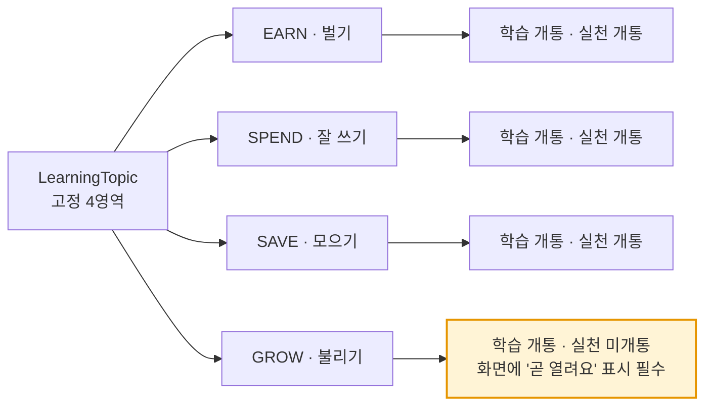
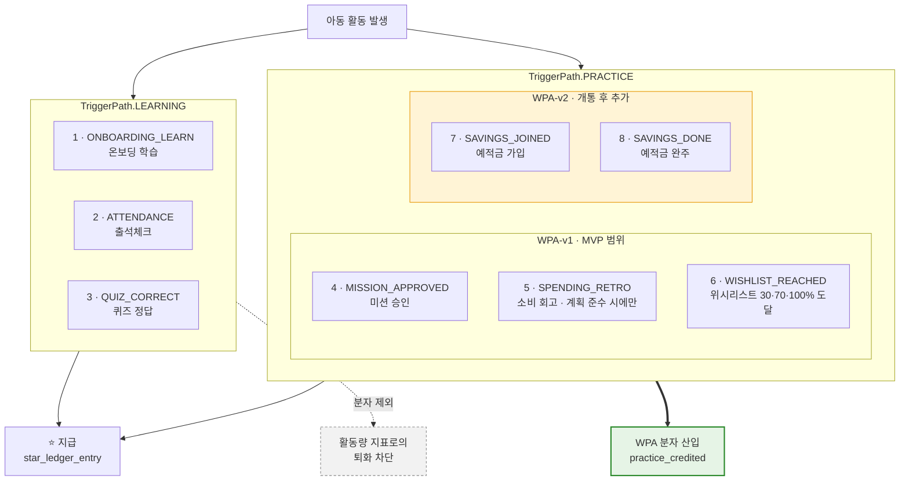
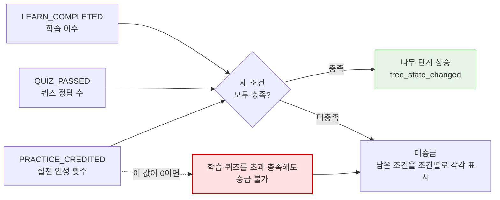
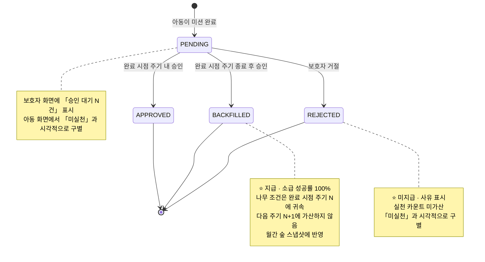
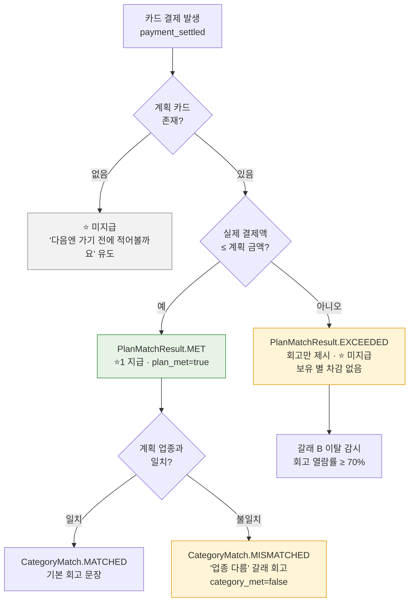
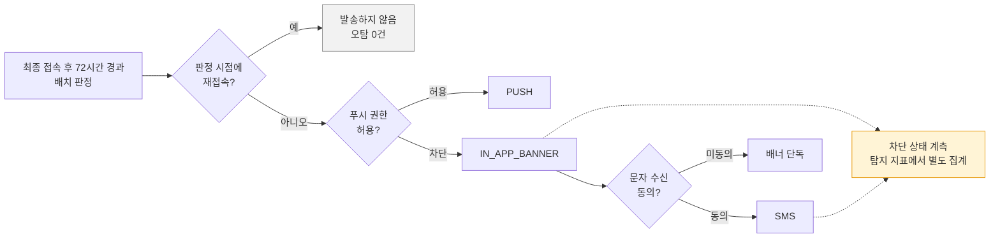
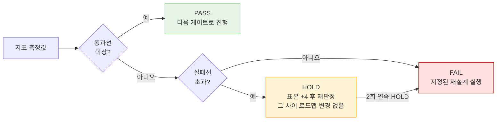
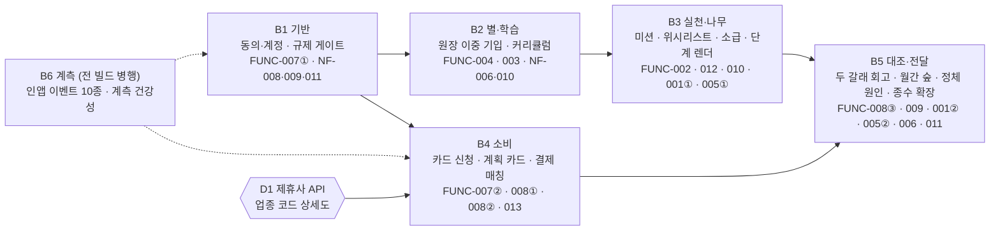
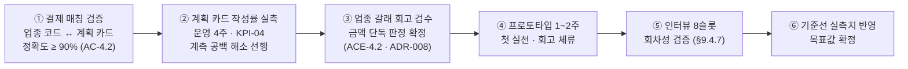

# [SRS 문서] FinFriends (한글)

# 소프트웨어 요구사항 명세서 (SRS)

**문서 ID:** SRS-FINFRIENDS-MVP-001

**개정 버전:** 1.0

**날짜:** 2026-08-24

**표준:** ISO/IEC/IEEE 29148:2018

**입력 문서:** `finfriends-prd-v1_0.md` (핀프렌즈 PRD v1.0 · 2026-08-24)

---

## 1. 서론

### 1.1 목적

본 문서는 ISO/IEC/IEEE 29148:2018 표준에 따라, **학습한 금융 지식을 실제 돈 행동으로 잇고 그 변화를 보호자가 읽을 수 있게 하는 아동 금융교육 플랫폼**의 요구사항을 정의한다.

본 시스템의 두 가지 가치 선언은 다음과 같으며, 모든 요구사항은 이 둘 중 하나에 귀속된다.

- **선언 ①** — 아이에게 **성장이 일어난다** (학습 → 실천)
- **선언 ②** — 그 성장이 보호자에게 **보인다** (실천 → 변화의 증거)

### 1.2 범위

- 4영역(벌기·잘 쓰기·모으기·불리기) **학습 커리큘럼 및 퀴즈**
- **실천 판정** — 미션 승인 · 소비 회고 · 위시리스트 달성의 3경로
- **별 지급 엔진** — 트리거 8종 · 차감형 · 주기 초기화 없음 · 저금통과 완전 분리
- **성장 나무 및 월간 숲** — 누적 수치가 아닌 **전월 대비 변화**를 제시하고, 정체 시 **원인을 조건 단위로** 표시
- **소비 계획 카드 및 계획↔실제 업종별 대조** — 결제 전 기록 + 결제 후 두 갈래 회고(지킴 ⭐1 / 넘김 회고만)
- **보호자 온보딩 및 법정대리인 동의 게이트** — 동의 완료가 아동 화면 진입의 선행 조건
- **승인 지연 시 ⭐ 소급 지급** 및 **아동 3일 미접속 알림**
- 제휴사 위탁 구조(선불업 B안) 기반 **아동 선불카드 충전·결제·해지**
- 인앱 이벤트 수집 10종 및 실시간 성과 집계

**명시적 범위 제외** — 아래는 누락이 아니라 **결정된 제외**이며, 근거는 §11 ADR에 있다.

| 제외 항목 | 근거 |
| --- | --- |
| **소비 순간 자동 개입**(위치 알림 · 사전 개입 트리거) | ADR-002 — 폐기된 기능이며 로드맵에도 없음. 사전 수단은 계획 카드가 대신함 |
| **위치정보 수집 일체** | ADR-002 — 요건을 회피한 것이 아니라 요건이 발생하지 않는 구조 |
| 앱 외부 현금(세뱃돈·친척 용돈) · 친구 기능 · 모의투자 · 미션 사진 인증 | 제품 범위 결정(v13 §11) |
| 아동 대상 유료 구독 | ADR-005 — 보호자·아동 모두 무료 |

> **본 문서의 구성** — §1~§7은 사내 표준 SRS 축약 양식을 따르며, §8~§13은 입력 PRD가 이미 보유한 내용 중 축약 양식으로 담기지 않는 것을 **ISO/IEC/IEEE 29148:2018의 해당 조항 구성에 따라 확장**한 절이다. 확장 절은 각 장 머리에 근거 조항을 명시한다.
>
> **확장 절 대응 조항** — §8 사용자 특성(9.6.6) · §9 검증(9.6.19) · §10 가정 및 의존성(9.6.8) · §11 설계 결정 근거(5.2.8) · §12 제약 사항(9.6.7) · §13 요구사항 배분 및 릴리스 계획(9.6.9)

### 1.3 정의, 약어, 축약어

| 용어 | 정의 |
| --- | --- |
| WPA | Weekly Practiced Active — 주간 실천 인정 아동 비율. 본 시스템의 북극성 지표 |
| 4영역 | 벌기 · 잘 쓰기 · 모으기 · 불리기. 학습·나무·실천이 공유하는 고정 분류 |
| 실천 트리거 | ⭐를 지급하는 8종 사건 중 **실천 경로**에 해당하는 것. MVP는 미션 승인·소비 회고·위시리스트 달성 3종 |
| 학습 경로 | 트리거 1(온보딩 학습)·2(출석체크)·3(퀴즈 정답). **WPA 분자에서 제외**됨 |
| 계획 카드 | 결제 **전에** 아동 또는 보호자가 적는 소비 계획(어디서·업종·얼마까지·무엇을) |
| 두 갈래 | 계획 준수 시 ⭐1 지급, 계획 초과 시 회고만 제시하고 ⭐ 미지급(보유 별 차감 없음) |
| 성장 나무 | 4영역 각각의 진행 단계를 보여주는 보호자 화면. 승급 조건은 학습·퀴즈·**실천** |
| 월간 숲 | 월 단위 스냅샷. **전월 대비 델타**를 제시하며 초기화되지 않고 누적 |
| 별 원장 | ⭐ 증감의 이중 기입 장부. 현금 전환 필드가 **존재하지 않음** |
| 소급 지급 | 보호자 승인이 지연돼도 아동의 완료 시점을 기준으로 ⭐를 지급하는 것 |
| 정체 | 특정 영역이 주기 시작 후 14일 이상 미상승한 상태 |
| 주기 | 나무 성장 조건의 집계 단위. 주기 종료 후 승인된 실천은 **완료 시점 주기에 귀속** |
| AC / AC-E | Acceptance Criteria(수용 기준) / Exception AC(예외·실패 경로 수용 기준) |
| PASS·HOLD·FAIL | 모든 지표·수용 기준의 3구간 판정. 통과선 이상 / 그 사이 / 실패선 이하 |
| `k/8` | 표본 8인 인터뷰 지표의 정수 판정 표기. 비율 표기를 쓰지 않음 |
| C_child | 아동 1인당 월 원가. 손익분기 항등식의 우변 |
| ADR | Architecture Decision Record — 결정·기각한 대안·서 있는 가설·뒤집히는 조건·대가의 기록 |
| MSCW | Must / Should / Could / Won't 우선순위 체계 |

---

## 2. 이해관계자

| 역할 | 이름 / 부서 | 책임 |
| --- | --- | --- |
| 제품기획 | 유림 / 기획팀 | 요구사항 확정 및 우선순위 결정 · 본 SRS 승인 |
| 정책·법령 | 병윤 / 기획팀 | 규제 상수(§4.2) 검증 · 법률 검토 과제 관리 |
| 경쟁·리뷰 | 하영 / 기획팀 | 대안 대비 벤치마크 · 경쟁사 분기 재점검 |
| 서비스분석 | 혜원 / 기획팀 | 지표 정의 · 측정 경로 설계 · 판정 운영 |
| 개발팀 리드 | 개발팀 | 설계 검토 및 승인 · 아키텍처 재검토 트리거 판정 |
| 개발 엔지니어 | 개발팀 | 구현 및 단위 테스트 |
| 개발 온콜 | 개발팀 | 규제·정합성·보안 알림 1차 수신 및 30분 내 확인 |
| 제품 담당 | 기획팀 | 북극성·실천·인정 지표 감시 및 주간 리뷰 |
| 콘텐츠 담당 | 기획팀 | 학습 원고 · 회고 문장 풀 관리 및 확장 |
| 사업 담당 | 사업팀 | 제휴 계약 조건 · 수수료율 · 원가 감시 |

---

## 3. 시스템 맥락 및 인터페이스

- **클라이언트 애플리케이션**
    1. **보호자 화면** — 성장 나무 · 월간 숲 · 승인 대기 · 소비 내역 · 온보딩·동의
    2. **아동 화면** — 학습·퀴즈 · 아바타·옷장 · 계획 카드 · 회고 · 위시리스트
    3. 두 화면은 **동일 앱 내에서 분리**되며, 아동 화면 진입은 **보호자 동의 완료를 선행 조건**으로 한다
- **내부 서비스**
    - Learning Service : 4영역 커리큘럼 · 퀴즈 · 이수 판정
    - Practice Service : 실천 판정(미션 승인 · 소비 회고 · 위시리스트) · 소급 지급
    - Star Ledger Service : ⭐ 증감 이중 기입 · 멱등 처리 · 일일 정산
    - Growth Service : 성장 나무 단계·조건 · 정체 판정 · 월간 숲 스냅샷
    - Plan & Spending Service : 계획 카드 · 결제 매칭 · 두 갈래 회고 · 업종별 집계
    - Notification Service : 3일 미접속 판정 · 채널 분기 · 발송 시간대 조정
    - Event Collector : 인앱 이벤트 10종 적재 · 오프라인 보정 · 지표 배치
- **외부 시스템**
    - **제휴사(선불업 등록 보유)** — 선불전자지급수단 발행·관리 · 카드 발행 · 가맹점망 · 결제 원장 · 충전·해지
    - 본인인증 서비스 — 보호자 실명 확인
    - 푸시 알림 인프라 — 미접속 알림 및 승인 알림

> **경계** — 브랜드·앱·학습·실천 판정 로직은 본 시스템이, 선불전자지급수단 발행·충전금 별도관리·카드 발행·가맹점망은 제휴사가 담당한다. **이용한도와 업종 제한은 제휴사 정책에 종속**되며 본 시스템이 정할 수 없다.

---

## 4. 구체적 요구사항

### 4.1 기능 요구사항

| ID | 제목 | 출처 | 우선순위 | 유형 | 검증 방식 | 인수 기준 | 상태 | 담당자 |
| --- | --- | --- | --- | --- | --- | --- | --- | --- |
| **REQ-FUNC-001** | 성장 나무 — 4영역 단계 표시 및 정체 원인 제시 | PRD §4-1 F1 | Must Have | Functional | 1) 화면 검수<br>2) 인터뷰 5초 회상 테스트<br>3) 열람률 계측 | 4영역 각각의 진행 단계와 **실천 근거를 기본 노출**해야 한다. 특정 영역이 14일 이상 미상승하면 **미충족 조건을 조건 단위로 전부 표시**하고, 가장 적게 남은 조건을 최상단에 둔다 | Proposed | 개발 엔지니어 |
| **REQ-FUNC-002** | 미션 루프 — 조건·금액 사전 설정, 승인, ⭐1 지급 | PRD §4-1 F2 | Must Have | Functional | 1) 미션 CRUD 테스트<br>2) 승인 상태 전이 테스트<br>3) QA 검증 | 보호자는 미션 조건과 금액을 **사전 설정**할 수 있어야 하며, 승인 시 ⭐1이 지급되고 실천 카운트에 가산되어야 한다. **거절 시 ⭐ 미지급 + 사유 표시**하며 「미실천」과 시각적으로 구별한다 | Proposed | 개발 엔지니어 |
| **REQ-FUNC-003** | 학습 커리큘럼 4영역 및 퀴즈 | PRD §4-1 F3 | Must Have | Functional | 1) 이수 판정 테스트<br>2) 콘텐츠 검수<br>3) QA 검증 | 4영역 전부가 금융 주제여야 하며, 각 영역의 학습 이수와 퀴즈 정답 수가 나무 승급 조건의 입력으로 기록되어야 한다 | Proposed | 개발 엔지니어 |
| **REQ-FUNC-004** | 별 지급 엔진 — 트리거 8종 · 차감형 · 초기화 없음 | PRD §4-1 F4 | Must Have | Functional | 1) 트리거별 지급 테스트<br>2) 멱등성 테스트<br>3) 원장 이중 기입 감사 | 트리거 8종에 대해 ⭐ 증감을 **이중 기입**해야 한다. 별은 **차감형**이며 주기 초기화가 없고, **현금 전환·양도·거래 경로가 존재하지 않아야** 한다 | Proposed | 개발 엔지니어 |
| **REQ-FUNC-005** | 아바타 및 옷장 | PRD §4-1 F5 | Must Have | Functional | 1) 별 잔액 연동 테스트<br>2) 에셋 검수 | 아동은 보유 ⭐로 사전 제작된 아바타 아이템을 교환할 수 있어야 하며, 교환 시 별 원장에 차감이 기입되어야 한다 | Proposed | 개발 엔지니어 |
| **REQ-FUNC-006** | 아동 온보딩 — 학습 → 퀴즈 → ⭐1 → 아이템 제시 | PRD §4-1 F6 | Should Have | Functional | 1) 퍼널 계측<br>2) 화면 검수 | 첫 보상 루프가 **5분 이내**에 닫혀야 한다. 보호자 동의 미완 상태에서는 진입이 차단되어야 한다 | Proposed | 개발 엔지니어 |
| **REQ-FUNC-007** | 보호자 온보딩 5단계 및 법정대리인 동의 | PRD §4-1 F7 | Must Have | Functional | 1) 단계 재개 테스트<br>2) 동의 게이트 자동 테스트<br>3) 외부 API 실패 시나리오 | 온보딩은 **세션 분할이 가능**해야 하며 재진입 시 재입력 항목이 0건이어야 한다. **동의 단계는 캐시하지 않고 세션 만료 시 재확인**한다. 카드 신청 단계 외부 API 실패 시 입력값을 **24시간 보존**한다 | Proposed | 개발 엔지니어 |
| **REQ-FUNC-008** | 소비 계획 카드 및 계획↔실제 업종별 대조 | PRD §4-1 F8 | Must Have | Functional | 1) 결제 매칭 정확도 대조<br>2) 두 갈래 분기 테스트<br>3) 작성률 계측 | 계획 카드는 **어디서·업종·얼마까지**를 필수로 받고 업종은 **카드 승인 데이터의 업종 코드와 대조 가능한 값**으로 기록되어야 한다. 결제 발생 시 자동 매칭하며 **매칭 정확도 ≥ 90%**. 계획 카드가 없는 결제는 **⭐를 지급하지 않고** 작성 유도를 노출한다 | Proposed | 개발 엔지니어 |
| **REQ-FUNC-009** | 월간 숲 — 전월 대비 변화 제시 | PRD §4-1 F9 | Must Have | Functional | 1) 델타 산출 테스트<br>2) 인터뷰 지목 테스트<br>3) 화면 검수 | 전월 대비 **변화 항목을 7개 이상** 렌더해야 한다. 전월 데이터가 없으면 **델타 0으로 렌더하지 않고** 「다음 달부터 비교할 수 있어요」로 대체한다. **이번 달 획득 별이 스크롤 없이 노출**되어야 한다 | Proposed | 개발 엔지니어 |
| **REQ-FUNC-010** | 승인 지연 시 ⭐ 소급 지급 및 대기 건수 표시 | PRD §4-1 F10 | Should Have | Functional | 1) 소급 시나리오 테스트<br>2) 주기 귀속 테스트<br>3) 화면 검수 | 승인이 지연돼도 **완료 시점 기준으로 ⭐가 소급 지급**되어야 하며 성공률 **100%**. 완료 시점 주기가 종료된 경우 **⭐는 지급하되 나무 조건은 완료 시점 주기에 귀속**하고 다음 주기 나무에 가산하지 않는다. 보호자 화면에 **「승인 대기 N건」**을 표시한다 | Proposed | 개발 엔지니어 |
| **REQ-FUNC-011** | 아동 3일 미접속 알림 | PRD §4-1 F11 | Should Have | Functional | 1) 배치 판정 테스트<br>2) 오탐 테스트<br>3) 채널 분기 테스트 | 최종 접속 후 **72시간 경과 시 보호자에게 발송률 100%**. 알림에 **아동이 멈춘 지점(영역·조건)을 함께 표시**한다. 71시간 시점 재접속 시 **오탐 발송 0건**. 푸시 차단 시 앱 내 배너 또는 문자로 대체 발송하고 차단 상태를 별도 집계한다 | Proposed | 개발 엔지니어 |
| **REQ-FUNC-012** | 위시리스트 — 30·70·100% 단계 보상 | PRD §4-1 F12 | Should Have | Functional | 1) 단계 도달 테스트<br>2) QA 검증 | 목표 금액 대비 30·70·100% 도달 시 각각 ⭐1을 지급하고, 해당 지급을 **실천 트리거로 계상**해야 한다 | Proposed | 개발 엔지니어 |
| **REQ-FUNC-013** | 소비 내역 — 전월 대비 증감액 및 업종별 집계 | PRD §4-1 F13 | Should Have | Functional | 1) 집계 정확성 테스트<br>2) 화면 검수 | **전월 대비 증감액을 화면 상단**에 두고, 계획 카드가 수집한 업종 기준으로 집계해야 한다 | Proposed | 서비스 운영자 |
| **REQ-FUNC-014** | 예적금 비교·선택 | PRD §4-1 F15 | Could Have | Functional | 1) 법률 검토 통과<br>2) 중개 경로 부재 검증 | **비교·선택 경험까지만** 제공하고 **가입 중개를 수행하지 않아야** 한다. 가입 ⭐1 · 완주 ⭐10. **법률 검토 통과 전 착수 불가** | Proposed | 정책·법령 |
| **REQ-FUNC-015** | 카드 없이 학습부터 시작하는 체험 경로 | PRD §4-1 F16 | Could Have | Functional | 1) 잠금 분기 테스트<br>2) 화면 검수 | 카드 배송 대기 중에도 **학습·퀴즈·별 획득이 가능**해야 하며, 카드가 필요한 기능만 잠기고 잠금 사유가 표시되어야 한다 | Proposed | 개발 엔지니어 |
| **REQ-FUNC-016** | 별의 옷장 외 목적지 | PRD §4-1 F17 | Could Have | Functional | 1) 현금 분리선 재검토 통과<br>2) 전환 경로 부재 검증 | 별의 사용처를 확장하되 **현금·저금통과의 분리선을 침범하지 않아야** 한다. 분리선 재검토 전 착수 불가 | Proposed | 정책·법령 |
| **REQ-FUNC-017** | 기존 앱 기록 이전 / 병행 사용 | PRD §4-1 F18 | Won't Have | Functional | — | 본 릴리즈에서 구현하지 않는다. 획득 메시지를 「이전」이 아니라 **「지금부터」** 프레임으로 제시하여 부재를 결함으로 오인하지 않게 한다 | Deferred | 제품기획 |

**우선순위 집계** — Must Have **8** · Should Have **5** · Could Have **3** · Won't Have **1** = **17건**

### 4.2 비기능 요구사항

| ID | 제목 | 출처 | 우선순위 | 유형 | 검증 방식 | 인수 기준 | 상태 | 담당자 |
| --- | --- | --- | --- | --- | --- | --- | --- | --- |
| **REQ-NF-001** | 화면 렌더 응답 시간 | PRD §5-2 | Must Have | Performance | 진입~첫 페인트 p95 주간 계측 | 성장 나무 **p95 ≤ 1,250 ms** · 월간 숲 **p95 ≤ 2,000 ms**. 각 값은 §9의 수용 기준에서 역산한 상한이며 **초과 시 해당 수용 기준이 성립하지 않는다** | Proposed | 시스템 운영자 |
| **REQ-NF-002** | ⭐ 지급 반영 지연 | PRD §5-2 | Must Have | Performance | 지급 확정~화면 반영 p95 일간 계측 | **p95 ≤ 800 ms** — 실천 완료와 동일 세션 내 반영이 전제이므로 1초 내 체감이 요구된다 | Proposed | 시스템 운영자 |
| **REQ-NF-003** | 오프라인 재연결 후 반영 | PRD §5-2 | Must Have | Reliability | 재연결~반영 p95 일간 계측 | **≤ 60초** 내 반영되어야 하며, **⭐ 중복 지급 0건**(멱등 키)이고 주차 귀속은 **`client_ts` 기준**이어야 한다 | Proposed | 개발 엔지니어 |
| **REQ-NF-004** | 월 가용성 | PRD §5-2 | Must Have | Reliability | 5분 단위 프로브 · 월간 집계 | **≥ 99.0%**. 본 시스템의 가용성 목표는 **제휴사 SLA를 초과할 수 없으므로**, 제휴사 SLA 확인 후 `min(자체 목표, 제휴사 SLA)`로 갱신한다 | Proposed | 사업 담당 |
| **REQ-NF-005** | API 오류율 | PRD §5-2 | Should Have | Reliability | (5xx + 타임아웃) / 전체 요청 · 일간 | **≤ 0.5%**. **3일 연속 초과 시 원인 특정 전까지 릴리즈를 중단**한다 | Proposed | 개발 담당 |
| **REQ-NF-006** | 별 원장 정합성 | PRD §5-2 | Must Have | Reliability | 이중 기입 대조 + 일일 정산 배치 diff | **오류율 0% — 협상 불가.** 아동이 모은 것을 잃는 경험이므로 허용 오차가 없다. 불일치 1건 이상 시 30분 내 확인, 1시간 내 원인 특정 | Proposed | 개발 온콜 |
| **REQ-NF-007** | ⭐ 소급 지급 성공률 | PRD §5-2 | Must Have | Reliability | 자동 테스트 + 상태 전이 로그 | **100% — 협상 불가.** 보호자의 지연이 아동의 실패로 기록되어서는 안 된다 | Proposed | 개발 엔지니어 |
| **REQ-NF-008** | 법정대리인 동의 게이트 | PRD §5-1 P-05·P-22 | Must Have | Compliance | 동의 미완 상태 진입 시도 자동 테스트 | 동의 완료 전 아동 화면 진입을 **100% 차단**해야 한다. 아동 온보딩은 첫 화면부터 개인정보 처리가 시작되므로 **순서 자체가 규제 요건**이다. 차단 이벤트 발생 시 **즉시 알림** | Proposed | 정책·법령 |
| **REQ-NF-009** | 아동 데이터 최소 수집 | PRD §5-1 P-13·P-19 · §5-3 | Must Have | Compliance | 스키마 스캔(일 1회 + 배포 시) · 패킷 검사 | **위치 좌표 필드 0건 · 얼굴 이미지 필드 0건.** 위치정보를 수집하지 않으므로 위치정보 관련 동의 요건이 **발생하지 않는 구조**여야 한다. 학습·실천 데이터는 아동 식별정보와 **분리 저장**하고 결합 조회 0건 | Proposed | 정책·법령 |
| **REQ-NF-010** | 별과 저금통의 완전 분리 | PRD §5-1 P-01·P-21 | Must Have | Compliance | 정적 분석(CI 게이트) + 전환 경로 부재 감사 | 별↔저금통 **전환 경로를 코드에 두지 않아야** 한다. 기능 플래그로 막는 방식은 허용되지 않으며, 전환 함수·API 심볼이 검출되면 **빌드를 실패**시킨다 | Proposed | 개발 담당 |
| **REQ-NF-011** | 아동 계정 종속성 | PRD §5-3 | Must Have | Security | 인증 로그 감사(일 1회) | 아동 계정은 **보호자 계정에 종속**되어야 하며 **독립 로그인 시도 0건**. 외부 공유·친구 기능을 제공하지 않는다 | Proposed | 개발 온콜 |
| **REQ-NF-012** | 금융상품 중개 회피 | PRD §5-1 P-20 | Must Have | Compliance | 구현 전 법률 검토 통과 | 예적금 **가입 중개를 수행하지 않아야** 한다. 검토 미통과 시 REQ-FUNC-014는 착수하지 않는다 | Proposed | 정책·법령 |
| **REQ-NF-013** | 해지 시 전액 환불 | PRD §5-1 P-11 | Must Have | Compliance | 해지 플로우 테스트 | 해지 시 잔액이 **전액 환불**되어야 한다 | Proposed | 사업 담당 |
| **REQ-NF-014** | 아동용 알기 쉬운 고지 | PRD §5-1 P-12 | Must Have | Usability | 문구 검수 + 아동 이해도 확인 세션 | 4영역 명칭은 보호자·아동에게 **동일**하게 제시하고, 「알기 쉬운 언어」는 **한 줄 설명**이 담당해야 한다 | Proposed | 콘텐츠 담당 |
| **REQ-NF-015** | 제휴사 정책 종속 명시 | PRD §5-1 P-17·P-18 · F-01 | Must Have | Design Constraint | 제휴 계약서 확인 · 아키텍처 리뷰 | 카드 **한도·업종 제한은 제휴사 정책에 종속**되며 본 시스템이 정하지 않는다. 만 14세 미만은 마이데이터 가입이 불가하므로 **표준 오픈뱅킹 연동을 전제하지 않고 자체 카드 발급 + 폐쇄형 수집** 구조여야 한다 | Proposed | 사업 담당 |
| **REQ-NF-016** | 아동 1인당 월 원가 관리 | PRD §5-4 | Should Have | Cost | 월간 원가 집계 · 청구서 대조 | 손익분기 항등식 **`월 결제액 × 수수료율 ≥ C_child`** 를 만족해야 한다. 수수료율 확정 전에는 **우변(원가)만 선행 관리**하며, 클라우드 비용 전월 대비 **+30% 초과** 또는 본인인증 호출 **> 1.2회/온보딩 건** 시 알림. 3D 에셋은 **사양 확정 전 제작 착수를 금지**한다 | Proposed | 사업 담당 |
| **REQ-NF-017** | 운영 모니터링 및 대응 SLA | PRD §5-5 | Must Have | Operability | 알림 발송·수신·에스컬레이션 리허설 | 모든 감시 항목에 **계산식 · 알림 기준 · 수신자 · 대응 SLA · 에스컬레이션**이 정의되어야 한다. 규제·정합성·보안 계층은 **1건 이상 발생 시 즉시 알림 · 30분 내 확인**이며, 2시간 미해결 시 서비스 일시 중단으로 에스컬레이션한다 | Proposed | 개발 온콜 |
| **REQ-NF-018** | 확장성 — 트리거·영역·문구 풀 확장 | PRD §5-2 · §4-1 | Could Have | Maintainability | 코드 리뷰 · 확장 시나리오 테스트 | 실천 트리거 추가(WPA-v1 → v2), 회고 문장 풀 확장, 알림 채널 추가 시 **열거형 확장만으로 처리**되어 분기 로직 변경이 최소화되어야 한다 | Proposed | 개발 엔지니어 |

---

## 5. 추적성 매트릭스

| 요구사항 ID | 모듈 | 구현 클래스 | 테스트 케이스 ID |
| --- | --- | --- | --- |
| REQ-FUNC-001 | Growth Service | GrowthTreeRenderer · StallReasonResolver | TC-FUNC-001 |
| REQ-FUNC-002 | Practice Service | MissionApprovalService | TC-FUNC-002 |
| REQ-FUNC-003 | Learning Service | CurriculumService · QuizEvaluator | TC-FUNC-003 |
| REQ-FUNC-004 | Star Ledger Service | StarLedgerEngine · TriggerDispatcher | TC-FUNC-004 |
| REQ-FUNC-005 | Star Ledger Service | AvatarWardrobeService | TC-FUNC-005 |
| REQ-FUNC-006 | Learning Service | ChildOnboardingFlow | TC-FUNC-006 |
| REQ-FUNC-007 | Consent & Account | ConsentGateService · OnboardingStepStore | TC-FUNC-007 |
| REQ-FUNC-008 | Plan & Spending Service | PlanCardService · PaymentMatcher · RetroBrancher | TC-FUNC-008 |
| REQ-FUNC-009 | Growth Service | MonthlyForestSnapshot · DeltaCalculator | TC-FUNC-009 |
| REQ-FUNC-010 | Practice Service | BackfillGrantService · CycleAttributionResolver | TC-FUNC-010 |
| REQ-FUNC-011 | Notification Service | InactivityDetector · ChannelFallbackRouter | TC-FUNC-011 |
| REQ-FUNC-012 | Practice Service | WishlistTracker | TC-FUNC-012 |
| REQ-FUNC-013 | Plan & Spending Service | SpendingLedgerView · CategoryAggregator | TC-FUNC-013 |
| REQ-FUNC-014 | Learning Service | SavingsCompareService | TC-FUNC-014 |
| REQ-FUNC-015 | Consent & Account | TrialPathRouter | TC-FUNC-015 |
| REQ-FUNC-016 | Star Ledger Service | StarRedemptionService | TC-FUNC-016 |
| REQ-FUNC-017 | — *(본 릴리즈 미구현)* | — | — |
| REQ-NF-001 | Growth Service | RenderLatencyMonitor | TC-NF-001 |
| REQ-NF-002 | Star Ledger Service | GrantLatencyMonitor | TC-NF-002 |
| REQ-NF-003 | Event Collector | OfflineReplayHandler · IdempotencyGuard | TC-NF-003 |
| REQ-NF-004 | Platform | AvailabilityProbe | TC-NF-004 |
| REQ-NF-005 | Platform | ErrorRateMonitor | TC-NF-005 |
| REQ-NF-006 | Star Ledger Service | LedgerReconciliationBatch | TC-NF-006 |
| REQ-NF-007 | Practice Service | BackfillGrantService | TC-NF-007 |
| REQ-NF-008 | Consent & Account | ConsentGateService · ConsentBlockAuditor | TC-NF-008 |
| REQ-NF-009 | Platform | SchemaScanner · PiiSeparationAuditor | TC-NF-009 |
| REQ-NF-010 | Star Ledger Service | ConversionPathStaticCheck *(CI 게이트)* | TC-NF-010 |
| REQ-NF-011 | Consent & Account | ChildSessionGuard | TC-NF-011 |
| REQ-NF-012 | Learning Service | SavingsCompareService *(중개 경로 부재 검증)* | TC-NF-012 |
| REQ-NF-013 | Partner Gateway | RefundService | TC-NF-013 |
| REQ-NF-014 | 전 서비스 | CopyReviewChecklist | TC-NF-014 |
| REQ-NF-015 | Partner Gateway | PartnerPolicyAdapter | TC-NF-015 |
| REQ-NF-016 | Platform | CostAggregator | TC-NF-016 |
| REQ-NF-017 | Platform | AlertRouter · EscalationPolicy | TC-NF-017 |
| REQ-NF-018 | 전 서비스 | *(열거형 확장 규약)* | TC-NF-018 |

---

## 6. 부록

### 6.1 인터페이스 목록

> 본 시스템은 공개 REST API를 제공하지 않는다. 외부 경계는 **제휴사 인터페이스**이며, 내부 계측 경계는 **인앱 이벤트**이다.

| 인터페이스 구분 | 방향 | 명칭 | 설명 |
| --- | --- | --- | --- |
| **제휴사 (선불업)** | 요청 | 충전 요청 | 입력: 보호자_id · 금액 / 출력: 충전 결과 · 잔액. **한도는 제휴사 정책 종속** |
| **제휴사 (선불업)** | 조회 | 결제 내역 조회 | 입력: 아동 카드 id · 기간 / 출력: 거래 목록(시각 · 금액 · 가맹점 분류). 🔴 **업종 코드 상세도가 계획 대조 정확도를 좌우** |
| **제휴사 (선불업)** | 요청 | 해지·환불 | 입력: 아동 카드 id / 출력: 환불 결과. **전액 환불 필수** |
| **제휴사 (선불업)** | 요청 | 카드 발급 신청 | 보호자 온보딩 4~5단계에서 호출. 실패 시 입력값 24시간 보존 |
| **본인인증** | 요청 | 보호자 실명 확인 | 온보딩 건당 호출 1회 기준, **1.2회 초과 시 알림** |
| **인앱 이벤트** | 적재 | `practice_credited` | 실천 트리거로 ⭐ 지급 확정. **WPA 산출의 원천** |
| **인앱 이벤트** | 적재 | `star_ledger_entry` | 별 증감 확정 · 멱등 키 포함 · 정합성 감사 입력 |
| **인앱 이벤트** | 적재 | `tree_state_changed` | 나무 단계·조건 갱신 · 정체 일수 산출 |
| **인앱 이벤트** | 적재 | `tree_view_opened` | 보호자 나무 진입 · 실천 근거·정체 원인 열람 여부 |
| **인앱 이벤트** | 적재 | `forest_view_opened` | 보호자 숲 진입 · 렌더된 델타 항목 수 · 체류 시간 |
| **인앱 이벤트** | 적재 | `retro_viewed` | 회고 진입~이탈 · 계획 준수 여부 · ⭐ 지급 여부 · 업종 일치 여부 |
| **인앱 이벤트** | 적재 | `approval_state_changed` | 승인/거절/소급 · 지연 시간 · 귀속 주기 |
| **인앱 이벤트** | 적재 | `inactivity_notified` | 미접속 알림 발송·열람 |
| **인앱 이벤트** | 적재 | `onboarding_step` | 온보딩 단계 진입/완료/이탈 · 재개 여부 |
| **인앱 이벤트** | 적재 | `consent_gate_blocked` | 동의 미완 진입 차단 — **1건 이상 시 즉시 규제 알림** |

> **적재 규칙** — 모든 이벤트에 `idempotency_key`(중복 방지)와 `client_ts` / `server_ts`(오프라인 보정)를 필수로 둔다. **오프라인 발생 이벤트는 `client_ts` 기준으로 주차에 귀속**한다.

### 6.2 데이터 모델 정의

> 값의 **정의**는 표로, 값 사이의 **관계 · 상태 전이 · 판정 순서**는 다이어그램으로 제시한다.
> 열거형 상수명은 구현 식별자이며, 괄호 안 한글은 화면 표기가 아니라 의미 설명이다.

#### 6.2.1 학습 영역 — `LearningTopic`

학습 · 나무 · 실천이 공유하는 **고정 4영역**이다. 영역을 늘리거나 줄이면 세 곳이 함께 바뀐다.



| 상수 | 의미 | 실천 경로 | 근거 |
| --- | --- | :-: | --- |
| `EARN` | 노동 · 미션을 통한 획득 | 개통 | REQ-FUNC-002 |
| `SPEND` | 계획과 실제의 대조 | 개통 | REQ-FUNC-008 |
| `SAVE` | 목표 기반 저축 | 개통 | REQ-FUNC-012 |
| `GROW` | 예적금 비교 · 선택 | **미개통** | REQ-FUNC-014가 Could Have이며 법률 검토 대기 |

#### 6.2.2 ⭐ 지급 트리거 — `StarTrigger` · `TriggerPath`

경로 구분이 **북극성 지표 산출의 기준**이다. 학습 경로를 분자에 넣으면 *접속만으로 실천 지표가 오르는* 활동량 지표로 퇴화한다.



| 코드 | 상수 | 경로 | 의미 | WPA 분자 |
| :-: | --- | :-: | --- | :-: |
| 1 | `ONBOARDING_LEARN` | LEARNING | 온보딩 학습 | 제외 |
| 2 | `ATTENDANCE` | LEARNING | 출석체크 | 제외 |
| 3 | `QUIZ_CORRECT` | LEARNING | 퀴즈 정답 | 제외 |
| 4 | `MISSION_APPROVED` | PRACTICE | 미션 승인 | **v1 산입** |
| 5 | `SPENDING_RETRO` | PRACTICE | 소비 회고 — **계획 준수 시에만** | **v1 산입** |
| 6 | `WISHLIST_REACHED` | PRACTICE | 위시리스트 30 · 70 · 100% 도달 | **v1 산입** |
| 7 | `SAVINGS_JOINED` | PRACTICE | 예적금 가입 | v2 산입 |
| 8 | `SAVINGS_DONE` | PRACTICE | 예적금 완주 | v2 산입 |

> **v1 → v2 전환 시** 시계열을 단절 표기하고 전환 후 4주간 두 값을 병기한다(§7.1).

#### 6.2.3 나무 승급 조건 — `TreeCondition`

세 조건의 **논리곱**이며, 실천 조건이 0이면 나머지 둘을 초과 충족해도 승급하지 않는다.



> 이 구조가 ADR-006의 구현체다. 실천을 **가중치가 아니라 필수 조건**으로 둔 이유는, 가중치로 두면 학습량으로 상쇄돼 「실천 0건 최고 단계」가 가능해지기 때문이다.

#### 6.2.4 미션 승인 상태 — `ApprovalState`

`BACKFILLED`는 **⭐는 지급하되 나무 조건은 완료 시점 주기에 귀속**되는 상태다 — 이 분기가 없으면 지연 승인이 다음 주기 나무를 부풀린다.



#### 6.2.5 계획↔실제 대조 — `PlanMatchResult` · `CategoryMatch`

⭐ 판정은 **금액 단독**이다. 업종 일치는 회고 문장을 분기하는 관측 항목이며 ⭐를 차단하지 않는다(ADR-008).



| 열거형 | 상수 | ⭐ 지급 | 의미 |
| --- | --- | :-: | --- |
| `PlanMatchResult` | `MET` | **지급** | 계획 준수 — `plan_met=true` |
| `PlanMatchResult` | `EXCEEDED` | 미지급 | 계획 초과 — 회고만 제시, **보유 별 차감 없음** |
| `CategoryMatch` | `MATCHED` | *(무관)* | 계획 업종과 일치 |
| `CategoryMatch` | `MISMATCHED` | *(무관)* | 계획 업종과 불일치 — 회고 분기 대상, **⭐를 차단하지 않음** |

#### 6.2.6 알림 채널 — `NotificationChannel`

푸시 차단 시 폴백하며, **차단 계정은 탐지 지표 산출에서 별도 집계**한다.



#### 6.2.7 판정 구간 — `Verdict`

모든 지표 · 수용 기준 · 실험에 공통 적용한다. 판정 임계치는 §9.1에 있다.



#### 6.2.8 인앱 이벤트 — `EventType`

값 사이에 관계나 전이가 없는 **평면 열거형**이므로 표로 정의한다. 각 이벤트의 필드와 산출 지표는 §6.1에 있다.

| 상수 | 생산 서비스 | 주 용도 |
| --- | --- | --- |
| `PRACTICE_CREDITED` | Practice Service | **WPA 분자** · 첫 실천 인정률 |
| `STAR_LEDGER_ENTRY` | Star Ledger Service | 정합성 감사 · 멱등 검증 |
| `TREE_STATE_CHANGED` | Growth Service | 승급 이력 · 정체 일수 |
| `TREE_VIEW_OPENED` | Growth Service | 실천 근거 · 정체 원인 열람률 |
| `FOREST_VIEW_OPENED` | Growth Service | 보호자 확인 시간 · 델타 항목 수 |
| `RETRO_VIEWED` | Plan & Spending Service | 회고 체류 · 갈래별 열람률 · 업종 일치 분포 |
| `APPROVAL_STATE_CHANGED` | Practice Service | 소급 성공률 · 승인 지연 분포 |
| `INACTIVITY_NOTIFIED` | Notification Service | 탐지 일수 · 채널별 발송·열람률 |
| `ONBOARDING_STEP` | Consent & Account | 온보딩 퍼널 · 단계 이탈률 |
| `CONSENT_GATE_BLOCKED` | Consent & Account | **규제 알림 — 1건 이상 시 즉시** |

### 6.3 `비즈니스` 규칙 요약

1. **동의 선행**: 법정대리인 동의가 완료되기 전에는 아동 화면에 진입할 수 없다. 동의는 캐시하지 않으며 세션 만료 시 재확인한다
2. **실천 필수 승급**: 나무 승급은 학습·퀴즈·실천 세 조건을 모두 요구하며, **실천 0건이면 학습·퀴즈를 초과 충족해도 승급하지 않는다**
3. **경로 분리 집계**: ⭐ 트리거 중 학습 경로(1·2·3)는 WPA 분자에서 제외한다 — 접속만으로 실천 지표가 오르는 것을 차단하기 위함
4. **별의 불가역성**: 별은 차감형이며 주기 초기화가 없고, 현금 충전·환급·양도·거래 경로가 **코드에 존재하지 않는다**
5. **두 갈래 회고**: 실제 결제액이 계획 금액 이하면 ⭐1을 지급하고, 초과하면 회고 문장만 제시하며 ⭐를 지급하지 않는다. **어느 경우에도 보유 별을 차감하지 않는다**
6. **금액 단독 판정**: 계획↔실제 판정은 금액 기준으로만 하며, 업종 불일치는 회고 문장을 분기하되 ⭐를 차단하지 않는다
7. **계획 없는 소비**: 계획 카드가 없는 결제는 대조 화면을 만들지 않고 작성 유도를 노출하며 ⭐를 지급하지 않는다
8. **소급 귀속**: 승인이 지연돼도 ⭐는 완료 시점 기준으로 지급한다. 완료 시점 주기가 종료됐으면 **나무 조건은 그 주기에 귀속**하고 다음 주기에 가산하지 않으며, 월간 숲 스냅샷에 반영한다
9. **정체 판정 유예**: 정체는 **주기 시작 후 14일이 경과한 건에만** 적용한다. 주기 초기화 직후 미충족 상태를 정체로 표시하지 않는다
10. **회고 문장 비복원**: 회고 문장은 풀에서 비복원 추출하며, 잔여 20% 이하 시 운영 알림을 발송하고 재사용 전에 풀 확장을 요구한다
11. **빈 화면 처리**: 실천 기록 0건 또는 전월 데이터 부재 시 **델타 0으로 렌더하지 않고** 안내 문구로 대체한다 — 빈 화면이 앱 결함이나 아동의 태만으로 오독되는 경로를 차단한다
12. **오탐 금지**: 미접속 알림은 72시간 판정 시점에 재접속이 확인되면 발송하지 않는다

### 6.4 데이터베이스 스키마 개요

```sql
-- 핵심 테이블 요약
guardian_accounts        -- 보호자 계정 · 법정대리인 동의 상태/일시 · 알림 시간대
child_accounts           -- 아동 계정 · 보호자 종속 · 생년 · 기기 유형(모집 분류 전용)
learning_progress        -- 4영역별 학습 이수 · 퀴즈 정답 수
practice_credits         -- 실천 판정 원장 (WPA 산출의 원천) · 판정 방식 · 승인 지연 시간
star_ledger              -- 별 증감 이중 기입 · 트리거 코드 · 잔액 · 멱등 키 (현금 전환 필드 없음)
tree_states              -- 영역별 단계 · 조건 충족 · 주기 시작일 · 정체 일수
forest_snapshots         -- 월간 스냅샷 · 전월 대비 델타 · 총 획득 별 (누적, 초기화 없음)
plan_cards               -- 계획 카드 (어디서 · 업종 · 금액 상한 · 품목)
spending_records         -- 결제 원장 대조 · 계획 매칭 결과 · 업종 일치 여부 · 회고 문장 id
wishlists                -- 목표 금액 · 단계 도달(30·70·100%) 이력
app_events               -- 인앱 이벤트 10종 (대용량 · 주차 파티셔닝 · client_ts 귀속)
```

---

## 7. 향후 개선 사항

현재 MVP는 **결정론적 실천 판정**과 **결제 후 대조**에 초점을 둔다. 다음은 향후 판본에서 계획된 확장이며, 각 항목의 **릴리스 배분과 착수 조건은 §13.2**에 있다.

### 7.1 WPA-v2 전환 — 「불리기」 실천 경로 개통

- REQ-FUNC-014(예적금 비교·선택)를 개통하고 실천 트리거를 **3종 → 5종**으로 확장
- 선행 조건: 금융상품 중개업 해당 여부에 대한 **법률 검토 통과**(REQ-NF-012)
- 전환 시 **시계열을 단절 표기**하고 전환 후 4주간 WPA-v1·v2를 **병기**한다

### 7.2 잔여 기능 개통

- **카드 없는 체험 경로**(REQ-FUNC-015) — 배송 대기 구간의 진입 장벽 완화
- **별의 옷장 외 목적지**(REQ-FUNC-016) — 현금 분리선 재검토 통과가 선행 조건
- **기존 앱 기록 이전**(REQ-FUNC-017) — 외부 앱 데이터 이관 경로가 확보되는 경우에 한함

### 7.3 자동 사전 개입의 재검토

- 소비 순간 자동 개입은 **폐기된 기능**이며 현재 로드맵에 없다(ADR-002)
- 재검토는 **계획 카드 작성률이 검증된 이후에만** 착수한다. 온라인 결제 대응 수단이 현재 0개인 상태가 함께 해소되어야 한다

### 7.4 확정 SLO 전환

- §4.2의 성능·가용성 값은 수용 기준에서 역산한 **상한**이다(ADR-007)
- 프로토타입 실측 후 확정 SLO로 교체하되, **상한을 조이는 방향으로만** 갱신한다
- 가용성은 제휴사 SLA 확인 시 `min(자체 목표, 제휴사 SLA)`로 갱신한다

### 7.5 어트리뷰션 및 종단 관찰의 확장

- 실천 증가가 실제 소비·저축 행동 변화로 이어지는지를 **3개월 종단 관찰**로 확인한다
- 지표 3종(사려다 멈춘 횟수 · 가격 비교 횟수 · 저축률)이 개선되지 않으면 **성장의 정의 자체를 재작성**한다

---

# 확장 절

> 아래 §8~§13은 입력 PRD가 이미 보유한 내용 중 §1~§7의 축약 양식으로 담기지 않는 것을, **ISO/IEC/IEEE 29148:2018의 해당 조항 구성에 따라** 확장한 절이다. 각 장 머리에 근거 조항을 명시한다. **PRD에 기술되지 않은 내용은 추가하지 않았으며**, §9.4의 계측 규칙과 §13.3의 빌드 구획은 PRD가 이미 확정한 지표 정의·임계 경로·분할 단위에서 **도출**한 것이다.

---

## 8. 대상 사용자 특성

> **근거** — ISO/IEC/IEEE 29148:2018 **9.6.6 User characteristics**. 특정 요구사항을 진술하는 대신, 왜 그 요구사항이 §4에서 특정되었는지의 이유를 기술한다.

### 8.1 주 사용자 유형

| | **유형 H1 — 성장 확인형 보호자** | **유형 H2 — 시간 제약형 보호자** |
| --- | --- | --- |
| **특성** | 39세 · 교사 · 자녀 만 8세(초2). 경쟁 앱 8개월 사용 이력 · 자녀 전용 태블릿 보유 · 요청에 **당일 응답** | 42세 · 자영업(주 6일 · 07~20시) · 자녀 만 9세(초3). 현금 용돈 3년 · 자녀 기기는 **키즈워치** · 확인 주 1회 |
| **핵심 요구** | 배운 것이 **실제 돈 행동으로 이어졌는지**를 짧은 시간에 확인하고 싶다 | 쓰기 전에 한 번 멈추게 하고, **그 선택이 기록으로 남게** 하고 싶다 |
| **대체재 한계** | 기존 앱의 학습 현황 — *"보고도 모른다"* | 현금 봉투 — *"볼 것이 없다"*(기록 0건) |
| **이탈 트리거** | 나무 **2주 이상 정체** → 자녀 탓이 아니라 **앱 불신**으로 조용히 이탈 | 확인할 것이 없으면 즉시 이탈 |
| **진입 장벽** | 기존 기록 이전 불가(8개월치 자산) | **시간** — 영업 중 배송 수령·등록 |
| **이 특성이 낳은 요구사항** | REQ-FUNC-001(정체 원인 표시) · REQ-FUNC-009(전월 대비 변화) | REQ-FUNC-007(세션 분할 온보딩) · REQ-FUNC-008(계획 카드) · REQ-FUNC-013(업종별 집계) |

### 8.2 아동 사용자 특성

- 만 8~9세 · 초등 저학년. **독립 로그인을 수행하지 않으며** 보호자 계정에 종속된다(REQ-NF-011)
- **전용 스마트폰을 전제하지 않는다** — 키즈워치·공유 기기 가정이 포함되므로, 계획 카드는 **보호자 기기에서도 작성 가능**해야 한다
- 학습 진도가 느린 아동은 **출석 ⭐가 유일한 초기 별**이 되는 구간이 존재한다 — 별 지급 조건 설계 시 진입 지체와 학습 회피 사이의 절충이 필요하다
- 고지·문구는 **아동이 이해할 수 있는 언어**여야 한다(REQ-NF-014)

### 8.3 범위 밖 사용자

| 유형 | 왜 범위 밖인가 | 그럼에도 유지하는 것 |
| --- | --- | --- |
| **지출 통제 목적 보호자** | 요구가 **「지출 감축」**이라 본 시스템의 두 선언과 성공 기준 자체가 다름 | REQ-FUNC-013(전월 대비 증감액)이 최소 유지 조건을 충족할 수 있음 — **포기가 아니라 1차 대상 제외** |
| 습관관리형 / 잠재관심형 | 후순위 확장 대상 | 별도 문서 |
| 승인 지연이 상시인 보호자 | 주 대상 프레임 밖이나 **여정상 최우선 문제** | REQ-FUNC-010(소급 지급)이 대응 |

---

## 9. 검증

> **근거** — ISO/IEC/IEEE 29148:2018 **9.6.19 Verification**. 요구사항 항목과 **병렬 구조로** 검증 접근·방법을 제시한다. §4의 「인수 기준」 칸이 담을 수 없는 **Given/When/Then 형식의 상세 수용 기준과 예외 경로**, 그리고 지표를 만드는 **사용자 행동의 카운트 규칙**을 이 절에 둔다.

### 9.1 판정 규칙

**① 3구간 판정** — 모든 지표·수용 기준·실험에 공통 적용한다.

| 구간 | 판정 | 행동 |
| --- | --- | --- |
| 통과선 이상 | **PASS** | 다음 게이트로 진행 |
| 통과선 미달 ~ 실패선 초과 | **HOLD** | 표본 +4 추가 후 재판정. **2회 연속 HOLD는 FAIL로 간주**하며 그 사이 로드맵을 변경하지 않는다 |
| 실패선 이하 | **FAIL** | 지정된 재설계를 실행하고 다음 판본에 반영 |

**② 정수 임계치 환산** — 표본 8인 인터뷰 지표는 **비율 표기를 쓰지 않고 `k/8`로 표기**한다. `≥70%`는 5.6명이라 정수 경계가 성립하지 않기 때문이다.

| 비율 표기 | 정수 판정 | 실제 비율 |
| --- | --- | --- |
| ≥ 70% | **≥ 6/8** | 75% |
| ≥ 60% | **≥ 5/8** | 62.5% |
| ≤ 30% / ≤ 25% | **≤ 2/8** | 25% |

**③ 코딩 규칙** — 판정이 관찰자 해석에 걸리는 항목은 아래 rubric과 일치도 기준을 적용한다.

| 판정 대상 | 성공 조건 |
| --- | --- |
| **「변화 회상」 성공** | 응답에 ① 비교 시점 ② 변화 방향 ③ 대상(영역 또는 행동)이 **모두** 포함 |
| **「실천」 도달** | *"실천 · 실제로 했다 · 참았다 · 미션"* 중 하나를 **진행자 개입 없이** 발화 |
| **오귀인 발화** | 정체 원인을 **아동의 능력·의지**로 귀속 |
| **앱 불신 발화** | 정체 원인을 **앱의 신뢰성**으로 귀속 |

- 코더 **2인 독립 코딩** · 일치도 **Cohen's κ ≥ 0.6**. 미달 시 규칙을 조정하고 **전 표본 재코딩**
- 불일치 항목은 제3자가 판정하고 사유를 기록
- 5초 노출 통제 — 타이머 + 화면 덮기 도구 사용. **노출 오차 ±0.5초 초과 세션은 표본에서 제외**하고 제외 건수를 보고

**④ 표본 미확보 시 판정**

| 확보 표본 | 판정 |
| --- | --- |
| n ≥ 8 | 정상 판정 |
| 5 ≤ n < 8 | **HOLD 고정** — PASS 판정을 내리지 않으며 비율 환산을 금지 |
| n < 5 | **판정 불가** — 실험 미실시로 기록 |

### 9.2 정상 경로 수용 기준

| 대상 요구사항 | # | Given / When / Then | 측정 도구 · 표본 |
| --- | --- | --- | --- |
| REQ-FUNC-001 · 009 | AC-1.1 | **Given** 이번 달 실천 기록이 1건 이상인 계정 / **When** 성장 나무 화면을 **5초만** 노출하고 덮은 뒤 기억나는 것을 묻는다 / **Then** *"이번 달 행동이 어떻게 달라졌나"* 를 1문장으로 **회상 ≥ 6/8** | 인터뷰 · n=8 · rubric 코딩 |
| REQ-FUNC-001 | AC-1.2 | **Given** 나무 상세를 펼치지 않은 기본 상태 / **When** *"나무가 자랐다는 건 아이가 뭘 했다는 뜻인가"* 를 묻는다 / **Then** **진행자 개입 0회로 「실천」에 도달 ≥ 6/8**. *"퀴즈를 많이 풀어서"* 만 나오면 **실패** | 인터뷰 · n=8 · 개입 횟수 로그 |
| REQ-FUNC-009 | AC-1.3 | **Given** 전월 데이터가 존재 / **When** 월간 숲을 열어 전월 대비 달라진 점을 찾게 한다 / **Then** **60초 이내 3개 이상 지목 ≥ 6/8** · 확인 소요 **중위 ≤ 3분** | 인터뷰 + 인앱 세션 시간 |
| REQ-FUNC-009 | AC-1.4 | **Given** 별을 즉시 소진해 잔액이 0인 계정 / **When** 월간 숲을 연다 / **Then** **「이번 달 획득 별」이 스크롤 없이 노출** ≥ 6/8 | 인터뷰 · 화면 캡처 검수 |
| REQ-FUNC-004 | AC-2.1 | **Given** 가입 7일 이내 아동 / **When** 실천 트리거 3종 중 1종을 최초 완료한다 / **Then** **⭐ 지급 + 나무 진행도 갱신이 동일 세션 내 반영** · **7일 내 첫 실천 인정률 ≥ 60%** | 인앱 이벤트 · 프로토타입 1~2주 |
| REQ-FUNC-001 | AC-2.2 | **Given** 학습만 완료하고 실천 0건인 아동 / **When** 퀴즈를 추가로 풀어 학습·정답 조건을 **초과 충족**한다 / **Then** **나무 단계가 상승하지 않는다** · 화면에 **"실천 N회 남음"** 이 명시된다 | 단위 테스트 + 화면 검수 |
| REQ-FUNC-001 | AC-2.3 | **Given** 운영 1개월 경과 / **When** 월말에 집계한다 / **Then** **4영역 중 2영역 이상 성장 가정 ≥ 50%** · **4영역 전부 정체 가정 ≤ 15%** | 인앱 집계 · 월간 |
| REQ-FUNC-003 | AC-2.4 | **Given** 「불리기」 실천 경로가 닫힘 / **When** 아동이 해당 영역을 연다 / **Then** **"곧 열려요" 안내가 표시**되고 4영역 미개통이 결함으로 오인되지 않는다 | 화면 검수 + 인터뷰 |
| REQ-FUNC-001 | AC-3.1 | **Given** 특정 영역이 **14일 이상 미상승** / **When** 보호자가 그 영역을 연다 / **Then** **정체 원인이 조건 단위로 표시**된다 · **열람률 ≥ 60%** | 인앱 화면 로그 · 월간 |
| REQ-FUNC-001 | AC-3.2 | **Given** 동일 상황 / **When** *"무슨 일이 있었다고 생각하느냐"* 를 묻는다 / **Then** **오귀인 발화 ≤ 2/8** · **앱 불신 발화 ≤ 2/8** | 인터뷰 · n=8 · rubric(κ≥0.6) |
| REQ-FUNC-001 | AC-3.3 | **Given** 정체 원인 표시를 본 보호자 / **When** 다음 주 동일 화면에 재방문한다 / **Then** **정체 계정의 익주 재방문율 ≥ 50%** | 인앱 세션 로그 |
| REQ-FUNC-008 | AC-4.1 | **Given** 아동 또는 보호자가 계획 카드를 연다 / **When** **어디서 · 업종 · 얼마까지**를 입력한다 / **Then** 카드가 저장되고 **업종은 카드 승인 데이터의 업종 코드와 대조 가능한 값**으로 기록된다 | 단위 테스트 + 화면 검수 |
| REQ-FUNC-008 | AC-4.2 | **Given** 계획 카드가 존재하는 아동 / **When** 카드 결제가 발생한다 / **Then** **자동 매칭**되고 정확도 **≥ 90%**(가맹점명 또는 업종 일치 기준) | 결제 매칭 로그 · 수동 대조 표본 50건 |
| REQ-FUNC-008 | AC-4.3 | **Given** 계획 카드가 **없는** 상태의 결제 / **When** 아동이 앱을 연다 / **Then** 대조 화면 대신 **작성 유도가 노출**되고 **⭐가 지급되지 않는다** | 단위 테스트 + 화면 검수 |
| REQ-FUNC-008 | AC-4.4 *(생존 조건)* | **Given** 운영 4주 / **When** 계획 카드 작성률을 집계한다 / **Then** **카드 결제 건 대비 작성률 ≥ 50%** | `plan_card_created` ÷ `payment_settled` |
| REQ-FUNC-008 | AC-5.1 | **Given** 7일 내 회고를 3회 이상 수행한 아동 / **When** 회고 문장을 제시한다 / **Then** **동일 문장 재노출률 ≤ 2/8**(비복원 추출) | 인앱 문장 배정 로그 |
| REQ-FUNC-008 | AC-5.2 | **Given** 회고 화면 진입 / **When** 확인 버튼을 누른다 / **Then** **체류 중위 ≥ 3초** · 체류 1초 미만 비율 **≤ 20%** | 인앱 화면 체류 로그 |
| REQ-FUNC-008 | AC-5.3 *(갈래 A)* | **Given** 실제 결제액 **≤** 계획 금액 / **When** 확인 버튼을 누른다 / **Then** **⭐1 지급** · `plan_met=true` · `star_granted=true` 기록 | 단위 테스트 + 인앱 이벤트 |
| REQ-FUNC-008 | AC-5.4 *(갈래 B)* | **Given** 실제 결제액 **>** 계획 금액 / **When** 확인 버튼을 누른다 / **Then** **회고 문장은 동일하게 제시**하되 **⭐ 미지급** · `plan_met=false` · **보유 별을 차감하지 않는다** | 단위 테스트 + 인앱 이벤트 |
| REQ-FUNC-008 | AC-5.5 *(갈래 B 이탈 감시)* | **Given** 계획 초과로 별을 받지 못하는 건 / **When** 회고가 대기한다 / **Then** **회고 열람률이 계획 준수 건 대비 ≥ 70%** | `retro_viewed` 갈래별 열람률 |
| REQ-FUNC-008 | AC-5.6 | **Given** 계획 초과일과 계획 준수일 / **When** 각각 회고를 완료한다 / **Then** **회고 문장이 서로 구별**되고 보호자가 화면만 보고 구분 ≥ 6/8 | 화면 검수 + 인터뷰 |
| REQ-FUNC-010 | AC-6.1 | **Given** 미션 완료 후 보호자 미승인 48시간 경과 / **When** 이후 승인한다 / **Then** **완료 시점 기준 소급 지급** · **성공률 100%** | 인앱 이벤트 · 단위 테스트 |
| REQ-FUNC-010 | AC-6.2 | **Given** 승인 대기 건이 1건 이상 / **When** 보호자가 성장 나무를 연다 / **Then** **「승인 대기 N건」이 표시**되어 *"이번 주엔 안 했구나"* 라는 반대 결론을 막는다 | 화면 검수 · 인터뷰 |
| REQ-FUNC-010 | AC-6.3 | **Given** 아동 화면 / **When** 승인 대기 상태를 본다 / **Then** **「대기 중」이 「미실천」과 시각적으로 구별**된다(색·문구 상이) | 화면 검수 |
| REQ-FUNC-011 | AC-7.1 | **Given** 아동 최종 접속 후 **72시간 경과** / **When** 배치가 실행된다 / **Then** **발송률 100%** · **정지→인지 일수 ≤ 3일** | 발송·열람 로그 |
| REQ-FUNC-011 | AC-7.2 | **Given** 미접속 알림 수신 / **When** 보호자가 알림을 연다 / **Then** **아동이 멈춘 지점(영역·조건)이 함께 표시**된다 | 화면 검수 |
| REQ-FUNC-011 | AC-7.3 | **Given** 야간에만 확인 가능한 보호자 / **When** 알림을 발송한다 / **Then** **발송 시간대가 조정 가능**하고 열람률 ≥ 50% | 인앱 설정 + 열람 로그 |
| REQ-FUNC-007 | AC-8.1 | **Given** 온보딩 5단계 중 2단계까지 진행 / **When** 종료 후 다음 날 재진입한다 / **Then** **직전 단계에서 이어서 시작** · 재입력 항목 0건 | 인앱 이벤트 · 단위 테스트 |
| REQ-FUNC-007 · 015 | AC-8.2 | **Given** 카드 배송 대기 상태 / **When** 아동이 앱을 연다 / **Then** **학습·퀴즈·별 획득이 가능**하고 카드 필요 기능만 잠긴다 | 화면 검수 |
| REQ-FUNC-007 | AC-8.3 | **Given** 온보딩 시작 / **When** 완주까지의 소요를 측정한다 / **Then** **세션 분할 시 총 소요 중위 ≤ 10분** · **3단계 이탈률 ≤ 30%** | 온보딩 퍼널 |

### 9.3 예외 경로 수용 기준

| 대상 요구사항 | # | Given / When / Then | 측정 도구 |
| --- | --- | --- | --- |
| REQ-FUNC-001 | ACE-1.1 | **Given** 이번 달 실천 기록이 **0건** / **When** 성장 나무를 연다 / **Then** **"아직 기록이 없어요 + 첫 실천 안내"** 가 표시되고 **빈 화면을 앱 결함으로 인식한 응답자 ≤ 2/8** | 인터뷰 · 화면 검수 |
| REQ-FUNC-009 | ACE-1.2 | **Given** 가입 첫 달로 **전월 데이터가 없음** / **When** 월간 숲을 연다 / **Then** 비교 영역이 **"다음 달부터 비교할 수 있어요"로 대체**되고 **델타 0으로 렌더되지 않는다** | 화면 검수 |
| REQ-NF-003 | ACE-2.1 | **Given** 아동 기기가 **오프라인** / **When** 실천 완료 후 재연결된다 / **Then** **⭐ 중복 지급 0건** · 반영 **≤ 60초** · 주차 귀속은 **`client_ts` 기준** | 단위 테스트 + 이벤트 |
| REQ-FUNC-004 | ACE-2.2 | **Given** 동일 미션에 승인 요청이 **2회 이상** 발생 / **When** 각각 승인한다 / **Then** **⭐는 1회만 지급**되고 원장 불일치 0건 | 단위 테스트 + 원장 대조 |
| REQ-FUNC-001 | ACE-2.3 | **Given** 실천 조건은 충족했으나 **학습·퀴즈 미충족** / **When** 나무를 연다 / **Then** **승급하지 않고** 남은 조건이 **조건별로 각각 표시**된다 | 단위 테스트 + 화면 검수 |
| REQ-FUNC-001 | ACE-3.1 | **Given** 정체 원인이 **복수** / **When** 정체 원인을 표시한다 / **Then** **미충족 조건을 전부 표시**하고 **「가장 적게 남은 조건」을 최상단**에 둔다 | 화면 검수 |
| REQ-FUNC-001 | ACE-3.2 | **Given** 정체가 **주기 초기화 직후** 발생(정상 상태) / **When** 보호자가 화면을 연다 / **Then** **「정체」로 표시하지 않는다** — 주기 시작 후 14일 경과분에만 적용 · **오탐 0건** | 단위 테스트 |
| REQ-FUNC-008 | ACE-4.1 | **Given** 한 계획 카드에 **여러 건의 결제**가 매칭 / **When** 대조 화면을 만든다 / **Then** **합계로 판정**하고 업종별 내역을 모두 나열한다 | 단위 테스트 |
| REQ-FUNC-008 | ACE-4.2 | **Given** 계획한 업종과 **다른 업종에서만** 결제(금액은 계획 이내) / **When** 대조 화면을 만든다 / **Then** **⭐1을 지급**하되 회고 문장을 **「업종 다름」 갈래로 분기**하고 `plan_met=true` · `category_met=false`로 기록한다 | 단위 테스트 + 이벤트 |
| REQ-FUNC-008 | ACE-5.1 | **Given** 회고 문장 풀이 **잔여 20% 이하** / **When** 다음 회고를 배정한다 / **Then** **운영 알림이 발송**되고 재사용 전에 **풀 확장이 요구**된다 | 문장 풀 잔여율 모니터 |
| REQ-FUNC-008 | ACE-5.2 | **Given** 회고 미완 상태에서 **다음 소비가 발생** / **When** 아동이 앱을 연다 / **Then** **미완 회고가 큐에 쌓여 순서대로 제시**되고, 큐 3건 초과 시 오래된 건은 **「요약 회고」로 병합** | 단위 테스트 + 화면 검수 |
| REQ-FUNC-002 | ACE-6.1 | **Given** 미션 완료 후 보호자가 **거절** / **When** 거절이 확정된다 / **Then** **⭐ 미지급** · **「승인되지 않음 + 사유」** 표시 · **「미실천」과 시각적으로 구별** · 실천 카운트 **미가산** | 상태 전이 로그 · 화면 검수 |
| REQ-FUNC-010 | ACE-6.2 | **Given** 완료 시점 주기가 **이미 종료**되고 다음 주기에 승인 / **When** 소급 지급이 실행된다 / **Then** **⭐는 지급**하되 **나무 조건은 완료 시점 주기에 귀속**되어 다음 주기 나무에 가산하지 않는다. **월간 숲 스냅샷에 반영**되고 *"지난 달 실천으로 인정됐어요"* 가 표시된다 | 단위 테스트 + 귀속 주기 로그 |
| REQ-FUNC-010 | ACE-6.3 | **Given** 승인 대기 건이 **5건 이상 누적** / **When** 보호자가 앱을 연다 / **Then** **일괄 승인 경로**가 제공되고, 일괄 승인 시에도 **각 건의 완료 시각 기준으로 개별 소급**된다 | 단위 테스트 |
| REQ-FUNC-011 | ACE-7.1 | **Given** 보호자가 **푸시를 차단** / **When** 72시간 미접속이 판정된다 / **Then** **앱 내 배너 + (동의 시)문자**로 대체 발송되고 **차단 상태가 계측**되며 **지표 산출에서 별도 집계**된다 | 권한 상태 + 발송 로그 |
| REQ-FUNC-011 | ACE-7.2 | **Given** 아동이 **앱을 삭제** / **When** 72시간 판정 시점이 온다 / **Then** 문구가 **「재설치 안내」로 분기**되고 **다른 이벤트 코드**로 적재된다 | 이벤트 코드 검수 |
| REQ-FUNC-011 | ACE-7.3 | **Given** 미접속 **71시간** 시점에 재접속 / **When** 배치가 실행된다 / **Then** **알림을 발송하지 않는다** — **오탐 발송 0건** | 단위 테스트 |
| REQ-FUNC-007 | ACE-8.1 | **Given** 카드 신청 단계에서 **외부 API 실패** / **When** 오류가 반환된다 / **Then** **입력값이 24시간 보존**되고 재진입 시 재입력 항목 0건 · 오류 사유가 사용자 언어로 표시된다 | 단위 테스트 + 화면 검수 |
| REQ-NF-008 | ACE-8.2 | **Given** 온보딩 중 **세션 만료** / **When** 재로그인한다 / **Then** **직전 완료 단계에서 재개**되고 **동의 단계는 재확인**한다 — 동의는 캐시하지 않는다 | 단위 테스트 |

> **수용 기준 집계** — 정상 경로 **30건** · 예외 경로 **19건** = **49건**. 모든 항목이 Given/When/Then 형식과 정량 임계치를 갖추며, 전 요구사항이 **최소 2건 이상의 예외 경로**를 보유한다.

### 9.4 KPI 계측 계획 — 사용자 행동을 무엇으로 세는가

> **이 절이 실험 설계를 두지 않는 이유** — MVP 개발 단계에서 검증 실험의 설계·표본·회차를 미리 고정하면, 아직 관측되지 않은 조건에 판정 절차를 먼저 묶는 결과가 된다. 구현의 선행 조건은 실험 설계가 아니라 **KPI를 만드는 사용자 행동을 무엇으로 세는가**이다. 따라서 본 절은 **카운트 규칙만** 정의한다.
> 판정선(PASS·HOLD·FAIL)은 §9.1, 기능 단위 수용 기준은 §9.2~§9.3, 릴리스 통과 조건은 §9.5가 담당한다. 회차성 검증(인터뷰·경쟁사 재점검·종단 관찰)은 §9.4.7에 분리해 둔다.

#### 9.4.1 계측 원칙

| # | 원칙 | 이유 |
| --- | --- | --- |
| **M1** | **행동 1건 = 이벤트 1건.** 모든 KPI는 §6.1 인앱 이벤트에서만 파생하며, 화면 상태·추정값·수동 집계로 대체하지 않는다 | 원천이 화면이면 화면을 고칠 때 지표가 함께 바뀐다 |
| **M2** | **중복 제거는 `idempotency_key`로만 한다.** 동일 키 재수신은 카운트하지 않는다 — 재시도·오프라인 재전송·일괄 승인 포함 | ⭐ 중복 지급 0건(REQ-NF-003)과 같은 규칙을 지표에도 적용해야 원장과 지표가 어긋나지 않는다 |
| **M3** | **시간 귀속은 `client_ts`.** 오프라인 발생 이벤트는 서버 도달 시각이 아니라 **발생 시각의 주차·월**에 귀속한다. `server_ts`는 유실·지연 진단 전용 | 재연결이 늦은 아동의 실천이 다음 주차로 밀리면 그 주의 WPA가 실제보다 낮게 나온다 |
| **M4** | **사람 단위 지표는 `distinct child_id` / `distinct parent_id`.** 이벤트 건수로 사람 수를 대체하지 않는다 | 한 아동의 반복 행동이 비율을 부풀리는 경로를 차단한다 |
| **M5** | **분모는 스냅샷으로 고정한다.** 주간 지표는 주차 시작 시점, 월간 지표는 월초 시점의 모집단을 쓰고 기간 중 가입·이탈로 분모를 바꾸지 않는다 | 분모가 흐르면 같은 주의 값이 집계 시점마다 달라진다 |
| **M6** | **인앱 관측이 불가능한 지표는 카운트 규칙 대신 「관측 불가」를 명시**하고 릴리스 게이트 기준으로 쓰지 않는다 | 자기보고·회차 지표를 상시 지표처럼 쓰면 게이트가 검증 불가능해진다 |

#### 9.4.2 북극성 KPI — WPA 카운트 규칙

```
WPA(주차 w) = 분자 ÷ 분모

분자 — 주차 w 에 「실천 트리거」로 ⭐를 1회 이상 받은 아동 수
       = practice_credited 이벤트가 1건 이상인 distinct child_id
       실천 트리거(MVP · WPA-v1) = 미션 승인 · 소비 회고 · 위시리스트 달성 3종

분모 — 주차 w 의 「활성 아동」 수
       = 주차 w 시작 시점에 아래 3조건을 모두 만족하는 아동
         ① 보호자 법정대리인 동의 완료
         ② 아동 계정 생성 후 7일 경과   ← 온보딩 ⭐가 실천을 과대계상하는 것을 차단
         ③ 직전 28일 내 앱 세션 1회 이상 ← 완전 이탈 계정 제외

주차 기준 — ISO 주(월~일) · KST · 주차 마감 후 D+1 배치
```

| 경계 상황 | 카운트 규칙 |
| --- | --- |
| 학습 경로 트리거(온보딩 학습·출석체크·퀴즈 정답) | **분자에 넣지 않는다.** 접속만으로 실천 지표가 오르는 경로를 차단한다(§6.3 규칙 3) |
| 한 아동이 주차 내 실천을 여러 건 완료 | **1로 계산**한다 — 사람 수 지표이므로 건수를 누적하지 않는다 |
| 승인 지연으로 ⭐가 소급 지급된 건 | **`earned_at`(완료 시점) 기준 주차**에 귀속한다. `awarded_at`(승인 시점)으로 세면 보호자의 지연이 아동의 미실천으로 기록된다 |
| 거절 후 재요청·재승인된 건 | **최종 승인 1건만** 계상하고, 거절 건은 분자에 넣지 않는다 |
| 계정 7일 미경과 아동 | 분자·분모에서 **모두 제외**한다 — 한쪽만 제외하면 비율이 왜곡된다 |
| 아바타 교환 등 ⭐ 차감 엔트리 | **카운트하지 않는다** — `practice_credited`가 아니라 `star_ledger_entry`의 차감 기입이다 |
| 소급 지급이 이미 마감된 주차에 귀속되는 경우 | 해당 주차 WPA를 **재계산하고 갱신 이력을 남긴다.** 마감값을 덮어쓰기만 하면 지표가 조용히 바뀐다 |
| WPA-v2 전환 이후 | 시계열을 **단절 표기**하고 전환 후 4주간 v1·v2를 **병기**한다(§7.1) |

#### 9.4.3 KPI별 카운트 규칙

**① 실천·성장 축 — 선언 ①(아이에게 성장이 일어난다)**

| KPI | 세는 대상(분자) | 기준 모집단(분모) | 원천 · 필드 | 카운트 규칙 | 주기 |
| --- | --- | --- | --- | --- | --- |
| **KPI-01** 7일 내 첫 실천 인정률 | 계정 생성 후 **168시간 내** `practice_credited` 1건 이상인 distinct `child_id` | 동일 주 가입 코호트 아동 수 | `practice_credited.earned_at` · 계정 생성 시각 | 소급 지급도 `earned_at`이 168시간 내면 인정. 학습 경로 트리거 제외 | 주간 코호트 |
| **KPI-02** 실천 경로 도달률 | 월 내 실천 트리거 3종 중 **1종 이상** 도달 distinct `child_id` | 월초 활성 아동(§9.4.2 분모 정의) | `practice_credited.trigger_code` | 트리거별 도달률도 함께 산출 — 3종 중 한 경로만 쓰이는 상태를 조기에 본다 | 월간 |
| **KPI-03** 4영역 중 2영역 이상 성장 비율 | `stage_after > stage_before` 인 서로 다른 `slot`이 **2개 이상**인 아동 | 월초 활성 아동 | `tree_state_changed.slot` · `stage_before` · `stage_after` | 동일 slot의 다중 상승은 **1개 영역으로** 계산. 소급 귀속분은 완료 시점 주기의 월에 반영 | 월간 |
| **KPI-04** 계획 카드 작성률 *(REQ-FUNC-008 생존 조건)* | **결제와 매칭된** 계획 카드 건수 | 카드 결제 확정 건수 | 🔴 §9.4.4 계측 공백 — 현재 이벤트 10종으로 산출 불가 | 결제 1건에 계획 카드가 여러 건 매칭되면 **분자 1로 캡**한다. 결제가 발생하지 않은 계획 카드는 분자에서 제외하고 **별도 집계**한다 — 캡·제외가 없으면 비율이 100%를 넘는다 | 주간 |
| **KPI-05** 소비의 앱 기록률 | 앱 소비 내역에 적재된 거래 건수 | 제휴사 결제 내역 조회로 수신한 거래 건수 | 제휴사 인터페이스(§6.1) · 소비 내역 테이블 | **diff 0건이 기준**이며 비율로 관리하지 않는다. 앱 외부 현금은 범위 제외이므로 분모에 넣지 않는다(CON-ARC-05) | 주간 |

**② 전달·신뢰 축 — 선언 ②(그 성장이 보호자에게 보인다)**

| KPI | 세는 대상(분자) | 기준 모집단(분모) | 원천 · 필드 | 카운트 규칙 | 주기 |
| --- | --- | --- | --- | --- | --- |
| **KPI-06** 정체 원인 표시 열람률 | `stall_reason_shown = true` 인 진입이 1회 이상인 distinct `parent_id` | **정체 발생 계정**(`stall_days ≥ 14`)의 보호자 수 | `tree_view_opened.stall_reason_shown` · `tree_state_changed.stall_days` | 분모를 전체 보호자로 두면 정체가 없는 계정이 비율을 희석한다. 주기 시작 후 14일 미경과 건은 분모에서 제외(§6.3 규칙 9) | 월간 |
| **KPI-07** 실천 근거 열람률 | `evidence_expanded = true` 인 distinct `parent_id` | 당월 나무 진입 보호자 수 | `tree_view_opened.evidence_expanded` | 기본 노출 상태에서 이미 보인 근거는 **펼침으로 세지 않는다** — 펼침률과 노출률을 구분해 기록한다 | 월간 |
| **KPI-08** 보호자 확인 소요시간 | — *(비율 아님)* | 월간 숲 진입 세션 | `forest_view_opened.dwell_ms` **p50** | 백그라운드 전환 **30초 초과**면 세션을 끊고 이후를 새 세션으로 센다. 렌더 지연(REQ-NF-001)은 체류에서 차감하지 않고 별도 관측 | 주간 |
| **KPI-09** 전월 대비 변화 항목 수 | — | 월간 숲 진입 세션 | `forest_view_opened.delta_items_rendered` 중위 | 전월 데이터 부재 계정은 **분모에서 제외**한다 — 대체 문구가 렌더된 화면을 0개로 세면 안 된다(ACE-1.2) | 월간 |
| **KPI-10** 익월 숲 재방문율 | m월과 m+1월에 **모두** `forest_view_opened`가 있는 distinct `parent_id` | m월에 진입한 보호자 수 | `forest_view_opened.year_month` | m+1월 진입이 m월 스냅샷 열람인 경우도 재방문으로 계상한다 | 월간 |
| **KPI-11** 다음 달 충전율 | 익월 충전 요청이 1건 이상인 보호자 수 | 당월 충전 이력 보유 보호자 수 | 제휴사 충전 인터페이스 응답 로그 *(외부 원천)* | 인앱 이벤트가 아니므로 **원천을 제휴사 응답 로그로 명시**하고 유실 시 산출 불가로 기록한다 | 월간 |

**③ 인정·탐지 축 — 끊김 방지**

| KPI | 세는 대상(분자) | 기준 모집단(분모) | 원천 · 필드 | 카운트 규칙 | 주기 |
| --- | --- | --- | --- | --- | --- |
| **KPI-12** ⭐ 소급 지급 성공률 *(불변 100%)* | `state = backfilled` 로 지급이 확정된 건 | 소급 대상 건 — 승인 시각이 완료 시각보다 늦은 전건 | `approval_state_changed.state` · `delay_hours` · `cycle_id` | 실패 **1건이면 즉시 알림**이며 비율 평균으로 덮지 않는다. 일괄 승인은 **건별로** 분자·분모에 계상한다(ACE-6.3) | 주간 |
| **KPI-13** 승인 지연 분포 | — | 승인 확정 전건 | `approval_state_changed.delay_hours` p50 · p95 | **48시간 초과 비율**을 함께 산출한다. 거절 건은 분모에 포함하고 미승인 대기 건은 제외(우측 절단) | 주간 |
| **KPI-14** 아동 정지 → 보호자 인지 일수 | — | 알림이 **열린** 건 | `inactivity_notified.last_session_at` · `opened_at` | `(opened_at − last_session_at) ÷ 24h` 의 중위. **미열람 건은 중위 산출에서 제외하되 미열람 비율을 반드시 병기**한다 — 제외만 하면 인지 일수가 실제보다 짧게 보인다 | 주간 |
| **KPI-15** 미접속 알림 발송률 | `sent_at`이 존재하는 건 | 72시간 판정 대상 건 | `inactivity_notified.sent_at` | 71시간 시점 재접속으로 발송하지 않은 건은 **분모에서 제외**(오탐 방지가 정상 동작이다 · ACE-7.3). 푸시 차단 계정은 대체 채널 발송으로 계상하고 **별도 집계**(ACE-7.1) | 주간 |

**④ 데이터 타당성 축 — 회고가 형식적 클릭으로 퇴화하지 않는지**

| KPI | 세는 대상(분자) | 기준 모집단(분모) | 원천 · 필드 | 카운트 규칙 | 주기 |
| --- | --- | --- | --- | --- | --- |
| **KPI-16** 회고 체류 중위 | — | 회고 화면 진입 전건 | `retro_viewed.dwell_ms` p50 · 1초 미만 비율 | **갈래별로 분리 집계**한다(`plan_met` true/false) — 합산하면 갈래 B의 이탈이 갈래 A에 가려진다 | 주간 |
| **KPI-17** 동일 문장 재노출률 | 7일 창 내 동일 `sentence_id`가 재배정된 아동 수 | 7일 내 회고 3회 이상 아동 수 | `retro_viewed.sentence_id` | 회고 2회 이하 아동은 재노출이 구조적으로 불가하므로 **분모에서 제외**한다 | 주간 |
| **KPI-18** 갈래별 회고 열람률 | `plan_met = false` 건의 열람 수 | 동 기간 `plan_met = true` 건의 열람률 | `retro_viewed.plan_met` · 진입 여부 | **비(比)로 관리**한다 — 별을 받지 못하는 갈래만 이탈하는지를 보는 지표이므로 절대값이 아니라 갈래 간 격차를 센다(AC-5.5) | 주간 |
| **KPI-19** 계획 준수율 · 업종 불일치 비율 | `plan_met = true` 건 / `category_met = false` 건 | 대조가 성립한 회고 전건 | `retro_viewed.plan_met` · `category_met` | **`category_met = false` 비율은 상시 관측 항목**이다 — 계획한 곳과 다른 데서 쓴 소비가 「지킴」으로 집계되는 양이므로 ADR-008의 대가를 이 값으로 감시한다 | 주간 |

**⑤ 온보딩·규제·정합성·수익 축**

| KPI | 세는 대상(분자) | 기준 모집단(분모) | 원천 · 필드 | 카운트 규칙 | 주기 |
| --- | --- | --- | --- | --- | --- |
| **KPI-20** 온보딩 단계별 이탈률 | 1 − (다음 단계 진입 distinct `parent_id` ÷ 현 단계 진입 distinct `parent_id`) | 각 단계 진입 보호자 | `onboarding_step.step` · `state` · `resumed` | **`resumed = true` 로 돌아온 건은 이탈로 세지 않는다.** 세션 분할이 설계 의도(REQ-FUNC-007)이므로 중단을 곧 이탈로 세면 정상 동작이 실패로 기록된다 | 주간 |
| **KPI-21** 온보딩 총 소요 중위 | — | 5단계 완료 보호자 | `onboarding_step` 진입·완료 시각 | 세션 분할 시 **실제 조작 구간만 합산**하고 세션 사이의 공백은 제외한다 — 벽시계 시간으로 세면 「다음 날 재개」가 24시간으로 잡힌다 | 주간 |
| **KPI-22** 별 원장 정합성 오류율 *(불변 0%)* | 일일 정산 배치의 불일치 건수 | 당일 원장 엔트리 전건 | 이중 기입 대조 · 정산 배치 diff | 비율이 아니라 **건수 0**이 기준이다. 1건 이상이면 30분 내 확인(REQ-NF-006) | 일간 |
| **KPI-23** 동의 게이트 차단 건수 | `consent_gate_blocked` 건수 | — *(비율 아님)* | `consent_gate_blocked.attempted_at` | **1건 이상 발생 자체가 알림 조건**이다. 차단은 정상 동작이지만 발생량은 규제 신호로 취급한다(REQ-NF-008) | 실시간 |
| **KPI-24** 아동 3일 · 7일 재접속률 | 기준일로부터 3일 · 7일 내 세션 1건 이상인 distinct `child_id` | 기준일 활성 아동 | 앱 세션 로그 *(인앱 이벤트 아님)* | 세션 정의는 **앱 포그라운드 진입 1회**이며, 알림 열람만으로는 세션으로 세지 않는다 | 주간 |
| **KPI-25** 카드 연결률 · 아동 1인당 월 결제액 | 카드 발급 완료 아동 수 / 월 결제 총액 | 동의 완료 아동 수 / 결제 이력 보유 아동 수 | 제휴사 결제 원장 *(외부 원천)* | 수수료율 확정 전이므로 **관측·추세만** 유지하고 목표값을 세우지 않는다(CON-RES-04) | 월간 |

#### 9.4.4 계측 공백 — 현재 이벤트 10종으로 산출되지 않는 KPI

> 아래는 **본 계측 계획을 세우는 과정에서 드러난 공백**이다. 지표 정의는 있으나 원천 이벤트가 §6.1에 없어, 이벤트를 추가하지 않으면 해당 KPI를 산출할 수 없다.

| KPI | 필요한 원천 | 왜 기존 10종으로 안 되는가 | 영향 |
| --- | --- | --- | --- |
| **KPI-04** 계획 카드 작성률 | `plan_card_created` — 계획 카드 저장 시점(`child_id` · `author(child·parent)` · `category` · `limit_amount` · `client_ts`) | 계획 카드 저장은 어떤 이벤트도 적재하지 않는다. `retro_viewed`는 **계획 카드가 있을 때만** 발생하므로 작성 여부의 분자를 만들 수 없다 | 🔴 REQ-FUNC-008의 **생존 조건(AC-4.4)이 측정 불가** |
| **KPI-04** 계획 카드 작성률 | `payment_settled` — 결제 확정 수신 시점(`child_id` · `amount` · `merchant_category` · `matched_plan_card_id` · `client_ts`) | 계획 카드가 없는 결제는 회고 화면을 만들지 않으므로(§6.3 규칙 7) `retro_viewed`가 발생하지 않는다 — **분모가 구조적으로 누락**된다 | 🔴 동일. 매칭 정확도(AC-4.2)의 원천도 함께 부재 |
| **KPI-11** 다음 달 충전율 · **KPI-25** 결제액 | 제휴사 인터페이스 응답 로그의 적재 규약 | 충전·결제 원장은 제휴사 영역이므로 인앱 이벤트에 없다 | 외부 원천이므로 이벤트 추가가 아니라 **적재 규약 정의**가 필요 |
| **KPI-24** 재접속률 | 앱 세션 로그의 세션 정의 | 세션은 이벤트 10종에 포함되지 않는다 | 세션 정의를 계측 규약에 명시해야 산출 가능 |

> **처리** — 위 공백은 요구사항의 누락이 아니라 **계측 명세의 누락**이다. `plan_card_created` · `payment_settled` 2종의 추가 여부는 §6.1 인터페이스 목록(현재 10종)과 §6.2.8 `EventType`을 함께 바꾸는 결정이므로, 본 절에서는 공백을 특정하는 데까지만 두고 **이해관계자 검토 항목으로 올린다.** 추가되지 않으면 AC-4.2 · AC-4.4는 **판정 불가**로 기록해야 한다.

#### 9.4.5 산출 가능 시점 — 기준선 확보 순서

> 모든 KPI가 동시에 산출되지 않는다. **언제부터 값이 존재하는가**를 미리 고정해 두어야, 값이 없는 구간을 성능 문제로 오독하지 않는다.

| 확보 시점 | 산출 가능해지는 KPI | 그 전까지의 표기 |
| --- | --- | --- |
| **계측 배포 직후** | KPI-22 정합성 · KPI-23 동의 차단 · KPI-20·21 온보딩 | — *(즉시 산출)* |
| **프로토타입 1~2주** | KPI-01 첫 실천 · KPI-16~19 회고 · KPI-13 승인 지연 | 「기준선 미확보」 |
| **프로토타입 2주** | **WPA(북극성)** · KPI-02 실천 경로 · KPI-24 재접속 | 「기준선 미확보」 — 목표값을 달성 성과로 쓰지 않는다(CON-DOC-03) |
| **운영 1개월** | KPI-03 4영역 성장 · KPI-06 정체 원인 열람 · KPI-25 수익 관측 시작 | 정체가 발생하기 전에는 KPI-06의 **분모가 0**이므로 비율을 산출하지 않고 「해당 없음」으로 둔다 |
| **운영 2개월** | KPI-10 익월 재방문 · KPI-11 다음 달 충전 | 익월 지표이므로 1개월차에는 **구조적으로 산출 불가** |
| **운영 4주** | KPI-04 계획 카드 작성률 | §9.4.4 이벤트 추가가 선행 조건 |

#### 9.4.6 계측 건강성 점검 — 지표를 믿을 수 있는지 보는 지표

| # | 점검 항목 | 계산식 | 임계 | 주기 |
| --- | --- | --- | --- | --- |
| **H1** | 이벤트 유실률 | (기대 이벤트 수 − 적재 이벤트 수) ÷ 기대 이벤트 수. 기대값은 `star_ledger_entry` 등 원장 기입 건수로 대조 | **≤ 0.5%** | 일간 |
| **H2** | 중복 적재율 | 동일 `idempotency_key` 재수신 건수 ÷ 전체 적재 건수 | 관측·추세 *(중복 자체는 M2로 무해화)* | 일간 |
| **H3** | `client_ts` 역행·이상치 | `client_ts > server_ts` 또는 `server_ts − client_ts > 7일` 인 건수 | **0건 기준 · 발생 시 원인 특정** | 일간 |
| **H4** | 필수 필드 결측 | 이벤트별 필수 필드 null 건수 | **0건 — 배포 시 스키마 검증으로 차단** | 배포 시 |
| **H5** | 주차 재계산 발생 | 마감된 주차의 지표가 소급 귀속으로 갱신된 횟수 | 관측 · 갱신 이력 필수 보존 | 주간 |

> **H1이 먼저다** — 유실률을 모르는 상태의 WPA 하락은 아동이 실천하지 않은 것인지 이벤트가 안 들어온 것인지 구분할 수 없다. 계측 건강성 점검은 **KPI 감시보다 먼저 켜져 있어야 한다.**

#### 9.4.7 회차성 검증의 분리 — 본 절이 담지 않는 것

> 아래는 상시 계측이 아니라 **회차로 수행하는 검증**이며, 설계·표본·시점을 MVP 착수 시점에 고정하지 않는다. 계측이 붙고 값이 존재하게 된 뒤에 별도 검증 계획으로 확정한다. 판정 규칙(§9.1)과 수용 기준(§9.2)은 그대로 적용된다.

| 검증 대상 | 성격 | 관련 기준 | 담당 |
| --- | --- | --- | --- |
| 나무 5초 노출 회상 · 실천 조건 전달 | **인터뷰 회차 지표** — 상시 계측 불가(ADR-001) | AC-1.1 · AC-1.2 | 서비스분석 |
| 정체 원인 표시의 오귀인·앱 불신 감소 | 발화 코딩(κ ≥ 0.6 · §9.1 ③) | AC-3.2 | 서비스분석 |
| 보호자의 금융 주제 집중 요구 | 반증 인터뷰 — 8슬롯 완료 시점 판정 | 가정 A1(§10.1) | 제품기획 · 경쟁·리뷰 |
| 계획↔실제 업종 매칭 정확도 | 수동 대조 표본 50건 | AC-4.2 | 개발 엔지니어 |
| 실천 증가 → 실제 행동 변화 | **3개월 종단 관찰** | 가정 A4(§10.1) · §7.5 | 서비스분석 |
| 대안 대비 「학습→성장」 공백 유지 | 분기 1회 경쟁사 재점검 | §7.5 · 리스크 R3 | 경쟁·리뷰 |

### 9.5 릴리즈 게이트

| 단계 | 범위 | 게이트 |
| --- | --- | --- |
| **α 내부** | 팀 + 지인 가정 3~5 | 규제 상수 자동 테스트 **100%** · 별 원장 불일치 **0건** |
| **β 클로즈드** | 모집 8슬롯 가정 | **AC-2.1 PASS**(첫 실천 인정률 ≥ 60% · KPI-01) · **AC-1.1 PASS**(5초 회상 ≥ 6/8) · **WPA ≥ 5/8** |
| **일반 공개** | 1차 대상 세그먼트 | **WPA ≥ 55% 2주 연속** · 정지→인지 **≤ 3일** · 정합성 오류 **0건** |

---

## 10. 가정 및 의존성

> **근거** — ISO/IEC/IEEE 29148:2018 **9.6.8 Assumptions and dependencies**. 여기 열거된 항목은 설계 제약이 아니라 **요구사항에 영향을 주는 요인**이며, 이들이 변하면 §4의 요구사항이 바뀔 수 있다.

### 10.1 가정

| # | 가정 | 검증 수단 | 판정 시점 |
| --- | --- | --- | --- |
| **A1** | 보호자는 **금융 주제에 집중된 커리큘럼**을 원한다 | 반증 인터뷰 — 8슬롯 회차(§9.4.7) | 8슬롯 완료 시점 |
| **A2** | 아동·보호자는 **결제 전에 계획 카드를 적는다** | 인앱 실측 — AC-4.4 · KPI-04 *(계측 공백 해소 선행 · §9.4.4)* | 운영 4주 시점 |
| **A3** | 보호자는 **위시리스트 목표에 실제로 이자를 준다** | 종단 관찰(§7.5)에 편입 | 3개월 시점 |
| **A4** | 실천 인정의 증가가 **실제 소비·저축 행동 변화의 대리 지표**로 성립한다 | 종단 관찰(§7.5 · §9.4.7) | 3개월 시점 |
| **A5** | 우선순위 산정에 쓰인 문제 순위가 **판단 근거로 유효**하다 | 인터뷰 완료 후 재채점 | 8슬롯 완료 시점 |

> **A2와 A4는 서로 다른 층위의 가정이다.** A2가 무너지면 REQ-FUNC-008의 사전 절반이 비고 사후 대조까지 함께 무너진다(ADR-002). A4가 무너지면 북극성 지표 자체의 정의를 재작성해야 한다(ADR-001).

### 10.2 외부 의존성

| # | 의존성 | 영향 받는 요구사항 | 확정 방법 | 확정 시점 |
| --- | --- | --- | --- | --- |
| **D1** 🔴 | **제휴사 수수료율 · 최소 물량 · SLA · 업종 코드 상세도** | REQ-NF-004 · REQ-NF-015 · REQ-NF-016 · REQ-FUNC-008 | 제휴사 문의 | **제휴 계약 체결 전** |
| **D2** 🔴 | **예적금 「가입 연결」의 금융상품 중개업 해당 여부** | REQ-FUNC-014 · REQ-NF-012 | 법률 검토 | **REQ-FUNC-014 착수 전** — 미확정 시 다음 판본으로 이월 |
| **D3** | 학습 콘텐츠 4영역 원고 | REQ-FUNC-003 | 콘텐츠 제작 | REQ-FUNC-003 착수 전 |
| **D4** | 3D 아바타 사양(종수 · 의상 수) | REQ-FUNC-005 · REQ-NF-016 | 팀 결정 | **제작 착수 전** — 선불 일회성 지출이라 사후 조정 불가 |
| **D5** | 출석체크 ⭐ 지급 조건 | REQ-FUNC-004 | 팀 결정 | REQ-FUNC-004 사양 확정 전 |

> **D5가 열려 있는 이유** — 두 사용자 유형이 정반대 신호를 준다. H1은 *"출석만 해도 주면 공부를 안 할 수도"* 를 우려하고, H2는 학습 진도가 느려 **출석 ⭐가 유일한 초기 별**이다. 「학습 1개 이상」으로 조건을 잡으면 H2의 진입이 지체된다.

### 10.3 요구사항 간 선행 의존성

| 요구사항 | 선행 요구사항 |
| --- | --- |
| REQ-FUNC-001 | REQ-FUNC-003(학습 이수) · REQ-FUNC-004(실천 판정 결과) |
| REQ-FUNC-002 | REQ-FUNC-007(보호자 계정·동의) · REQ-FUNC-004 |
| REQ-FUNC-004 | REQ-FUNC-007(동의 게이트) |
| REQ-FUNC-005 | REQ-FUNC-004(별 잔액) · D4(3D 사양) |
| REQ-FUNC-007 | D1(제휴사 카드 발급) · 본인인증 |
| REQ-FUNC-008 | D1(결제 내역 API · **업종 코드 상세도**) · REQ-FUNC-004 |
| REQ-FUNC-009 | REQ-FUNC-001 · REQ-FUNC-004 · REQ-FUNC-008 |
| REQ-FUNC-010 | REQ-FUNC-002 · REQ-FUNC-004(멱등 키) |
| REQ-FUNC-011 | REQ-FUNC-007(알림 시간대 설정) · 푸시 인프라 |
| REQ-FUNC-013 | REQ-FUNC-008(업종 집계) · D1 |
| REQ-FUNC-014 | **D2(법률 검토) — 블로커** |
| REQ-FUNC-016 | 현금 분리선 재검토 — 블로커 |

> **임계 경로** — `REQ-FUNC-007 → REQ-FUNC-004 → {REQ-FUNC-001, 002, 008}`. **007과 004가 지연되면 Must Have 8건 중 6건이 함께 밀린다.**
> **REQ-FUNC-008은 외부 계약에 착수가 걸린 유일한 Must Have**이다. 업종 코드 상세도 확인이 지연되면 계획 카드 입력 기능만 선행 구현하고 결제 매칭을 분리 착수한다.

### 10.4 리스크

| # | 리스크 | 영향 | 완화 |
| --- | --- | --- | --- |
| **R1** 🟠 | **계획 카드 작성률 미달** — 사전 수단이 사용자 행동에 의존 | 작성률이 낮으면 사전·사후가 **함께** 무너짐 | 운영 4주 실측(AC-4.4 · KPI-04) · 50% 미만 시 계획 작성 UX 재설계 |
| **R2** 🔴 | **성장 효과의 제3자 검증 부재** — 설계는 있으나 효과 증명이 없음 | 성과로 말하면 반박당함 | 대외 문구를 **「설계상 그렇게 되도록 만들었다」** 까지로 제한 · 외부 검증을 장기 과제로 |
| **R3** 🔴 | **커리큘럼 집중이 확정 차별점이 아님** — A1이 미검증 | 반증 시 4영역 매핑과 행동 변화 측정 축까지 재설계 | 인터뷰 최우선 배치(§9.4.7) · 선언 ②는 과목 구성과 무관하므로 포지션 전체는 유지 |
| **R4** 🔴 | **수익식의 좌변이 외부에 있음** — 수수료율이 제휴사 종속 | 수수료율 확정 전 수익 목표를 세울 수 없음 | D1 확정 · **우변(원가)은 REQ-NF-016으로 즉시 관리 착수** |
| **R5** | **대상 모집단이 매년 감소** | 시장 분모가 해마다 줄어듦 — **진입 속도 자체가 경쟁력** | 연도 변경 시 세그먼트 재산출 |
| **R6** | **가격 경쟁 봉쇄** — 최대 경쟁자가 이미 무료이고 대체재 점유율이 높음 | 기능 모방 시 즉시 카피 대상 | 운영·생산과 기술 개발 두 활동에 자원 집중 |
| **R7** | **아동의 문제가 보호자 화면에 신호로 나타나지 않음** | 아동이 멈춰도 보호자는 최대 한 달 뒤 인지 | REQ-FUNC-011을 Should Have에서 내리지 않음 |
| **R8** 🔴 | **온라인 결제 사전 대응 수단 0개** | 온라인·충동 결제는 계획 카드를 적을 계기조차 없음 | **미대응 확정**(ADR-002) · 대외 자료에 대응 기능으로 기술하지 않음 |

---

## 11. 설계 결정 근거 (ADR)

> **근거** — ISO/IEC/IEEE 29148:2018 **5.2.8 Requirement attributes**: *"각 요구사항을 수립한 근거(rationale)를 기록해야 한다."* 아래 8건은 **되돌리려면 다른 결정까지 함께 흔들리는 것**만 수록했으며, 각 결정에 **그 결정이 틀렸음을 무엇으로 알게 되는가**(뒤집히는 조건)를 붙였다.

| ADR | 결정 | 기각한 대안 | 뒤집히는 조건 | 대가 | 관련 요구사항 |
| --- | --- | --- | --- | --- | --- |
| **001** | 북극성 지표를 **WPA 하나**로 둔다. 분자는 실천 트리거 3종, 분모는 활성 아동(동의 완료 · 계정 7일 경과 · 28일 내 세션) | ① 5초 회상률 — 인터뷰 회차 지표라 상시 계측 불가 ② 다음 달 충전율 — 월 1회 지연 지표 ③ 재접속률 — 출석 ⭐만으로 올라 **활동량 지표로 퇴화** | **§7.5 종단 관찰에서 실천은 늘고 3지표가 불변**이면 실천 인정이 성장의 대리 지표가 아니라는 뜻 → **성장의 정의부터 재작성** | 보호자 쪽 전달 품질이 보조 지표로 내려간다 — 전달이 나빠도 WPA는 오를 수 있어 별도 감시가 필요 | 전 기능 |
| **002** | **자동 사전 개입을 만들지 않고**, 사전 수단을 **「쓰기 전에 적는 행위」** 로 옮긴다. 위치정보를 일절 쓰지 않는다 | ① 위치 알림 유지 ② 경량 트리거 분할 ③ 우선순위 승격 — 셋 다 기기 전제와 사각지대가 그대로 남는다. 특히 ②는 해결해도 소용없다: **체류 트리거가 못 잡는 소비가 곧 문제의 정의**였기 때문 | **계획 카드 작성률(AC-4.4)이 30% 미만(FAIL)** 이면 사전 절반이 비고 대조할 것이 없어 **사후 절반까지 무너진다** → 계획 작성 UX 재설계 | ① **자동 발동이 사라졌다** — 사각지대가 「짧은 체류 소비」에서 **「계획을 적지 않은 소비」로 옮겨갔다** ② 온라인·충동 결제 대응 기능이 **0개** ③ 대외 문구에서 위치 기반 서술을 전부 내려야 한다 | REQ-FUNC-008 · REQ-NF-009 |
| **003** | 별은 **차감형 · 주기 초기화 없음**, 별↔저금통 **전환 경로를 코드에 두지 않는다** | 기능 플래그로 전환 경로를 막는 방식 — **플래그는 켜질 수 있다.** 경로 자체가 없어야 규제 검증이 성립한다 | 학습 경로 제외 규칙을 적용하고도 **출석률과 WPA의 상관이 0.3을 초과**하면 분리가 실패한 것 → 트리거 재설계 | 별의 사용처가 **옷장 하나뿐**이라 모으기 성향 아동의 루프 회수가 약하다 | REQ-FUNC-004 · REQ-NF-010 |
| **004** | 선불업을 직접 등록하지 않고 **제휴사에 위탁**한다 | 직접 등록 — 자본·인가 기간이 일정을 초과한다 | 업종 코드 상세도가 낮으면 **매칭 정확도 90%가 성립하지 않는다** → 업종 대조를 포기하고 금액 단독 판정으로 축소(ADR-008) | ① 한도·업종 제한을 **우리가 정할 수 없다** ② 가용성 목표가 **제휴사 SLA를 넘을 수 없다** ③ 수수료를 나눈다 | REQ-NF-004 · REQ-NF-013 · REQ-NF-015 |
| **005** | 보호자·아동 **모두 무료**. 수익은 **결제 수수료 + 금융사 제휴 2중 구조** | 구독 과금 — 최대 경쟁자가 이미 무료이고 대체재 점유율이 높아 **가격 경쟁이 봉쇄**돼 있다 | `월 결제액 × 수수료율 < C_child`가 **2개월 지속**되면 손익분기 미달 → 제휴 조건 재협상 | **수수료 종속** — 유일한 수익원의 몫을 제휴사와 나누며 요율을 우리가 정하지 못한다. 구독 전제의 시장 규모 산출식이 무효가 된다 | REQ-NF-016 |
| **006** | **실천 0건이면 나무가 승급하지 않는다** — 승급 조건에 학습·퀴즈·실천을 모두 넣는다 | 실천을 가중치로만 반영 — 학습량으로 상쇄돼 **「실천 0건 최고 단계」가 가능**해진다 | §7.5 종단 관찰에서 실천 증가가 3지표 개선으로 이어지지 않으면 승급 조건의 **「실천」 정의를 재설계**(ADR-001과 함께 흔들림) | **초기 화면이 오래 비어 보인다.** 학습 진도가 느린 아동은 일부 영역이 오래 비어 「고르지 않게」 보인다 → ACE-1.1로 대응 | REQ-FUNC-001 · REQ-FUNC-003 |
| **007** | 성능·가용성을 **수용 기준에서 역산한 상한**으로 확정하고, 확정 SLO 산정을 실측 이후로 미룬다 | ① 업계 관행값 차용 — 우리 수용 기준과 무관해 초과해도 무엇이 깨지는지 말할 수 없다 ② 미정 유지 — 테스트가 불가능하다 | 실측치가 상한보다 나쁘면 **값을 늦추지 않고 재설정 트리거를 발동**한다 | 가용성 99.0%는 제휴사 SLA 미확인 상태의 보수적 하한이라, 확인 후 낮아질 수 있다(ADR-004 종속) | REQ-NF-001 ~ 005 |
| **008** | 계획↔실제 판정을 **금액 단독**으로 한다. 업종 불일치는 회고 문장을 분기하되 ⭐를 막지 않는다 | 업종 일치를 ⭐ 조건에 포함 — ① 업종 코드 상세도가 **제휴사 종속**이라 통제할 수 없고 ② 매칭 오류가 곧 ⭐ 미지급이 되어 아동이 **시스템 오류로 보상을 잃는다**(ADR-003과 충돌) | 매칭 정확도가 90% 이상으로 안정되고 `category_met=false` 비율이 유의하게 높으면 **업종 일치를 ⭐ 조건으로 승격**하는 안을 재검토 | *"적은 대로 썼는가"* 를 금액으로만 판정하므로 **계획한 곳과 다른 데서 쓴 소비가 「지킴」으로 집계**된다 — 이 비율을 상시 관측한다 | REQ-FUNC-008 · ACE-4.2 |

> **불변 항목** — ADR-003의 **별 원장 정합성 0%**(REQ-NF-006)와 **소급 지급 성공률 100%**(REQ-NF-007)는 역산값이 아니라 **불변**이다. 아동이 모은 것을 잃는 경험이므로 허용 오차가 없으며, 재설정 트리거를 두지 않는다.

---

## 12. 제약 사항

> **근거** — ISO/IEC/IEEE 29148:2018 **9.6.7 Limitations**. §10의 가정·의존성은 **변할 수 있는 요인**이지만, 본 절의 제약은 **설계가 선택할 수 없는 경계**다. 어떤 요구사항도 이 경계를 넘는 방식으로는 구현될 수 없으며, 제약과 요구사항이 충돌하면 제약이 이긴다.

### 12.1 제약의 우선순위

아동 대상 금융 서비스의 1순위 비기능 요구는 성능이 아니라 **규제**다. 계층이 충돌할 때 상위가 하위를 잘라낸다.

| 순위 | 제약 계층 | 허용 오차 | 충돌 시 처리 |
| --- | --- | --- | --- |
| **1** | 규제·법령 (CON-REG) | **0** — 협상 불가 | 하위 계층의 목표를 포기한다. 기능 자체를 착수하지 않는 것을 포함 |
| **2** | 정합성·보안 (CON-ARC 일부) | **0** — 불변 | 성능·비용 목표를 희생한다. 별 원장·동의 게이트는 예외를 만들지 않는다 |
| **3** | 아키텍처·데이터 (CON-ARC) | 구조적 — 회피 불가 | 요구사항의 **범위를 축소**한다(예: 업종 대조 → 금액 단독 판정) |
| **4** | 플랫폼·기기 (CON-DEV) | 구조적 | 기능 판정을 기기에 의존시키지 않는 방향으로 설계를 바꾼다 |
| **5** | 자원·원가 (CON-RES) | 임계치 관리 | 착수 게이트로 처리한다 — 초과 시 보류하고 릴리스를 진행하지 않는다 |
| **6** | 표현·인용 (CON-DOC) | **0** — 사실 아닌 서술 금지 | 문구를 내린다. 기능이 아니라 서술을 조정하는 계층이다 |

### 12.2 규제·법령 제약 — CON-REG

| ID | 근거 조항 | 제약 | 설계에 미치는 구속 | 귀속 요구사항 |
| --- | --- | --- | --- | --- |
| **CON-REG-01** | P-05 · P-22 | 법정대리인 동의 완료 전 **아동 화면 진입 불가** | 아동 온보딩은 첫 화면부터 개인정보 처리가 시작되므로 **순서 자체가 규제 요건**이다. 동의를 캐시할 수 없고 세션 만료 시 재확인해야 한다 | REQ-NF-008 · REQ-FUNC-006 · 007 |
| **CON-REG-02** | P-12 | 아동용 **알기 쉬운 고지** | 4영역 명칭을 보호자·아동이 **동일하게** 쓰되, 「알기 쉬운 언어」는 **한 줄 설명**이 담당한다 — 명칭을 아동용으로 따로 만들 수 없다 | REQ-NF-014 |
| **CON-REG-03** | P-19 | **위치정보를 일절 수집하지 않는다** | 요건을 회피한 것이 아니라 **요건이 발생하지 않는 구조**다. 좌표 필드를 두지 않는 것을 넘어 **위치 판정 경로 자체가 없다.** 위치 기능이 재도입되면 본 행을 상수로 복원해야 한다 | REQ-NF-009 |
| **CON-REG-04** | P-20 | 예적금 **가입 중개를 수행하지 않는다** | 비교·선택 경험까지만 제공한다. **법률 검토 통과 전에는 착수 자체가 불가**하며, 우선순위 승격으로 앞당길 수 없다 | REQ-NF-012 · REQ-FUNC-014 |
| **CON-REG-05** | P-01 · P-21 | 별↔저금통 **완전 분리** | 현금 충전·환급·양도·거래 경로를 **코드에 두지 않는다.** 기능 플래그로 막는 방식은 허용되지 않는다 — 플래그는 켜질 수 있으므로 경로 부재만이 검증 가능하다 | REQ-NF-010 · REQ-FUNC-004 |
| **CON-REG-06** | P-13 | 얼굴 이미지 **미수집** | 아바타는 사전 제작 에셋만 사용하며 이미지 업로드 경로를 두지 않는다 | REQ-NF-009 · REQ-FUNC-005 |
| **CON-REG-07** | P-11 | 해지 시 잔액 **전액 환불** | 해지 플로우에 잔액 소멸·부분 환불 분기를 둘 수 없다 | REQ-NF-013 |
| **CON-REG-08** | P-17 · P-18 | 카드 **한도·업종 제한은 제휴사 정책 종속** | 본 시스템이 한도·업종을 정하지 않는다. 정책이 바뀌면 우리 화면의 안내가 따라 바뀌어야 한다 | REQ-NF-015 |
| **CON-REG-09** | F-01 | 만 14세 미만 **마이데이터 가입 불가** | 표준 오픈뱅킹·마이데이터 연동을 **전제할 수 없다.** 데이터 수집 구조가 여기서 결정된다(→ CON-ARC-01) | REQ-NF-015 |

### 12.3 아키텍처·데이터 제약 — CON-ARC

| ID | 제약 | 왜 회피할 수 없는가 | 귀속 요구사항 |
| --- | --- | --- | --- |
| **CON-ARC-01** | **자체 카드 발급 + 폐쇄형 수집** 구조 필수 | CON-REG-09에서 파생된다 — 표준 API로 데이터를 받을 수 없으므로 우리가 발급한 카드의 결제 원장만이 유일한 소비 데이터원이다 | REQ-NF-015 · REQ-FUNC-008 |
| **CON-ARC-02** | 선불전자지급수단 발행·충전금 별도관리·카드 발행·가맹점망은 **제휴사 영역** | 선불업을 직접 등록하지 않는 결정(ADR-004)의 구조적 귀결. 본 시스템은 브랜드·앱·학습·실천 판정만 담당한다 | REQ-NF-015 |
| **CON-ARC-03** | 가용성 목표의 **상한이 제휴사 SLA** | 우리 가용성이 제휴사보다 높을 수 없다. `min(자체 목표, 제휴사 SLA)`로만 확정할 수 있다 | REQ-NF-004 |
| **CON-ARC-04** | 계획↔실제 대조 정확도의 상한이 **제휴사 업종 코드 상세도에 종속** | 상세도는 계약 대상이며 우리가 올릴 수 없다. 미달 시 업종 대조를 포기하고 **금액 단독 판정으로 축소**한다(ADR-008) | REQ-FUNC-008 · 013 |
| **CON-ARC-05** | **앱 외부 현금은 범위 제외** | 세뱃돈·친척 용돈을 수동 입력에 의존시키면 성장 기록의 정확성이 훼손된다 — 정확성을 지키기 위해 범위에서 뺀 것이다 | REQ-FUNC-013 · KPI-05 |
| **CON-ARC-06** | 별↔저금통 전환 경로 **정적 분석 CI 게이트** | CON-REG-05를 코드 수준에서 강제하는 수단. 전환 함수·API 심볼이 검출되면 **빌드를 실패**시킨다 | REQ-NF-010 |
| **CON-ARC-07** | 모든 인앱 이벤트에 `idempotency_key` · `client_ts` / `server_ts` **필수**, 오프라인 발생분은 `client_ts` 기준 주차 귀속 | 지표와 원장이 어긋나지 않게 하는 최소 조건. 이 규약이 없으면 오프라인 아동의 실천이 다음 주로 밀린다 | REQ-NF-003 · §9.4.1 |

### 12.4 플랫폼·기기 제약 — CON-DEV

| ID | 제약 | 설계에 미치는 구속 | 귀속 요구사항 |
| --- | --- | --- | --- |
| **CON-DEV-01** | 아동 **전용 스마트폰을 전제하지 않는다** — 키즈워치 · 공유 기기 · 기기 없음을 포함 | 계획 카드는 **보호자 기기에서도 작성 가능**해야 한다. 아동 기기 알림 수신을 전제하는 기능은 만들 수 없다 | REQ-FUNC-008 · §8.2 |
| **CON-DEV-02** | 기기 유형을 **기능 판정에 쓰지 않는다** | 알림 채널 선택과 모집 스크리너 분류에만 사용한다 — 기기로 기능을 가르면 CON-DEV-01이 무력화된다 | REQ-FUNC-011 |
| **CON-DEV-03** | 아동 **독립 로그인 부재** — 보호자 세션 종속 | 외부 공유·친구 기능을 제공할 수 없다. 아동 단독 인증 경로를 두지 않는다 | REQ-NF-011 |
| **CON-DEV-04** | **푸시 차단 상태를 정상 경로로 취급**한다 | 앱 내 배너 또는 문자로 대체 발송하고 차단 상태를 별도 집계한다 — 푸시 도달을 전제한 지표를 쓸 수 없다 | REQ-FUNC-011 · KPI-15 |

### 12.5 자원·원가 제약 — CON-RES

| ID | 제약 | 임계 / 게이트 | 귀속 요구사항 |
| --- | --- | --- | --- |
| **CON-RES-01** | **구독 매출 0원** — 보호자·아동 모두 무료 | 유료 전환율을 지표로 쓸 수 없다. 구독 전제의 시장 규모 산출식은 무효다 | REQ-NF-016 |
| **CON-RES-02** | 3D 에셋은 **사양(종수·벌수) 확정 전 제작 착수 금지** | **착수 게이트** — 선불 일회성 지출이라 사후 조정이 불가능하다. 미결 상태로 제작에 들어가면 되돌릴 수 없는 원가가 확정된다 | REQ-FUNC-005 · REQ-NF-016 · D4 |
| **CON-RES-03** | 운영 원가 임계 | 클라우드 비용 전월 대비 **+30% 초과** 시 원인 특정 전까지 증설 보류 · 본인인증 호출 **> 1.2회/온보딩 건** 시 알림 | REQ-NF-016 |
| **CON-RES-04** | 손익분기 항등식의 **좌변(수수료율)이 외부에 있다** | 수수료율 확정 전에는 수익 목표를 세울 수 없다 — **우변(원가)만 선행 관리**한다 | REQ-NF-016 · KPI-25 · D1 |

### 12.6 표현·인용 제약 — CON-DOC

> 기능이 아니라 **서술**에 걸리는 제약이다. 사실이 아닌 문장이 산출물·대외 자료·화면 문구에 들어가는 것을 막는다.

| ID | 제약 | 정확한 서술 |
| --- | --- | --- |
| **CON-DOC-01** | 「소비 순간 자동 개입」 · 「매장 체류 알림」을 **기능으로 기술하지 않는다** | 폐기된 기능이며 로드맵에도 없다(ADR-002). 사전 수단은 계획 카드이고 **자동 발동은 0개**다. 정확한 문장은 *"가기 전에 적고, 쓴 뒤에 맞춰본다"* |
| **CON-DOC-02** | 성장 효과를 **성과로 주장하지 않는다** | 제3자 검증이 없다(리스크 R2). 허용되는 범위는 **「설계상 그렇게 되도록 만들었다」** 까지다 |
| **CON-DOC-03** | §4·§9의 목표값을 **달성한 성과처럼 옮겨 적지 않는다** | 기준선이 미실측 상태이며 확보 시점은 §9.4.5에 있다. 성능·가용성 값은 확정 SLO가 아니라 **수용 기준에서 역산한 상한**이다(ADR-007) |
| **CON-DOC-04** | 대안을 **「확인 기능이 없다」로 기술하지 않는다** | 확인은 된다. 정확한 문장은 *"확인은 됩니다. 그게 성장인지 알 수 없는 것이 문제입니다."* |
| **CON-DOC-05** | 사전 개입 사각지대를 **해소된 것으로 기술하지 않는다** | 계획 카드는 **부분 대응**이며 온라인·충동 결제 대응 수단은 **0개**다(리스크 R8) |
| **CON-DOC-06** | 근거 문장의 **등급 표기를 유지한다** | `[관측]` · `[추론]` · `[설계 확정]` · `[검증 대기]` · ✍️`[합성 가설]` · 🧪`[모의]` 를 지우고 단정으로 바꾸지 않는다 |

---

## 13. 요구사항 배분 및 릴리스 계획

> **근거** — ISO/IEC/IEEE 29148:2018 **9.6.9 Apportioning of requirements**. 요구사항을 릴리스·빌드에 배분하고 각 배분의 **착수 조건**을 명시한다.
> 선행 의존성은 §10.3, 릴리스 단계별 **통과 게이트**는 §9.5에 있다. 본 절은 그 둘을 중복하지 않고 **무엇을 어느 릴리스·빌드에 넣는가**만 정한다. 본 절의 빌드 구획은 §10.3 임계 경로와 아래 §13.1 분할 단위에서 **도출**한 것이며 새로운 요구사항을 추가하지 않는다.

### 13.1 배분 단위 및 규모 환산

- **1 스프린트(sp) = 2주**
- 난이도 → sp 환산: **5 → 2sp · 4 → 1.5sp · 3 → 1sp · 2 → 0.5sp**
- **1sp를 초과하는 요구사항은 분할 단위를 명시**해 스프린트 경계에 맞춘다 — 해당 4건
- **비기능 요구사항에는 별도 sp를 부여하지 않는다.** 귀속 기능 요구사항의 **완료 조건**에 포함시킨다 — 분리해 배분하면 규제·정합성 항목이 뒤로 밀린다

| 요구사항 | 우선순위 | sp | 1sp 내 | 분할 단위 |
| --- | --- | --- | --- | --- |
| **REQ-FUNC-001** 성장 나무 | Must | 1.5 | ✖ | ① 4영역 단계 렌더 → ② **정체 원인 표시** |
| **REQ-FUNC-002** 미션 루프 | Must | 1 | ✅ | — |
| **REQ-FUNC-003** 학습 커리큘럼·퀴즈 | Must | 1 | ✅ | — *(콘텐츠 원고 D3가 외부 선행)* |
| **REQ-FUNC-004** 별 지급 엔진 | Must | 1 | ✅ | — |
| **REQ-FUNC-005** 아바타·옷장 | Must | 1.5 | ✖ | ① 아바타 1종 + 옷 3벌 → ② 종수 확장 *(D4 사양 확정 후)* |
| **REQ-FUNC-007** 보호자 온보딩·동의 | Must | 1.5 | ✖ | ① 동의·계정(1~3단계) → ② **카드 신청**(4~5단계) |
| **REQ-FUNC-008** 계획 카드·업종 대조 | Must | 2 | ✖ | ① 계획 카드 CRUD → ② **결제 매칭**(AC-4.2 ≥ 90%) → ③ 두 갈래 회고 |
| **REQ-FUNC-009** 월간 숲 | Must | 1 | ✅ | — |
| **REQ-FUNC-006** 아동 온보딩 | Should | 0.5 | ✅ | — |
| **REQ-FUNC-010** ⭐ 소급 지급 | Should | 0.5 | ✅ | — |
| **REQ-FUNC-011** 3일 미접속 알림 | Should | 0.5 | ✅ | — |
| **REQ-FUNC-012** 위시리스트 | Should | 0.5 | ✅ | — |
| **REQ-FUNC-013** 소비 내역 | Should | 0.5 | ✅ | — |
| **REQ-FUNC-014** 예적금 비교·선택 | Could | 1 | ✅ | 착수 조건: **D2 법률 검토 통과** — 블로커 |
| **REQ-FUNC-015** 카드 없는 체험 경로 | Could | 1 | ✅ | — |
| **REQ-FUNC-016** 별의 옷장 외 목적지 | Could | 1 | ✅ | 착수 조건: **현금 분리선 재검토 통과** — 블로커 |
| **REQ-FUNC-017** 기존 앱 기록 이전 | Won't | 2 | ✖ | *(미배분 — 분할 계획 없음)* |

**분할 단위의 sp 배분** — 2분할은 절반씩 나눈다(001 · 005 · 007 각 0.75 + 0.75). REQ-FUNC-008의 3분할은 **① 0.75 · ② 0.75 · ③ 0.5**로 둔다 — ②(결제 매칭)가 정확도 게이트 ≥ 90%를 안고 있어 ③(두 갈래 회고)보다 무겁다.

**규모 집계** — Must **10.5sp** · Should **2.5sp** · Could **3sp**(블로커 2건 포함) · Won't **2sp 미배분**. 배분 대상 총 **13sp**(Must + Should).

### 13.2 릴리스 배분

| 릴리스 | 포함 요구사항 | 규모 | 배분 근거 | 착수 조건 |
| --- | --- | --- | --- | --- |
| **R1 — MVP** *(α → β → 일반 공개)* | REQ-FUNC-001 ~ 013 *(Must 8 · Should 5)* + REQ-NF-001 ~ 017 | **13sp** | MVP 컷라인. 두 가치 선언이 성립하는 최소 집합 — Should 5건 중 어느 하나를 빼도 「인정」 또는 「탐지」 경로가 끊긴다 | 없음 *(단, REQ-FUNC-007②·008②는 D1 종속)* |
| **R1.1 — 여력 편입** | REQ-FUNC-015 *(카드 없는 체험)* | 1sp | 블로커가 없는 유일한 Could. R1 스프린트에 여력이 생기면 편입한다 — 배송 대기 구간의 진입 장벽을 낮추므로 R1의 온보딩 지표와 함께 관측된다 | R1 Must 8건 완료 |
| **R2 — WPA-v2 전환** | REQ-FUNC-014 *(예적금 비교·선택)* | 1sp | 개통 시 실천 트리거가 **3종 → 5종**으로 늘어나 북극성 지표의 정의가 바뀐다. 전환 시 시계열을 **단절 표기**하고 4주간 v1·v2를 병기한다(§7.1) | 🔴 **D2 법률 검토 통과** — 미확정 시 다음 판본으로 이월 |
| **R2+ — 조건 해제 후** | REQ-FUNC-016 *(별의 옷장 외 목적지)* | 1sp | 별의 사용처 확장은 현금 분리선(CON-REG-05)을 건드리므로 규제 계층의 재검토가 선행한다 | 🔴 **현금 분리선 재검토 통과** |
| **미배분** | REQ-FUNC-017 *(기록 이전)* | 2sp | 외부 앱 데이터 이관 경로가 없어 릴리스에 배분하지 않는다. 부재는 기능이 아니라 **문구로 처리**한다 — 「이전」이 아니라 **「지금부터」** 프레임 | 이관 경로 확보 시 재검토 |
| **영구 제외** | 소비 순간 자동 개입 · 위치정보 수집 | — | 폐기된 기능이며 **릴리스 배분 대상이 아니다**(ADR-002 · CON-REG-03) | 재검토는 계획 카드 작성률이 검증된 이후에만(§7.3) |

> **비기능 요구사항의 배분** — REQ-NF-001 ~ 017은 전부 R1에 귀속되며 별도 릴리스로 미루지 않는다. REQ-NF-018(확장성)만 Could이지만, **열거형 확장 규약**이므로 R1의 **설계 규약으로 선반영**하고 사후 개조 비용을 만들지 않는다.

### 13.3 R1 빌드 순서

빌드 구획은 임계 경로 `REQ-FUNC-007 → REQ-FUNC-004 → {001, 002, 008}`(§10.3)을 따른다.



| 빌드 | 포함 | 누적 sp | 착수 조건 | 완료 판정 |
| --- | --- | --- | --- | --- |
| **B1** 기반 | REQ-FUNC-007① · REQ-NF-008 · 009 · 011 | 0.75 | 없음 | 동의 미완 진입 **100% 차단** · 좌표·얼굴 필드 **0건** · 아동 독립 로그인 시도 **0건** |
| **B2** 별·학습 | REQ-FUNC-004 · 003 · REQ-NF-006 · 010 | 2.75 | B1 | 원장 불일치 **0건** · 전환 경로 **CI 게이트 통과** · 4영역 이수 판정 동작 |
| **B3** 실천·나무 | REQ-FUNC-002 · 012 · 010 · 001① · 005① | 6.25 | B2 | **실천 0건 미승급**(AC-2.2) · 소급 지급 **100%**(AC-6.1) |
| **B4** 소비 | REQ-FUNC-007② · 008① · 008② · 013 | 9.0 | **D1 제휴사 API 확정** | 결제 매칭 정확도 **≥ 90%**(AC-4.2) · 계획 없는 결제 ⭐ 미지급(AC-4.3) |
| **B5** 대조·전달 | REQ-FUNC-008③ · 009 · 001② · 005② · 006 · 011 | 13.0 | B3 · B4 | 델타 항목 **7개 이상**(AC-1.3) · 정체 원인 **조건 단위 표시**(AC-3.1) · 72시간 발송률 **100%** |
| **B6** 계측 *(병행)* | 인앱 이벤트 10종 적재 · §9.4 계측 규칙 · 계측 건강성 H1~H5 | — *(각 빌드에 포함)* | B1과 동시 착수 | 이벤트 유실률 **≤ 0.5%** · 필수 필드 결측 **0건** |

> **B6을 병행으로 두는 이유** — 계측을 마지막 빌드로 미루면 B1~B5의 어떤 지표도 소급 산출되지 않는다. 각 빌드는 **자기 이벤트를 함께 내는 것**을 완료 조건에 포함한다(§9.4.6 H1).
> **B4가 유일한 외부 종속 빌드**다. D1이 지연되면 **B4를 008①(계획 카드 CRUD)까지만 수행**하고 008②(결제 매칭)를 다음 빌드로 넘긴다 — B5의 두 갈래 회고는 매칭이 없으면 성립하지 않으므로 함께 밀린다.

### 13.4 착수 게이트 — 선결 과제 순서



> **①②를 먼저 두는 이유** — 둘 다 문항이 아니라 **계측**이고, 결과가 REQ-FUNC-008의 성립 여부를 직접 바꾼다. ①이 실패하면 대조 화면 자체가 신뢰를 잃고, ②가 실패하면 **대조할 것이 없다.**
> ②는 §9.4.4의 **계측 공백(`plan_card_created` · `payment_settled`)이 해소되지 않으면 실행 자체가 불가능**하다 — 게이트 ②의 실질 선행 조건이다.

### 13.5 배분 변경 규칙

| # | 규칙 | 이유 |
| --- | --- | --- |
| **AP-1** | 착수 조건이 미해소된 요구사항은 **다음 판본으로 이월**하며, 우선순위를 올려 해소하지 않는다 | 블로커는 일정 문제가 아니라 조건 문제다. Could를 Must로 올려도 법률 검토가 끝나지 않는다 |
| **AP-2** | **HOLD 구간에서는 배분을 바꾸지 않는다** — 표본 +4 재판정 결과가 나온 뒤에만 로드맵을 조정한다(§9.1) | 중간 구간의 값으로 로드맵을 흔들면 판정 규칙 자체가 무의미해진다 |
| **AP-3** | REQ-FUNC-007 · 004의 지연은 **즉시 릴리스 일정 리스크로 보고**한다 | 임계 경로상 이 둘이 밀리면 **Must 8건 중 6건이 함께 밀린다**(§10.3) |
| **AP-4** | REQ-FUNC-008은 외부 계약에 착수가 걸린 **유일한 Must**이므로, D1 지연 시 **008①만 선행**하고 008②·③을 분리 착수한다 | 계약을 기다리며 유일한 Must를 멈추면 13sp 전체가 대기한다 |
| **AP-5** | Won't·블로커 항목을 R1으로 승격하려면 **§9.5 릴리스 게이트 통과 후에만** 재검토한다 | 게이트 미통과 상태의 범위 확장은 미검증 가정을 하나 더 얹는 것이다 |
| **AP-6** | 비기능 요구사항을 후속 릴리스로 미루는 배분은 **허용하지 않는다** — 귀속 기능 요구사항의 완료 조건에서 빼는 방식도 포함한다 | 규제·정합성 계층(CON-REG · CON-ARC)은 허용 오차가 0이므로 뒤로 밀 대상이 아니다 |

---

*작성자: 서비스분석 혜원, 검토자: 개발팀 리드, 승인자: 제품기획 유림*
